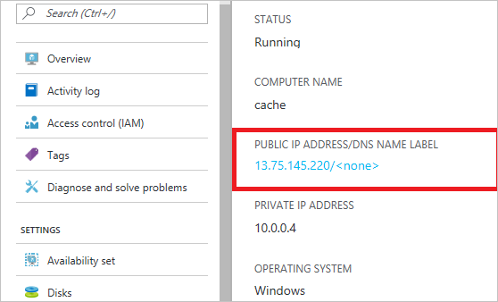
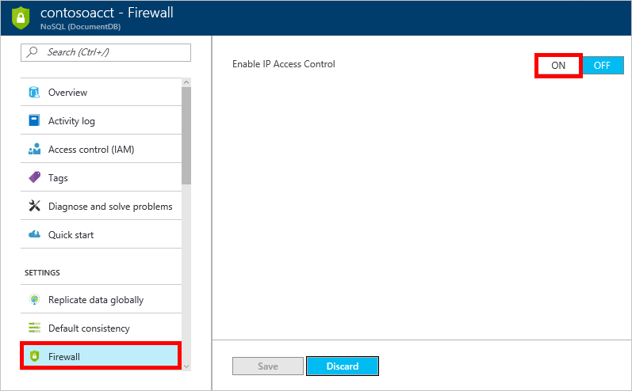
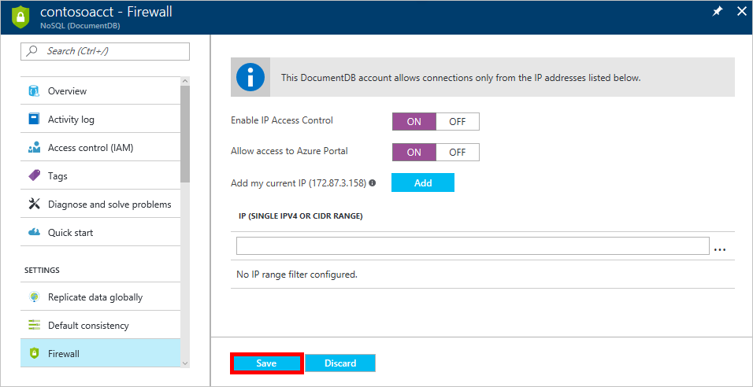
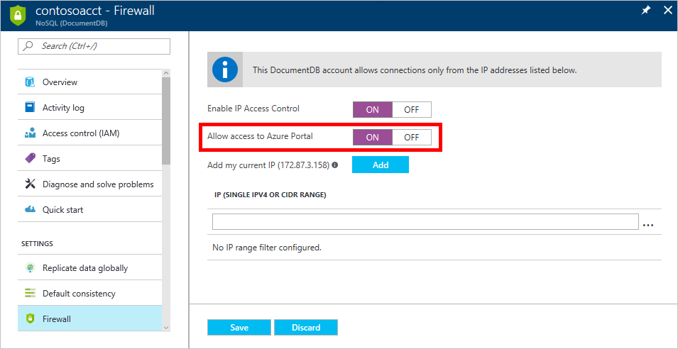

<properties
    pageTitle="Azure DocumentDB 防火墙支持和 IP 访问控制 | Azure"
    description="了解如何将 IP 访问控制策略用于 Azure DocumentDB 数据库帐户上的防火墙支持。"
    keywords="IP 访问控制, 防火墙支持"
    services="documentdb"
    author="shahankur11"
    manager="jhubbard"
    editor=""
    tags="azure-resource-manager"
    documentationcenter=""
    translationtype="Human Translation" />
<tags
    ms.assetid="c1b9ede0-ed93-411a-ac9a-62c113a8e887"
    ms.service="documentdb"
    ms.workload="data-services"
    ms.tgt_pltfrm="na"
    ms.devlang="na"
    ms.topic="article"
    ms.date="04/05/2017"
    wacn.date="05/08/2017"
    ms.author="ankshah"
    ms.sourcegitcommit="2c4ee90387d280f15b2f2ed656f7d4862ad80901"
    ms.openlocfilehash="56b0d67405ea904d0731de598c4c0c1782d4e33a"
    ms.lasthandoff="04/28/2017" />

# DocumentDB 防火墙支持
为保护存储在 Azure DocumentDB 数据库帐户的数据，DocumentDB 已提供对基于机密的[授权模型](https://msdn.microsoft.com/zh-cn/library/azure/dn783368.aspx)的支持，该模型利用强大的基于哈希的消息验证代码 (HMAC)。 现在，除了基于机密的授权模型以外，DocumentDB 还支持针对入站防火墙支持的基于 IP 的策略驱动访问控制。 此方式非常类似于传统数据库系统的防火墙规则，为 DocumentDB 数据库帐户提供了额外的安全级别。 使用此方式，现在可以配置仅批准的一组计算机和/或云服务可以访问 DocumentDB 数据库帐户。 这些已批准的计算机和服务对 DocumentDB 资源的访问仍要求调用方提供有效的授权令牌。

## IP 访问控制概览
默认情况下，只要请求附带有效的授权令牌，就可以从公共 Internet 访问 DocumentDB 数据库帐户。 若要配置基于 IP 策略的访问控制，用户必须提供 IP 地址集合或者 CIDR 格式的 IP 地址范围，以便将这些地址作为指定数据库帐户的允许的客户端 IP 列表。 应用此配置后，服务器将阻止从该允许的列表以外的计算机发出的所有请求。  下图描述了基于 IP 的访问控制的连接处理流程

## 从云服务进行连接
在 Azure 中，云服务是一种使用 DocumentDB 承载中间层服务逻辑的常用方法。 若要从云服务启用对 DocumentDB 数据库帐户的访问，必须通过[配置 IP 访问控制策略](#configure-ip-policy)，将云服务的公共 IP 地址添加到与 DocumentDB 数据库帐户关联的 IP 地址的允许列表中。  这可确保云服务的所有角色实例都有权访问 DocumentDB 数据库帐户。 如下面的屏幕截图所示，可以在 Azure 门户预览中检索云服务的 IP 地址。

通过添加其他角色实例扩大云服务时，这些新的实例将自动具有 DocumentDB 数据库帐户的访问权限，因为它们属于同一云服务。

## 从虚拟机连接
[虚拟机](/home/features/virtual-machines/)或[虚拟机规模集](/documentation/articles/virtual-machine-scale-sets-overview/)还可以用于托管使用 DocumentDB 的中间层服务。  若要将 DocumentDB 数据库帐户配置为允许从虚拟机访问，必须通过[配置 IP 访问控制策略](#configure-ip-policy)，将虚拟机和/或虚拟机规模集的公共 IP 地址配置为 DocumentDB 数据库帐户允许的 IP 地址之一。 如以下屏幕截图所示，可以在 Azure 门户预览中检索虚拟机的 IP 地址。

将其他虚拟机实例添加到组中时，它们自动具有 DocumentDB 数据库帐户的访问权限。

## 从 Internet 进行连接
从 Internet 上的计算机访问 DocumentDB 数据库帐户时，必须将此计算机的客户端 IP 地址或 IP 地址范围添加到 DocumentDB 数据库帐户的允许的 IP 地址列表中。 

## 配置 IP 访问控制策略
可以在 Azure 门户预览中设置 IP 访问控制策略，也可以通过 [Azure CLI](/documentation/articles/documentdb-automation-resource-manager-cli/)、[Azure Powershell](/documentation/articles/documentdb-manage-account-with-powershell/) 或 [REST API](https://msdn.microsoft.com/zh-cn/library/azure/dn781481.aspx) 通过更新 `ipRangeFilter` 属性以编程方式设置 IP 访问控制策略。 IP 地址/范围必须以逗号分隔，且不能包含空格。 示例：“13.91.6.132,13.91.6.1/24”。 通过这些方法更新数据库帐户时，请确保填充所有属性，防止重置为默认设置。

> [AZURE.NOTE]
> 为 DocumentDB 数据库帐户启用 IP 访问控制策略后，从配置的允许的 IP 地址范围列表以外的计算机对 DocumentDB 数据库帐户的所有访问都被阻止。 通过此模型，也将阻止从门户浏览数据平面操作，以确保访问控制的完整性。

为简化开发，Azure 门户预览将帮助你识别你的客户端计算机的 IP 并将其添加到允许的列表中，以便在你的计算机上运行的应用可以访问 DocumentDB 帐户。 请注意，此处的客户端 IP 地址与通过门户看到的一样。 它可能是你的计算机的客户端 IP 地址，也可能是你的网络网关的 IP 地址。 在迁移到生产环境之前，不要忘记将其删除。

若要在 Azure 门户预览中设置 IP 访问控制策略，请导航到 DocumentDB 帐户边栏选项卡，在导航菜单中单击“防火墙”，然后单击“开启”。 

在新窗格中，指定 Azure 门户预览是否可以访问该帐户，并根据情况添加其他地址和范围，然后单击“保存”。  

> [AZURE.NOTE]
> 启用 IP 访问控制策略时，需要添加 Azure 门户预览的 IP 地址以维护访问。 门户 IP 地址是：
> 
> |区域|IP 地址|
> |------|----------|
> |所有区域（下面指定的这些区域除外）| 104.42.195.92|
> |德国|51.4.229.218|
> |中国|139.217.8.252|
> |美国亚利桑那州政府|52.244.48.71|
>

## IP 访问控制策略的故障排除
### 门户操作
通过启用 DocumentDB 数据库帐户的 IP 访问控制策略，阻止从 IP 地址范围已配置的允许列表外部的计算机访问 DocumentDB 数据库帐户。 因此，如果希望启用门户数据平面操作，例如浏览集合和查询文档，则需要使用门户中的“防火墙”边栏选项卡显式允许 Azure 门户预览访问。 

### SDK & Rest API
出于安全的原因，从不在允许的列表中的计算机通过 SDK 或 REST API 访问时，返回一个常规的“404 找不到”响应，并且不包含其他详细信息。 请确认为 DocumentDB 数据库帐户配置的允许的 IP 列表，以确保将正确的策略配置应用到 DocumentDB 数据库帐户。

## 后续步骤
有关网络相关性能技巧的信息，请参阅[性能提示](/documentation/articles/documentdb-performance-tips/)。

<!--Update_Description: wording update-->