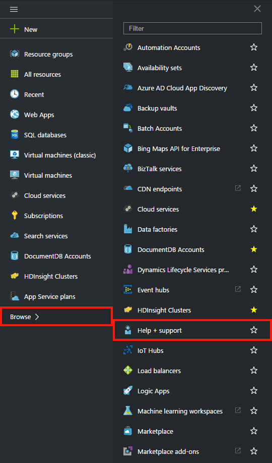
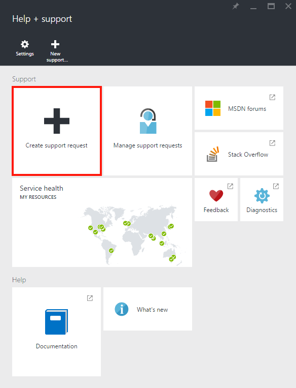
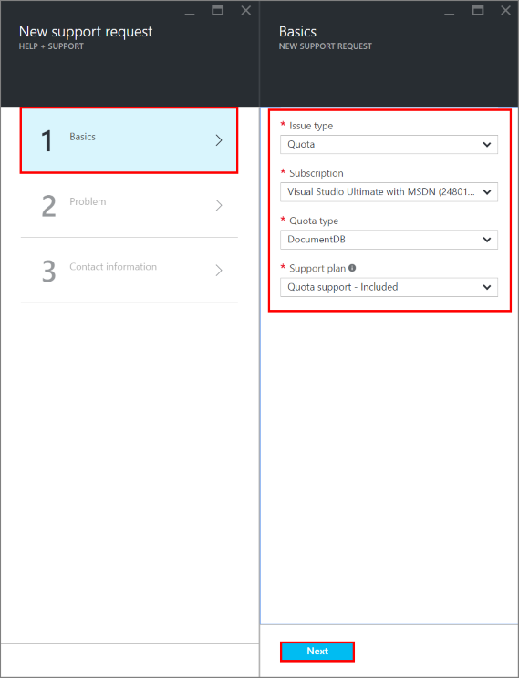
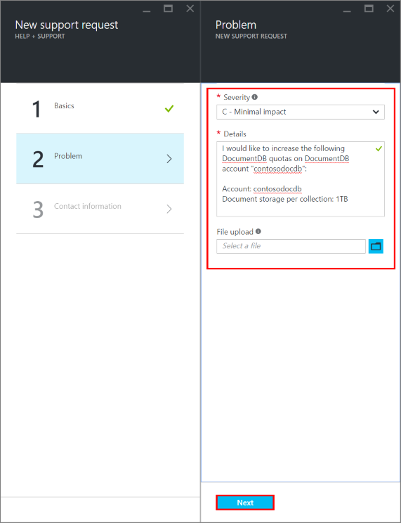
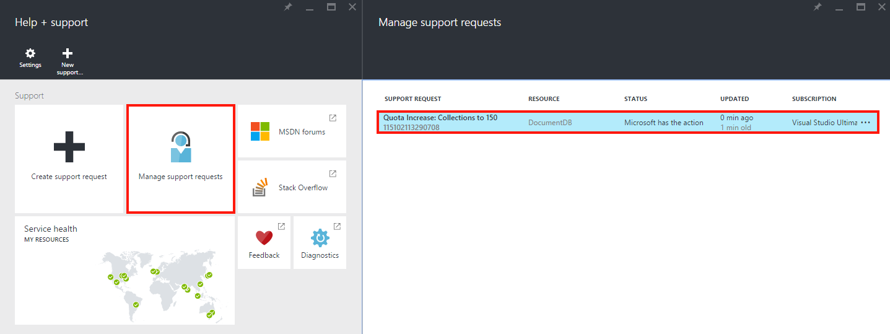

<properties
	pageTitle="请求增加 DocumentDB 帐户配额 | Azure"
	description="了解如何请求对 DocumentDB 数据库配额（如文档存储空间和每个集合的吞吐量）的调整。"
	services="documentdb"
	authors="AndrewHoh"
	manager="jhubbard"
	editor="monicar"
	documentationCenter=""/>

<tags
	ms.service="documentdb"
	ms.workload="data-services"
	ms.tgt_pltfrm="na"
	ms.devlang="na"
	ms.topic="article"
	ms.date="08/25/2016"
	ms.author="anhoh"
   	wacn.date="10/18/2016"/>  

# 请求提高 DocumentDB 帐户限制

[Azure DocumentDB](/home/features/documentdb/) 有一组默认配额，可以通过联系 Azure 支持加以调整。本文介绍了如何请求增加配额。

阅读本文之后，你将能够回答以下问题：

-	可联系 Azure 支持部门来调整哪些 DocumentDB 数据库配额？
-	我如何请求对 DocumentDB 帐户配额进行调整？

## DocumentDB 帐户配额

下表描述了 DocumentDB 配额。可联系 Azure 支持部门调整带星号 (*) 的配额：

[AZURE.INCLUDE [azure-documentdb-limits](../../includes/azure-documentdb-limits.md)]

## 请求配额调整
以下步骤演示了如何请求配额调整。

1. 在 [Azure 门户预览](https://portal.azure.cn)中，依次单击“更多服务”、“帮助 + 支持”。

	  

2. 在“帮助 + 支持”边栏选项卡上，单击“新建支持请求”。

	  

3. 在**新支持请求**边栏选项卡上，单击**基本**。接下来，将**问题类型**设置为“配额”，将**订阅**设置为托管 DocumentDB 帐户的订阅，将**配额类型**设置为“DocumentDB”，并将**支持计划**设置为“配额支持 - 包括”。然后，单击“下一步”。

	  

4. 在“问题”边栏选项卡中，选择严重级别，并在“详细信息”中包含关于你的配额增加的信息。单击**“下一步”**。

	  

5. 最后，在“联系信息”边栏选项卡中填写你的联系信息，然后单击“创建”。

创建支持票证后，你会通过电子邮件收到支持请求编号。还可以通过单击“帮助 + 支持”边栏选项卡上的“管理支持请求”来查看支持请求。

  

##后续步骤
- 若要了解有关 DocumentDB 的详细信息，请单击[此处](/documentation/services/documentdb/)。

<!---HONumber=Mooncake_1010_2016-->
