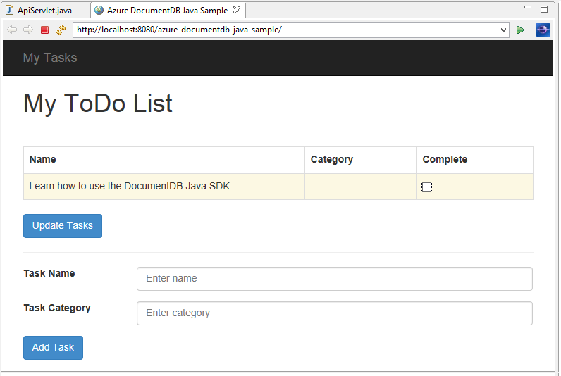
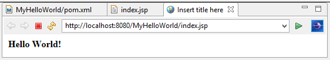

<properties
	pageTitle="使用 DocumentDB 的 Java 应用程序开发教程 | Azure"
	description="此 Java Web 应用程序教程演示了如何使用 Azure DocumentDB 服务存储和访问托管在 Azure 网站上的 Java 应用程序中的数据。"
	keywords="应用程序开发、数据库教程、Java 应用程序、Java Web 应用程序教程、documentdb、Azure、Microsoft Azure"
	services="documentdb"
	documentationCenter="java"
	authors="aliuy"
	manager="jhubbard"
	editor="mimig"/>

<tags
	ms.service="documentdb"
	ms.date="03/10/2016"
	wacn.date="07/04/2016"/>

# 使用 DocumentDB 生成一个 Java Web 应用程序

> [AZURE.SELECTOR]
- [.NET](/documentation/articles/documentdb-dotnet-application/)
- [Node.js](/documentation/articles/documentdb-nodejs-application/)
- [Java](/documentation/articles/documentdb-java-application/)
- [Python](/documentation/articles/documentdb-python-application/)

此 Java Web 应用程序教程演示了如何使用 [Azure DocumentDB](https://portal.azure.cn/#gallery/Microsoft.DocumentDB) 服务存储和访问托管在 Azure 网站上的 Java 应用程序中的数据。在本教程中，你将学习：

- 如何在 Eclipse 中构建基本 JSP 应用程序。
- 如何借助 [DocumentDB Java SDK](https://github.com/Azure/azure-documentdb-java) 来使用 Azure DocumentDB 服务。

此 Java 应用程序教程演示了如何创建一个基于 web 的任务管理应用程序，你可以使用此应用程序创建、检索任务，以及将任务标记为已完成，如下图所示。在 Azure DocumentDB 中，ToDo 列表中的每个任务都存储为 JSON 文档。

> [AZURE.TIP] 此应用程序开发教程假定你之前有使用 Java 的经验。如果你不熟悉 Java 或[必备工具](#Prerequisites)，我们建议从 GitHub 下载完整的 [todo](https://github.com/Azure-Samples/documentdb-java-todo-app) 项目，并按照[本文末尾的说明](#GetProject)构建应用程序。构建之后，你可以回顾本文以深入了解项目上下文中的代码。

##此 Java Web 应用程序教程的先决条件
在开始本应用程序开发教程前，你必须具有：

- 有效的 Azure 帐户。如果你没有帐户，只需花费几分钟就能创建一个免费试用帐户。有关详细信息，请参阅 [Azure 试用](https://www.azure.cn/pricing/free-trial/)。
- [Java 开发工具包 (JDK) 7+](http://www.oracle.com/technetwork/java/javase/downloads/index.html)。
- [Eclipse IDE for Java EE Developers](http://www.eclipse.org/downloads/packages/eclipse-ide-java-ee-developers/lunasr1)。
- [已启用 Java 运行时环境（例如 Tomcat 或 Jetty）的 Azure 网站。](/documentation/articles/web-sites-java-get-started/)

如果你是首次安装这些工具，那么你可以参考 coreservlets.com 网站的 [教程：安装 TomCat7 并将其与 Eclipse 一起使用](http://www.coreservlets.com/Apache-Tomcat-Tutorial/tomcat-7-with-eclipse.html) 文章的 Quick Start 部分提供的安装过程演练。

##步骤 1：创建 DocumentDB 数据库帐户

让我们首先创建 DocumentDB 帐户。如果你已经有一个帐户，则可以跳到[步骤 2：创建 Java JSP 应用程序](#CreateJSP)。

[AZURE.INCLUDE [documentdb-create-dbaccount](../includes/documentdb-create-dbaccount.md)]

[AZURE.INCLUDE [documentdb-keys](../includes/documentdb-keys.md)]

##步骤 2：创建 Java JSP 应用程序

若要创建 JSP 应用程序，请执行以下步骤：

1. 首先，我们将从创建 Java 项目开始。启动 Eclipse，然后依次单击“文件”、“新建”和“动态 Web 项目”。如果你未看到“动态 Web 项目”作为可用项目列出，请执行下列操作：依次单击“文件”、“新建”和“项目”，展开“Web”，单击“动态 Web 项目”，然后单击“下一步”。

	

2. 在“项目名称”框中输入项目名称，然后在“目标运行时”下拉菜单中随意选择一个值（例如 Apache Tomcat v7.0），然后单击“完成”。选择目标运行可通过 Eclipse 在本地运行你的项目。
3. 在 Eclipse 的项目资源管理器视图中，展开你的项目。右键单击“WebContent”，单击“新建”，然后单击“JSP 文件”。
4. 在“新建 JSP 文件”对话框中，将文件命名为 index.jsp。将父文件夹保留为 **WebContent**，如下图所示，然后单击“下一步”。

	

5. 对于本教程，请在“选择 JSP 模板”对话框中选择“新建 JSP 文件(html)”，然后单击“完成”。

6. 在 Eclipse 中打开 index.jsp 文件后，添加文本以便在现有 <body> 元素中显示 **Hello World!**。更新后的 <body> 内容应类似于以下代码：

	    <body>
	        <% out.println("Hello World!"); %>
	    </body>

8. 保存 index.jsp 文件。
9. 如果在步骤 2 中设置了目标运行时，则可以单击“项目”，然后单击“运行”，以在本地运行 JSP 应用程序：

	

##第 3 步：安装 DocumentDB Java SDK ##

提取 DocumentDB Java SDK 和其依赖项的最简单方法是使用 [Apache Maven](http://maven.apache.org/)。

若要执行此操作，你需要通过完成以下步骤将项目转换为 maven 项目：

1. 在项目资源管理器中右键单击项目，单击“配置”，然后单击“转换为 Maven 项目”。
2. 在“创建新 POM”窗口中，接受默认值，然后单击“完成”。
3. 在“项目资源管理器”中，打开 pom.xml 文件。
4. 在“依赖项”选项卡上，在“依赖项”窗格中单击“添加”。
4. 在“选择依赖项”窗口中，执行以下操作：
 - 在“组 ID”框中，输入 com.microsoft.azure。
 - 在“项目 ID”框中输入 azure-documentdb。
 - 在“版本”框中输入 1.5.1。

	

	或者通过文本编辑器直接将 GroupId 和 ArtifactId 的依赖项 XML 添加到 pom.xml：

	    <dependency>
		    <groupId>com.microsoft.azure</groupId>
		    <artifactId>azure-documentdb</artifactId>
		    <version>1.5.1</version>
	    </dependency>

5. 单击“确定”，Maven 将安装 DocumentDB Java SDK。
6. 保存 pom.xml 文件。

##步骤 4：在 java 应用程序中使用 DocumentDB 服务

1. 首先，让我们定义 TodoItem 对象：

	    @Data
	    @Builder
	    public class TodoItem {
		    private String category;
		    private boolean complete;
		    private String id;
		    private String name;
	    }

	在此项目中，我们将使用[项目 Lombok](http://projectlombok.org/) 生成构造函数、getter、setter 和一个生成器。或者，你可以手动编写此代码，或使用 IDE 生成此代码。

2. 若要调用 DocumentDB 服务，则必须实例化一个新的 **DocumentClient**。一般情况下，最好是重用 **DocumentClient** -而不是为每个后续请求构造新的客户端。我们可以通过在 **DocumentClientFactory** 中包装客户端来重用此客户端。你还需要在此处粘贴[步骤 1](#CreateDB) 中保存到剪贴板中的 URI 和 主密钥值。将 [YOUR\_ENDPOINT\_HERE] 替换为你的 URI，以及将 [YOUR\_KEY\_HERE] 替换为你的主密钥。

	    private static final String HOST = "[YOUR_ENDPOINT_HERE]";
	    private static final String MASTER_KEY = "[YOUR_KEY_HERE]";

	    private static DocumentClient documentClient;

	    public static DocumentClient getDocumentClient() {
	        if (documentClient == null) {
	            documentClient = new DocumentClient(HOST, MASTER_KEY,
	                    ConnectionPolicy.GetDefault(), ConsistencyLevel.Session);
	        }

	        return documentClient;
	    }

3. 现在让我们来创建数据访问对象 (DAO)，将 ToDo 项保存到 DocumentDB 的过程进行抽象。

	要将 ToDo 项保存到集合中，客户端需要知道保存到哪个数据库和集合（通过自链接引用）通常，如果可能的话最好缓存数据库和集合，以避免额外的往返访问数据库。

	以下代码演示了存在数据库和集合的情况下如何检索数据库和集合，如果不存在，则创建新的数据库和集合。

		public class DocDbDao implements TodoDao {
		    // The name of our database.
		    private static final String DATABASE_ID = "TodoDB";

		    // The name of our collection.
		    private static final String COLLECTION_ID = "TodoCollection";

		    // The DocumentDB Client
		    private static DocumentClient documentClient = DocumentClientFactory
		            .getDocumentClient();

		    // Cache for the database object, so we don't have to query for it to
		    // retrieve self links.
		    private static Database databaseCache;

		    // Cache for the collection object, so we don't have to query for it to
		    // retrieve self links.
		    private static DocumentCollection collectionCache;

		    private Database getTodoDatabase() {
		        if (databaseCache == null) {
		            // Get the database if it exists
		            List<Database> databaseList = documentClient
		                    .queryDatabases(
		                            "SELECT * FROM root r WHERE r.id='" + DATABASE_ID
		                                    + "'", null).getQueryIterable().toList();

		            if (databaseList.size() > 0) {
		                // Cache the database object so we won't have to query for it
		                // later to retrieve the selfLink.
		                databaseCache = databaseList.get(0);
		            } else {
		                // Create the database if it doesn't exist.
		                try {
		                    Database databaseDefinition = new Database();
		                    databaseDefinition.setId(DATABASE_ID);

		                    databaseCache = documentClient.createDatabase(
		                            databaseDefinition, null).getResource();
		                } catch (DocumentClientException e) {
		                    // TODO: Something has gone terribly wrong - the app wasn't
		                    // able to query or create the collection.
		                    // Verify your connection, endpoint, and key.
		                    e.printStackTrace();
		                }
		            }
		        }

		        return databaseCache;
		    }

		    private DocumentCollection getTodoCollection() {
		        if (collectionCache == null) {
		            // Get the collection if it exists.
		            List<DocumentCollection> collectionList = documentClient
		                    .queryCollections(
		                            getTodoDatabase().getSelfLink(),
		                            "SELECT * FROM root r WHERE r.id='" + COLLECTION_ID
		                                    + "'", null).getQueryIterable().toList();

		            if (collectionList.size() > 0) {
		                // Cache the collection object so we won't have to query for it
		                // later to retrieve the selfLink.
		                collectionCache = collectionList.get(0);
		            } else {
		                // Create the collection if it doesn't exist.
		                try {
		                    DocumentCollection collectionDefinition = new DocumentCollection();
		                    collectionDefinition.setId(COLLECTION_ID);

		                    // Configure the new collection performance tier to S1.
		                    RequestOptions requestOptions = new RequestOptions();
		                    requestOptions.setOfferType("S1");

		                    collectionCache = documentClient.createCollection(
		                            getTodoDatabase().getSelfLink(),
		                            collectionDefinition, requestOptions).getResource();
		                } catch (DocumentClientException e) {
		                    // TODO: Something has gone terribly wrong - the app wasn't
		                    // able to query or create the collection.
		                    // Verify your connection, endpoint, and key.
		                    e.printStackTrace();
		                }
		            }
		        }

		        return collectionCache;
		    }
		}

4. 下一步是编写一些代码将 TodoItem 保存到集合中。在本示例中，我们将使用 [Gson](https://code.google.com/p/google-gson/) 将 TodoItem 普通 Java 对象 (POJO) 序列化到 JSON 文档和从中反序列化 POJO。[Jackson](http://jackson.codehaus.org/) 或你自己的自定义序列化程序也是用于序列化 POJO 的很好的替代项。

	    // We'll use Gson for POJO <=> JSON serialization for this example.
	    private static Gson gson = new Gson();

	    @Override
	    public TodoItem createTodoItem(TodoItem todoItem) {
	        // Serialize the TodoItem as a JSON Document.
	        Document todoItemDocument = new Document(gson.toJson(todoItem));

	        // Annotate the document as a TodoItem for retrieval (so that we can
	        // store multiple entity types in the collection).
	        todoItemDocument.set("entityType", "todoItem");

	        try {
	            // Persist the document using the DocumentClient.
	            todoItemDocument = documentClient.createDocument(
	                    getTodoCollection().getSelfLink(), todoItemDocument, null,
	                    false).getResource();
	        } catch (DocumentClientException e) {
	            e.printStackTrace();
	            return null;
	        }

	        return gson.fromJson(todoItemDocument.toString(), TodoItem.class);
	    }

5. 和 DocumentDB 数据库和集合一样，文档也是通过自链接来引用。以下帮助器函数可以让我们通过另一个属性（例如“id”）来检索文档，而不是自链接：

	    private Document getDocumentById(String id) {
	        // Retrieve the document using the DocumentClient.
	        List<Document> documentList = documentClient
	                .queryDocuments(getTodoCollection().getSelfLink(),
	                        "SELECT * FROM root r WHERE r.id='" + id + "'", null)
	                .getQueryIterable().toList();

	        if (documentList.size() > 0) {
	            return documentList.get(0);
	        } else {
	            return null;
	        }
	    }

6. 我们可使用步骤 5 中的帮助器方法按 ID 检索 TodoItem JSON 文档，然后将其反序列化到 POJO：

	    @Override
	    public TodoItem readTodoItem(String id) {
	        // Retrieve the document by id using our helper method.
	        Document todoItemDocument = getDocumentById(id);

	        if (todoItemDocument != null) {
	            // De-serialize the document in to a TodoItem.
	            return gson.fromJson(todoItemDocument.toString(), TodoItem.class);
	        } else {
	            return null;
	        }
	    }

7. 我们还可以通过 DocumentClient 使用 DocumentDB SQL 获取一个集合或 TodoItem 列表：

	    @Override
	    public List<TodoItem> readTodoItems() {
	        List<TodoItem> todoItems = new ArrayList<TodoItem>();

	        // Retrieve the TodoItem documents
	        List<Document> documentList = documentClient
	                .queryDocuments(getTodoCollection().getSelfLink(),
	                        "SELECT * FROM root r WHERE r.entityType = 'todoItem'",
	                        null).getQueryIterable().toList();

	        // De-serialize the documents in to TodoItems.
	        for (Document todoItemDocument : documentList) {
	            todoItems.add(gson.fromJson(todoItemDocument.toString(),
	                    TodoItem.class));
	        }

	        return todoItems;
	    }

8. 使用 DocumentClient 更新文档的方法有多种。在 Todo 列表应用程序中，我们希望能够切换 TodoItem 是否已完成。这可以通过更新文档中的"完成"属性来实现：

	    @Override
	    public TodoItem updateTodoItem(String id, boolean isComplete) {
	        // Retrieve the document from the database
	        Document todoItemDocument = getDocumentById(id);

	        // You can update the document as a JSON document directly.
	        // For more complex operations - you could de-serialize the document in
	        // to a POJO, update the POJO, and then re-serialize the POJO back in to
	        // a document.
	        todoItemDocument.set("complete", isComplete);

	        try {
	            // Persist/replace the updated document.
	            todoItemDocument = documentClient.replaceDocument(todoItemDocument,
	                    null).getResource();
	        } catch (DocumentClientException e) {
	            e.printStackTrace();
	            return null;
	        }

	        return gson.fromJson(todoItemDocument.toString(), TodoItem.class);
	    }

9. 最后，我们希望能够从我们的列表中删除 TodoItem。若要执行此操作，我们可以使用之前编写的帮助器方法检索自链接，然后告诉客户端将其删除：

	    @Override
	    public boolean deleteTodoItem(String id) {
	        // DocumentDB refers to documents by self link rather than id.

	        // Query for the document to retrieve the self link.
	        Document todoItemDocument = getDocumentById(id);

	        try {
	            // Delete the document by self link.
	            documentClient.deleteDocument(todoItemDocument.getSelfLink(), null);
	        } catch (DocumentClientException e) {
	            e.printStackTrace();
	            return false;
	        }

	        return true;
	    }

##步骤 5：将剩余的 Java 应用程序开发项目绑定到一起

现在我们完成了有趣的部分，剩下所有要做的是构建一个快速的用户接口，并将其与我们的 DAO 进行绑定。

1. 首先，让我们生成控制器以调用 DAO：

		public class TodoItemController {
		    public static TodoItemController getInstance() {
		        if (todoItemController == null) {
		            todoItemController = new TodoItemController(TodoDaoFactory.getDao());
		        }
		        return todoItemController;
		    }

		    private static TodoItemController todoItemController;

		    private final TodoDao todoDao;

		    TodoItemController(TodoDao todoDao) {
		        this.todoDao = todoDao;
		    }

		    public TodoItem createTodoItem(@NonNull String name,
		            @NonNull String category, boolean isComplete) {
		        TodoItem todoItem = TodoItem.builder().name(name).category(category)
		                .complete(isComplete).build();
		        return todoDao.createTodoItem(todoItem);
		    }

		    public boolean deleteTodoItem(@NonNull String id) {
		        return todoDao.deleteTodoItem(id);
		    }

		    public TodoItem getTodoItemById(@NonNull String id) {
		        return todoDao.readTodoItem(id);
		    }

		    public List<TodoItem> getTodoItems() {
		        return todoDao.readTodoItems();
		    }

		    public TodoItem updateTodoItem(@NonNull String id, boolean isComplete) {
		        return todoDao.updateTodoItem(id, isComplete);
		    }
		}

	在更复杂的应用程序中，控制器可以包含基于 DAO 的复杂的业务逻辑。

2. 接下来，我们将创建 servlet 将 HTTP 请求路由到控制器：

		public class TodoServlet extends HttpServlet {
			// API Keys
			public static final String API_METHOD = "method";

			// API Methods
			public static final String CREATE_TODO_ITEM = "createTodoItem";
			public static final String GET_TODO_ITEMS = "getTodoItems";
			public static final String UPDATE_TODO_ITEM = "updateTodoItem";

			// API Parameters
			public static final String TODO_ITEM_ID = "todoItemId";
			public static final String TODO_ITEM_NAME = "todoItemName";
			public static final String TODO_ITEM_CATEGORY = "todoItemCategory";
			public static final String TODO_ITEM_COMPLETE = "todoItemComplete";

			public static final String MESSAGE_ERROR_INVALID_METHOD = "{'error': 'Invalid method'}";

			private static final long serialVersionUID = 1L;
			private static final Gson gson = new Gson();

			@Override
			protected void doGet(HttpServletRequest request,
					HttpServletResponse response) throws ServletException, IOException {

				String apiResponse = MESSAGE_ERROR_INVALID_METHOD;

				TodoItemController todoItemController = TodoItemController
						.getInstance();

				String id = request.getParameter(TODO_ITEM_ID);
				String name = request.getParameter(TODO_ITEM_NAME);
				String category = request.getParameter(TODO_ITEM_CATEGORY);
				boolean isComplete = StringUtils.equalsIgnoreCase("true",
						request.getParameter(TODO_ITEM_COMPLETE)) ? true : false;

				switch (request.getParameter(API_METHOD)) {
				case CREATE_TODO_ITEM:
					apiResponse = gson.toJson(todoItemController.createTodoItem(name,
							category, isComplete));
					break;
				case GET_TODO_ITEMS:
					apiResponse = gson.toJson(todoItemController.getTodoItems());
					break;
				case UPDATE_TODO_ITEM:
					apiResponse = gson.toJson(todoItemController.updateTodoItem(id,
							isComplete));
					break;
				default:
					break;
				}

				response.getWriter().println(apiResponse);
			}

			@Override
			protected void doPost(HttpServletRequest request,
					HttpServletResponse response) throws ServletException, IOException {
				doGet(request, response);
			}
		}

3. 我们需要一个 Web 用户界面来向用户显示。让我们重新编写之前创建的 index.jsp：

		<html>
		<head>
		  <meta http-equiv="Content-Type" content="text/html; charset=ISO-8859-1">
          <meta http-equiv="X-UA-Compatible" content="IE=edge;" />
		  <title>Azure DocumentDB Java Sample</title>

		  <!-- Bootstrap -->
		  <link href="//ajax.aspnetcdn.com/ajax/bootstrap/3.2.0/css/bootstrap.min.css" rel="stylesheet">

		  
		</head>
		<body>
		  <!-- Nav Bar -->
		  

		    

		      

		        <a class="navbar-brand" href="#">My Tasks</a>
		      

		    

		  

		  <!-- Body -->
		  

		    <h1>My ToDo List</h1>

		    

		    <!-- The ToDo List -->
		    

		      <table class="table table-bordered table-striped" id="todoItems">
		        <thead>
		          <tr>
		            <th>Name</th>
		            <th>Category</th>
		            <th>Complete</th>
		          </tr>
		        </thead>
		        <tbody>
		        </tbody>
		      </table>

		      <!-- Update Button -->
		      

		        <form class="form-horizontal" role="form">
		          <button type="button" class="btn btn-primary">Update Tasks</button>
		        </form>
		      

		    

		    

		    <!-- Item Input Form -->
		    

		      <form class="form-horizontal" role="form">
		        

		          <label for="inputItemName" class="col-sm-2">Task Name</label>
		          

		            <input type="text" class="form-control" id="inputItemName" placeholder="Enter name">
		          

		        

		        

		          <label for="inputItemCategory" class="col-sm-2">Task Category</label>
		          

		            <input type="text" class="form-control" id="inputItemCategory" placeholder="Enter category">
		          

		        

		        <button type="button" class="btn btn-primary">Add Task</button>
		      </form>
		    

		  

		  <!-- Placed at the end of the document so the pages load faster -->
		  
		  
		  
		</body>
		</html>

4. 最后，编写一些客户端 Javascript 将 Web 用户界面和 servlet 绑定在一起：

		var todoApp = {
		  /*
		   * API methods to call Java backend.
		   */
		  apiEndpoint: "api",

		  createTodoItem: function(name, category, isComplete) {
		    $.post(todoApp.apiEndpoint, {
		        "method": "createTodoItem",
		        "todoItemName": name,
		        "todoItemCategory": category,
		        "todoItemComplete": isComplete
		      },
		      function(data) {
		        var todoItem = data;
		        todoApp.addTodoItemToTable(todoItem.id, todoItem.name, todoItem.category, todoItem.complete);
		      },
		      "json");
		  },

		  getTodoItems: function() {
		    $.post(todoApp.apiEndpoint, {
		        "method": "getTodoItems"
		      },
		      function(data) {
		        var todoItemArr = data;
		        $.each(todoItemArr, function(index, value) {
		          todoApp.addTodoItemToTable(value.id, value.name, value.category, value.complete);
		        });
		      },
		      "json");
		  },

		  updateTodoItem: function(id, isComplete) {
		    $.post(todoApp.apiEndpoint, {
		        "method": "updateTodoItem",
		        "todoItemId": id,
		        "todoItemComplete": isComplete
		      },
		      function(data) {},
		      "json");
		  },

		  /*
		   * UI Methods
		   */
		  addTodoItemToTable: function(id, name, category, isComplete) {
		    var rowColor = isComplete ? "active" : "warning";

		    todoApp.ui_table().append($("<tr>")
		      .append($("<td>").text(name))
		      .append($("<td>").text(category))
		      .append($("<td>")
		        .append($("<input>")
		          .attr("type", "checkbox")
		          .attr("id", id)
		          .attr("checked", isComplete)
		          .attr("class", "isComplete")
		        ))
		      .addClass(rowColor)
		    );
		  },

		  /*
		   * UI Bindings
		   */
		  bindCreateButton: function() {
		    todoApp.ui_createButton().click(function() {
		      todoApp.createTodoItem(todoApp.ui_createNameInput().val(), todoApp.ui_createCategoryInput().val(), false);
		      todoApp.ui_createNameInput().val("");
		      todoApp.ui_createCategoryInput().val("");
		    });
		  },

		  bindUpdateButton: function() {
		    todoApp.ui_updateButton().click(function() {
		      // Disable button temporarily.
		      var myButton = $(this);
		      var originalText = myButton.text();
		      $(this).text("Updating...");
		      $(this).prop("disabled", true);

		      // Call api to update todo items.
		      $.each(todoApp.ui_updateId(), function(index, value) {
		        todoApp.updateTodoItem(value.name, value.value);
		        $(value).remove();
		      });

		      // Re-enable button.
		      setTimeout(function() {
		        myButton.prop("disabled", false);
		        myButton.text(originalText);
		      }, 500);
		    });
		  },

		  bindUpdateCheckboxes: function() {
		    todoApp.ui_table().on("click", ".isComplete", function(event) {
		      var checkboxElement = $(event.currentTarget);
		      var rowElement = $(event.currentTarget).parents('tr');
		      var id = checkboxElement.attr('id');
		      var isComplete = checkboxElement.is(':checked');

		      // Toggle table row color
		      if (isComplete) {
		        rowElement.addClass("active");
		        rowElement.removeClass("warning");
		      } else {
		        rowElement.removeClass("active");
		        rowElement.addClass("warning");
		      }

		      // Update hidden inputs for update panel.
		      todoApp.ui_updateForm().children("input[name='" + id + "']").remove();

		      todoApp.ui_updateForm().append($("<input>")
		        .attr("type", "hidden")
		        .attr("class", "updateComplete")
		        .attr("name", id)
		        .attr("value", isComplete));

		    });
		  },

		  /*
		   * UI Elements
		   */
		  ui_createNameInput: function() {
		    return $(".todoForm #inputItemName");
		  },

		  ui_createCategoryInput: function() {
		    return $(".todoForm #inputItemCategory");
		  },

		  ui_createButton: function() {
		    return $(".todoForm button");
		  },

		  ui_table: function() {
		    return $(".todoList table tbody");
		  },

		  ui_updateButton: function() {
		    return $(".todoUpdatePanel button");
		  },

		  ui_updateForm: function() {
		    return $(".todoUpdatePanel form");
		  },

		  ui_updateId: function() {
		    return $(".todoUpdatePanel .updateComplete");
		  },

		  /*
		   * Install the TodoApp
		   */
		  install: function() {
		    todoApp.bindCreateButton();
		    todoApp.bindUpdateButton();
		    todoApp.bindUpdateCheckboxes();

		    todoApp.getTodoItems();
		  }
		};

		$(document).ready(function() {
		  todoApp.install();
		});

5. 非常好！ 现在剩下的就是测试此应用程序。在本地运行此应用程序，并添加一些 Todo 项，方法是填充项名称和类别，然后单击“添加任务”。

6. 显示项之后，你可以通过切换复选框，然后单击“更新任务”来更新项是否已完成。

##步骤 6：将 Java 应用程序部署到 Azure 网站

要在 Azure 网站上部署 Java 应用程序，只需将程序导入为 WAR 文件，然后通过源控件（例如 GIT）或 FTP 上载此文件。

1. 若要将应用程序导出为 WAR，请在“项目资源管理器”中右键单击你的项目，然后依次单击“导出”和“WAR 文件”。
2. 在“WAR 导出”窗口中，执行以下操作：
 - 在“Web 项目”框中，输入 azure-documentdb-java-sample。
 - 在“目标”框中，选择一个目标以保存 WAR 文件。
 - 单击“完成”。

3. 现在你已经具有 WAR 文件，只需将它上载到 Azure 网站的 **webapps** 目录。有关上载此文件的说明，请参阅[将应用程序添加到 Azure 的 Java 网站](/documentation/articles/web-sites-java-add-app/)。

	将 WAR 文件上载到 webapps 目录之后，运行时环境将检测到你已经添加了此文件，并将自动加载它。
4. 若要查看你已完成的产品，请导航到 http://YOUR\_SITE\_NAME.azurewebsites.net/azure-documentdb-java-sample/ 然后开始添加你的任务！

##从 GitHub 获取项目

GitHub 上的 [todo](https://github.com/Azure-Samples/documentdb-java-todo-app) 项目包含本教程中的所有示例。若要将 todo 项目导入 Eclipse，请确保你具有[先决条件](#Prerequisites)部分中所列的软件和资源，然后执行以下操作：

1. 安装[项目 Lombok](http://projectlombok.org/)。Lombok 用于生成项目中的构造函数、getter 和 setter。当你下载 lombok.jar 文件之后，双击此文件进行安装，或者从命令行安装。
2. 如果 Eclipse 处于打开状态，请将其关闭并重新启动以加载 Lombok。
3. 在 Eclipse 中，在“文件”菜单上单击“导入”。
4. 在“导入”窗口中，依次单击“Git”、“来自 Git 的项目”和“下一步”。
5. 在“选择存储库源”屏幕上，单击“克隆 URI”。
6. 在“源 Git 存储库”屏幕上，在“URI”框中输入 https://github.com/Azure-Samples/documentdb-java-todo-app.git，然后单击“下一步”。
7. 在“分支选择”屏幕上，确保已选择“master”，然后单击“下一步”。
8. 在“本地目标”屏幕上，单击“浏览”选择要将存储库复制到的文件夹，然后单击“下一步”。
9. 在“选择要用于导入项目的向导”屏幕上，确保已选择“导入现有项目”，然后单击“下一步”。
10. 在“导入项目”屏幕上，取消选择“DocumentDB”项目，然后单击“完成”。DocumentDB 项目包含 DocumentDB Java SDK，我们会将其添加为依赖项。
11. 在“项目资源管理器”中，导航到 azure-documentdb-java-sample\\src\\com.microsoft.azure.documentdb.sample.dao\\DocumentClientFactory.java，并将 HOST 和 MASTER\_KEY 值替换为你的 DocumentDB 帐户的 URI 和 PRIMARY KEY，然后保存该文件。有关更多信息，请参阅[步骤 1. 创建一个 DocumentDB 数据库帐户](#CreateDB)。
12. 在“项目资源管理器”中，右键单击“azure-documentdb-java-sample”，单击“生成路径”，然后单击“配置生成路径”。
13. 在“Java 生成路径”屏幕上，在右侧窗格中，选择“库”选项卡，然后单击“添加外部 JAR”。导航至 lombok.jar 文件的位置，单击“打开”，然后单击“确定”。
14. 使用步骤 12 再次打开“属性”窗口，然后在左窗格中单击“目标运行时”。
15. 在“目标运行时”屏幕上，单击“新建”，选择“Apache Tomcat v7.0”，然后单击“确定”。
16. 使用步骤 12 再次打开“属性”窗口，然后在左窗格中单击“项目方面”。
17. 在“项目方面”屏幕上，选择“动态 Web 模块”和“Java”，然后单击“确定”。
18. 在此屏幕下面的“服务器”选项卡上，右键单击“localhost 上的 Tomcat v7.0 服务器”，然后单击“添加和删除”。
19. 在“添加和删除”窗口中，将 **azure-documentdb-java-sample** 移动到“配置”框，然后单击“完成”。
20. 在“服务器”选项卡上，右键单击“localhost 上的 Tomcat v7.0 服务器”，然后单击“重新启动”。
21. 在浏览器中导航到 http://localhost:8080/azure-documentdb-java-sample/，然后开始向你的任务列表中添加项。请注意，如果你更改了默认端口值，请将 8080 更改为你选择的值。
22. 若要将项目部署到 Azure 网站，请参阅[步骤 6. 将应用程序部署到 Azure 网站](#Deploy)。

[1]: media/documentdb-java-application/keys.png

<!---HONumber=Mooncake_0627_2016-->