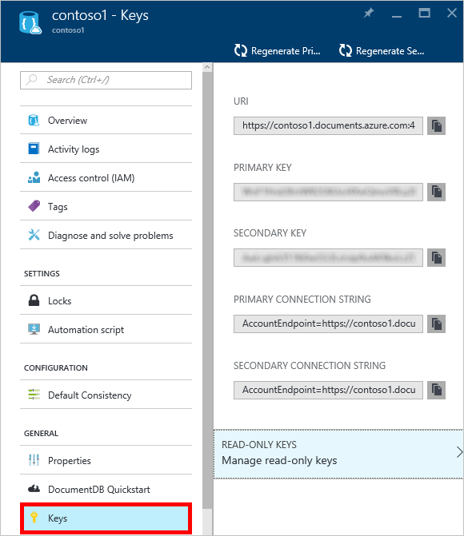
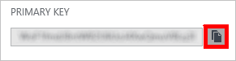
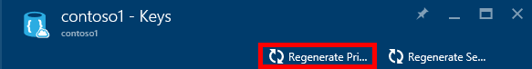
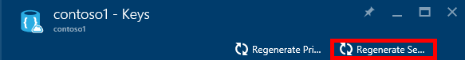
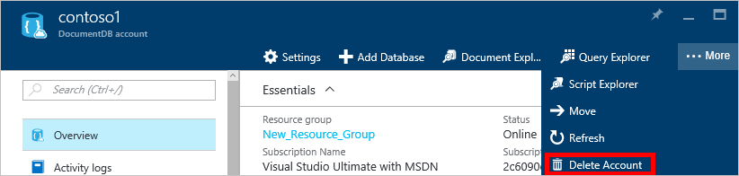
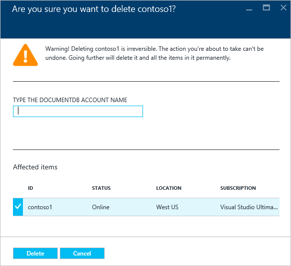

<properties
    pageTitle="通过 Azure 门户预览管理 DocumentDB 帐户 | Azure"
    description="了解如何通过 Azure 门户预览管理 DocumentDB 帐户。 查找有关使用 Azure 门户预览查看、复制、删除和访问帐户的指南。"
    keywords="Azure 门户预览, documentdb, azure, Azure"
    services="documentdb"
    documentationcenter=""
    author="kirillg"
    manager="jhubbard"
    editor="cgronlun" />
<tags
    ms.assetid="00fc172f-f86c-44ca-8336-11998dcab45c"
    ms.service="documentdb"
    ms.workload="data-services"
    ms.tgt_pltfrm="na"
    ms.devlang="na"
    ms.topic="article"
    ms.date="02/03/2017"
    wacn.date="05/31/2017"
    ms.author="kirillg"
    ms.translationtype="Human Translation"
    ms.sourcegitcommit="4a18b6116e37e365e2d4c4e2d144d7588310292e"
    ms.openlocfilehash="ac7c5722462aa453714676ccc1bd1514b2596795"
    ms.contentlocale="zh-cn"
    ms.lasthandoff="05/19/2017" />

# 如何管理 DocumentDB 帐户
了解如何在 Azure 门户预览中设置全局一致性、使用密钥，以及删除 DocumentDB 帐户。

## 管理 DocumentDB 一致性设置
根据应用程序的语义选择正确的一致性级别。 用户应通过阅读[使用一致性级别最大限度地提高 DocumentDB 中的可用性和性能][consistency]，自行熟悉 DocumentDB 中提供的一致性级别。 DocumentDB 在适用于数据库帐户的每个一致性级别提供一致性、可用性和性能保证。 使用“强”一致性级别配置数据库帐户需要将数据局限在单个 Azure 区域，而不能使其全局可用。 另一方面，宽松的一致性级别 - 受限停滞、会话或最终一致性可让你将任意数量的 Azure 区域与你的数据库帐户相关联。 以下简单步骤说明如何为数据库帐户选择默认的一致性级别。 

### 指定 DocumentDB 帐户的默认一致性
1. 在 [Azure 门户预览](https://portal.azure.cn/)中访问 DocumentDB 帐户。
2. 在帐户边栏选项卡中，单击“默认一致性” 。
3. 在“默认一致性”边栏选项卡中，选择新的一致性级别并单击“保存”。
    ![默认一致性会话][5]

## 查看、复制和重新生成访问密钥
当创建 DocumentDB 帐户时，服务生成两个主访问密钥，用于访问 DocumentDB 帐户时的身份验证。 DocumentDB 提供两个访问密钥是为了让你在不中断 DocumentDB 帐户连接的情况下重新生成密钥。 

在 [Azure 门户预览](https://portal.azure.cn/)中，从“DocumentDB 帐户”边栏选项卡上的资源菜单访问“密钥”边栏选项卡，查看、复制和重新生成用于访问 DocumentDB 帐户的访问密钥。

> [AZURE.NOTE]
> “密钥”边栏选项卡还包括可用来从[数据迁移工具](/documentation/articles/documentdb-import-data/)连接到帐户的主要和辅助连接字符串。
> 
> 

此边栏选项卡上还提供只读密钥。 读取和查询为只读操作，而创建、删除和替换不是。

### 在 Azure 门户预览中复制访问密钥
在“密钥”边栏选项卡中，单击要复制的密钥右侧的“复制”按钮。

### 重新生成访问密钥
应定期更改 DocumentDB 帐户的访问密钥，加强连接的安全性。 为你分配两个访问密钥是为了让你使用一个访问密钥保持与 DocumentDB 帐户的连接，同时可以重新生成另一个访问密钥。

> [AZURE.WARNING]
> 重新生成访问密钥会影响任何依赖于当前密钥的应用程序。 所有使用访问密钥访问 DocumentDB 帐户的客户端都必须进行更新，以便使用新密钥。
> 
> 

如果应用程序或云服务使用 DocumentDB 帐户，则重新生成密钥会失去连接，除非滚动使用密钥。 以下步骤概述了轮询密钥的过程。

1. 更新应用程序代码中的访问密钥以引用 DocumentDB 帐户的辅助访问密钥。
2. 为 DocumentDB 帐户重新生成主访问密钥。 在 [Azure 门户预览](https://portal.azure.cn/)中访问 DocumentDB 帐户。
3. 在“DocumentDB 帐户”边栏选项卡中，单击“密钥”。
4. 在“密钥”边栏选项卡上，单击“重新生成”按钮，然后单击“确定”确认要生成新密钥。
    
5. 确认新的密钥可供使用后（大约在重新生成后的 5 分钟），请更新应用程序代码中的访问密钥以引用新的主访问密钥。
6. 重新生成辅助访问密钥。
   
    

> [AZURE.NOTE]
> 可能需要几分钟时间才能使用新生成的密钥访问 DocumentDB 帐户。
> 
> 

## 获取连接字符串
若要检索连接字符串，请执行以下操作： 

1. 在 [Azure 门户预览](https://portal.azure.cn)中访问 DocumentDB 帐户。
2. 在资源菜单中，单击“密钥” 。
3. 单击“主连接字符串”或“辅助连接字符串”框旁边的“复制”按钮。 

如果要在 [DocumentDB 数据库迁移工具](/documentation/articles/documentdb-import-data/)中使用连接字符串，请将数据库名称追加到连接字符串的末尾。 `AccountEndpoint=< >;AccountKey=< >;Database=< >`。

##  删除 DocumentDB 帐户
若要从 Azure 门户预览中删除不再使用的 DocumentDB 帐户，请右键单击该帐户名称，然后单击“删除帐户”。

1. 在 [Azure 门户预览](https://portal.azure.cn/)中，访问要删除的 DocumentDB 帐户。
2. 在“DocumentDB 帐户”边栏选项卡上，右键单击该帐户，然后单击“删除帐户”。 
3. 在生成的确认边栏选项卡中，键入 DocumentDB 帐户名称以确认要删除该帐户。
4. 单击“删除”按钮。

<!--Image references-->
[1]: ./media/documentdb-manage-account/documentdb_add_region-1.png
[2]: ./media/documentdb-manage-account/documentdb_add_region-2.png
[3]: ./media/documentdb-manage-account/documentdb_change_write_region-1.png
[4]: ./media/documentdb-manage-account/documentdb_change_write_region-2.png
[5]: ./media/documentdb-manage-account/documentdb_change_consistency-1.png
[6]: ./media/documentdb-manage-account/chooseandsaveconsistency.png

<!--Reference style links - using these makes the source content way more readable than using inline links-->
[consistency]: /documentation/articles/documentdb-consistency-levels/
[offers]: /pricing/details/documentdb/

<!---Update_Description: wording update -->