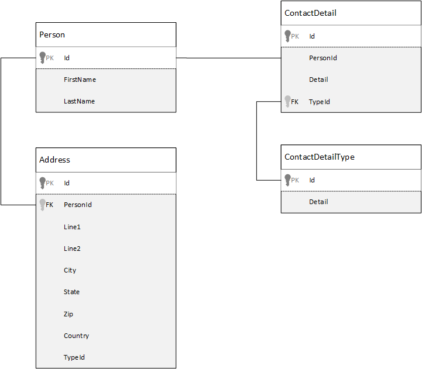
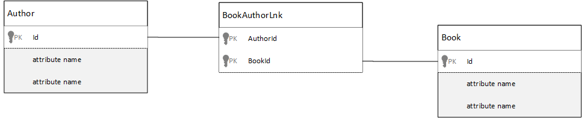

<properties 
	pageTitle="Azure DocumentDB 中的数据建模 | Azure" 
	description="了解 DocumentDB，一个 NoSQL 文档数据库的数据建模。" 
	keywords="数据建模"
	services="documentdb" 
	authors="stephbaron" 
	manager="jhubbard" 
	editor="mimig1" 
	documentationCenter=""/>

<tags 
	ms.service="documentdb" 
	ms.date="05/12/2016" 
	wacn.date="06/29/2016"/>

#对 DocumentDB 中的数据进行建模#
尽管无架构的数据库如 DocumentDB 能够非常容易地接受对数据模型的更改，你仍需花一些时间来研究你的数据。

将如何存储数据？ 你的应用程序将如何检索和查询数据？ 你的应用程序是读取频繁，还是写入频繁？

阅读本文后，你将能够回答以下问题：

- 我该如何考虑文档数据库中的文档？
- 什么是数据建模，我为什么应该关注？ 
- 文档数据库中的数据建模与关系型数据库中的有何不同？
- 如何在非关系型数据库中表示数据关系？
- 我应何时嵌入数据和何时链接数据？

##嵌入数据##
当你对文档存储如 DocumentDB 中的数据进行建模时，尝试将你的实体视为使用 JSON 表示的**独立文档**。

在深入探讨之前，让我们先回顾一下在关系型数据库中我们会如何建模，许多人对该主题已很熟悉。下面的示例演示了如何在关系型数据库中存储一个人的信息。

多年来我们在使用关系型数据库时一直被教导要规范化、规范化、规范化。

规范化数据通常涉及到将一个实体例如一个人的信息分解为多个离散的数据片段。在上面的示例中，一个人除了多个地址记录之外，还可以有多个联系人详细记录。我们甚至通过进一步提取常用字段如“类型”，又深入走近一步，将联系人详细信息进一步细分。与地址相同，此处每条记录都有一个类型，例如家庭或办公

规范化数据时的指导前提是**避免存储每个记录的冗余数据**，并且引用数据。在本例中，要读取一个人的所有联系人详细信息和地址信息，你需要使用 JOINS 才能在运行时高效汇总数据。

	SELECT p.FirstName, p.LastName, a.City, cd.Detail
	FROM Person p
    JOIN ContactDetail cd ON cd.PersonId = p.Id
    JOIN ContactDetailType on cdt ON cdt.Id = cd.TypeId
    JOIN Address a ON a.PersonId = p.Id

更新一个人的联系人详细信息和地址信息需要跨多个表执行写入操作。

现在让我们来看看如何将相同的数据作为文档数据库中的独立实体进行建模。
		
	{
	    "id": "1",
	    "firstName": "Thomas",
	    "lastName": "Andersen",
	    "addresses": [
	        {            
	            "line1": "100 Some Street",
	            "line2": "Unit 1",
	            "city": "Seattle",
	            "state": "WA",
	            "zip": 98012
	        }
	    ],
	    "contactDetails": [
	        {"email: "thomas@andersen.com"},
	        {"phone": "+1 555 555-5555", "extension": 5555}
	    ] 
	}

通过使用上述方法，我们对这个人的记录实施了**非规范化**处理，即我们将与此人有关的信息，例如联系人详细信息和地址，**嵌入**到一个 JSON 文档中。此外，因为我们不受固定架构的限制，所以我们可以灵活地执行一些操作，例如可以具有完全不同类型的联系人详细信息。

从数据库检索一个完整的人员记录现在成为针对单个集合和单个文档的单个读取操作。更新人员的联系人详细信息和地址也是针对单个文档的单个写入操作。

通过非规范化数据，你的应用程序需要发出的查询更少，并且更新为完成常见的操作。

###何时嵌入

通常在下列情况下使用嵌入式数据模型：

- 实体之间存在**包含**关系。
- 实体之间存在**一对多**关系。
- 嵌入式数据**不经常更改**。
- 嵌入式数据不会在**没有限制**的情况下不断增长。
- 嵌入式数据是文档中的数据**不可缺少**的部分。

> [AZURE.NOTE] 通常非规范化数据模型具有更好的**读取**性能。

###何时不嵌入

虽然文档数据库的经验法则是将所有事物非规范化，并将所有数据嵌入到单个文档中，但是这可能导致一些情况的发生，而这些情况是应该避免的。

以下面的 JSON 代码段为例。

	{
		"id": "1",
		"name": "What's new in the coolest Cloud",
		"summary": "A blog post by someone real famous",
		"comments": [
			{"id": 1, "author": "anon", "comment": "something useful, I'm sure"},
			{"id": 2, "author": "bob", "comment": "wisdom from the interwebs"},
			…
			{"id": 100001, "author": "jane", "comment": "and on we go ..."},
			…
			{"id": 1000000001, "author": "angry", "comment": "blah angry blah angry"},
			…
			{"id": ∞ + 1, "author": "bored", "comment": "oh man, will this ever end?"},
		]
	}

如果我们要对一个典型博客或 CMS 系统建模，那么具有嵌入式评论的发布实体可能就如上面的代码所示。此示例中的问题是评论数组**没有限制**，这意味着任何单个发布的评论数都没有（实际）限制。随着文档大小的显著增长，这将成为一个问题。

> [AZURE.TIP] DocumentDB 中的文档大小具有最大值。有关此方面的详细信息，请参阅 [DocumentDB 限制](/documentation/articles/documentdb-limits/)。

随着文档大小的不断增长，通过网络传输数据和大规模读取和更新文档的能力将受到影响。

在此情况下，考虑以下模型会更好。
		
	Post document:
	{
		"id": 1,
		"name": "What's new in the coolest Cloud",
		"summary": "A blog post by someone real famous",
		"recentComments": [
			{"id": 1, "author": "anon", "comment": "something useful, I'm sure"},
			{"id": 2, "author": "bob", "comment": "wisdom from the interwebs"},
			{"id": 3, "author": "jane", "comment": "....."}
		]
	}

	Comment documents:
	{
		"postId": 1
		"comments": [
			{"id": 4, "author": "anon", "comment": "more goodness"},
			{"id": 5, "author": "bob", "comment": "tails from the field"},
			...
			{"id": 99, "author": "angry", "comment": "blah angry blah angry"}
		]
	},
	{
		"postId": 1
		"comments": [
			{"id": 100, "author": "anon", "comment": "yet more"},
			...
			{"id": 199, "author": "bored", "comment": "will this ever end?"}
		]
	}

该模型在发布中嵌入了三个最新评论，这次这些评论是有固定限制的数组。其他评论被分到不同批次中，每个批次大小为 100 个评论，并在单独的文档中存储这些评论。批次的大小选为 100，因为我们的虚构的应用程序允许用户一次加载 100 个评论。

另一个不适合嵌入数据的情况是嵌入式数据经常在文档间使用，并且会经常更改。

以下面的 JSON 代码段为例。

	{
	    "id": "1",
	    "firstName": "Thomas",
	    "lastName": "Andersen",
	    "holdings": [
	        {
	            "numberHeld": 100,
	            "stock": { "symbol": "zaza", "open": 1, "high": 2, "low": 0.5 }
	        },
	        {
	            "numberHeld": 50,
	            "stock": { "symbol": "xcxc", "open": 89, "high": 93.24, "low": 88.87 }
	        }
	    ]
	}

这可以表示某人的股票投资组合。我们已选择在每个投资组合文档中嵌入股票信息。在一个相关数据频繁更改的环境中，例如股票交易应用程序，嵌入经常更改的数据将意味着每当进行一次股票交易，你就需要更新每个投资组合文档，你需要不停地更新。

在一天时间里股票 *zaza* 可能交易成百上千次，并且数以千计的用户可能在其投资组合中具有股票 *zaza*。使用类似上面的数据模型，我们需要每天更新成千上万的投资组合文档许多次，导致系统无法很好地扩展。

##引用数据##

因此，嵌入式数据在很多情况下都可以很好运作，但很明显在一些情况下，非规范化数据将导致更多问题而得不偿失。因此我们现在该怎么办？

关系型数据库不是可以在实体之间创建关系的唯一数据库。在文档数据库中，一个文档中的信息实际与其他文档中的数据相关。现在，我甚至一分钟也不提倡在 DocumentDB 或任何其他文档数据库中构建可以更好地适应关系型数据库的系统，但是简单关系是可以的，并且还非常有用。

在下面的 JSON 代码中我们选择使用前面的股票投资组合示例，但是这次我们引用了投资组合中的股票项目，而不是嵌入此项目。在这种情况下，当一天当中股票项发生频繁更改时，仅有的需要更新的文档就是一个股票文档。

    Person document:
    {
        "id": "1",
        "firstName": "Thomas",
        "lastName": "Andersen",
        "holdings": [
            { "numberHeld":  100, "stockId": 1},
            { "numberHeld":  50, "stockId": 2}
        ]
    }
	
    Stock documents:
    {
        "id": 1,
        "symbol": "zaza",
        "open": 1,
        "high": 2,
        "low": 0.5,
        "vol": 11970000,
        "mkt-cap": 42000000,
        "pe": 5.89
    },
    {
        "id": 2,
        "symbol": "xcxc",
        "open": 89,
        "high": 93.24,
        "low": 88.87,
        "vol": 2970200,
        "mkt-cap": 1005000,
        "pe": 75.82
    }
    

但是当前这种方法的缺点是当显示一个人的投资组合时，如果应用程序需要显示所持有的每个股票的信息，则你需要多次访问数据库以加载每个股票文档的信息。这里我们决定提高一天当中频繁发生的写操作的效率，但是这反过来会影响读取操作，读取操作对此特定系统的性能的潜在影响较小。

> [AZURE.NOTE] 规范化的数据模型**可能需要更多的往返访问服务器**。

### 外键呢？
因为当前没有约束、外键或其他类似概念，所以文档中存在的任何文档间关系都是有效的“弱链接”，并且数据库不会验证此关系。如果你想要确保文档要引用的数据实际存在，那么你需要在应用程序中进行此验证，或通过使用 DocumentDB 上的服务器端触发器或存储过程来验证。

###何时引用
通常在下列情况下使用规范化的数据模型：

- 表示**一对多**关系。
- 表示**多对多**关系。
- 相关数据**频繁更改**。
- 引用的数据可能**没有限制**。

> [AZURE.NOTE] 通常规范化能够提供更好的**编写**性能。

###将关系数据存储在何处？
关系的增长将有助于确定用于存储引用的文档。

让我们看看下面的对出版商和书籍进行建模的 JSON 代码。

	Publisher document:
	{
	    "id": "mspress",
	    "name": "Microsoft Press",
	    "books": [ 1, 2, 3, ..., 100, ..., 1000]
	}

	Book documents:
	{"id": 1, "name": "DocumentDB 101" }
	{"id": 2, "name": "DocumentDB for RDBMS Users" }
	{"id": 3, "name": "Taking over the world one JSON doc at a time" }
	...
	{"id": 100, "name": "Learn about Azure DocumentDB" }
	...
	{"id": 1000, "name": "Deep Dive in to DocumentDB" }

如果每个出版商的书籍数量较少且增长有限，那么在出版商文档中存储书籍引用可能很有用。但是，如果每个出版商的书籍数量没有限制，那么此数据模型将产生可变、不断增长的数组，类似于上面示例中的出版商文档。

稍微做些更改就会使模型仍显示相同的数据，但可以避免产生较大的可变集合。

	Publisher document: 
	{
	    "id": "mspress",
	    "name": "Microsoft Press"
	}
	
	Book documents: 
	{"id": 1,"name": "DocumentDB 101", "pub-id": "mspress"}
	{"id": 2,"name": "DocumentDB for RDBMS Users", "pub-id": "mspress"}
	{"id": 3,"name": "Taking over the world one JSON doc at a time"}
	...
	{"id": 100,"name": "Learn about Azure DocumentDB", "pub-id": "mspress"}
	...
	{"id": 1000,"name": "Deep Dive in to DocumentDB", "pub-id": "mspress"}

在上面的示例中，我们删除了出版商文档中的无限制集合，只在每个书籍文档中引用出版商。

###如何对多对多关系建模？
在关系型数据库中，多对多关系通常使用联接表来建模，这种方法只是将其他表中的记录联接在一起。

你可能想要使用文档复制相同内容，并生成类似以下示例的数据模型。

	Author documents: 
	{"id": 1, "name": "Thomas Andersen" }
	{"id": 2, "name": "William Wakefield" }
	
	Book documents:
	{"id": 1, "name": "DocumentDB 101" }
	{"id": 2, "name": "DocumentDB for RDBMS Users" }
	{"id": 3, "name": "Taking over the world one JSON doc at a time" }
	{"id": 4, "name": "Learn about Azure DocumentDB" }
	{"id": 5, "name": "Deep Dive in to DocumentDB" }
	
	Joining documents: 
	{"authorId": 1, "bookId": 1 }
	{"authorId": 2, "bookId": 1 }
	{"authorId": 1, "bookId": 2 }
	{"authorId": 1, "bookId": 3 }

此模型可行。但是，加载一个作者及其书籍或加载一个书籍及其作者，将始终要求对数据库执行至少两次查询。一次是对联接文档的查询，另一个查询用来获取联接的实际文档。

如果联接表只是将两个数据片段联接在一起，那么为什么不将该表完全删除？ 请考虑以下代码。

	Author documents:
	{"id": 1, "name": "Thomas Andersen", "books": [1, 2, 3]}
	{"id": 2, "name": "William Wakefield", "books": [1, 4]}
	
	Book documents: 
	{"id": 1, "name": "DocumentDB 101", "authors": [1, 2]}
	{"id": 2, "name": "DocumentDB for RDBMS Users", "authors": [1]}
	{"id": 3, "name": "Learn about Azure DocumentDB", "authors": [1]}
	{"id": 4, "name": "Deep Dive in to DocumentDB", "authors": [2]}

现在，如果我有作者的姓名，我可以立即知道他们写了哪些书，相反如果我加载了书籍文档，我可以知道作者的 ID。这可以省去对联接表的中间查询，从而减少了应用程序需要往返访问服务器的次数。

##混合数据模型##
现在我们已经看了嵌入数据（或非规范化）和引用数据（规范化）的示例，正如我们看到的每种方法都有其优点和缺点。

不需要始终只使用其中一种方法，你可以大胆地将这两种方法结合使用。

根据你的应用程序的特定使用模式和工作负载，可能在一些情况下结合使用嵌入式数据和引用数据是有意义的，可产生具有更少的服务器往返访问次数的更简单的应用程序逻辑，同时仍保持较好的性能级别。

请考虑以下 JSON。

	Author documents: 
	{
	    "id": 1,
	    "firstName": "Thomas",
	    "lastName": "Andersen",		
	    "countOfBooks": 3,
	 	"books": [1, 2, 3],
		"images": [
			{"thumbnail": "http://....png"}
			{"profile": "http://....png"}
			{"large": "http://....png"}
		]
	},
	{
	    "id": 2,
	    "firstName": "William",
	    "lastName": "Wakefield",
	    "countOfBooks": 1,
		"books": [1, 4, 5],
		"images": [
			{"thumbnail": "http://....png"}
		]
	}
	
	Book documents:
	{
		"id": 1,
		"name": "DocumentDB 101",
		"authors": [
			{"id": 1, "name": "Thomas Andersen", "thumbnailUrl": "http://....png"},
			{"id": 2, "name": "William Wakefield", "thumbnailUrl": "http://....png"}
		]
	},
	{
		"id": 2,
		"name": "DocumentDB for RDBMS Users",
		"authors": [
			{"id": 1, "name": "Thomas Andersen", "thumbnailUrl": "http://....png"},
		]
	}

此处我们（主要）遵循了嵌入式模型，在顶层文档中嵌入其他实体的数据，但同时引用了其他数据。

如果你查看书籍文档中的作者数组，会看到一些有趣的字段。其中 id 字段用来引用作者文档，这是规范化模型中的标准做法，但是然后我们还使用了 name 和 thumbnailUrl。我们可以只使用 id 字段，然后让应用程序使用“链接”从各自的作者文档中获取所需的任何其他信息，但是由于我们的应用程序在显示的每本书中显示了作者的姓名和缩略图，因此通过非规范化作者中的**一些**数据，我们节省了针对列表中每本书往返访问服务器的次数。

当然，如果作者的姓名发生更改，或者他们想要更新自己的照片，那么我们必须更新他们曾经出版的每本书，但对于我们的应用程序来说，基于作者不会经常更改他们的姓名的假设，这是一个可接受的设计决策。

在示例中**预先计算的汇总**值可在读取操作上节省高昂的处理成本。在本例中，作者文档中嵌入的一些数据为在运行时计算的数据。每当出版了一本新书，就会创建一个书籍文档**并且**将 countOfBooks 字段设置为基于特定作者的现有书籍文档数的计算值。这种优化对于读取频繁的系统来说是有益的，为了优化读取，我们可以对写入操作执行更多计算。

因为 DocumentDB 支持**多文档事务**，所以构建一个具有预先计算字段的模型是可能的。许多 NoSQL 存储无法跨文档执行事务，正是因为该限制，所以提倡诸如“始终嵌入所有数据”的设计决策。在 DocumentDB 中，你可以使用服务器端触发器或存储过程在一个 ACID 事务中插入书籍和更新作者信息等。现在你**无需**将所有数据嵌入一个文档，只需确保你的数据保持一致性。

##后续步骤

本文的最大的要点在于了解无架构环境下的数据建模的重要性一如既往。

就像有多种方法可在屏幕上表示一个数据片段一样，数据的建模方法也不会只有一种。你需要了解你的应用程序以及它如何生成、使用和处理数据。然后，通过应用此处提供的一些准则，你可以开始创建可满足你的应用程序当前需求的模型。当你的应用程序需要进行更改时，你可以利用无架构数据库的灵活性欣然接受更改，并轻松改进你的数据模型。

若要了解有关 Azure DocumentDB 的详细信息，请参阅该服务的[文档](/documentation/services/documentdb/)页。

若要了解有关在 Azure DocumentDB 中优化索引的信息，请参阅[索引策略](/documentation/articles/documentdb-indexing-policies/)中的文章。

若要了解如何在多个分区之间对数据进行分片，请参阅[在 DocumentDB 中对数据进行分区](/documentation/articles/documentdb-partition-data/)。

最后，有关多租户应用程序的数据建模和分片指导，请查阅[使用 Azure DocumentDB 扩展多租户应用程序](http://blogs.msdn.com/b/documentdb/archive/2014/12/03/scaling-a-multi-tenant-application-with-azure-documentdb.aspx)。
 

<!---HONumber=Mooncake_0627_2016-->