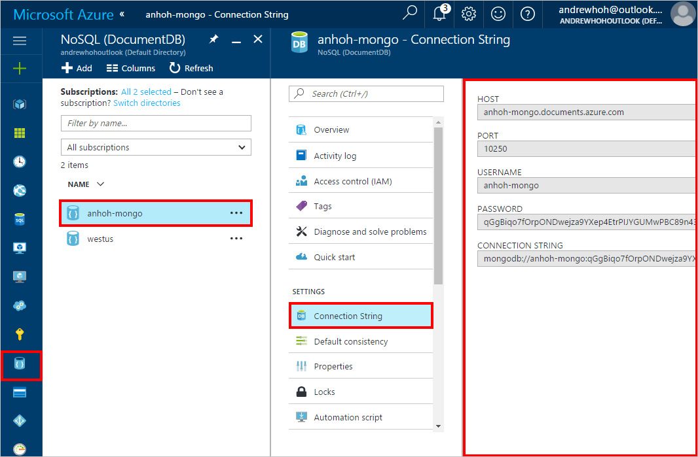

<properties
    pageTitle="将数据迁移到具有 MongoDB 协议支持的 Azure DocumentDB 帐户 | Azure"
    description="了解如何使用 mongoimport 和 mongorestore 将数据导入到具有 MongoDB 协议支持的 DocumentDB 帐户（目前以预览版提供）。"
    keywords="迁移"
    services="documentdb"
    author="AndrewHoh"
    manager="jhubbard"
    editor=""
    documentationcenter="" />
<tags
    ms.assetid="352c5fb9-8772-4c5f-87ac-74885e63ecac"
    ms.service="documentdb"
    ms.workload="data-services"
    ms.tgt_pltfrm="na"
    ms.devlang="na"
    ms.topic="article"
    ms.date="12/07/2016"
    wacn.date="01/12/2017"
    ms.author="anhoh" />  

# 将数据迁移到具有 MongoDB 协议支持的 DocumentDB
若要迁移到具有 MongoDB 协议支持的 Azure DocumentDB 帐户，必须：

- 从 [MongoDB](https://www.mongodb.com/download-center) 下载 *mongoimport.exe* 或 *mongorestore.exe*
- 提供具有 MongoDB 协议支持的 DocumentDB 帐户的[连接字符串](/documentation/articles/documentdb-connect-mongodb-account/)信息

## 迁移之前的注意事项

1. **增加吞吐量** - 为集合预配的吞吐量将影响数据迁移的持续时间。请确保对于较大的数据迁移增加吞吐量。之后，请确保降低回吞吐量以节省成本。有关如何在 [Azure 门户预览](https://portal.azure.cn)中增加吞吐量的说明，请参阅 [DocumentDB 中的性能级别和定价层](/documentation/articles/documentdb-performance-levels/)。

2. **启用 SSL** - DocumentDB 具有严格的安全要求和标准。请确保在与帐户进行交互时启用 SSL。下面的示例包括如何为 *mongoimport* 和 *mongorestore* 启用 SSL。

## 查找连接信息（主机、端口、用户名和密码）

1. 转到 [Azure 门户预览](https://portal.azure.cn)。

2. 单击门户左侧资源导航中的“NoSQL (DocumentDB)”条目。

3. 在 DocumentDB 帐户列表中找到并单击“具有 MongoDB 协议支持的 DocumentDB 帐户名称”。

4. 在新打开的帐户边栏选项卡中，单击左侧导航中的“连接字符串”。

      

5. “连接字符串”边栏选项卡将包含成功连接到帐户所需的所有信息。

## 使用 mongoimport 将数据导入到具有 MongoDB 协议支持的 DocumentDB

1. 使用特定于帐户的值填写*主机*、*用户名*和*密码*。

    模板：

        mongoimport.exe --host <your_hostname>:10250 -u <your_username> -p <your_password> --db <your_database> --collection <your_collection> --ssl --sslAllowInvalidCertificates --type json --file C:\sample.json

    示例：

        mongoimport.exe --host anhoh-host.documents.azure.com:10250 -u anhoh-host -p tkvaVkp4Nnaoirnouenrgisuner2435qwefBH0z256Na24frio34LNQasfaefarfernoimczciqisAXw== --ssl --sslAllowInvalidCertificates --db sampleDB --collection sampleColl --type json --file C:\Users\anhoh\Desktop*.json

2. 祝贺你！ 已成功将数据导入到 DocumentDB 帐户。

## 使用 mongorestore 将数据导入到具有 MongoDB 协议支持的 DocumentDB

1. 使用特定于帐户的值填写*主机*、*用户名*和*密码*。

    模板：

        mongorestore.exe --host <your_hostname>:10250 -u <your_username> -p <your_password> --db <your_database> --collection <your_collection> --ssl --sslAllowInvalidCertificates <path_to_backup>

    示例：

        mongorestore.exe --host anhoh-host.documents.azure.com:10250 -u anhoh-host -p tkvaVkp4Nnaoirnouenrgisuner2435qwefBH0z256Na24frio34LNQasfaefarfernoimczciqisAXw== --ssl --sslAllowInvalidCertificates ./dumps/dump-2016-12-07

2. 祝贺你！ 已成功将数据还原到 DocumentDB 帐户。

## 后续步骤
- 浏览具有 MongoDB 协议支持的 DocumentDB [示例](/documentation/articles/documentdb-mongodb-samples/)。

<!---HONumber=Mooncake_0103_2017-->
