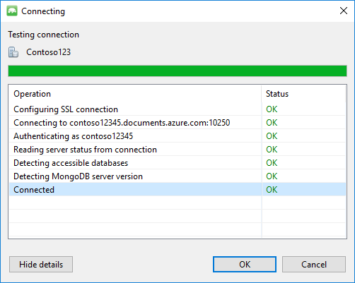
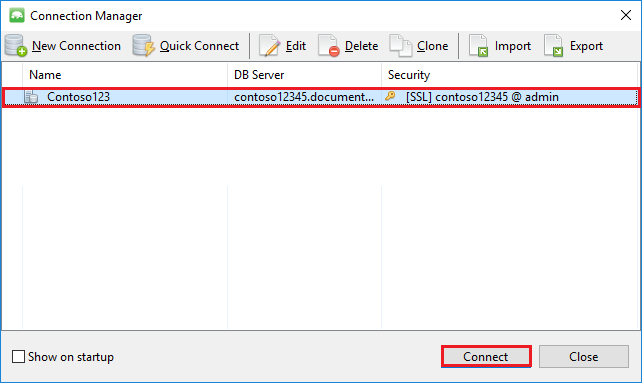

<properties 
	pageTitle="将 MongoChef 与具有 MongoDB 协议支持的 DocumentDB 帐户配合使用 | Azure" 
	description="了解如何将 MongoChef 与具有 MongoDB 协议支持的 DocumentDB 帐户（目前以预览版提供）配合使用。" 
	keywords="mongochef"
	services="documentdb" 
	authors="stephbaron" 
	manager="jhubbard" 
	editor="" 
	documentationCenter=""/>

<tags 
	ms.service="documentdb" 
	ms.workload="data-services" 
	ms.tgt_pltfrm="na" 
	ms.devlang="na" 
	ms.topic="article" 
	ms.date="08/25/2016" 
	wacn.date="10/18/2016" 
	ms.author="anhoh"/>  

# 将 MongoChef 与具有 MongoDB 协议支持的 DocumentDB 帐户配合使用

若要使用 MongoChef 连接到具有 MongoDB 协议支持的 Azure DocumentDB 帐户，必须：

- 下载并安装 [MongoChef](http://3t.io/mongochef)
- 提供具有 MongoDB 协议支持的 DocumentDB 帐户的[连接字符串](/documentation/articles/documentdb-connect-mongodb-account/)信息

## 在 MongoChef 中创建连接  

若要将具有 MongoDB 协议支持的 DocumentDB 帐户添加到 MongoChef 连接管理器，请执行以下步骤。

1. 使用[此处](/documentation/articles/documentdb-connect-mongodb-account/)的指令检索具有 MongoDB 协议支持的 DocumentDB 的连接信息。

	  

2. 单击“连接”以打开“连接管理器”，然后单击“新建连接”

	  

	
2. 在“新建连接”窗口中的“服务器”选项卡上，输入具有 MongoDB 协议支持的 DocumentDB 帐户的主机 (FQDN) 和端口。
	
	  

3. 在“新建连接”窗口中的“身份验证”选项卡上，选择“标准(MONGODB-CR 或 SCARM-SHA-1)”身份验证模式，然后输入用户名和密码。接受默认的身份验证数据库（管理员），或提供自己的值。

	

4. 在“新建连接”窗口中的“SSL”选项卡上，选中“使用 SSL 协议进行连接”复选框和“接受自签名 SSL 证书”单选按钮。

	

5. 单击“测试连接”按钮以验证连接信息，单击“确定”以返回到“新建连接”窗口，然后单击“保存”。

	

## 使用 MongoChef 创建数据库、集合与文档  

若要使用 MongoChef 创建数据库、集合与文档，请执行以下步骤。

1. 在“连接管理器”中突出显示连接，然后单击“连接”。

	

2. 右键单击主机，然后选择“添加数据库”。提供数据库名称，然后单击“确定”。
	
	

3. 右键单击数据库，然后选择“添加集合”。提供集合名称，然后单击“创建”。

	

4. 单击“集合”菜单项，然后单击“添加文档”。

	

5. 在“添加文档”对话框中粘贴以下内容，然后单击“添加文档”。

		{
    	"_id": "AndersenFamily",
    	"lastName": "Andersen",
    	"parents": [
       		{ "firstName": "Thomas" },
       		{ "firstName": "Mary Kay"}
    	],
    	"children": [
       	{
           	"firstName": "Henriette Thaulow", "gender": "female", "grade": 5,
           	"pets": [{ "givenName": "Fluffy" }]
       	}
    	],
    	"address": { "state": "WA", "county": "King", "city": "seattle" },
    	"isRegistered": true
		}

	
6. 添加另一个文档，但这次使用以下内容。

		{
	    "_id": "WakefieldFamily",
	    "parents": [
    	    { "familyName": "Wakefield", "givenName": "Robin" },
        	{ "familyName": "Miller", "givenName": "Ben" }
    	],
    	"children": [
	        {
            	"familyName": "Merriam", 
             	"givenName": "Jesse", 
            	"gender": "female", "grade": 1,
            	"pets": [
	                { "givenName": "Goofy" },
                	{ "givenName": "Shadow" }
            	]
        	},
        	{ 
	            "familyName": "Miller", 
             	"givenName": "Lisa", 
             	"gender": "female", 
             	"grade": 8 }
    	],
    	"address": { "state": "NY", "county": "Manhattan", "city": "NY" },
    	"isRegistered": false
		}

7. 执行示例查询。例如，搜索姓氏为“Andersen”的家庭，并返回父母和州/省字段。

	
	

## 后续步骤

- 浏览具有 MongoDB 协议支持的 DocumentDB [示例](/documentation/articles/documentdb-mongodb-samples/)。
- 阅读具有 MongoDB 协议支持的 DocumentDB [预览版开发指南](/documentation/articles/documentdb-mongodb-guidelines/)。

 

<!---HONumber=Mooncake_1010_2016-->
