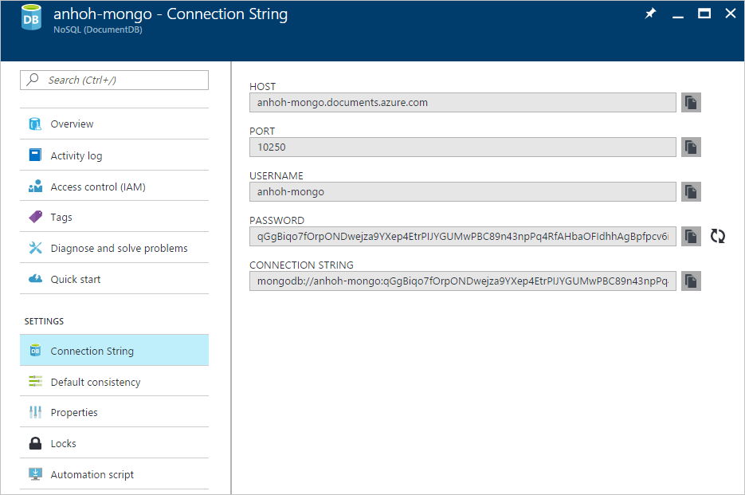
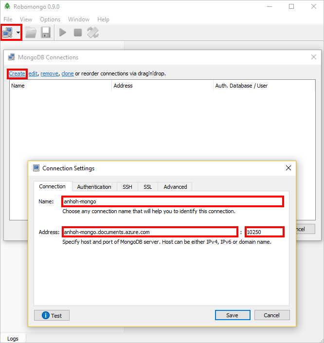
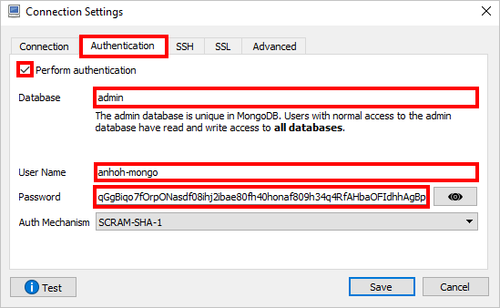
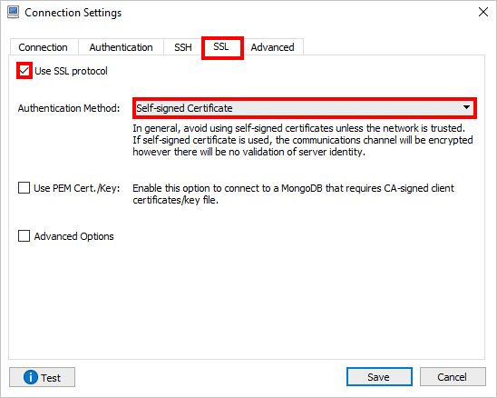

<properties
    pageTitle="将 Robomongo 用于 DocumentDB | Azure"
    description="了解如何将 Robomongo 用于 DocumentDB: API for MongoDB 帐户"
    keywords="robomongo"
    services="documentdb"
    author="AndrewHoh"
    manager="jhubbard"
    editor=""
    documentationcenter="" />
<tags
    ms.assetid="352c5fb9-8772-4c5f-87ac-74885e63ecac"
    ms.service="documentdb"
    ms.workload="data-services"
    ms.tgt_pltfrm="na"
    ms.devlang="na"
    ms.topic="article"
    ms.date="04/28/2017"
    wacn.date="05/31/2017"
    ms.author="anhoh"
    ms.translationtype="Human Translation"
    ms.sourcegitcommit="4a18b6116e37e365e2d4c4e2d144d7588310292e"
    ms.openlocfilehash="d0ac35826d9d5133e48b7bd9ec5cdf34bf6a1303"
    ms.contentlocale="zh-cn"
    ms.lasthandoff="05/19/2017" />

# 将 Robomongo 用于 DocumentDB: API for MongoDB 帐户
若要使用 Robomongo 连接到 DocumentDB: API for MongoDB 帐户，必须：

- 下载并安装 [Robomongo](https://robomongo.org/)
- 具有 DocumentDB: API for MongoDB 帐户的[连接字符串](/documentation/articles/documentdb-connect-mongodb-account/)信息

## 使用 Robomongo 进行连接
若要将 DocumentDB: API for MongoDB 帐户添加到 Robomongo MongoDB 连接，请执行以下步骤。

1. 使用[此处](/documentation/articles/documentdb-connect-mongodb-account/)的指令检索 DocumentDB: API for MongoDB 帐户连接信息。

    
2. 运行 *Robomongo.exe*

3. 单击“文件”下的“连接”按钮以管理连接。 然后，在“MongoDB 连接”窗口中单击“创建”，这会打开“连接设置”窗口。

4. 在“连接设置”窗口中，选择名称。 然后，从步骤 1 的连接信息中找到**主机**和**端口**，并将其分别输入到“地址”和“端口”中。

    
5. 在“身份验证”选项卡上，单击“执行身份验证”。 然后，输入数据库（默认值为 Admin）、**用户名**和**密码**。
**用户名**和**密码**可以在步骤 1 的连接信息中找到。

    
6. 在“SSL”选项卡上，选中“使用 SSL 协议”，然后将“身份验证方法”更改为“自签名证书”。

    
7. 最后，单击“测试”验证是否能够连接，然后单击“保存”。

## 后续步骤
- 浏览 DocumentDB: API for MongoDB [示例](/documentation/articles/documentdb-mongodb-samples/)。

<!---Update_Description: wording update -->