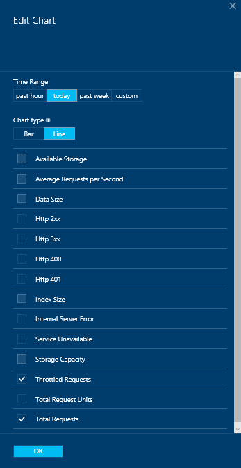
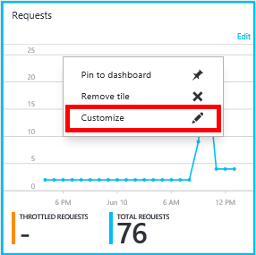
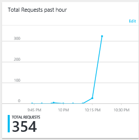

<properties
    pageTitle="监视 DocumentDB 请求和存储 | Azure"
    description="了解如何监视 DocumentDB 帐户的性能指标（如请求和服务器错误）以及使用情况指标（如存储消耗）。"
    services="documentdb"
    documentationcenter=""
    author="mimig1"
    manager="jhubbard"
    editor="cgronlun" />
<tags
    ms.assetid="4c6a2e6f-6e78-48e3-8dc6-f4498b235a9e"
    ms.service="documentdb"
    ms.workload="data-services"
    ms.tgt_pltfrm="na"
    ms.devlang="na"
    ms.topic="article"
    ms.date="12/15/2016"
    wacn.date="05/31/2017"
    ms.author="mimig"
    ms.translationtype="Human Translation"
    ms.sourcegitcommit="4a18b6116e37e365e2d4c4e2d144d7588310292e"
    ms.openlocfilehash="49c40641133bffaeb7bc43ba6aca0fd9d6505bd5"
    ms.contentlocale="zh-cn"
    ms.lasthandoff="05/19/2017" />

# 监视 DocumentDB 请求、使用情况和存储
可以在 [Azure 门户预览](https://portal.azure.cn/)中监视 DocumentDB 帐户。 对于每个 DocumentDB 帐户，性能指标（如请求和服务器错误）和使用情况指标（如存储消耗）都可用。

可在“帐户”边栏选项卡、新的“指标”边栏选项卡或 Azure Monitor.查看指标。

## 在“指标”边栏选项卡上查看性能指标
1. 在 [Azure 门户预览](https://portal.azure.cn/)中，单击“更多服务”，滚动到“数据库”，单击“DocumentDB”，然后单击要查看其性能指标的 DocumentDB 帐户的名称。
2. 在资源菜单的“监视”下，单击“指标”。

此时将打开“指标”边栏选项卡，可以选择要查看的集合。 可以查看“可用性”、“请求”、“吞吐量”和“存储”指标，并将其与 DocumentDB SLA 进行比较。

## 使用 Azure Monitor 查看性能指标
1. 在 [Azure 门户预览](https://portal.azure.cn/)中，单击跳转栏上的“监视器”。
2. 在资源菜单中，单击“指标”。
3. 在“监视器 - 指标”窗口的“资源组”下拉菜单中，选择与想要监视的 DocumentDB 帐户关联的资源组。 
4. 在“资源”  下拉菜单中，选择要监视的数据库帐户。
5. 在“可用指标” 列表中，选择要显示的指标。 使用 Ctrl 按钮进行多选。 

    指标在“绘图”  窗口中显示。 

## 在帐户边栏选项卡上查看性能指标
1. 在 [Azure 门户预览](https://portal.azure.cn/)中，单击“更多服务”，滚动到“数据库”，单击“DocumentDB”，然后单击要查看其性能指标的 DocumentDB 帐户的名称。
2. 默认情况下，“监视”可重用功能区  显示以下磁贴：
   
   - 当天的请求总数。
   - 使用的存储量。
   
   如果表显示“无可用数据”  而你认为数据库中有数据，请参阅 [故障排除](#troubleshooting) 部分。
   
   
3. 单击“请求”或“使用配额”磁贴可打开详细的“指标”边栏选项卡。
4. “指标”  边栏选项卡显示有关所选指标的详细信息。  边栏选项卡顶部显示了按小时绘制的请求图表，其下的表格中显示了限制请求数和请求总数的聚合值。  指标边栏选项卡还显示警报列表，这些警报已经定义，且根据当前指标边栏选项卡上显示的指标进行了筛选（因此，如果警报数量较多，将只能在此处看到相关的警报）。   
   
   

## 在门户中自定义性能指标视图
1. 若要自定义显示在特定图表中的指标，请单击该图表在“指标”边栏选项卡中将它打开，然后单击“编辑图表”。  
   
2. 在“编辑图表”边栏选项卡中，有选项可用于修改显示在该图表中的指标，以及它们的时间范围。  
   
3. 若要更改显示在该部件中的指标，只需选择或清除可用的性能指标，然后单击边栏选项卡底部的“确定”。  
4. 若要更改时间范围，请选择一个不同的范围（例如，“自定义”），然后单击边栏选项卡底部的“确定”。  
   
   

## 在门户中创建并排图表
Azure 门户预览使你能够创建并排的指标图表。  

1. 首先，请右键单击要复制的图表，然后选择“自定义”。
   
   
2. 单击菜单上的“克隆”以复制部件，然后单击“完成自定义”。
   
     

你现在可能将此部件视为其他任何指标部件，同时自定义显示在部件中的指标和时间范围。  通过执行此操作，可以同时看到两个并排的不同的指标图表。  
      

## 在门户中设置警报
1. 在 [Azure 门户预览](https://portal.azure.cn/)中，依次单击“更多服务”、“DocumentDB”、要为其设置性能指标警报的 DocumentDB 帐户的名称。
2. 在资源菜单中，单击“警报规则”以打开“警报规则”边栏选项卡。  
   
3. 在“警报规则”边栏选项卡中，单击“添加警报”。  
   
4. 在“添加警报规则”边栏选项卡中，指定： 
   
   - 你正在设置的警报规则的名称。
   - 新的警报规则的说明。
   - 警报规则指标。
   - 确定何时激活警报的条件、阈值和时间段。 例如，在过去的 15 分钟服务器错误计数大于 5。
   - 当警报触发时，服务管理员和协同管理员是否将通过电子邮件得到通知。
   - 警报通知的其他电子邮件地址。  
     

## 以编程方式监视 DocumentDB
门户中可用的帐户级别指标（如帐户存储使用情况和请求总数）不可通过 DocumentDB API 使用。 但是，你可以使用 DocumentDB API 在集合级别检索使用情况数据。 若要检索集合级别的数据，请执行以下操作：

- 若要使用 REST API，请[对集合执行 GET](https://msdn.microsoft.com/zh-cn/library/mt489073.aspx)。 集合的配额和使用情况信息将返回到响应中的 x-ms-resource-quota 和 x-ms-resource-usage 标头中。
- 若要使用 .NET SDK，请使用 [DocumentClient.ReadDocumentCollectionAsync](https://msdn.microsoft.com/zh-cn/library/microsoft.azure.documents.client.documentclient.readdocumentcollectionasync.aspx) 方法，它将返回 [ResourceResponse](https://msdn.microsoft.com/zh-cn/library/dn799209.aspx)，其中包含大量使用情况属性，例如 **CollectionSizeUsage**、**DatabaseUsage**、**DocumentUsage** 等。

若要访问其他指标，请使用 [Azure Monitor SDK](https://www.nuget.org/packages/Microsoft.Azure.Insights)。 可以通过调用以下命令检索可用的指标定义：

    https://management.azure.com/subscriptions/{SubscriptionId}/resourceGroups/{ResourceGroup}/providers/Microsoft.DocumentDb/databaseAccounts/{DocumentDBAccountName}/metricDefinitions?api-version=2015-04-08

用于检索各个指标的查询使用以下格式：

    https://management.azure.com/subscriptions/{SubecriptionId}/resourceGroups/{ResourceGroup}/providers/Microsoft.DocumentDb/databaseAccounts/{DocumentDBAccountName}/metrics?api-version=2015-04-08&$filter=%28name.value%20eq%20%27Total%20Requests%27%29%20and%20timeGrain%20eq%20duration%27PT5M%27%20and%20startTime%20eq%202016-06-03T03%3A26%3A00.0000000Z%20and%20endTime%20eq%202016-06-10T03%3A26%3A00.0000000Z

有关详细信息，请参阅 [通过 Azure Monitor REST API 检索资源指标](https://blogs.msdn.microsoft.com/cloud_solution_architect/2016/02/23/retrieving-resource-metrics-via-the-azure-insights-api/)。 请注意，“Azure Inights”已重命名为“Azure Monitor”。  本博客条目引用旧名称。

## 故障排除
如果监视磁贴显示“无可用数据”  消息，并且你最近向数据库发出过请求或添加过数据，则可以编辑该磁贴以反映最新使用情况。

### 编辑磁贴以刷新当前数据
1. 若要自定义显示在特定部件中的指标，请单击该图表打开“指标”边栏选项卡，然后单击“编辑图表”。  
   
2. 在“编辑图表”边栏选项卡上的“时间范围”部分中，单击“过去一小时”，然后单击“确定”。  
   
3. 现在磁贴应该刷新以显示当前数据和使用情况。  
   

## 后续步骤
若要深入了解 DocumentDB 容量规划，请参阅 [DocumentDB Capacity Planner 计算器](https://www.documentdb.com/capacityplanner)。

<!-- Update_Description: wording update -->