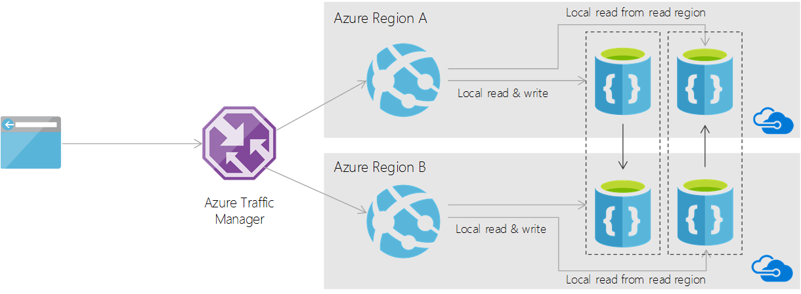

<properties
    pageTitle="使用 DocumentDB 的多主数据库结构 | Azure"
    description="了解如何使用 DocumentDB 来设计可实现跨多个地理区域进行本地读取和写入的应用程序结构。"
    services="documentdb"
    documentationcenter=""
    author="arramac"
    manager="jhubbard"
    editor="" />
<tags
    ms.assetid="706ced74-ea67-45dd-a7de-666c3c893687"
    ms.service="documentdb"
    ms.devlang="multiple"
    ms.topic="article"
    ms.tgt_pltfrm="na"
    ms.workload="na"
    ms.date="01/25/2017"
    wacn.date="05/31/2017"
    ms.author="arramac"
    ms.custom="H1Hack27Feb2017"
    ms.translationtype="Human Translation"
    ms.sourcegitcommit="4a18b6116e37e365e2d4c4e2d144d7588310292e"
    ms.openlocfilehash="52f30748d3aa591f316991a29aa163ec4b6935a3"
    ms.contentlocale="zh-cn"
    ms.lasthandoff="05/19/2017" />

# 使用 DocumentDB 多主机全局复制数据库体系结构
DocumentDB 支持统包的[全局复制](/documentation/articles/documentdb-distribute-data-globally/)，允许在工作负荷中的任意位置以低延迟的访问将数据分布到多个区域。 此模型常用于发布者/使用者工作负荷。在这些工作负荷中，单个地理区域包含一个作者，其他（读取）区域包含分布于全球的读者。 

还可以使用 DocumentDB 的全局复制支持来构建作者和读者分布于全球的应用程序。 本文档概述一种使用 DocumentDB 为全球分布的作者实现本地写入和本地读取访问的模式。

## 内容发布 - 示例方案
让我们借助一个真实的方案，介绍如何在 DocumentDB 中使用全局分布式多区域/多主读写模式。 假设已在 DocumentDB 上构建一个内容发布平台。 为了向发布者和使用者提供良好的用户体验，此平台必须满足一些要求。

- 作者和订户遍布全球 
- 作者必须将文章发布（写入）到本地（最近的）区域
- 作者的文章拥有遍布全球的读者/订户。 
- 新文章发布时，订户应会收到通知。
- 订户必须能从本地区域阅读文章。 订户还应能对这些文章添加评论。 
- 包括文章作者在内的任何人都应能在本地区域查看文章所附的所有评论。 

假设存在数百万的使用者和发布者以及数十亿篇文章，我们很快就必须面对扩展以及保证访问位置的问题。 与大多数可伸缩性问题一样，解决方案在于良好的分区策略。 接下来，让我们看看如何将文章、评论和通知作为文档建模、配置 DocumentDB 帐户以及实现数据访问层。 

若要了解有关分区和分区键的详细信息，请参阅 [DocumentDB 中的分区和缩放](/documentation/articles/documentdb-partition-data/)。

## 为通知建模
通知是特定于用户的数据馈送。 因此，通知文档的访问模式始终发生在单个用户的上下文中。 例如，可以“向某个用户发布通知”或“为某个给定用户获取所有通知”。 因此，对于此类型，分区键的最佳选择是 `UserId`。

    class Notification 
    { 
        // Unique ID for Notification. 
        public string Id { get; set; }

        // The user Id for which notification is addressed to. 
        public string UserId { get; set; }

        // The partition Key for the resource. 
        public string PartitionKey 
        { 
            get 
            { 
                return this.UserId; 
            }
        }

        // Subscription for which this notification is raised. 
        public string SubscriptionFilter { get; set; }

        // Subject of the notification. 
        public string ArticleId { get; set; } 
    }

## 为订阅建模
订阅可以根据各种标准创建，如感兴趣的特定类别的文章或特定的发布者。 因此， `SubscriptionFilter` 是很好的分区键选择。

    class Subscriptions 
    { 
        // Unique ID for Subscription 
        public string Id { get; set; }

        // Subscription source. Could be Author | Category etc. 
        public string SubscriptionFilter { get; set; }

        // subscribing User. 
        public string UserId { get; set; }

        public string PartitionKey 
        { 
            get 
            { 
                return this.SubscriptionFilter; 
            } 
        } 
    }

## 为文章建模
通过通知标识一篇文章后，后续查询通常基于 `Article.Id`。 选择 `Article.Id` 作为分区键将为在 DocumentDB 集合内存储文章提供最佳分布。 

    class Article 
    { 
        // Unique ID for Article 
        public string Id { get; set; }
        
        public string PartitionKey 
        { 
            get 
            { 
                return this.Id; 
            } 
        }
        
        // Author of the article
        public string Author { get; set; }

        // Category/genre of the article
        public string Category { get; set; }

        // Tags associated with the article
        public string[] Tags { get; set; }

        // Title of the article
        public string Title { get; set; }
        
        //... 
    }

## 为评论建模
和文章一样，评论通常在文章上下文中写入和读取。 选择 `ArticleId` 作为分区键将为与文章相关的评论提供最佳分布和高效访问。 

    class Review 
    { 
        // Unique ID for Review 
        public string Id { get; set; }

        // Article Id of the review 
        public string ArticleId { get; set; }

        public string PartitionKey 
        { 
            get 
            { 
                return this.ArticleId; 
            } 
        }
        
        //Reviewer Id 
        public string UserId { get; set; }
        public string ReviewText { get; set; }
        
        public int Rating { get; set; } }
    }

## 数据访问层方法
现在让我们看看需要实现的主要数据访问方法。 以下是 `ContentPublishDatabase` 需要的方法列表：

    class ContentPublishDatabase 
    { 
        public async Task CreateSubscriptionAsync(string userId, string category);
    
        public async Task<IEnumerable<Notification>> ReadNotificationFeedAsync(string userId);
    
        public async Task<Article> ReadArticleAsync(string articleId);
    
        public async Task WriteReviewAsync(string articleId, string userId, string reviewText, int rating);
    
        public async Task<IEnumerable<Review>> ReadReviewsAsync(string articleId); 
    }

## DocumentDB 帐户配置
若要保证本地读取和写入，数据分区不仅要基于分区键，还要基于不同区域的地理访问模式。 该模型依赖于每个区域具有异地复制的 DocumentDB 数据库帐户。 例如，对于两个区域，具有针对多区域写入的设置：

| 帐户名 | 写入区域 | 读取区域 |
| --- | --- | --- |
| `contentpubdatabase-usa.documents.azure.com` | `West US` |`North Europe` |
| `contentpubdatabase-europe.documents.azure.com` | `North Europe` |`West US` |

下图显示如何在使用此设置的典型应用程序中执行读取和写入：

以下代码片段演示如何在 `West US` 区域中运行的 DAL 中初始化客户端。
    
    ConnectionPolicy writeClientPolicy = new ConnectionPolicy { ConnectionMode = ConnectionMode.Direct, ConnectionProtocol = Protocol.Tcp };
    writeClientPolicy.PreferredLocations.Add(LocationNames.WestUS);
    writeClientPolicy.PreferredLocations.Add(LocationNames.NorthEurope);

    DocumentClient writeClient = new DocumentClient(
        new Uri("https://contentpubdatabase-usa.documents.azure.com"), 
        writeRegionAuthKey,
        writeClientPolicy);

    ConnectionPolicy readClientPolicy = new ConnectionPolicy { ConnectionMode = ConnectionMode.Direct, ConnectionProtocol = Protocol.Tcp };
    readClientPolicy.PreferredLocations.Add(LocationNames.NorthEurope);
    readClientPolicy.PreferredLocations.Add(LocationNames.WestUS);

    DocumentClient readClient = new DocumentClient(
        new Uri("https://contentpubdatabase-europe.documents.azure.com"),
        readRegionAuthKey,
        readClientPolicy);

通过上述设置，数据访问层可以根据其部署位置将所有写入转发到本地帐户。 通过从两个帐户读取来执行读取以获得数据的全局视图。 这种方法可以扩展到所需的任意多个区域。 例如，以下是三个地理区域的设置：

| 帐户名 | 写入区域 | 读取区域 1 | 读取区域 2 |
| --- | --- | --- | --- |
| `contentpubdatabase-usa.documents.azure.com` | `West US` |`North Europe` |`Southeast Asia` |
| `contentpubdatabase-europe.documents.azure.com` | `North Europe` |`West US` |`Southeast Asia` |
| `contentpubdatabase-asia.documents.azure.com` | `Southeast Asia` |`North Europe` |`West US` |

## 数据访问层实现
现在让我们看一下如何实现具有两个可写区域的应用程序的数据访问层 (DAL)。 DAL 必须执行以下步骤：

- 为每个帐户创建多个 `DocumentClient` 实例。在两个区域的情况下，每个 DAL 实例具有一个 `writeClient` 和一个 `readClient`。
- 根据应用程序的部署区域来配置 `writeclient` 和 `readClient` 的终结点。例如，部署在 `West US` 中的 DAL 使用 `contentpubdatabase-usa.documents.azure.com` 执行写入。部署在 `NorthEurope` 中的 DAL 使用 `contentpubdatabase-europ.documents.azure.com` 执行写入。

通过上述设置，可以实现数据访问方法。 写入操作将写入转发到相应的 `writeClient`。

    public async Task CreateSubscriptionAsync(string userId, string category)
    {
        await this.writeClient.CreateDocumentAsync(this.contentCollection, new Subscriptions
        {
            UserId = userId,
            SubscriptionFilter = category
        });
    }

    public async Task WriteReviewAsync(string articleId, string userId, string reviewText, int rating)
    {
        await this.writeClient.CreateDocumentAsync(this.contentCollection, new Review
        {
            UserId = userId,
            ArticleId = articleId,
            ReviewText = reviewText,
            Rating = rating
        });
    }

若要读取通知和评论，必须从两个区域读取并合并结果，如以下代码片段所示：

    public async Task<IEnumerable<Notification>> ReadNotificationFeedAsync(string userId)
    {
        IDocumentQuery<Notification> writeAccountNotification = (
            from notification in this.writeClient.CreateDocumentQuery<Notification>(this.contentCollection) 
            where notification.UserId == userId 
            select notification).AsDocumentQuery();
        
        IDocumentQuery<Notification> readAccountNotification = (
            from notification in this.readClient.CreateDocumentQuery<Notification>(this.contentCollection) 
            where notification.UserId == userId 
            select notification).AsDocumentQuery();

        List<Notification> notifications = new List<Notification>();

        while (writeAccountNotification.HasMoreResults || readAccountNotification.HasMoreResults)
        {
            IList<Task<FeedResponse<Notification>>> results = new List<Task<FeedResponse<Notification>>>();

            if (writeAccountNotification.HasMoreResults)
            {
                results.Add(writeAccountNotification.ExecuteNextAsync<Notification>());
            }

            if (readAccountNotification.HasMoreResults)
            {
                results.Add(readAccountNotification.ExecuteNextAsync<Notification>());
            }

            IList<FeedResponse<Notification>> notificationFeedResult = await Task.WhenAll(results);

            foreach (FeedResponse<Notification> feed in notificationFeedResult)
            {
                notifications.AddRange(feed);
            }
        }
        return notifications;
    }

    public async Task<IEnumerable<Review>> ReadReviewsAsync(string articleId)
    {
        IDocumentQuery<Review> writeAccountReviews = (
            from review in this.writeClient.CreateDocumentQuery<Review>(this.contentCollection) 
            where review.ArticleId == articleId 
            select review).AsDocumentQuery();
        
        IDocumentQuery<Review> readAccountReviews = (
            from review in this.readClient.CreateDocumentQuery<Review>(this.contentCollection) 
            where review.ArticleId == articleId 
            select review).AsDocumentQuery();

        List<Review> reviews = new List<Review>();
        
        while (writeAccountReviews.HasMoreResults || readAccountReviews.HasMoreResults)
        {
            IList<Task<FeedResponse<Review>>> results = new List<Task<FeedResponse<Review>>>();

            if (writeAccountReviews.HasMoreResults)
            {
                results.Add(writeAccountReviews.ExecuteNextAsync<Review>());
            }

            if (readAccountReviews.HasMoreResults)
            {
                results.Add(readAccountReviews.ExecuteNextAsync<Review>());
            }

            IList<FeedResponse<Review>> notificationFeedResult = await Task.WhenAll(results);

            foreach (FeedResponse<Review> feed in notificationFeedResult)
            {
                reviews.AddRange(feed);
            }
        }

        return reviews;
    }

因此，通过选择合适的分区键和静态的基于帐户的分区，可以使用 DocumentDB 实现多区域本地写入和读取。

## 后续步骤
本文以内容发布作为示例方案，介绍如何通过 DocumentDB 使用全局分布式多区域读写模式。

- 了解 DocumentDB 如何支持 [全局分布](/documentation/articles/documentdb-distribute-data-globally/)
- 了解 [DocumentDB 中的自动和手动故障转移](/documentation/articles/documentdb-regional-failovers/)
- 了解 [DocumentDB 的全局一致性](/documentation/articles/documentdb-consistency-levels/)

<!---Update_Description: wording update -->