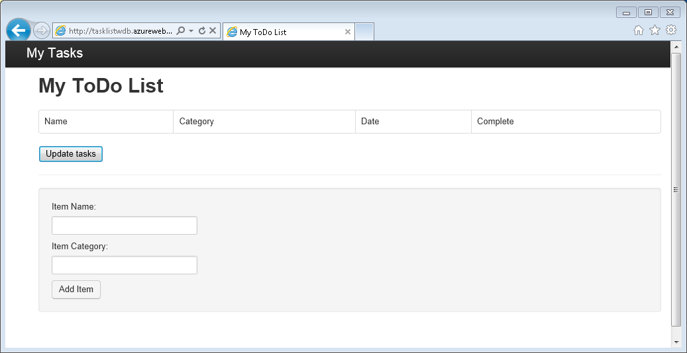

<properties
    pageTitle="了解 Node.js - DocumentDB Node.js 教程 | Azure"
    description="了解 Node.js！ 教程探讨了如何使用 DocumentDB 存储和访问托管在 Azure 网站上的 Node.js Express Web 应用程序中的数据。"
    keywords="应用程序开发, 数据库教程, 了解 node.js, node.js 教程, documentdb, azure, Azure"
    services="documentdb"
    documentationcenter="nodejs"
    author="syamkmsft"
    manager="jhubbard"
    editor="cgronlun" />
<tags
    ms.assetid="9da9e63b-e76a-434e-96dd-195ce2699ef3"
    ms.service="documentdb"
    ms.workload="data-services"
    ms.tgt_pltfrm="na"
    ms.devlang="nodejs"
    ms.topic="hero-article"
    ms.date="12/16/2016"
    wacn.date="05/31/2017"
    ms.author="syamk"
    ms.translationtype="Human Translation"
    ms.sourcegitcommit="4a18b6116e37e365e2d4c4e2d144d7588310292e"
    ms.openlocfilehash="49004fc2f92190cd14a1d20a8581b29cc257ef6a"
    ms.contentlocale="zh-cn"
    ms.lasthandoff="05/19/2017" />

# 使用 DocumentDB 生成 Node.js Web 应用程序
> [AZURE.SELECTOR]
- [.NET](/documentation/articles/documentdb-dotnet-application/)
- [适用于 MongoDB 的 .NET](/documentation/articles/documentdb-mongodb-application/)
- [Node.js](/documentation/articles/documentdb-nodejs-application/)
- [Java](/documentation/articles/documentdb-java-application/)
- [Python](/documentation/articles/documentdb-python-application/)

本 Node.js 教程展示了如何使用 DocumentDB 通过 Azure 网站上托管的 Node.js Express 应用程序存储和访问数据。 用户会生成一个简单的基于 Web 的任务管理应用程序（ToDo 应用），用于创建、检索和完成任务。 任务存储为 DocumentDB 中的 JSON 文档。 本教程指导完成创建和部署应用的过程，并说明每个片段中发生的情况。

没有时间完成本教程且只想获取完整的解决方案？ 没有问题，你可以从 [GitHub][GitHub]获得完整的示例解决方案。 

## 先决条件
> [AZURE.TIP]
> 本 Node.js 教程假定你之前有使用 Node.js 和 Azure 网站的经验。
> 
> 

在按照本文中的说明操作之前，应确保已具备以下先决条件：

- 有效的 Azure 帐户。 如果你没有帐户，可以创建一个试用帐户，只需几分钟即可完成。 有关详细信息，请参阅 [Azure 1 元试用](/pricing/1rmb-trial/)。

   或

   本地安装的 [DocumentDB 模拟器](/documentation/articles/documentdb-nosql-local-emulator/)。
- [Node.js][Node.js] 版本 v0.10.29 或更高版本。
- [Express 生成器](http://www.expressjs.com/starter/generator.html)（可以通过 `npm install express-generator -g` 安装）
- [Git][Git]。

## 步骤 1：创建 DocumentDB 数据库帐户
首先创建一个 DocumentDB 帐户。 如果已有一个帐户，或者要在本教程中使用 DocumentDB 模拟器，可以跳到[步骤 2：创建新的 Node.js 应用程序](#_Toc395783178)。

[AZURE.INCLUDE [documentdb-create-dbaccount](../../includes/documentdb-create-dbaccount.md)]

[AZURE.INCLUDE [documentdb-keys](../../includes/documentdb-keys.md)]

## 步骤 2：了解如何创建新的 Node.js 应用程序
现在让我们来了解如何使用 [Express](http://expressjs.com/) 框架创建基本的 Hello World Node.js 项目。

1. 打开首选终端，例如 Node.js 命令提示符。
2. 导航到要在其中存储新应用程序的目录。
3. 使用 Express 生成器生成名叫 **todo**的新应用程序。
   
        express todo
4. 打开新的 **todo** 目录并安装依赖项。
   
        cd todo
        npm install
5. 运行新应用程序。
   
        npm start
6. 在浏览器中导航到 http://localhost:3000 即可查看新应用程序。
   
    

    然后，若要停止应用程序，请在终端窗口中按 CTRL + C，然后单击 **y** 终止批处理作业。

## 步骤 3：安装其他模块
**package.json** 文件是在项目的根目录中创建的文件之一。 此文件包含一系列其他模块，它们是 Node.js 应用程序必需的。 稍后，在你将此应用程序部署到 Azure 网站时，使用此文件以确定需要在 Azure 上安装哪些模块来支持你的应用程序。 我们仍需要为本教程多安装两个程序包。

1. 返回终端，通过 npm 安装 **async** 模块。
   
        npm install async --save
2. 通过 npm 安装 **documentdb** 模块。 这是 DocumentDB 所有奇迹发生的模块。
   
        npm install documentdb --save
3. 快速检查应用程序的 **package.json** 文件应显示其他模块。 此文件将通知 Azure 当运行应用程序时要下载并安装的程序包。 它应类似于下面的示例。
   
        {
          "name": "todo",
          "version": "0.0.0",
          "private": true,
          "scripts": {
            "start": "node ./bin/www"
          },
          "dependencies": {
            "async": "^2.1.4",
            "body-parser": "~1.15.2",
            "cookie-parser": "~1.4.3",
            "debug": "~2.2.0",
            "documentdb": "^1.10.0",
            "express": "~4.14.0",
            "jade": "~1.11.0",
            "morgan": "~1.7.0",
            "serve-favicon": "~2.3.0"
          }
        }
   
    这将告知 Node（稍后告知 Azure），你的应用程序依赖于这些模块。

## 步骤 4：在 Node 应用程序中使用 DocumentDB 服务
这负责处理所有的初始安装和配置，现在看看为什么要用这步，可以编写一些使用 DocumentDB 的代码。

### 创建模型
1. 在项目目录中，在 package.json 文件所在的同一目录中创建名为 **models** 的新目录。
2. 在 **models** 目录中，创建一个名为 **taskDao.js** 的新文件。 此文件将包含我们应用程序所创建任务的模型。
3. 在同一个 **models** 目录中，创建名为 **docdbUtils.js** 的另一个新文件。 此文件将包含一些可重用的有用代码，我们将在整个应用程序期间用到这些代码。 
4. 将以下代码复制到 **docdbUtils.js**
   
        var DocumentDBClient = require('documentdb').DocumentClient;
   
        var DocDBUtils = {
            getOrCreateDatabase: function (client, databaseId, callback) {
                var querySpec = {
                    query: 'SELECT * FROM root r WHERE r.id= @id',
                    parameters: [{
                        name: '@id',
                        value: databaseId
                    }]
                };
   
                client.queryDatabases(querySpec).toArray(function (err, results) {
                    if (err) {
                        callback(err);
   
                    } else {
                        if (results.length === 0) {
                            var databaseSpec = {
                                id: databaseId
                            };
   
                            client.createDatabase(databaseSpec, function (err, created) {
                                callback(null, created);
                            });
   
                        } else {
                            callback(null, results[0]);
                        }
                    }
                });
            },
   
            getOrCreateCollection: function (client, databaseLink, collectionId, callback) {
                var querySpec = {
                    query: 'SELECT * FROM root r WHERE r.id=@id',
                    parameters: [{
                        name: '@id',
                        value: collectionId
                    }]
                };               
   
                client.queryCollections(databaseLink, querySpec).toArray(function (err, results) {
                    if (err) {
                        callback(err);
   
                    } else {        
                        if (results.length === 0) {
                            var collectionSpec = {
                                id: collectionId
                            };
   
                            client.createCollection(databaseLink, collectionSpec, function (err, created) {
                                callback(null, created);
                            });
   
                        } else {
                            callback(null, results[0]);
                        }
                    }
                });
            }
        };
   
        module.exports = DocDBUtils;
   
	> [AZURE.TIP]
   	> createCollection 采用一个用以指定集合 Offer 类型的可选 requestOptions 参数。如果没有提供任何 requestOptions.offerType 值，则将使用默认 Offer 类型创建集合。
   	> 
   	> 有关 DocumentDB 产品/服务类型的详细信息，请参阅 [DocumentDB 中的性能级别](/documentation/articles/documentdb-performance-levels/)
   	> 
   	>
 
5. 保存并关闭 **docdbUtils.js** 文件。
6. 在 **taskDao.js** 文件的开头添加以下代码，引用前面创建的 **DocumentDBClient** 和 **docdbUtils.js**：
   
        var DocumentDBClient = require('documentdb').DocumentClient;
        var docdbUtils = require('./docdbUtils');
7. 接下来，你将添加代码以定义和导出 Task 对象。 这负责初始化我们的 Task 对象，并设置我们将使用的数据库和文档集合。
   
        function TaskDao(documentDBClient, databaseId, collectionId) {
          this.client = documentDBClient;
          this.databaseId = databaseId;
          this.collectionId = collectionId;
   
          this.database = null;
          this.collection = null;
        }
   
        module.exports = TaskDao;
8. 然后添加以下代码以定义 Task 对象上的其他方法，该对象可与存储在 DocumentDB 中的数据进行交互。
   
        TaskDao.prototype = {
            init: function (callback) {
                var self = this;
   
                docdbUtils.getOrCreateDatabase(self.client, self.databaseId, function (err, db) {
                    if (err) {
                        callback(err);
                    } else {
                        self.database = db;
                        docdbUtils.getOrCreateCollection(self.client, self.database._self, self.collectionId, function (err, coll) {
                            if (err) {
                                callback(err);
   
                            } else {
                                self.collection = coll;
                            }
                        });
                    }
                });
            },
   
            find: function (querySpec, callback) {
                var self = this;
   
                self.client.queryDocuments(self.collection._self, querySpec).toArray(function (err, results) {
                    if (err) {
                        callback(err);
   
                    } else {
                        callback(null, results);
                    }
                });
            },
   
            addItem: function (item, callback) {
                var self = this;
   
                item.date = Date.now();
                item.completed = false;
   
                self.client.createDocument(self.collection._self, item, function (err, doc) {
                    if (err) {
                        callback(err);
   
                    } else {
                        callback(null, doc);
                    }
                });
            },
   
            updateItem: function (itemId, callback) {
                var self = this;
   
                self.getItem(itemId, function (err, doc) {
                    if (err) {
                        callback(err);
   
                    } else {
                        doc.completed = true;
   
                        self.client.replaceDocument(doc._self, doc, function (err, replaced) {
                            if (err) {
                                callback(err);
   
                            } else {
                                callback(null, replaced);
                            }
                        });
                    }
                });
            },
   
            getItem: function (itemId, callback) {
                var self = this;
   
                var querySpec = {
                    query: 'SELECT * FROM root r WHERE r.id = @id',
                    parameters: [{
                        name: '@id',
                        value: itemId
                    }]
                };
   
                self.client.queryDocuments(self.collection._self, querySpec).toArray(function (err, results) {
                    if (err) {
                        callback(err);
   
                    } else {
                        callback(null, results[0]);
                    }
                });
            }
        };
9. 保存并关闭 **taskDao.js** 文件。 

### 创建控制器
1. 在项目的 **routes** 目录中，创建一个名为 **tasklist.js** 的新文件。 
2. 将以下代码添加到 **tasklist.js**。 这将加载 **tasklist.js**使用的 DocumentDBClient 和 async 模块。 这还定义了 **TaskList** 函数，将向该函数传递我们之前定义的 **Task** 对象的一个实例：
   
        var DocumentDBClient = require('documentdb').DocumentClient;
        var async = require('async');
   
        function TaskList(taskDao) {
          this.taskDao = taskDao;
        }
   
        module.exports = TaskList;
3. 继续向 **tasklist.js** 文件添加用于 **showTasks、addTask** 和 **completeTasks** 的方法：
   
        TaskList.prototype = {
            showTasks: function (req, res) {
                var self = this;
   
                var querySpec = {
                    query: 'SELECT * FROM root r WHERE r.completed=@completed',
                    parameters: [{
                        name: '@completed',
                        value: false
                    }]
                };
   
                self.taskDao.find(querySpec, function (err, items) {
                    if (err) {
                        throw (err);
                    }
   
                    res.render('index', {
                        title: 'My ToDo List ',
                        tasks: items
                    });
                });
            },
   
            addTask: function (req, res) {
                var self = this;
                var item = req.body;
   
                self.taskDao.addItem(item, function (err) {
                    if (err) {
                        throw (err);
                    }
   
                    res.redirect('/');
                });
            },
   
            completeTask: function (req, res) {
                var self = this;
                var completedTasks = Object.keys(req.body);
   
                async.forEach(completedTasks, function taskIterator(completedTask, callback) {
                    self.taskDao.updateItem(completedTask, function (err) {
                        if (err) {
                            callback(err);
                        } else {
                            callback(null);
                        }
                    });
                }, function goHome(err) {
                    if (err) {
                        throw err;
                    } else {
                        res.redirect('/');
                    }
                });
            }
        };
4. 保存并关闭 **tasklist.js** 文件。

### 添加 config.js
1. 在项目目录中创建一个名为 **config.js**的新文件。
2. 将以下内容添加到 **config.js**。 这将定义我们的应用程序所需的配置设置和值。
   
        var config = {}
   
        config.host = process.env.HOST || "[the URI value from the DocumentDB Keys blade on http://portal.azure.cn]";
        config.authKey = process.env.AUTH_KEY || "[the PRIMARY KEY value from the DocumentDB Keys blade on http://portal.azure.cn]";
        config.databaseId = "ToDoList";
        config.collectionId = "Items";
   
        module.exports = config;
3. 在 **config.js** 文件中，使用 [Azure 门户预览](https://portal.azure.cn)中 DocumentDB 帐户的“密钥”边栏选项卡中的值更新 HOST 和 AUTH_KEY 的值。
4. 保存并关闭 **config.js** 文件。

### 修改 app.js
1. 在项目目录中，打开 **app.js** 文件。 此文件早于 Express Web 应用程序创建。
2. 将以下代码添加到 **app.js**
   
        var DocumentDBClient = require('documentdb').DocumentClient;
        var config = require('./config');
        var TaskList = require('./routes/tasklist');
        var TaskDao = require('./models/taskDao');
3. 此代码定义要使用的配置文件，并继续将此文件的值读取到不久就要使用的一些变量中。
4. 替换 **app.js** 文件中的以下两行：
   
        app.use('/', index);
        app.use('/users', users); 
   
      使用下面的代码段：
   
        var docDbClient = new DocumentDBClient(config.host, {
            masterKey: config.authKey
        });
        var taskDao = new TaskDao(docDbClient, config.databaseId, config.collectionId);
        var taskList = new TaskList(taskDao);
        taskDao.init();
   
        app.get('/', taskList.showTasks.bind(taskList));
        app.post('/addtask', taskList.addTask.bind(taskList));
        app.post('/completetask', taskList.completeTask.bind(taskList));
        app.set('view engine', 'jade');
5. 这些行（使用从 **config.js** 中读取的值）定义 **TaskDao** 对象的新实例以及与 DocumentDB 的新连接，初始化该任务对象，然后将窗体操作与 **TaskList** 控制器上的方法绑定。 
6. 最后，保存并关闭 **app.js** 文件，我们就快完成了。

## 步骤 5：构建用户界面
现在让我们把注意力转向生成用户界面，因此用户可以与我们的应用程序进行切实的交互。 我们创建的 Express 应用程序使用 **Jade** 作为视图引擎。 有关 Jade 的详细信息，请参阅 [http://jade-lang.com/](http://jade-lang.com/)。

1. **views** 目录中的 **layout.jade** 文件用作其他 **.jade** 文件的全局模板。 在此步骤中，你将对其进行修改以使用 [Twitter Bootstrap](https://github.com/twbs/bootstrap)（一个可以轻松设计美观网站的工具包）。 
2. 打开 **views** 文件夹中的 **layout.jade** 文件，将内容替换为以下代码：
   
        doctype html
        html
           head
             title= title
             link(rel='stylesheet', href='//ajax.aspnetcdn.com/ajax/bootstrap/3.3.2/css/bootstrap.min.css')
             link(rel='stylesheet', href='/stylesheets/style.css')
           body
             nav.navbar.navbar-inverse.navbar-fixed-top
               div.navbar-header
                 a.navbar-brand(href='#') My Tasks
             block content
             script(src='//ajax.aspnetcdn.com/ajax/jQuery/jquery-1.11.2.min.js')
             script(src='//ajax.aspnetcdn.com/ajax/bootstrap/3.3.2/bootstrap.min.js')

    这将有效告知 **Jade** 引擎来为应用程序呈现某些 HTML，并创建名为 **content** 的**块**，我们可在其中提供内容页面的布局。
    保存并关闭此 **layout.jade** 文件。

3. 现在打开 **index.jade** 文件（应用程序将要使用的视图），并将文件内容替换为以下代码：
   
        extends layout
        block content
           h1 #{title}
           br
        
           form(action="/completetask", method="post")
             table.table.table-striped.table-bordered
               tr
                 td Name
                 td Category
                 td Date
                 td Complete
               if (typeof tasks === "undefined")
                 tr
                   td
               else
                 each task in tasks
                   tr
                     td #{task.name}
                     td #{task.category}
                     - var date  = new Date(task.date);
                     - var day   = date.getDate();
                     - var month = date.getMonth() + 1;
                     - var year  = date.getFullYear();
                     td #{month + "/" + day + "/" + year}
                     td
                       input(type="checkbox", name="#{task.id}", value="#{!task.completed}", checked=task.completed)
             button.btn(type="submit") Update tasks
           hr
           form.well(action="/addtask", method="post")
             label Item Name:
             input(name="name", type="textbox")
             label Item Category:
             input(name="category", type="textbox")
             br
             button.btn(type="submit") Add item
   
    这将扩展布局，并为先前在 **layout.jade** 文件中看到的 **content** 占位符提供内容。
   
    在此布局中，我们创建了两个 HTML 窗体。 
    第一个窗体中的表包含我们的数据和按钮，该按钮允许我们通过发布控制器的 **/completetask** 方法更新项。
    第二个窗体包含两个输入字段和一个按钮，该按钮允许我们通过发布控制器的 **/addtask** 方法来新建项。
   
    这应该是应用程序工作所需的所有内容了。
4. 打开 **public\stylesheets** 目录中的 **style.css** 文件并替换为以下代码：
   
        body {
          padding: 50px;
          font: 14px "Lucida Grande", Helvetica, Arial, sans-serif;
        }
        a {
          color: #00B7FF;
        }
        .well label {
          display: block;
        }
        .well input {
          margin-bottom: 5px;
        }
        .btn {
          margin-top: 5px;
          border: outset 1px #C8C8C8;
        }
   
    保存并关闭此 **style.css** 文件。

## 步骤 6：在本地运行应用程序
1. 若要在本地计算机上测试应用程序，请在终端中运行 `npm start` 以启动应用程序，然后刷新 http://localhost:3000 浏览器页。 该页面现在应类似下图：
   
    

    > [AZURE.TIP]
    > 如果收到有关 layout.jade 文件或 index.jade 文件的缩进错误，请确保这两个文件的前两行已经左对齐且没有空格。 如果前两行前面有空格，请删除空格并保存这两个文件，然后刷新浏览器窗口。 

2. 使用“项”、“项名称”和“类别”字段输入新任务，然后单击“添加项” 。 这将在 DocumentDB 中创建具有这些属性的文档。 
3. 页面应更新为在 ToDo 列表中显示新建项。
   
    
4. 若要完成任务，只需选中“完成”列中的复选框，然后单击“更新任务”即可。 此操作会更新已经创建的文档。

5. 若要停止应用程序，请在终端窗口中按 CTRL + C，然后单击 **Y** 终止批处理作业。

## 步骤 7：将应用程序开发项目部署到 Azure 网站
1. 如果尚未部署，则启用 Azure 网站的 git 存储库。 可以在[从本地 GIT 部署到 Azure 应用服务](/documentation/articles/app-service-deploy-local-git/)主题中找到如何执行此操作的说明。
2. 将 Azure 网站添加为 git 远程。
   
        git remote add azure https://username@your-azure-website.scm.chinacloudsites.cn:443/your-azure-website.git
3. 通过推送到远程进行部署。
   
        git push azure master
4. 在几秒钟内，git 将完成 Web 应用程序发布并启动浏览器，你可从中查看在 Azure 中运行的简单作品！

    祝贺你！ 你刚才构建了第一个使用 DocumentDB 的 Node.js Express Web 应用程序并将其发布到了 Azure 网站。

    如果想要下载或引用本教程的完整参考应用程序，可从 [GitHub][GitHub]下载。

## 后续步骤

- 希望使用 DocumentDB 执行规模和性能测试？ 请参阅[使用 DocumentDB 执行性能和规模测试](/documentation/articles/documentdb-performance-testing/)
- 了解如何[监视 DocumentDB 帐户](/documentation/articles/documentdb-monitor-accounts/)。
- 在 [Query Playground](https://www.documentdb.com/sql/demo)中对示例数据集运行查询。
- 浏览 [DocumentDB 文档](/documentation/services/documentdb/)。

[Node.js]: http://nodejs.org/
[Git]: http://git-scm.com/
[GitHub]: https://github.com/Azure-Samples/documentdb-node-todo-app

<!---Update_Description: wording update -->
