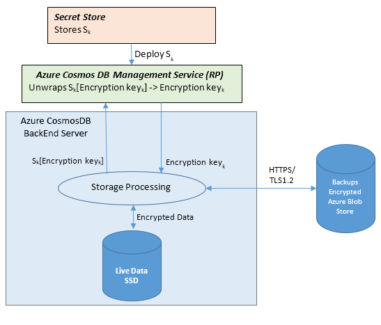

<properties
    pageTitle="数据库静态加密 - DocumentDB | Azure"
    description="了解 DocumentDB 如何为所有数据提供默认加密。"
    services="documentdb"
    author="voellm"
    manager="jhubbard"
    editor="mimig"
    documentationcenter="" />
<tags
    ms.assetid="99725c52-d7ca-4bfa-888b-19b1569754d3"
    ms.service="documentdb"
    ms.workload="data-services"
    ms.tgt_pltfrm="na"
    ms.devlang="na"
    ms.topic="article"
    ms.date="04/31/2017"
    ms.author="voellm"
    wacn.date="05/31/2017"
    ms.translationtype="Human Translation"
    ms.sourcegitcommit="4a18b6116e37e365e2d4c4e2d144d7588310292e"
    ms.openlocfilehash="f11af92b2a712ea2bf0d6b1748f7dea92b224d95"
    ms.contentlocale="zh-cn"
    ms.lasthandoff="05/19/2017" />

# DocumentDB 数据库静态加密

“静态加密”这个短语通常指非易失性存储设备（例如固态硬盘 (SSD) 和硬盘 (HDD)）上的数据的加密。  DocumentDB 将其主数据库存储在 SSD 中，将其媒体附件和备份存储在通常由 HDD 支持的 Azure Blob 中。  随着 DocumentDB 的静态加密功能的发布，现在，所有数据库、媒体附件以及备份都是加密的。  这意味着，现在数据在传输中（通过网络）以及在静态时（非易失性存储）都处于加密状态，从而实现端到端加密。

DocumentDB 是一项 PaaS 服务，我们一直在努力使其变得非常易于使用。  秉承着这一理念，我们已使 DocumentDB 中存储的所有用户数据在静态时和传输中都处于加密状态，不需要用户执行任何操作。  实现这一理念的另一方式是默认“开启”静态加密。  没有开启或关闭此功能的控制。我们在提供此功能的同时，会继续满足可用性和性能 SLA 方面的要求。

## 静态加密的工作原理是什么？

静态加密是使用许多安全技术实现的，其中包括安全的密钥存储系统、加密的网络以及加密 API。  下图展示了加密数据的存储和密钥的管理是如何隔离的。  对数据进行解密和处理的系统必须与管理密钥的系统通信。

用户请求的基本流程如下所述：
- 用户数据库帐户准备就绪以后，通过向管理服务资源提供程序 (RP) 发出请求来检索存储密钥。
- 用户通过 HTTPS/安全传输创建与 DocumentDB 的连接（SDK 对详细信息进行抽象化）。
- 用户通过之前创建的安全连接发送要存储的 JSON 文档。
- 为 JSON 文档编制索引，除非已关闭索引编制功能。
- 将 JSON 文档和索引数据都写入到安全存储中。
- 定期从安全存储中读取数据并将其备份到 Azure 加密 Blob 存储中。

## 常见问题

### 问：如果启用 SSE，Azure 存储的费用将会高多少？
答：没有任何额外费用。

### 问：加密密钥由谁管理？
答：密钥由 Microsoft 管理。

### 问：隔多久轮换一次加密密钥？
答：Microsoft 提供了一组内部指南，DocumentDB 必须遵守这些指南。  虽然没有发布具体指南，但 Microsoft 发布了(安全开发生命周期，简称 SDL)[https://www.microsoft.com/sdl/default.aspx]，可以将其视为内部指南的一部分，其中提供的最佳做法对开发人员很有用。

### 问：可以使用自己的加密密钥吗？
答：DocumentDB 是一项 PaaS 服务，我们一直在努力使该服务易于使用。  我们注意到此问题经常被作为一个与满足符合性（例如 PCI-DSS）相关的代理问题问起。  在构建此功能时，我们一直与符合性审核机构合作，确保使用 DocumentDB 的客户满足相关要求，不需要客户自己管理密钥。
因此，我们当前没有向用户提供自行管理密钥的选项。

### 问：哪些区域已开启加密？
答：所有 DocumentDB 区域都已针对所有用户数据开启加密。

### 问：加密是否影响性能延迟和吞吐量 SLA？
答：不会影响或改变性能 SLA，因为已对所有现有的和新的帐户启用静态加密。

### 问：本地模拟器是否支持静态加密？
答：模拟器是一项独立的开发/测试工具，不使用托管 DocumentDB 服务使用的密钥管理服务。 建议在要存储敏感的模拟器测试数据的驱动器上启用 BitLocker。 (模拟器支持更改默认的数据目录)[/documentation/articles/documentdb-nosql-local-emulator]以及使用已知的位置。

## 后续步骤

有关 DocumentDB 安全性和最新改进的概述，请参阅 [DocumentDB 数据库安全性](/documentation/articles/documentdb-nosql-database-security/)。

有关 Microsoft 认证的详细信息，请参阅 [Azure 信任中心](https://azure.microsoft.com/en-us/support/trust-center/)。

