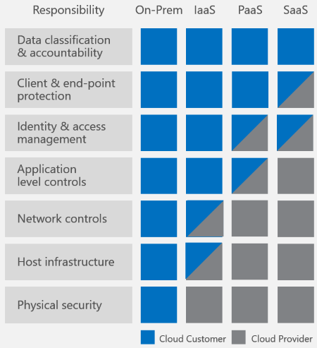
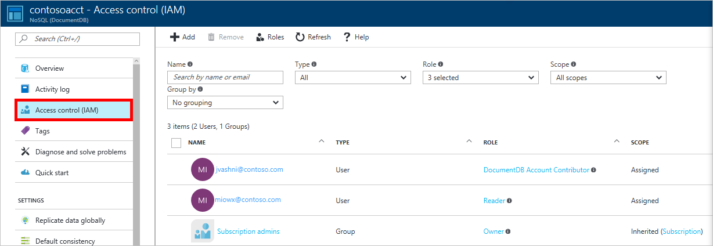
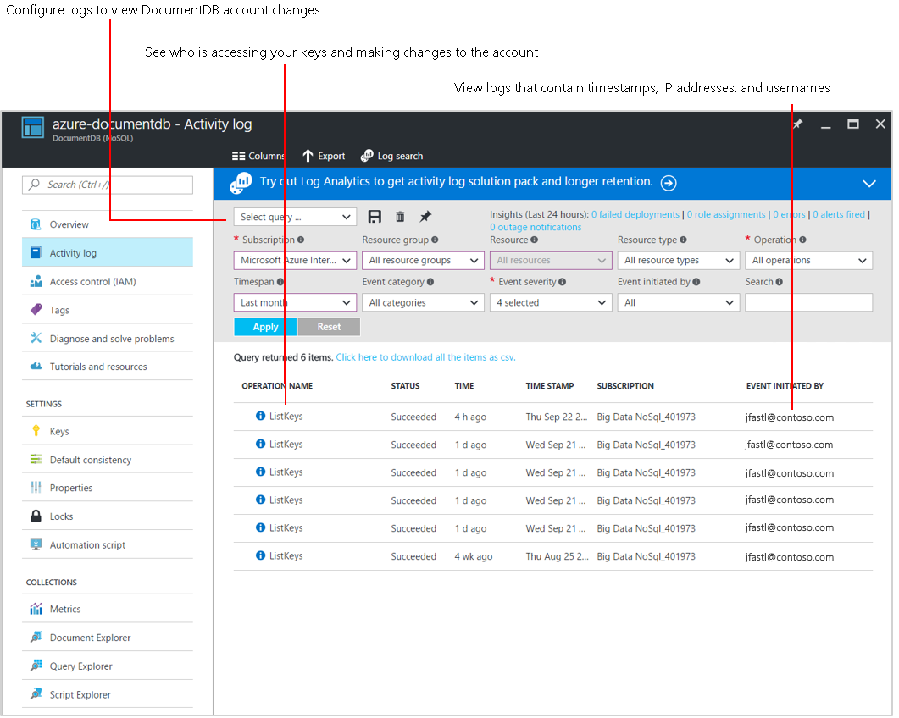

<properties
    pageTitle="NoSQL 数据库安全性 - Azure DocumentDB | Azure"
    description="了解 Azure DocumentDB 如何为 NoSQL 数据提供数据库保护和数据安全性。"
    keywords="nosql 数据库安全性, 信息安全性, 数据安全性, 数据库加密, 数据库保护, 安全策略, 安全测试"
    services="documentdb"
    author="mimig1"
    manager="jhubbard"
    editor="mimig"
    documentationcenter=""
    translationtype="Human Translation" />

<tags
    ms.assetid="a02a6a82-3baf-405c-9355-7a00aaa1a816"
    ms.service="documentdb"
    ms.workload="data-services"
    ms.tgt_pltfrm="na"
    ms.devlang="na"
    ms.topic="article"
    ms.date="03/08/2017"
    wacn.date="04/17/2017"
    ms.author="mimig"
    ms.sourcegitcommit="7cc8d7b9c616d399509cd9dbdd155b0e9a7987a8"
    ms.openlocfilehash="17292e45477d511f245b42c2b85b8e0670afdff8"
    ms.lasthandoff="04/07/2017" />

# DocumentDB NoSQL 数据库安全性

 本文介绍 NoSQL 数据库安全最佳做法以及 Azure DocumentDB 提供的关键功能，帮助你防范、检测和应对数据库入侵。

## 如何保护 NoSQL 数据库？ 

数据安全性的责任由你、客户和数据库提供程序共同分担。 根据所选的数据库提供程序，你要承担的责任大小将有所不同。 如果选择本地解决方案，则从终结点保护到硬件物理安全性的所有工作都由你负责 - 这不是一个轻松的任务。 如果选择 Azure DocumentDB 等 PaaS 云数据库提供程序，你要考虑的问题会明显减少。 下图摘自 Microsoft 的 [Shared Responsibilities for Cloud Computing](https://aka.ms/sharedresponsibility)（云计算的责任分担）白皮书，显示了使用 Azure DocumentDB 等 PaaS 提供程序时，你的责任会得到怎样的减轻。

上图显示了高层级的云安全组件，但是，对于 NoSQL 数据库解决方案，需要考虑到哪些具体的事项呢？ 如何对不同的解决方案进行比较？ 

建议根据以下要求查检表来比较 NoSQL 数据库系统：

- 网络安全和防火墙设置
- 用户身份验证和精细用户控制
- 能够全局复制数据来应对区域性故障
- 能够执行从一个数据中心到另一个数据中心的故障转移
- 在数据中心内执行本地数据复制
- 自动数据备份
- 从备份还原已删除的数据
- 保护和隔离敏感数据
- 监视攻击
- 响应攻击
- 能够地域隔离数据以遵守数据监管限制
- 对受保护数据中心内的服务器实施物理保护

以下要求看似理所当然，但最近发生的[大规模数据库入侵](http://thehackernews.com/2017/01/mongodb-database-security.html)提醒我们这些要求尽管很简单，但却至关重要：
- 将修补的服务器保持最新状态
- 按默认启用 HTTPS/SSL 加密
- 使用强密码的管理帐户

## Azure DocumentDB 如何保护数据库？

让我们回顾前面的列表 - Azure DocumentDB 能够满足其中的多少项要求？ 它满足每一项要求。

让我们深入分析其中的每项要求。

|安全要求|DocumentDB 的安全方案|
|---|---|---|
|网络安全|使用 IP 防火墙是用于保护 NoSQL 数据库的第一个保护层。 DocumentDB 支持使用基于 IP 的策略驱动访问控制来提供入站防火墙支持。 基于 IP 的访问控制类似于传统数据库系统使用的防火墙规则，但已经过扩展，确保只能通过获批准的一组计算机或云服务访问 DocumentDB 数据库帐户。   使用 DocumentDB 可以启用特定的 IP 地址 (168.61.48.0)、IP 范围 (168.61.48.0/8) 以及 IP 和范围的组合。   从此允许列表外部的计算机发出的所有请求将被 DocumentDB 阻止。 从获批准计算机和云服务发出的请求必须完成身份验证过程才能获得资源的访问控制权。|
|授权|DocumentDB 使用基于哈希的消息身份验证代码 (HMAC) 进行授权。   每个请求将使用机密帐户密钥进行哈希处理，后续的 base-64 编码哈希将连同每个调用发送到 DocumentDB。 若要验证请求，DocumentDB 服务需使用正确的机密密钥和属性生成哈希值，然后将该值与请求中的值进行比较。 如果两个值匹配，将成功为操作授权并处理请求，否则，会发生授权失败并拒绝请求。  可以使用[主密钥](/documentation/articles/documentdb-secure-access-to-data/#master-keys/)或[资源令牌](/documentation/articles/documentdb-secure-access-to-data/#resource-tokens/)对文档等资源进行精细访问。  在[保护对 DocumentDB 资源的访问](/documentation/articles/documentdb-secure-access-to-data/)中了解详细信息。|
|用户和权限|使用帐户的[主密钥](#master-key)可为每个数据库创建用户资源和权限资源。 [资源令牌](#resource-token)与数据库中的权限相关联，确定用户是否对数据库中的应用程序资源拥有访问权限（读写、只读或无访问权限）。 应用程序资源包括集合、文档、附件、存储过程、触发器和 UDF。 然后，在身份验证期间，将使用资源令牌来允许或拒绝访问资源。  在[保护对 DocumentDB 资源的访问](/documentation/articles/documentdb-secure-access-to-data/)中了解详细信息。|
|Active Directory 集成 (RBAC)| 还可以在 Azure 门户预览中使用访问控制 (IAM) 来提供对数据库帐户的访问权限。 IAM 提供基于角色的访问控制并与 Active Directory 集成。 对于个人和组，可如下图中所示使用内置角色或自定义角色。  |
|全局复制|DocumentDB 提供全面的全局分发。只需单击一个按钮，就能将数据复制到 Azure 的任何一个全球数据中心。 全局复制可以实现全局缩放，以较低的延迟访问全球各地的数据。  从安全的上下文来看，全局复制可确保数据受到保护，防范区域性故障。  在[全局分发数据](/documentation/articles/documentdb-distribute-data-globally/)中了解详细信息。|
|区域性故障转移|如果已将数据复制到多个数据中心，当区域数据中心脱机时，DocumentDB 会自动切换你的操作。 可以使用数据复制到的区域创建故障转移区域的优先级列表。   在 [Azure DocumentDB 中的区域性故障转移](/documentation/articles/documentdb-regional-failovers/)中了解详细信息。|
|本地复制|即使是在单个数据中心内，DocumentDB 也会自动复制数据来实现高可用性，并允许选择[一致性级别](/documentation/articles/documentdb-consistency-levels/)。 这可以保证 99.99% 运行时间的可用性 SLA 并附带财务保证 - 其他 NoSQL 数据库服务无法提供这样的保证。|
|自动联机备份|DocumentDB 数据库将定期备份并存储在异地冗余的存储中。   在[使用 DocumentDB 进行自动联机备份和还原](/documentation/articles/documentdb-online-backup-and-restore/)中了解详细信息。|
|还原已删除的数据|可以使用自动联机备份来恢复大约 30 天内意外删除的数据。   在[使用 DocumentDB 进行自动联机备份和还原](/documentation/articles/documentdb-online-backup-and-restore/)中了解详细信息|
|保护和隔离敏感数据|可将 PII 和其他机密数据隔离到特定的集合，并限制为只能由特定的用户进行读写或只读访问。|
|监视攻击|使用审核日志和活动日志，可以监视帐户中的正常和异常活动。 可以查看针对资源执行了哪些操作、操作是谁发起的、操作是何时发生的、操作的状态，等等。  |
|响应攻击|联系 Azure 支持部门举报潜在的攻击行为后，将启动由 5 个步骤构成的事件响应过程。 该 5 步骤过程的目的是在检测到问题并启动调查后，尽快将服务安全性和操作恢复正常。  在[云中的 Azure 安全响应](https://aka.ms/securityresponsepaper)中了解详细信息。|
|地域隔离|DocumentDB 确保符合主权区域（例如德国、中国和美国政府）的数据监管与符合性要求。|
|受保护的设施|DocumentDB 中的数据存储在 Azure 的受保护数据中心内的 SSD 上。  在 [Microsoft 全球数据中心](https://www.microsoft.com/en-us/cloud-platform/global-datacenters)中了解详细信息|
|HTTPS/SSL/TLS 加密|从客户端到服务的所有 DocumentDB 交互都会实施 SSL/TLS 1.2。 此外，所有数据中心内部和跨数据中心的复制都会实施 SSL/TLS 1.2。|
|修补的服务器|作为一种托管的 NoSQL 数据库，在 DocumentDB 中无需管理和修补服务器，系统会自动完成这些操作。|
|使用强密码的管理帐户|难以相信，我们竟然还要提到这项要求。但与我们的某些竞争产品不同，在 DocumentDB 中，不带密码的管理帐户是根本不受允许的。   DocumentDB 中默认融入了基于 SSL 和 HMAC 机密的身份验证安全性。|
|安全和数据保护认证|DocumentDB 已通过 [ISO 27001](https://www.microsoft.com/en-us/TrustCenter/Compliance/ISO-IEC-27001)、[欧洲示范条款 (EUMC)](https://www.microsoft.com/en-us/TrustCenter/Compliance/EU-Model-Clauses) 和 [HIPAA](https://www.microsoft.com/en-us/TrustCenter/Compliance/HIPAA) 认证。 其他认证正在审批中。|

## 后续步骤

有关主密钥和资源令牌的详细信息，请参阅[保护对 DocumentDB 数据的访问](/documentation/articles/documentdb-secure-access-to-data/)。

有关 Microsoft 认证的详细信息，请参阅 [Azure 信任中心](/support/trust-center/)。

