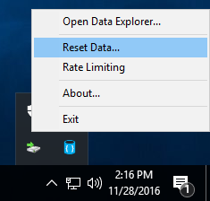
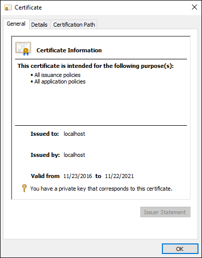
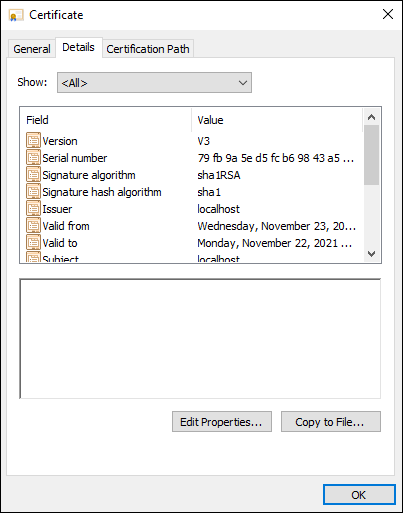
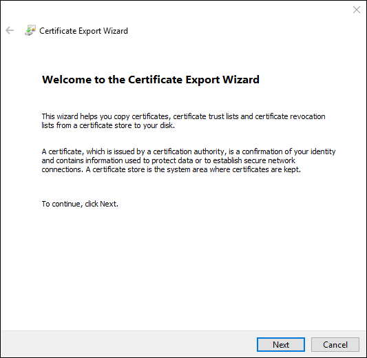
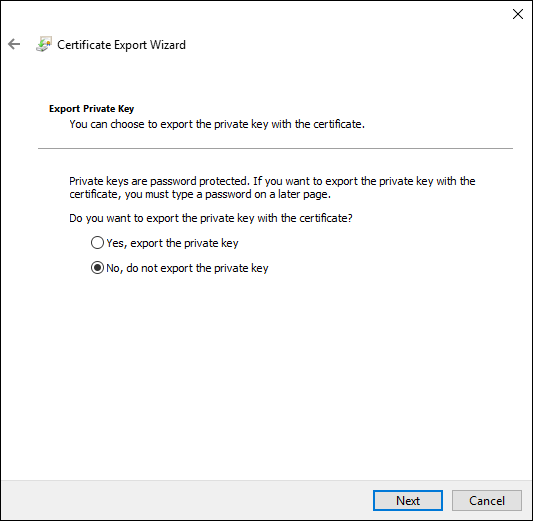
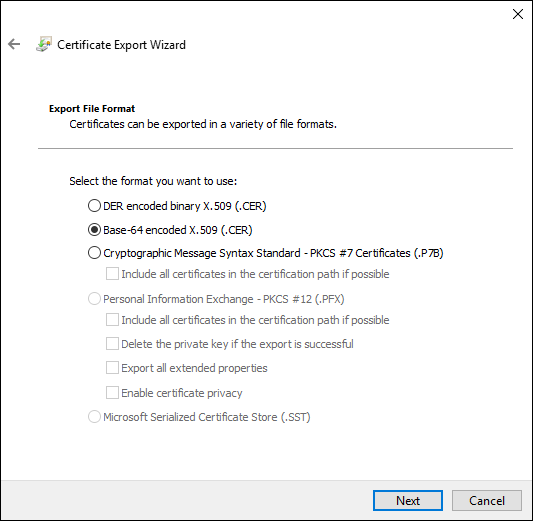
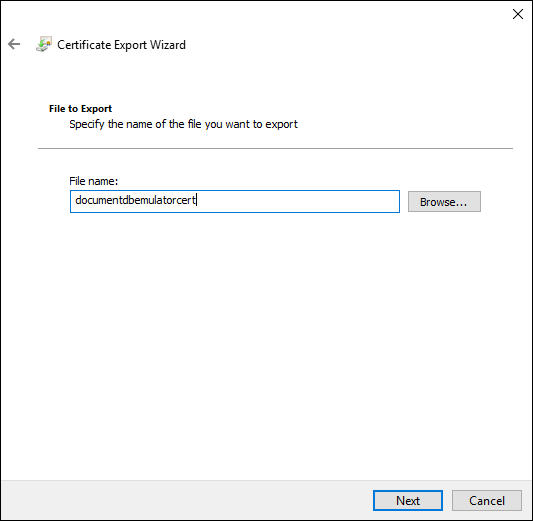
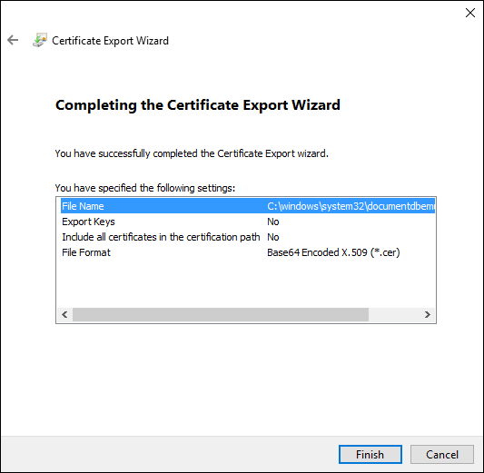

<properties
    pageTitle="导出 DocumentDB 模拟器证书 | Azure"
    description="使用不使用 Windows 证书存储的语言和运行时进行开发时，将需要导出和管理 SSL 证书。此文提供了分步说明。"
    services="documentdb"
    documentationcenter=""
    keywords="DocumentDB 模拟器"
    author="voellm"
    manager="jhubbard"
    editor="" />
<tags
    ms.assetid="ef43deda-c2e9-4193-99e2-7f6a88a0319f"
    ms.service="documentdb"
    ms.devlang="multiple"
    ms.topic="article"
    ms.tgt_pltfrm="na"
    ms.workload="na"
    ms.date="01/22/2017"
    wacn.date="03/22/2017"
    ms.author="tvoellm" />  

# 导出 DocumentDB 模拟器证书

[**下载模拟器**](https://aka.ms/documentdb-emulator)

Azure DocumentDB 模拟器提供了一个模拟用于开发的 Azure DocumentDB 服务的本地环境，包括其使用的 SSL 连接。本文演示如何导出 SSL 证书以用于不与 Windows 证书存储集成的语言和运行时，例如 Java（它使用自己的[证书存储](https://docs.oracle.com/cd/E19830-01/819-4712/ablqw/index.html)）、Python（它使用[套接字包装器](https://docs.python.org/2/library/ssl.html)）和 Node.js（它使用 [tlsSocket](https://nodejs.org/api/tls.html#tls_tls_connect_options_callback)）。可以在[使用 Azure DocumentDB 模拟器进行开发和测试](/documentation/articles/documentdb-nosql-local-emulator/)中了解有关模拟器的更多信息。

## 证书轮转

首次运行模拟器时，在 DocumentDB 本地模拟器中生成证书。有两个证书。一个用于连接到本地模拟器，另一个用于管理模拟器中的机密。要导出的证书是友好名称为“DocumentDBEmulatorCertificate”的连接证书。

可以通过单击在 Windows 任务栏中运行的 DocumentDB 模拟器中的“重置数据”重新生成这两个证书，如下所示。如果重新生成证书并已将它们安装到 Java 证书存储或已在其他位置使用它们，则需要更新这些证书，否则应用程序将无法再连接到本地模拟器。

  

## 如何导出 DocumentDB SSL 证书

1. 通过运行 certlm.msc 启动 Windows 证书管理器并导航到“个人”->“证书”文件夹，打开友好名称为“DocumentDBEmulatorCertificate”的证书。

      

2. 单击“详细信息”，然后单击“确定”。

      

3. 单击“复制到文件...”。

      

4. 单击“下一步”。

      

5. 单击“否，不导出私钥”，然后单击“下一步”。

      

6. 单击“Base-64 编码 X.509 (.CER)”，然后单击“下一步”。

      

7. 为证书指定名称。在本示例中为“documentdbemulatorcert”，然后单击“下一步”。

      

8. 单击“完成”。

      

## 如何在 Java 中使用证书

运行使用 Java 客户端的 Java 应用程序或 MongoDB 应用程序时，更方便的方法是将证书安装到 Java 默认证书存储中，而不是传递“-Djavax.net.ssl.trustStore=<keystore> -Djavax.net.ssl.trustStorePassword="<password>”标志。例如，包含的 [Java 演示应用程序](https://localhost:8081/_explorer/index.html)依赖于默认证书存储。

请按照[将证书添加到 Java CA 证书存储](https://docs.microsoft.com/zh-cn/azure/java-add-certificate-ca-store)中的说明将 X.509 证书导入到默认 Java 证书存储。请注意，运行 keytool 时将在 %JAVA\_HOME% 目录中执行操作。

安装“DocumentDBEmulatorCertificate”SSL 证书后，应用程序应该能够连接并使用本地 DocumentDB 模拟器。如果仍然遇到问题，可能需要按照[调试 SSL/TLS 连接](http://docs.oracle.com/javase/7/docs/technotes/guides/security/jsse/ReadDebug.html)一文进行操作。很有可能证书未安装到 %JAVA\_HOME%/jre/lib/security/cacerts 存储中。例如，如果已安装多个 Java 版本，则应用程序使用的 cacerts 存储可能与你更新的存储不同。

## 如何在 Python 中使用证书

默认情况下，用于 DocumentDB 的 [Python SDK（版本 2.0.0 或更高版本）](/documentation/articles/documentdb-sdk-python/)在连接到本地模拟器时不会尝试使用 SSL 证书。但是，如果要使用 SSL 验证，则可以按照 [Python 套接字包装器](https://docs.python.org/2/library/ssl.html)文档中的示例进行操作。

## 如何在 Node.js 中使用证书

默认情况下，用于 DocumentDB 的 [Node.js SDK（版本 1.10.1 或更高版本）](/documentation/articles/documentdb-sdk-node/)在连接到本地模拟器时不会尝试使用 SSL 证书。但是，如果要使用 SSL 验证，则可以按照 [Node.js 文档](https://nodejs.org/api/tls.html#tls_tls_connect_options_callback)中的示例进行操作。

## 后续步骤
- 若要了解有关 DocumentDB 的详细信息，请参阅 [Azure DocumentDB 简介](/documentation/articles/documentdb-introduction/)。
- 若要开始使用 DocumentDB 模拟器进行开发，请下载一个[支持的 DocumentDB SDK](/documentation/articles/documentdb-sdk-dotnet/)。

<!---HONumber=Mooncake_0313_2017-->
<!---Update_Description: wording update -->