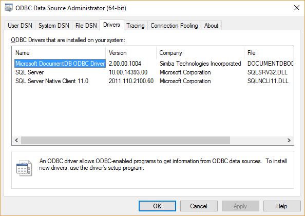
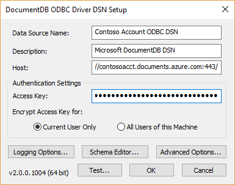
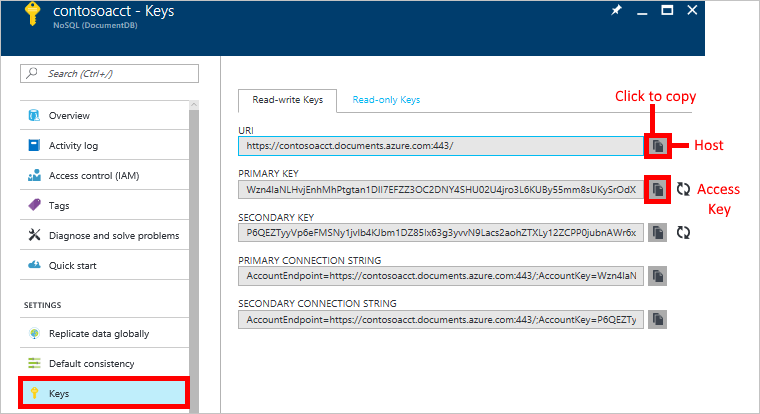
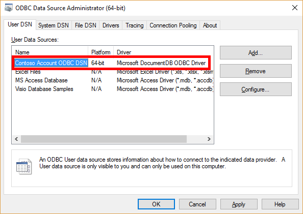
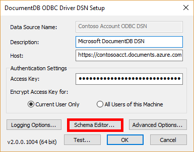

<properties
    pageTitle="使用 BI 分析工具连接到 Azure DocumentDB | Microsoft 文档"
    description="了解如何使用 Azure DocumentDB ODBC 驱动程序创建表和视图，以便能够在 BI 和数据分析软件中查看规范化数据。"
    keywords="odbc, odbc 驱动程序"
    services="documentdb"
    author="mimig1"
    manager="jhubbard"
    editor=""
    documentationcenter=""
    translationtype="Human Translation" />
<tags
    ms.assetid="9967f4e5-4b71-4cd7-8324-221a8c789e6b"
    ms.service="documentdb"
    ms.workload="data-services"
    ms.tgt_pltfrm="na"
    ms.devlang="rest-api"
    ms.topic="article"
    ms.date="03/27/2017"
    wacn.date="05/08/2017"
    ms.author="mimig"
    ms.sourcegitcommit="2c4ee90387d280f15b2f2ed656f7d4862ad80901"
    ms.openlocfilehash="64c38474fa1861bbb0aeb51cc5a9842a0fcd1400"
    ms.lasthandoff="04/28/2017" />

# 使用 BI 分析工具和 ODBC 驱动程序连接到 DocumentDB

借助 DocumentDB ODBC 驱动程序，可以使用 SQL Server Integration Services、Power BI Desktop 和 Tableau 等 BI 分析工具连接到 DocumentDB，以便能够在这些解决方案中分析和创建 DocumentDB 数据的可视化效果。

DocumentDB ODBC 驱动程序符合 ODBC 3.8 规范，支持 ANSI SQL-92 语法。 该驱动程序提供丰富的功能来帮助用户重新规范化 DocumentDB 中的数据。 使用该驱动程序，能够以表和视图的形式表示 DocumentDB 中的数据。 使用该驱动程序还可以针对表和视图执行 SQL 操作，包括 group by 查询、插入、更新和删除。

## 为何需要将数据规范化？
DocumentDB 是一种 NoSQL 数据库，它允许应用程序即时迭代其数据模型，而不会将它们限定于一个严格定义的架构，因此可以加快应用的开发。 一个 DocumentDB 数据库可以包含各种结构的 JSON 文档。 这非常适合快速应用程序开发，但如果用户想要使用数据分析和 BI 工具来分析和创建数据报表，则数据通常需要平展并遵守特定的架构。

这就是 ODBC 驱动程序的作用所在。 借助 ODBC 驱动程序，现可根据数据分析和报告需求，将 DocumentDB 中的数据重新规范化为表和视图。 重新规范化的架构不会对基础数据造成影响，也不强制要求开发人员遵守，而只是方便用户利用符合 ODBC 规范的工具来访问数据。 因此，DocumentDB 数据库不仅是开发团队的最爱，数据分析师也对它青睐有加。

现在，让我们学习 ODBC 驱动程序的入门知识。

## 步骤 1：安装 DocumentDB ODBC 驱动程序

1. 下载适用于你的环境的驱动程序：

    - [Azure DocumentDB ODBC 64-bit.msi](https://aka.ms/documentdb-odbc-64x64)（适用于 64 位 Windows）
    - [Azure DocumentDB ODBC 32x64-bit.msi](https://aka.ms/documentdb-odbc-32x64)（适用于 32 位或 64 位 Windows）
    - [Azure DocumentDB ODBC 32-bit.msi](https://aka.ms/documentdb-odbc-32x32)（适用于 32 位 Windows）

    在本地运行 msi 文件，启动 **Azure DocumentDB ODBC 驱动程序安装向导**。 
2. 使用默认输入完成安装向导，安装 ODBC 驱动程序。
3. 在 Windows 搜索框中键入“ODBC 数据源”，在计算机上打开“ODBC 数据源管理器”应用。 
    可通过单击“驱动程序”选项卡并检查“Microsoft DocumentDB ODBC 驱动程序”是否已列出，来确认是否已安装该驱动程序。

    

## 步骤 2：连接到 DocumentDB 数据库

1. [安装 DocumentDB ODBC 驱动程序](#install)后，请在“ODBC 数据源管理器”窗口中单击“添加”。 可以创建一个用户 DSN 或系统 DSN。 在本示例中，我们将创建一个用户 DSN。
2. 在“创建新数据源”窗口中选择“Microsoft DocumentDB ODBC 驱动程序”，然后单击“完成”。
3. 在“DocumentDB ODBC 驱动程序 SDN 设置”窗口中填写以下信息： 

    
    - **数据源名称**：ODBC DSN 的友好名称。 此名称对于 DocumentDB 帐户是唯一的，因此，如果有多个帐户，请适当地为数据源命名。
    - **说明**：数据源的简短说明。
    - **主机**：DocumentDB 帐户的 URI。 可通过 Azure 门户预览中的“DocumentDB 密钥”边栏选项卡检索此信息，如以下屏幕截图所示。 
    - **访问密钥**：从 Azure 门户预览中的“DocumentDB 密钥”边栏选项卡获取的主要或辅助读写/只读密钥，如以下屏幕截图所示。 如果 DSN 用于只读数据的处理和报告，我们建议使用只读密钥。
    
        

    - **加密以下对象的访问密钥**：根据此计算机的用户选择最合适的选项。 
4. 单击“测试”  按钮，确保可以连接到 DocumentDB 帐户。 
5. 单击“高级选项”  并设置以下值：
    - **查询一致性**：选择操作的[一致性级别](/documentation/articles/documentdb-consistency-levels/)。 默认值为“会话”。
    - **重试次数**：输入初始请求因服务限制而未能完成时，重试操作的次数。
    - **架构文件**：此处有多个选项。
        - 默认情况下，可将此项保留原样（空白），驱动程序将在第一页的数据中扫描所有集合，确定每个集合的架构。 这称为“集合映射”。 如果未定义架构文件，驱动程序必须针对每个驱动程序会话执行扫描，这可能会导致使用 DSN 启动应用程序时需要更长的时间。 我们建议始终关联 DSN 的架构文件。
        - 如果已有一个架构文件（也许是使用[架构编辑器](#schema-editor)创建的文件），则可以单击“浏览”，导航到该文件，单击“保存”，然后单击“确定”。
        - 如果想要创建新架构，请单击“确定”，然后在主窗口中单击“架构编辑器”。 接下来，继续在[架构编辑器](#schema-editor)中提供信息。 创建新架构文件后，请记得返回“高级选项”  窗口以包含新创建的架构文件。

6. 完成并关闭“DocumentDB ODBC 驱动程序 DSN 设置”  窗口后，新的用户 DSN 会添加到“用户 DSN”选项卡。

    

## 步骤 3：使用集合映射方法创建架构定义

可以使用两种类型的采样方法：**集合映射**或**表分隔符**。 采样会话可以利用这两种采样方法，但每个集合只能使用特定的采样方法。 以下步骤使用集合映射方法为一个或多个集合中的数据创建架构。 此采样方法会检索集合页面中的数据，确定数据的结构。 它会将集合转置到 ODBC 端的某个表。 如果集合中的数据是同构的，此采样方法十分快速高效。 如果集合包含异构类型的数据，我们建议使用[表分隔符映射方法](#table-mapping)，因为这是确定集合中数据结构的更可靠采样方法。 

1. 完成[连接到 DocumentDB 数据库](#connect)中的步骤 1-4 后，请在“DocumentDB ODBC 驱动程序 DSN 设置”窗口中单击“架构编辑器”。

    
2. 在“架构编辑器”窗口中单击“新建”。
    “生成架构”窗口将显示 DocumentDB 帐户中的所有集合。 
3. 选择要采样的一个或多个集合，然后单击“采样” 。 
4. “设计视图”选项卡中显示了数据库、架构和表。 在表视图中，扫描将显示与列名称（“SQL 名称”、“源名称”等）关联的属性集。
    可以修改每个列，包括“SQL 名称”、“SQL 类型”、“SQL 长度”（如果适用）、“小数位数”（如果适用）、“精度”（如果适用）和“可为 Null”。
    - 如果想要从查询结果中排除某个列，可将对应的“隐藏列”设置为 **true**。 标记为“隐藏列 = true”的列不会返回供选择和投影，不过它们仍是架构的一部分。 例如，可以隐藏以“_”开头的所有 DocumentDB 系统必需属性。
    - “Id”列是唯一不能隐藏的字段，因为它用作规范化架构中的主键。 
5. 完成定义架构后，请单击“文件” | “保存”，导航到用于保存该架构的目录，然后单击“保存”。

    以后如果想要配合 DSN 使用此架构，请打开“DocumentDB ODBC 驱动程序 DSN 设置”窗口（通过“ODBC 数据源管理器”），单击“高级选项”，然后在“架构文件”框中导航到保存的架构。 将架构文件保存到现有 DSN 会将 DSN 连接范围修改为架构定义的数据和结构。

## 步骤 4：使用表分隔符映射方法创建架构定义

可以使用两种类型的采样方法：**集合映射**或**表分隔符**。 采样会话可以利用这两种采样方法，但每个集合只能使用特定的采样方法。 

以下步骤使用 **表分隔符** 映射方法为一个或多个集合中的数据创建架构。 如果集合包含异构类型的数据，我们建议使用此采样方法。 可以使用此方法将采样范围限定为一组属性及其对应的值。 例如，如果某个文档包含“Type”属性，可将采样范围限定为此属性的值。 采样的最终结果为针对每个指定 Type 的值返回的一组表。 例如，Type = Car 将生成 Car 表，Type = Plane 将生成 Plane 表。

1. 完成[连接到 DocumentDB 数据库](#connect)中的步骤 1-4 后，请在“DocumentDB ODBC 驱动程序 DSN 设置”窗口中单击“架构编辑器”。
2. 在“架构编辑器”窗口中单击“新建”。
    “生成架构”窗口将显示 DocumentDB 帐户中的所有集合。 
3. 在“采样视图”选项卡上的集合“映射定义”列中选择一个集合，然后单击“编辑”。 在“映射定义”窗口中，选择“表分隔符”方法。 然后执行以下操作：

    a.在“解决方案资源管理器”中，右键单击项目文件夹下的“引用”文件夹，然后单击“添加引用”。 在“属性”框中，键入分隔符属性的名称。 这是文档中要将采样范围限定到的属性（例如 City）。然后按 Enter 键。 

    b. 如果只想要将采样范围限定为刚刚输入的属性的值，请在选择框中选择该属性，在“值”框中输入值（例如 Seattle），然后按 Enter 键。 可以继续添加属性的多个值。 只需确保在输入值时选择正确的属性。

    例如，如果包含 City 的 **Attributes** 值，并想要将表限制为仅包含带有 New York 和 Dubai 城市值的行，请在“属性”框中输入 City，在“值”框中输入 New York 和 Dubai。
4. 单击 **“确定”**。 
5. 完成想要采样的集合的映射定义后，请在“架构编辑器”窗口中单击“采样”。
     可以修改每个列，包括“SQL 名称”、“SQL 类型”、“SQL 长度”（如果适用）、“小数位数”（如果适用）、“精度”（如果适用）和“可为 Null”。
    - 如果想要从查询结果中排除某个列，可将对应的“隐藏列”设置为 **true**。 标记为“隐藏列 = true”的列不会返回供选择和投影，不过它们仍是架构的一部分。 例如，可以隐藏以“_”开头的所有 DocumentDB 系统必需属性。
    - “Id”列是唯一不能隐藏的字段，因为它用作规范化架构中的主键。 
6. 完成定义架构后，请单击“文件” | “保存”，导航到用于保存该架构的目录，然后单击“保存”。
7. 返回“DocumentDB ODBC 驱动程序 DSN 设置”窗口，单击“高级选项”。 然后，在“架构文件”框中，导航到保存的架构文件并单击“确定”。 再次单击“确定”保存 DSN。 这会将创建的架构保存到 DSN。 

## （可选）创建视图
可在采样过程中定义和创建视图。 这些视图相当于 SQL 视图。 它们是只读的，并且是定义的 DocumentDB SQL 的选择和投影范围。 

若要创建数据的视图，请在“架构编辑器”窗口中的“视图定义”列内，单击要采样的集合行中的“添加”。 然后在“视图定义”窗口中执行以下操作：
1. 单击“新建”，输入视图的名称（例如 EmployeesfromSeattleView），然后单击“确定”。
2. 在“编辑视图”窗口中，输入一个 DocumentDB 查询。 这必须是 DocumentDB SQL 查询，例如 `SELECT c.City, c.EmployeeName, c.Level, c.Age, c.Gender, c.Manager FROM c WHERE c.City = “Seattle”`。然后单击“确定”。

可以创建任意数量的视图。 定义完视图后，可以采样数据。 

## 步骤 5：在 Power BI Desktop 等 BI 工具中查看数据

可以使用新 DSN 将 DocumentADB 连接到任何符合 ODBC 规范的工具。本步骤仅说明如何连接到 Power BI Desktop 并创建 Power BI 可视化效果。

1. 打开 Power BI Desktop。
2. 单击“获取数据”。
3. 在“获取数据”窗口中，单击“其他” | “ODBC” | “连接”。
4. 在“从 ODBC”窗口中，选择创建的数据源名称，然后单击“确定”。 可将“高级选项”项保留空白。
5. 在“使用 ODBC 驱动程序访问数据源”窗口中，选择“默认或自定义”，然后单击“连接”。 不需要包括“凭据连接字符串属性”。
6. 在“导航器”  窗口的左窗格中，展开数据库和架构，然后选择表。 结果窗格包含使用所创建的架构的数据。
7. 若要在 Power BI Desktop 中可视化数据，请选中表名称前面的框，然后单击“加载” 。
8. 在 Power BI Desktop 的最左侧，选择“数据”选项卡  确认数据是否已导入。
9. 现在，可以使用 Power BI 创建视觉对象：单击“报表”选项卡，单击“新建视觉对象”，然后自定义磁贴。 有关在 Power BI Desktop 中创建可视化效果的详细信息，请参阅 [Power BI 中的可视化效果类型](https://powerbi.microsoft.com/documentation/powerbi-service-visualization-types-for-reports-and-q-and-a/)。

## 故障排除

如果遇到以下错误，请确保执行[步骤 2](#connect) 时在 Azure 门户预览中复制的“主机”和“访问密钥”值正确，然后重试。 在 Azure 门户预览中使用“主机”和“访问密钥”值右侧的复制按钮可以正确无误地复制这些值。

    [HY000]: [Microsoft][DocumentDB] (401) HTTP 401 Authentication Error: {"code":"Unauthorized","message":"The input authorization token can't serve the request. Please check that the expected payload is built as per the protocol, and check the key being used. Server used the following payload to sign: 'get\ndbs\n\nfri, 20 jan 2017 03:43:55 gmt\n\n'\r\nActivityId: 9acb3c0d-cb31-4b78-ac0a-413c8d33e373"}`

## 后续步骤

若要了解有关 DocumentDB 的详细信息，请参阅[什么是 DocumentDB？](/documentation/articles/documentdb-introduction/)。

<!--Update_Description: wording update-->