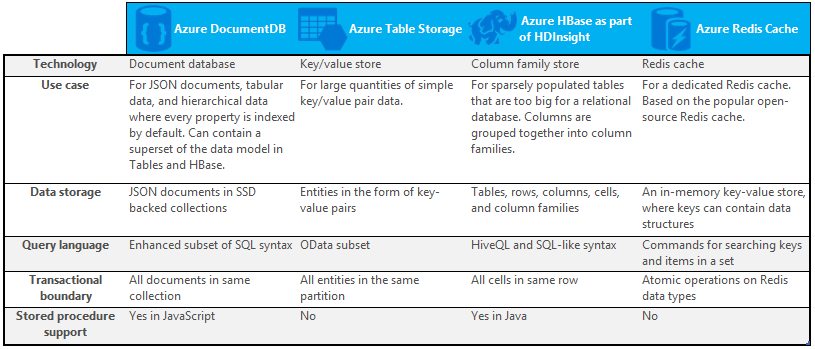

<properties
    pageTitle="NoSQL 与 SQL 和 DocumentDB | Azure"
    description="比较使用 NoSQL 非关系解决方案与使用 SQL 解决方案和 DocumentDB 的好处。 了解 DocumentDB 如何提供 NoSQL 和 SQL 的优势。"
    keywords="nosql 与 sql, 何时使用 NoSQL, sql 与 nosql"
    services="documentdb"
    documentationcenter=""
    author="mimig1"
    manager="jhubbard"
    editor=""
    redirect_url="https://aka.ms/documentdb"
    ROBOTS="NOINDEX, NOFOLLOW" />
<tags
    ms.assetid="71ef1798-d709-4ccb-9f5c-57948fb96229"
    ms.service="documentdb"
    ms.custom="overview"
    ms.workload="data-services"
    ms.tgt_pltfrm="na"
    ms.devlang="dotnet"
    ms.topic="article"
    ms.date="03/14/2017"
    wacn.date="05/31/2017"
    ms.author="mimig"
    ms.translationtype="Human Translation"
    ms.sourcegitcommit="4a18b6116e37e365e2d4c4e2d144d7588310292e"
    ms.openlocfilehash="fede6af81f7a6f40bfb0d29194da18c9f6de3262"
    ms.contentlocale="zh-cn"
    ms.lasthandoff="05/19/2017" />

# NoSQL 与 SQL 和 DocumentDB
SQL Server 和关系数据库 (RDBMS) 成为重要专业数据库已经 20 多年了。 但是，不断增长的快速处理更多容量、速度和各种数据的需求改变了应用程序开发人员对数据存储的本质需求。 为了实现这种需求，能够大规模存储非结构化和异类数据的 NoSQL 数据库得到了普及。 对于大多数开发人员而言，关系数据库是默认或常用的选项，因为表结构易于理解且较为熟悉，但仍存在许多需要探索除关系数据库以外的数据库的因素。

NoSQL 是一种与 SQL 数据库截然不同的数据库。 NoSQL 常用来指代“非 SQL”的数据管理系统，或者指代“不仅限于 SQL”的数据管理方法。 NoSQL 类别中有多种技术，包括文档数据库、键值存储、列系列存储和图形数据库，这些技术在游戏、社交和 IoT 应用中非常流行。

本文旨在帮助你了解 NoSQL 和 SQL 之间的区别，并为你提供来自 Microsoft 的 NoSQL 和 SQL 产品/服务简介。  

## 何时使用 NoSQL？
假设你正在生成新的社交网站。 用户可以创建帖子，并向其中添加图片、视频和音乐。 其他用户可以对帖子发表评论，并对帖子打分（点赞）进行评级。 登录页将提供一些帖子，用户可以进行共享和互动。 

那么，如何存储此数据？ 如果你熟悉 SQL，你可能会开始绘制类似如下的内容：

目前为止，一切都好，但现在想想单个帖子的结构以及如何将其显示。 如果你想要在网站或应用程序上显示帖子和关联的图像、音频、视频、评论、分数以及用户信息，你将必须使用八表联接执行查询，只是为了检索内容。 现在，假设帖子流动态加载并出现在屏幕上，并且你可轻松地预测它将需要数千个查询和多个联接来完成任务。

和 SQL 支持动态数据（ [以 JSON 为格式](https://msdn.microsoft.com/zh-cn/library/dn921897.aspx) ）一样，现在可以使用关系解决方案（如 SQL Server）存储数据并使用联接查询数据 - 但是存在另一种选项（即 NoSQL），它简化了此特定场景的解决方法。 通过使用和以下内容类似的一个文档并将其存储在 DocumentDB（Azure NoSQL 文档数据库服务）中，可以提高性能并使用一个查询检索整个帖子，而无需使用联接。 它更简单、更直观，并且性能更高。

    {
        "id":"ew12-res2-234e-544f",
        "title":"post title",
        "date":"2016-01-01",
        "body":"this is an awesome post stored on NoSQL",
        "createdBy":User,
        "images":["http://myfirstimage.png","http://mysecondimage.png"],
        "videos":[
            {"url":"http://myfirstvideo.mp4", "title":"The first video"},
            {"url":"http://mysecondvideo.mp4", "title":"The second video"}
        ],
        "audios":[
            {"url":"http://myfirstaudio.mp3", "title":"The first audio"},
            {"url":"http://mysecondaudio.mp3", "title":"The second audio"}
        ]
    }

此外，此数据可以按帖子 ID 进行分区，从而允许数据自然扩展并利用 NoSQL 缩放特征。 此外，NoSQL 系统允许开发人员放宽一致性，并提供低延迟的高度可用的应用。  最后，此解决方案不需要开发人员在数据层定义、管理和维护架构，实现快速迭代。

然后你可以使用其他 Azure 服务生成此解决方案：

- [Azure 应用服务](/home/features/app-service/)可用来托管应用程序和后台进程。
- [Azure Blob 存储](/home/features/storage/)可用来存储包括映像的完整的用户配置文件。
- [Azure SQL 数据库](/home/features/sql-database/)可用来存储大量数据，例如登录信息和使用情况分析数据。

此社交网站只是 NoSQL 数据库是针对作业的适当数据模型的其中一种方案。 如果对阅读有关此方案以及如何在社交媒体应用程序中对 DocumentDB 的数据建模的详细信息感兴趣，请参阅[使用 DocumentDB 进行社交](/documentation/articles/documentdb-social-media-apps/)。 

## NoSQL 与 SQL 比较
下表比较了 NoSQL 和 SQL 之间的主要区别。 

如果 NoSQL 数据库最适合你的要求，继续进行下一部分，了解有关 Azure 中可用 NoSQL 服务的详细信息。 否则，如果 SQL 数据库最适合你的要求，请跳到 [Microsoft SQL 产品/服务有哪些？](#what-are-the-microsoft-sql-offerings)

## Azure NoSQL 产品/服务有哪些？
Azure 具有以下四种完全托管的 NoSQL 服务： 

- [Azure DocumentDB](/home/features/documentdb/)
- [Azure 表存储](/home/features/storage/)
- [作为 HDInsight 一部分的 Azure HBase](/home/features/hdinsight/)
- [Azure Redis 缓存](/home/features/redis-cache/)

下面的比较图表详细说明了每种服务的关键差异。 哪个最能准确描述你的应用程序的需求？ 

如果这些服务中的一个或多个可能满足你的应用程序的需要，可使用以下资源了解详细信息： 

- [DocumentDB 用例](/documentation/articles/documentdb-use-cases/)
- [Azure 表存储入门](/documentation/articles/storage-dotnet-how-to-use-tables/)
- [HDInsight 中的 HBase 是什么](/documentation/articles/hdinsight-hbase-overview/)

然后转到 [后续步骤](#next-steps) ，获取试用信息。

## Microsoft SQL 产品/服务有哪些？
Microsoft 提供了五种 SQL 产品/服务： 

- [Azure SQL 数据库](/home/features/sql-database/)
- [Azure 虚拟机中的 SQL Server](/home/features/virtual-machines#SQL/)
- [SQL Server](https://www.microsoft.com/server-cloud/products/sql-server-2016/)
- [Azure SQL 数据仓库](/home/features/sql-data-warehouse/)
- [分析平台系统（本地设备）](https://www.microsoft.com/en-us/server-cloud/products/analytics-platform-system/)

如果对虚拟机上的 SQL Server 或 SQL 数据库感兴趣，请参阅[选择云 SQL Server 选项：Azure SQL (PaaS) 数据库或 Azure VM 上的 SQL Server (IaaS)](/documentation/articles/sql-database-paas-vs-sql-server-iaas/)，了解两者区别的详细信息。

如果 SQL 听起来像是最佳选择，请转到 [SQL Server](https://www.microsoft.com/server-cloud/products/) 了解有关 Microsoft SQL 产品和服务所要提供的功能的详细信息。

然后转到 [后续步骤](#next-steps) ，获取试用信息和评估链接。

## 后续步骤
我们邀请你通过试用 SQL 和 NoSQL，了解有关二者的详细信息。 

- 对于所有 Azure 服务，可以注册一个[试用版](/pricing/1rmb-trial/)。

  - [Azure DocumentDB](/home/features/documentdb/)
  - [作为 HDInsight 一部分的 Azure HBase](/home/features/hdinsight/)
  - [Azure Redis 缓存](/home/features/redis-cache/)
  - [Azure SQL 数据仓库](/home/features/sql-data-warehouse/)
  - [Azure SQL 数据库](/home/features/sql-database/)
  - [Azure 表存储](/home/features/storage/)
- 可以注册虚拟机上的 SQL Server 2016 评估版或下载 [SQL Server 评估版](https://www.microsoft.com/en-us/evalcenter/evaluate-sql-server-2016)。

  - [SQL Server](https://www.microsoft.com/server-cloud/products/sql-server-2016/)
  - [Azure 虚拟机中的 SQL Server](/home/features/virtual-machines#SQL/)

<!---Update_Description: wording update -->