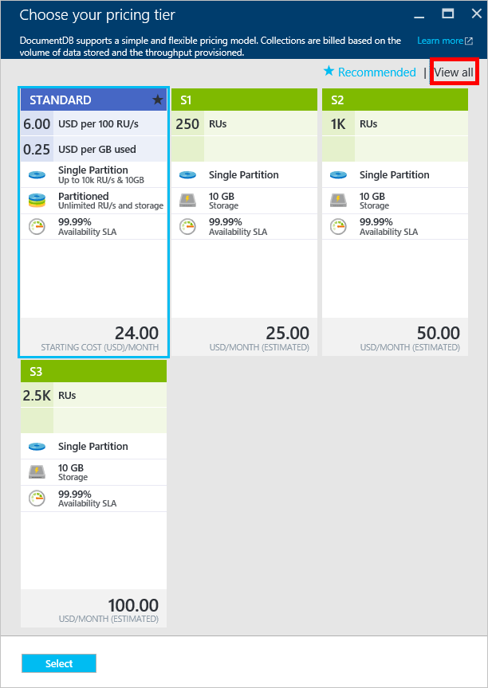

<properties
    pageTitle="DocumentDB 中的性能级别 | Azure"
    description="了解 DocumentDB 中的性能级别如何让你能够在每个集合的基础上保留吞吐量。"
    services="documentdb"
    author="mimig1"
    manager="jhubbard"
    editor="monicar"
    documentationcenter="" />
<tags
    ms.assetid="7dc21c71-47e2-4e06-aa21-e84af52866f4"
    ms.service="documentdb"
    ms.workload="data-services"
    ms.tgt_pltfrm="na"
    ms.devlang="na"
    ms.topic="article"
    ms.date="12/13/2016"
    wacn.date="01/16/2017"
    ms.author="mimig" />  

# DocumentDB 中的性能级别和定价层
本文概述 [Azure DocumentDB](/home/features/documentdb/) 中的性能级别。

阅读本文后，将能够回答以下问题：

- 什么是性能级别？
- 数据库帐户的吞吐量是如何保留的？
- 如何使用性能级别工作？
- 性能级别是怎么计费的？

## 性能级别简介
将为在标准 DocumentDB 帐户中创建的每个 DocumentDB 集合设置关联的性能级别。数据库中的每个集合均有不同的性能级别，允许为经常访问的集合指定更多的吞吐量，为不常访问的集合指定更少的吞吐量。

DocumentDB 支持**用户定义的**性能级别和**预定义的**性能级别，如下表所示。通过用户定义的性能，可使用 100 RU/s 单位的保留吞吐量和无限制的存储空间，而三个预定义的性能级别具有指定的吞吐量选项和 10 GB 的存储配额。下表对**用户定义**的性能和**预定义**的性能进行比较。

|性能类型|详细信息|吞吐量|存储|版本|API|
|----------------|-------|----------|-------|-------|----|
|用户定义的性能|用户以 100 RU/s 为单位设置吞吐量|不受限制|不受限制|V2|API 2015-12-16 及更新版本|
|预定义性能|10 GB 保留存储空间。  S1 = 250 RU/s S2 = 1000 RU/s S3 = 2500 RU/s|2500 RU/s|10 GB|V1|任意|

吞吐量按集合进行保留，可供相应集合以独占方式进行使用。吞吐量以[请求单位 \(RU\)](/documentation/articles/documentdb-request-units/) 度量，请求单位确定执行各种 DocumentDB 数据库操作所需的资源量。

> [AZURE.NOTE]
集合的性能级别可通过 [SDK](/documentation/articles/documentdb-sdk-dotnet/) 或 [Azure 门户预览](https://portal.azure.cn/)进行调整。性能级别更改应在 3 分钟内完成。
> 
> 

## 设置集合的性能级别
创建集合之后，基于指定性能级别的 RU 的完整分配为该集合保留。

注意，对于用户定义的性能级别和预定义的性能级别，DocumentDB 都可以基于保留的吞吐量进行运作。通过创建集合，应用程序已保留吞吐量且不论实际使用了多少该吞吐量，都会对已保留的吞吐量计费。对于用户定义的性能级别，存储基于消耗量按流量计费，但是对于预定义性能级别，将在创建集合时保留 10 GB 的存储。

创建集合后，可以使用 [SDK](/documentation/articles/documentdb-sdk-dotnet/) 或 [Azure 门户预览](https://portal.azure.cn/)修改性能级别和/或吞吐量。

> [AZURE.IMPORTANT]
DocumentDB 标准集合以小时计费，且你创建的每个集合都将以最低一小时的使用量计费。
> 
> 

如果在一小时内调整集合的性能级别，将以这一小时内最高性能级别集进行计费。例如，如果在上午 8:53 提高了集合的性能级别，则将从上午 8:00 开始，向你收取新级别的费用。同样，如果在上午 8:53 降低了性能级别，新费率将在上午 9:00 生效。

请求单位基于性能级别设置而为每个集合保留。请求单位消耗以每秒速率评估。集合上超出预配请求单位速率（或性能级别）的应用程序将会受到限制，直到速率降低到集合的保留级别之下。如果应用程序要求更高级别的吞吐量，可以提高每个集合的性能级别。

> [AZURE.NOTE]
应用程序超出一个或多个集合的性能级别时，将按每个集合限制请求。这意味着一些应用程序请求可能成功，而另一些则可能受限制。建议受到限制时添加少量重试次数，以处理请求流量中的峰值。
> 
> 

## 使用性能级别工作
DocumentDB 集合允许根据应用程序的查询模式和性能需求来对数据进行分组。利用 DocumentDB 的自动索引和查询支持，在同一集合内并置异类文档是相当常见的做法。决定是否应该使用单独集合的关键注意事项包括：

- 查询 - 集合是查询执行的范围。如果需要在一组文档间进行查询，最有效的读取模式就是在单个集合中并置文档。
- 事务 - 所有事务都处于单个集合的范围内。如果你有文档必须在单个存储过程或触发器内进行更新，则它们必须存储在相同的集合内。更具体地说，集合内的分区键就是事务边界。有关更多详细信息，请参阅 [DocumentDB 中的分区](/documentation/articles/documentdb-partition-data/)。
- 性能隔离 - 集合具有关联的性能级别。这可确保每个集合通过保留的 RU 都有可预测的性能。可以根据访问频率将数据分配到具有不同性能级别的不同集合。

> [AZURE.IMPORTANT]
重要的是，需要了解将根据应用程序所创建的集合数，以全标准费率向你收费。
> 
> 

建议应用程序使用小数量的集合，除非有较大的存储或吞吐量要求。确保已清楚理解创建新集合的应用程序模式。你可以选择将集合创建保留为在应用程序外进行处理的管理操作。同样，调整集合的性能级别将更改集合计费的小时费率。如果应用程序会动态调整集合性能级别，则应进行监视。

## 从 S1、S2、S3 更改为用户定义的性能
在 Azure 门户预览中按照这些步骤从使用预定义的吞吐量级别更改为用户定义的吞吐量级别。通过使用用户定义的吞吐量级别，可以按需求定制吞吐量。如果你仍在使用 S1 帐户，则只需单击几下，即可将默认吞吐量从 250 RU/s 增加到 400 RU/s。请注意，一旦将集合从 S1、S2 或 S3 移至标准（用户定义），就无法再移回 S1、S2 或 S3，但可随时修改标准集合的吞吐量。

有关与用户定义和预定义的吞吐量相关的定价更改的详细信息，请参阅博客文章 [DocumentDB: Everything you need to know about using the new pricing options](https://azure.microsoft.com/blog/documentdb-use-the-new-pricing-options-on-your-existing-collections/)（DocumentDB：关于使用新的定价选项所需要了解的一切）。

1. 在 [**Azure 门户预览**](https://portal.azure.cn)中，单击 **NoSQL \(DocumentDB\)**，然后选择要修改的 DocumentDB 帐户。
 
    如果跳转栏上未显示 **NoSQL \(DocumentDB\)**，请单击“\>”，滚动到“数据库”，选择“NoSQL \(DocumentDB\)”，然后选择 DocumentDB 帐户。

2. 在资源菜单的“集合”下，单击“缩放”，从下拉列表中选择要修改的集合，然后单击“定价层”。使用预定义吞吐量的帐户拥有定价层 S1、S2 或 S3。在“选择定价层”边栏选项卡中，单击“标准”更改用户定义的吞吐量，然后单击“选择”保存更改。

      

3. 返回到“缩放”边栏选项卡中，“定价层”已更改为“标准”，“吞吐量\(RU/s\)”框显示默认值 400。可以在 400 和 10,000 [请求单位](/documentation/articles/documentdb-request-units/)/秒 \(RU/s\) 之间设置吞吐量。页面底部的“估计的每月帐单”将自动更新以提供月成本估计值。单击“保存”以保存更改。

    如果你确定需要更多吞吐量（大于 10,000 RU/s）或更多存储（大于 10GB），可以创建分区集合。若要创建分区集合，请参阅[创建集合](/documentation/articles/documentdb-create-collection/)。

> [AZURE.NOTE]
更改集合的性能级别可能会花费 2 分钟。
> 
> 

## 使用 .NET SDK 更改性能级别  
另一个更改集合的性能级别的选项便是通过我们的 SDK 进行操作。本节只介绍使用 [.NET SDK](https://msdn.microsoft.com/zh-cn/library/azure/dn948556.aspx) 更改集合的性能级别，但对于其他 [SDK](https://msdn.microsoft.com/zh-cn/library/azure/dn781482.aspx)，过程也是相似的。如果不熟悉 .NET SDK，请访问[入门教程](/documentation/articles/documentdb-get-started/)。

以下是将服务吞吐量更改为每秒 50,000 请求单位的代码片段：

    //Fetch the resource to be updated
    Offer offer = client.CreateOfferQuery()
                      .Where(r => r.ResourceLink == collection.SelfLink)    
                      .AsEnumerable()
                      .SingleOrDefault();

    // Set the throughput to 5000 request units per second
    offer = new OfferV2(offer, 5000);

    //Now persist these changes to the database by replacing the original resource
    await client.ReplaceOfferAsync(offer);

    // Set the throughput to S2
    offer = new Offer(offer);
    offer.OfferType = "S2";

    //Now persist these changes to the database by replacing the original resource
    await client.ReplaceOfferAsync(offer);

> [AZURE.NOTE]
预配为每秒 10,000 请求单位以下的集合可以于任何时间在用户定义的吞吐量服务（S1、S2、S3）和预定义吞吐量服务之间进行迁移。预配为每秒 10,000 请求单位以上的集合不能转换为预定义吞吐量级别。
> 
> 

请访问 [MSDN](https://msdn.microsoft.com/zh-cn/library/azure/microsoft.azure.documents.client.documentclient.aspx) 以查看其他示例并了解更多有关服务方法的信息：

- [**ReadOfferAsync**](https://msdn.microsoft.com/zh-cn/library/azure/microsoft.azure.documents.client.documentclient.readofferasync.aspx)
- [**ReadOffersFeedAsync**](https://msdn.microsoft.com/zh-cn/library/azure/microsoft.azure.documents.client.documentclient.readoffersfeedasync.aspx)
- [**ReplaceOfferAsync**](https://msdn.microsoft.com/zh-cn/library/azure/microsoft.azure.documents.client.documentclient.replaceofferasync.aspx)
- [**CreateOfferQuery**](https://msdn.microsoft.com/zh-cn/library/azure/microsoft.azure.documents.linq.documentqueryable.createofferquery.aspx)

## 更改集合的吞吐量
如果已在使用用户定义的性能，可以通过执行以下操作来更改集合的吞吐量。如果需要从 S1、S2 或 S3 性能级别（预定义性能）更改为用户定义的性能，请参阅[从 S1、S2、S3 更改为用户定义的性能](#changing-performance-levels-using-the-azure-portal)。

1. 在 [**Azure 门户预览**](https://portal.azure.cn)中，单击 **NoSQL \(DocumentDB\)**，然后选择要修改的 DocumentDB 帐户。
2. 在资源菜单的“集合”下，单击“缩放”，选择要从下拉列表中修改的集合。
3. 在“吞吐量 \(RU/s\)”框中，键入新的吞吐量级别。
   
    页面底部的“估计的每月帐单”将自动更新以提供月成本估计值。单击“保存”以保存更改。

    如果不确定要增加多少吞吐量，请参阅[估计吞吐量需求](/documentation/articles/documentdb-request-units/#estimating-throughput-needs/)和[请求单位计算器](https://www.documentdb.com/capacityplanner)。

## 故障排除

如果“选择定价层”边栏选项卡上未显示在 S1、S2 或 S3 性能级别之间进行更改的选项，单击“查看全部”可显示标准、S1、S2 和 S3 性能级别。如果使用标准定价层，则无法在 S1、S2 和 S3 之间进行更改。

  

一旦将集合从 S1、S2 或 S3 更改为标准，就无法移回 S1、S2 或 S3。

## 后续步骤
若要了解更多有关 Azure DocumentDB 的定价和管理数据的信息，请浏览以下资源：

- [DocumentDB 定价](/pricing/details/documentdb/)
- [管理 DocumentDB 容量](/documentation/articles/documentdb-manage/)
- [对 DocumentDB 中的数据进行建模](/documentation/articles/documentdb-modeling-data/)
- [对 DocumentDB 中的数据进行分区](/documentation/articles/documentdb-partition-data/)
- [请求单位](/documentation/articles/documentdb-request-units/)

若要了解有关 DocumentDB 的详细信息，请参阅 Azure DocumentDB [文档](/documentation/services/documentdb/)。

若要开始使用 DocumentDB 进行规模和性能测试，请参阅[使用 Azure DocumentDB 进行性能和规模测试](/documentation/articles/documentdb-performance-testing/)。

[1]: ./media/documentdb-performance-levels/documentdb-change-collection-performance7-9.png
[2]: ./media/documentdb-performance-levels/documentdb-change-collection-performance10-11.png

<!---HONumber=Mooncake_0109_2017-->
