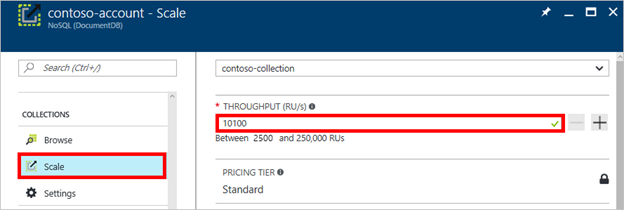
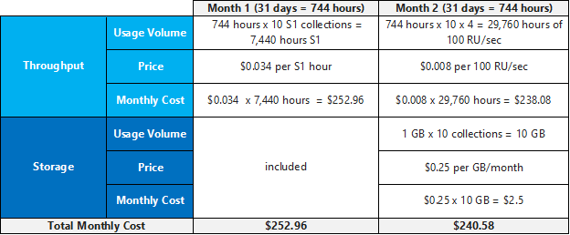
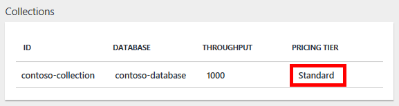
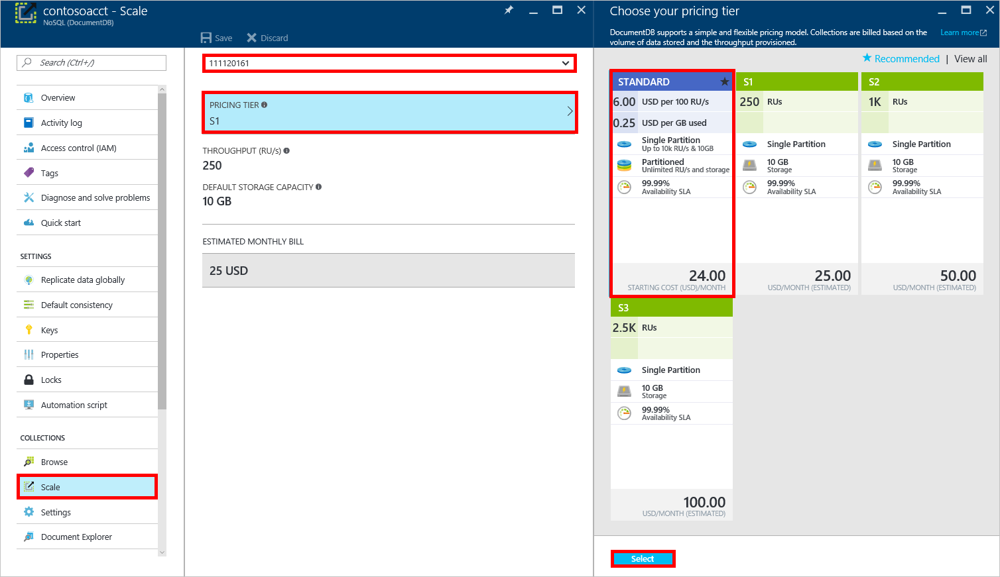

<properties
    pageTitle="DocumentDB API 性能级别 | Azure"
    description="了解如何通过 DocumentDB API 性能级别在每个容器的基础上保留吞吐量。"
    services="documentdb"
    author="mimig1"
    manager="jhubbard"
    editor="monicar"
    documentationcenter="" />
<tags
    ms.assetid="7dc21c71-47e2-4e06-aa21-e84af52866f4"
    ms.service="documentdb"
    ms.workload="data-services"
    ms.tgt_pltfrm="na"
    ms.devlang="na"
    ms.topic="article"
    ms.date="05/10/2017"
    wacn.date="05/31/2017"
    ms.author="mimig"
    ms.custom="H1Hack27Feb2017"
    ms.translationtype="Human Translation"
    ms.sourcegitcommit="4a18b6116e37e365e2d4c4e2d144d7588310292e"
    ms.openlocfilehash="23a320108edb21bc0aa8977986d612e700f59c14"
    ms.contentlocale="zh-cn"
    ms.lasthandoff="05/19/2017" />

# 停用 S1、S2 和 S3 性能级别

> [AZURE.IMPORTANT] 
> 本文所述的 S1、S2 和 S3 性能级别即将停用，不再适用于新的 DocumentDB API 帐户。
>

本文概述 S1、S2 和 S3 性能级别，并介绍在 2017 年 8 月 1 日，使用这些性能级别的集合将如何迁移到单区集合。 阅读本文后，将能够回答以下问题：

- [为何要停用 S1、S2 和 S3 性能级别？](#why-retired)
- [单区集合和分区集合与 S1、S2、S3 性能级别有哪些区别？](#compare)
- [我需要做些什么才能确保不间断地访问我的数据？](#uninterrupted-access)
- [迁移后，集合会发生怎样的变化？](#collection-change)
- [迁移到单区集合后，帐单会发生怎样的变化？](#billing-change)
- [如果需要 10 GB 以上的存储，应该怎么做？](#more-storage-needed)
- [在 2017 年 8 月 1 日之前，是否可以在 S1、S2 和 S3 性能级别之间切换？](#change-before)
- [如何了解集合已迁移？](#when-migrated)
- [如何自行从 S1、S2、S3 性能级别迁移到单区集合？](#migrate-diy)
- [EA 客户会受到怎样的影响？](#ea-customer)

## 为何要停用 S1、S2 和 S3 性能级别？ 

S1、S2 和 S3 性能级别无法提供 DocumentDB API 集合具备的灵活性。 使用 S1、S2、S3 性能级别时，吞吐量和存储容量都是预设的，没有任何弹性。 现在，DocumentDB 允许用户自定义吞吐量和存储，大幅提高随需求变化而缩放的灵活性。

## 单区集合和分区集合与 S1、S2、S3 性能级别有哪些区别？ 

下表比较了单区集合、分区集合以及 S1、S2、S3 性能级别提供的吞吐量和存储选项。 

你是 EA 客户吗？ 如果是，请参阅 [如果我是 EA 客户，我会受到怎样的影响？](#ea-customer)

## 我需要做些什么才能确保不间断地访问我的数据？ 

不需要执行任何操作，DocumentDB 会代你处理迁移。 如果你有 S1、S2 或 S3 集合，当前集合将在 2017 年 7 月 31 日迁移到单区集合。 

## 迁移后，集合会发生怎样的变化？ 

如果你有 S1 集合，该集合将迁移到吞吐量为 400 RU/s 的单区集合。 400 RU/s 是单区集合提供的最低吞吐量。 但是，单区集合中 400 RU/s 吞吐量的费用与 S1 集合中 250 RU/s 吞吐量的费用大致相等 - 因此不需要为额外的 150 RU/s 付费。

如果你有 S2 集合，该集合将迁移到吞吐量为 1 K RU/s 的单区集合。 吞吐量级别没有可见变化。

如果你有 S3 集合，该集合将迁移到吞吐量为 2.5 K RU/s 的单区集合。 吞吐量级别没有可见变化。

对于上面的每种情况，在迁移集合后，可自定义吞吐量级别，或将其缩放以向用户提供低延迟的访问。 若要在迁移集合后更改吞吐量级别，只需在 Azure 门户中打开 DocumentDB 帐户，单击“缩放”，选择集合，然后如以下屏幕截图所示调整吞吐量级别：

## 迁移到单区集合后，帐单会发生怎样的变化？ 

假设你在中国东部区域使用 10 个 S1 集合，其中每个集合的存储为 1 GB，现在要将这 10 个 S1 集合迁移到吞吐量为 400 RU/秒（最低级别）的 10 个单分区集合。 如果将 10 个单区集合保留一整月，帐单将如下所示：

## 如果需要 10 GB 以上的存储，应该怎么做？  

无论使用 S1、S2 或 S3 性能级别的集合还是单区集合（其可用存储都是 10 GB），都可以使用 DocumentDB 数据迁移工具将数据迁移到分区集合（存储几乎无限）。 有关分区集合优势的信息，请参阅 [DocumentDB 中的分区和缩放](/documentation/articles/documentdb-partition-data/)。 有关如何将 S1、S2、S3 或单区集合迁移到分区集合的信息，请参阅[从单区迁移到分区集合](/documentation/articles/documentdb-partition-data/#migrating-from-single-partition/)。 

## 在 2017 年 8 月 1 日之前，是否可以在 S1、S2 和 S3 性能级别之间切换？  

只有 S1、S2 和 S3 性能级别的现有帐户才能通过门户或编程方式更改和切换性能级别层。 从 2017 年 8 月 1 日开始，S1、S2 和 S3 性能级别将不再可用。 如果从 S1、S3 或 S3 切换到了单区集合，将无法恢复到 S1、S2 或 S3 性能级别。

## 如何了解集合已迁移？ 

迁移将在 2017 年 7 月 31 日进行。 如果有使用 S1、S2 或 S3 性能级别的集合，DocumentDB 团队将在进行迁移前通过电子邮件与你联系。 2017 年 8 月 1 日完成迁移后，Azure 门户将显示你的集合使用标准定价。

## 如何自行从 S1、S2、S3 性能级别迁移到单区集合？ 

可通过 Azure 门户或编程方式从 S1、S2 和 S3 性能级别迁移到单区集合。 可在 8 月 1 日之前自行执行此操作，以享用单区集合提供的灵活吞吐量选项；否则，我们将在 2017 年 7 月 31 日代你迁移集合。

**使用 Azure 门户迁移到单区集合**

1. 在 [**Azure 门户**](https://portal.azure.cn)中单击“DocumentDB”，然后选择要修改的 DocumentDB 帐户。 
 
    如果跳转栏上没有“DocumentDB”，请单击 >，滚动到“数据库”，选择“DocumentDB”，然后选择 DocumentDB 帐户。  

2. 在资源菜单中的“容器”下面单击“缩放”，从下拉列表中选择要修改的集合，然后单击“定价层”。 使用预定义吞吐量的帐户拥有定价层 S1、S2 或 S3。  在“选择定价层”边栏选项卡中，单击“标准”以更改为用户定义的吞吐量，然后单击“选择”保存更改。

    

3. 返回到“规模”边栏选项卡中，“定价层”已更改为“标准”，“吞吐量(RU/s)”框显示默认值 400。 可以在 400 和 10,000 [请求单位](/documentation/articles/documentdb-request-units/)/秒 (RU/s) 之间设置吞吐量。 页面底部的“估计的每月帐单”  将自动更新以提供月成本估计值。 

    >[AZURE.IMPORTANT] 
    > 保存更改后并转移到标准定价层后，无法回滚到 S1、S2 或 S3 性能级别。

4.  以保存更改。

    如果确定需要更多吞吐量（大于 10,000 RU/s）或更多存储（大于 10GB），可以创建分区集合。 若要将单分区集合迁移到分区集合，请参阅[从单分区集合迁移到分区集合](/documentation/articles/documentdb-partition-data/#migrating-from-single-partition/)。

    > [AZURE.NOTE]
    > 从 S1、S2 或 S3 切换到标准定价层最长可能需要 2 分钟时间。
    > 
    > 

**使用 .NET SDK 迁移到单区集合**

另一个更改集合的性能级别的选项便是通过我们的 SDK 进行操作。 本节只介绍使用 [.NET SDK](https://msdn.microsoft.com/zh-cn/library/azure/dn948556.aspx) 更改集合的性能级别，但对于其他 [SDK](https://msdn.microsoft.com/zh-cn/library/azure/dn781482.aspx)，过程也是相似的。 .NET SDK 的新手可以访问[入门教程](/documentation/articles/documentdb-get-started/)。

以下代码片段可将集合吞吐量更改为每秒 5,000 个请求单位：

        //Fetch the resource to be updated
        Offer offer = client.CreateOfferQuery()
                          .Where(r => r.ResourceLink == collection.SelfLink)    
                          .AsEnumerable()
                          .SingleOrDefault();

        // Set the throughput to 5000 request units per second
        offer = new OfferV2(offer, 5000);

        //Now persist these changes to the database by replacing the original resource
        await client.ReplaceOfferAsync(offer);

请访问 [MSDN](https://msdn.microsoft.com/zh-cn/library/azure/microsoft.azure.documents.client.documentclient.aspx) 以查看其他示例并了解更多有关服务方法的信息：

- [**ReadOfferAsync**](https://msdn.microsoft.com/zh-cn/library/azure/microsoft.azure.documents.client.documentclient.readofferasync.aspx)
- [**ReadOffersFeedAsync**](https://msdn.microsoft.com/zh-cn/library/azure/microsoft.azure.documents.client.documentclient.readoffersfeedasync.aspx)
- [**ReplaceOfferAsync**](https://msdn.microsoft.com/zh-cn/library/azure/microsoft.azure.documents.client.documentclient.replaceofferasync.aspx)
- [**CreateOfferQuery**](https://msdn.microsoft.com/zh-cn/library/azure/microsoft.azure.documents.linq.documentqueryable.createofferquery.aspx)

## EA 客户会受到怎样的影响？ 

EA 客户在当前合同到期之前，价格将受到保护。

## 后续步骤
若要了解更多有关 DocumentDB 的定价和管理数据的信息，请浏览以下资源：

1. [对 DocumentDB 中的数据进行分区](/documentation/articles/documentdb-partition-data/)。 了解单区容器与分区容器的差异，以及有关实施分区策略以进行无缝缩放的提示。
2. [DocumentDB 定价](/pricing/details/documentdb/)。 了解预配吞吐量和使用存储的费用。
3. [请求单位](/documentation/articles/documentdb-request-units/)。 了解不同操作类型（例如读取、写入和查询）的吞吐量消耗。

<!---Update_Description: wording update -->