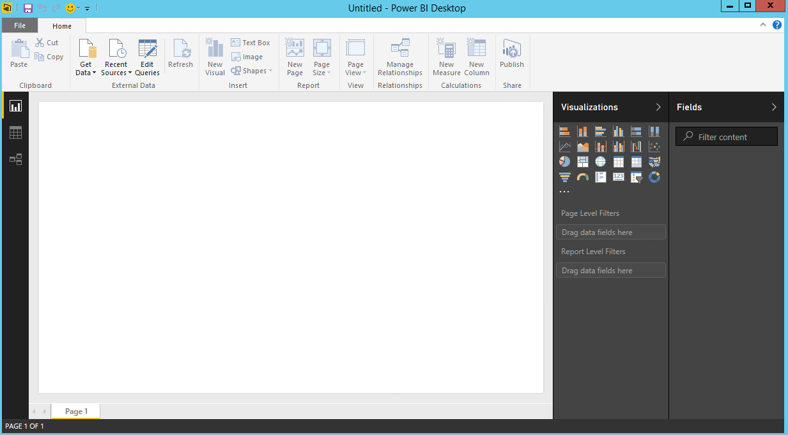
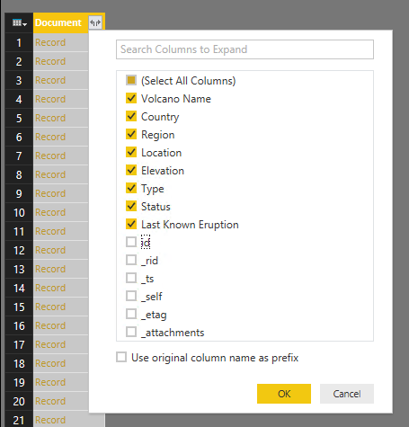
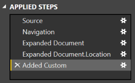
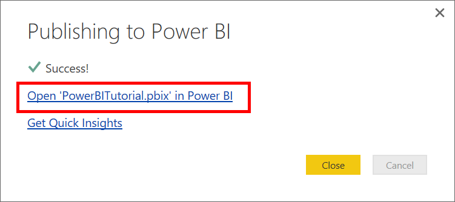
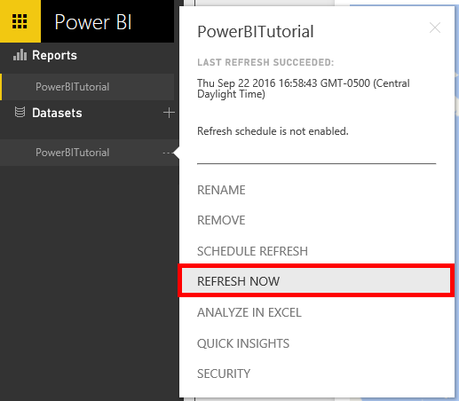

<properties
    pageTitle="DocumentDB 连接器的 Power BI 教程 | Azure"
    description="使用此 Power BI 教程导入 JSON、创建见解深入的报表以及使用 DocumentDB 和 Power BI 连接器可视化数据。"
    keywords="Power BI 教程, 可视化数据, Power BI 连接器"
    services="documentdb"
    author="mimig1"
    manager="jhubbard"
    editor="mimig"
    documentationcenter="" />
<tags
    ms.assetid="cd1b7f70-ef99-40b7-ab1c-f5f3e97641f7"
    ms.service="documentdb"
    ms.workload="data-services"
    ms.tgt_pltfrm="na"
    ms.devlang="na"
    ms.topic="article"
    ms.date="02/14/2016"
    wacn.date="03/22/2017"
    ms.author="mimig" />  

# DocumentDB 的 Power BI 教程：使用 Power BI 连接器可视化数据
[PowerBI.com](https://powerbi.microsoft.com/) 是一个在线服务，在此处你可以创建和共享包含对你和你的组织来说很重要的数据的仪表板和报表。Power BI Desktop 是一个专用的报表创作工具，使你能够从各种数据源检索数据、合并和转换数据、创建功能强大的报表和可视化效果以及将报表发布到 Power BI。使用最新版本的 Power BI Desktop，你现在可以通过 Power BI 的 DocumentDB 连接器连接到你的 DocumentDB 帐户。

在此 Power BI 教程中，我们将逐步讲解各步骤 - 在 Power BI Desktop 中连接到 DocumentDB 帐户、导航至我们想要在其中使用导航器提取数据的集合、使用 Power BI Desktop 查询编辑器将 JSON 数据转换为表格格式以及生成报表并将其发布到 PowerBI.com。

在完成此 Power BI 教程后，你将能够回答以下问题：

- 我可以如何使用 Power BI Desktop 生成包含 DocumentDB 的数据的报表？
- 如何在 Power BI Desktop 中连接到 DocumentDB 帐户？
- 如何在 Power BI Desktop 中从集合检索数据？
- 如何在 Power BI Desktop 中转换嵌套的 JSON 数据？
- 如何在 PowerBI.com 中发布和共享我的报表？

## 先决条件
在按照此 Power BI 教程中的说明操作之前，请确保具备以下先决条件：

- [最新版本的 Power BI Desktop](https://powerbi.microsoft.com/desktop)。
- 在你的 Azure DocumentDB 帐户中访问我们的演示帐户或数据。
  - 演示帐户使用本教程中显示的火山数据填充。此演示帐户未由任何 SLA 绑定且只用于演示目的。我们保留对此演示帐户进行修改的权利，包括但不限于在任何时间无需提前通知或理由而终止帐户、更改密钥、限制访问、更改和删除数据。
    - URL：https://analytics.documents.azure.com
    - 只读密钥：MSr6kt7Gn0YRQbjd6RbTnTt7VHc5ohaAFu7osF0HdyQmfR+YhwCH2D2jcczVIR1LNK3nMPNBD31losN7lQ/fkw==
  - 或者，若要创建你自己帐户，请参阅[使用 Azure 门户预览创建 DocumentDB 数据库帐户](/documentation/articles/documentdb-create-account/)。然后，要获取类似于本教程中使用的示例火山数据（但不包含 GeoJSON 块），请参阅 [NOAA 站点](https://www.ngdc.noaa.gov/nndc/struts/form?t=102557&s=5&d=5)，然后使用 [DocumentDB 数据迁移工具](/documentation/articles/documentdb-import-data/)导入数据。

若要在 PowerBI.com 中共享你的报表，必须在 PowerBI.com 中拥有帐户。若要了解更多有关 Power BI 免费版和 Power BI Pro 的信息，请访问 [https://powerbi.microsoft.com/pricing](https://powerbi.microsoft.com/pricing)。

## 让我们开始吧
在本教程中，让我们假设你是一位研究世界各地的火山的地理学家。火山数据存储在 DocumentDB 帐户中且 JSON 文档的外观如下所示。

    {
        "Volcano Name": "Rainier",
           "Country": "United States",
          "Region": "US-Washington",
          "Location": {
            "type": "Point",
            "coordinates": [
              -121.758,
              46.87
            ]
          },
          "Elevation": 4392,
          "Type": "Stratovolcano",
          "Status": "Dendrochronology",
          "Last Known Eruption": "Last known eruption from 1800-1899, inclusive"
    }

你想从 DocumentDB 帐户中检索火山数据并在如下交互式 Power BI 报表中将数据可视化。

准备好尝试一下了吗？ 让我们开始吧。

1. 在你的工作站上运行 Power BI Desktop。
2. 一旦启动 Power BI Desktop 后，将显示“欢迎”屏幕。
   
    
3. 你可以“获取数据”、查看“最近使用的源”或直接从“欢迎”屏幕“打开其他报表”。单击右上角的 X 以关闭屏幕。将显示 Power BI Desktop 的“报表”视图。
   
    
4. 选择“主页”功能区，然后单击“获取数据”。应出现“获取数据”窗口。
5. 单击“Azure”，选择“Azure DocumentDB (Beta)”，然后单击“连接”。此时应显示“Azure DocumentDB 连接”窗口。
   
      

6. 如下所示指定你想要从其中检索数据的 DocumentDB 帐户终结点 URL，然后单击“确定”。可以在 Azure 门户预览的“密钥”边栏选项卡上的“URI”框中检索 URL，或者使用演示帐户，在本例中，URL 为 `https://analytics.documents.azure.com`。****
   
    数据库名称、集合名称和 SQL 语句都可留空，因为这些字段是可选的。我们将使用导航器选择数据库和集合以指定数据来源。
   
      

7. 如果你是首次连接到此终结点，则将提示你输入帐户密钥。可以在 Azure 门户预览的“只读密钥”边栏选项卡上的“主密钥”框中检索密钥，或者使用演示帐户，在本例中，密钥为 `MSr6kt7Gn0YRQbjd6RbTnTt7VHc5ohaAFu7osF0HdyQmfR+YhwCH2D2jcczVIR1LNK3nMPNBD31losN7lQ/fkw==`。****输入帐户密钥并单击“连接”。
   
    我们建议你在生成报表时使用只读密钥。这将防止主密钥不必要地暴露于潜在的安全风险中。只读密钥在 Azure 门户预览的“密钥”边栏选项卡中提供，或者，可以使用上面提供的演示帐户信息。
   
      

8. 帐户成功连接后，将出现“导航器”。“导航器”将显示帐户下的数据库列表。
9. 单击并展开报表数据的来源数据库；如果使用演示帐户，请选择“volcanodb”。
10. 现在，选择要从其中检索数据的集合。如果使用的是演示帐户，请选择“volcano1”。
    
    “预览”窗格显示“记录”项的列表。文档在 Power BI 中表示为一种“记录”类型。同样，文档内部的嵌套 JSON 块也是“记录”。
    
      

11. 单击“编辑”启动查询编辑器，以便转换数据。

## 平展和转换 JSON 文档
1. 在 Power BI 查询编辑器的中心窗格中应会显示“文档”列。
2. 单击“文档”列标题右侧的展开控件。将显示带有字段列表的上下文菜单。选择报表所需的字段，例如，火山名称、国家/地区、区域、位置、海拔、类型、状态和已知的上次喷发时间，然后单击“确定”。
   
      

3. 中心窗格将以所选字段显示结果预览。
   
      

4. 在我们的示例中，“位置”属性在文档中为 GeoJSON 块。可以看到，“位置”在 Power BI Desktop 中表示为一种“记录”类型。
5. 单击“位置”列标头右侧的扩展器。将显示具有类型和坐标字段的上下文菜单。选择坐标字段，然后单击“确定”。
   
      

6. 中心窗格现在将显示“列表”类型的坐标列。如教程的开头所示，本教程中的 GeoJSON 数据是“点”类型，纬度值和经度值记录在坐标数组中。
   
    coordinates[0] 元素表示经度，coordinates[1] 表示纬度。
    
    
7. 若要平展坐标数组，需创建名为“经纬度”的**自定义列**。选择“添加列”功能区并单击“添加自定义列”。应出现“添加自定义列”窗口。
8. 为新列提供一个名称，例如 LatLong。
9. 接下来，为新列指定自定义公式。本示例将按如下所示，使用以下公式串连逗号分隔的纬度值和经度值：`Text.From([Document.Location.coordinates]{1})&","&Text.From([Document.Location.coordinates]{0})`。单击**“确定”**。
   
    有关数据分析表达式 (DAX)（包括 DAX 函数）的详细信息，请访问 [DAX Basic in Power BI Desktop](https://support.powerbi.com/knowledgebase/articles/554619-dax-basics-in-power-bi-desktop)（Power BI Desktop 中的 DAX Basic）。
   
      

10. 现在，中心窗格将显示使用逗号分隔的纬度值和经度值填充的新“LatLong”列。
    
      

    
    如果新列中出现错误，请确保“查询设置”下应用的步骤与下图相符：
    
      

    
    如果步骤不同，请删除额外的步骤，然后重试添加自定义列。
11. 此时我们已经完成了将数据平展到表格格式中。你可以利用查询编辑器中所有可用的功能在 DocumentDB 中形成和转换数据。如果使用样本，请在“主页”功能区上更改“数据类型”，将“高度”的数据类型更改为“整数”。
    
      

12. 单击“关闭并应用”保存数据模型。
    
      

## 生成报表
你可以在 Power BI Desktop 报表视图中开始创建报表以可视化数据。可以通过将字段拖放到“报表”画布中来创建报表。

  

在“报表”视图中，你应找到：

1. “字段”窗格，其中显示包含可在报表中使用的字段的数据模型列表。
2. “可视化效果”窗格。一个报表可以包含单个或多个可视化效果。从“可视化效果”窗格中选择符合需要的视觉对象类型。
3. “报表”画布，将在其中为报表生成视觉效果。
4. “报表”页。可以在 Power BI Desktop 中添加多个报表页。

下面将演示创建简单交互地图视图报表的基本步骤。

1. 对于我们的示例，我们将创建显示每座火山的位置的地图视图。在“可视化效果”窗格中，单击如上屏幕截图中突出显示的“地图”视觉对象类型。应会看到绘制在“报表”画布上的地图视觉对象类型。“可视化效果”窗格还应显示一组与地图视觉对象类型相关的属性。
2. 现在，从“字段”窗格将“经纬度”字段拖放到“可视化效果”窗格中的“位置”属性。
3. 接下来，将“火山名称”字段拖放到“图例”属性。
4. 然后，将“海拔”字段拖放到“大小”属性。
5. 现在你应该会看到显示一组表示每座火山位置的气泡的地图视觉对象，气泡的大小与火山的海拔相关联。
6. 此时你已创建了基本报表。你可以通过添加更多可视化效果进一步自定义该报表。在本例中，我们添加了火山类型切片器以使报表具有交互性。
   
      

## 发布和共享报表
若要共享你的报表，必须在 PowerBI.com 中拥有帐户。

1. 在 Power BI Desktop 中，单击“主页”功能区。
2. 单击“发布”。系统将提示你输入你的 PowerBI.com 帐户的用户名和密码。
3. 凭据通过身份验证后，报表将发布到选择的目标。
4. 单击“在 Power BI 中打开 'PowerBITutorial.pbix'”，在 PowerBI.com 上查看和共享报表。
   
      

## 在 PowerBI.com 中创建仪表板
现在，已创建一份可在 PowerBI.com 上共享的报表

将报表从 Power BI Desktop 发布到 PowerBI.com 时，会在 PowerBI.com 租户中生成一份**报表**和一个**数据集**。例如，将名为 **PowerBITutorial** 的报表发布到 PowerBI.com 后，将在 PowerBI.com 的“报表”和“数据集”部分中看到 PowerBITutorial。

     

若要创建可共享的仪表板，请单击 PowerBI.com 报表上的“固定活动页面”按钮。

     

然后，根据 [Pin a tile from a report](https://powerbi.microsoft.com/documentation/powerbi-service-pin-a-tile-to-a-dashboard-from-a-report/#pin-a-tile-from-a-report)（从报表固定磁贴）中的说明创建新仪表板。

还可在创建仪表板之前进行即席修改。但是，我们建议使用 Power BI Desktop 执行修改，然后将报表重新发布到 PowerBI.com。

## 刷新 PowerBI.com 中的数据
有两种方式可以刷新数据：即席刷新和计划刷新。

若要即席刷新，只需单击“数据集”（例如 PowerBITutorial）旁边的省略号 (…)。应会看到包括“立即刷新”的操作列表。单击“立即刷新”即可刷新数据。

  

若要按计划刷新，请执行以下操作。

1. 单击操作列表中的“计划刷新”。

	

2. 在“设置”页上，展开“数据源凭据”。
3. 单击“编辑凭据”。
   
    此时将显示“配置”弹出窗口。
4. 输入该数据集的密钥连接到 DocumentDB 帐户，然后单击“登录”。
5. 展开“计划刷新”，并设置数据集的刷新计划。
6. 单击“应用”即可完成计划刷新的设置。

## 后续步骤
- 有关 Power BI 的详细信息，请参阅 [Get started with Power BI](https://powerbi.microsoft.com/documentation/powerbi-service-get-started/)（Power BI 入门）。
- 有关 DocumentDB 的详细信息，请参阅 [DocumentDB 文档登录页](/documentation/services/documentdb/)。

<!---HONumber=Mooncake_0313_2017-->
<!---Update_Description: wording update -->