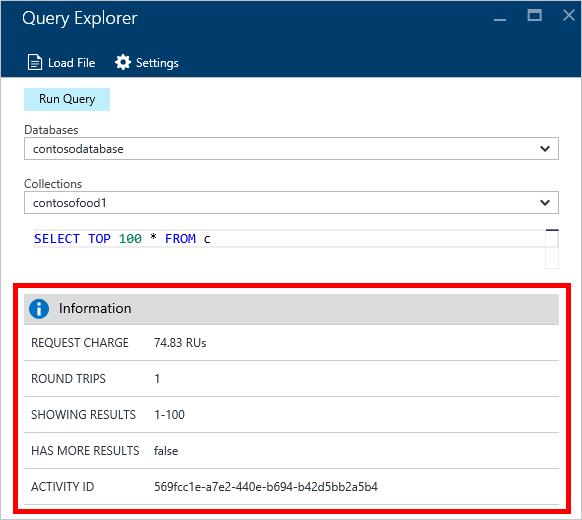

<properties
    pageTitle="Azure DocumentDB 门户工具：查询资源管理器 | Azure"
    description="了解 DocumentDB 查询资源管理器，它是 Azure 门户预览中的一个编写 SQL 查询，并针对 NoSQL DocumentDB 集合运行这些查询的 SQL 查询编辑器。"
    keywords="编写 SQL 查询, SQL 查询编辑器"
    services="documentdb"
    author="kirillg"
    manager="jhubbard"
    editor="monicar"
    documentationcenter="" />
<tags
    ms.assetid="ac378240-b11f-4522-ae9f-09da3a6f9c16"
    ms.service="documentdb"
    ms.workload="data-services"
    ms.tgt_pltfrm="na"
    ms.devlang="na"
    ms.topic="article"
    ms.date="02/10/2017"
    wacn.date="03/22/2017"
    ms.author="kirillg" />  

# 在 Azure 门户预览中使用查询资源管理器对 DocumentDB 编写、编辑和运行 SQL 查询
本文概述了 [Azure DocumentDB](/home/features/documentdb/) 查询资源管理器，该资源管理器是一个 Azure 门户预览工具，允许用户针对 [DocumentDB 集合](/documentation/articles/documentdb-create-collection/)编写、编辑和运行 SQL 查询。

1. 在 [Azure 门户预览](https://portal.azure.cn)的左侧导航栏中，单击 “NoSQL (DocumentDB)”。

    如果“NoSQL (DocumentDB)”不可见，则单击底部的“更多服务”，然后单击 “NoSQL (DocumentDB)”。
2. 在资源菜单中，单击“查询资源管理器”。
   
      

3. 在“查询资源管理器”边栏选项卡中，从下拉列表中选择要查询的**数据库**和**集合**，然后键入要运行的查询。
   
    “数据库”和“集合”下拉列表会根据启动查询资源管理器的上下文进行预填充。
   
    提供了 `SELECT TOP 100 * FROM c` 的默认查询。可以接受默认查询，也可以使用 [SQL 查询速查表](/documentation/articles/documentdb-sql-query-cheat-sheet/)或 [SQL 查询和 SQL 语法](/documentation/articles/documentdb-sql-query/)文章中所述的 SQL 查询语言构造自己的查询。
   
    单击“运行查询”查看结果。
   
      

4. “结果”边栏选项卡将显示查询的输出。
   
      

## 处理结果
默认情况下，查询资源管理器会返回 100 条一组的结果。如果查询生成了 100 多条结果，只需使用“下一页”和“上一页”命令即可浏览结果集。

  

对于成功的查询，“信息”窗格将包含度量值，如请求费用、查询进行的往返数、当前显示的结果集，以及是否有更多结果（如上文所述，可通过“下一页”命令进行访问）。

  

## 使用多个查询
如果正在使用多个查询，并且想要在它们之间快速切换，则可以在“查询资源管理器”边栏选项卡的查询文本框中输入所有查询，然后突出显示想要运行的查询，再单击“运行查询”以查看结果。

  

## 将查询从文件添加到 SQL 查询编辑器
可以使用“加载文件”命令加载现有文件的内容。

  

## 故障排除  

如果查询完成但有错误，查询资源管理器将显示可以帮助进行故障排除工作的错误列表。

  

## 运行门户外部的 DocumentDB SQL 查询
Azure 门户预览中的查询资源管理器只是一种对 DocumentDB 运行 SQL 查询的方式。还可以使用 [REST API](https://msdn.microsoft.com/zh-cn/library/azure/dn781481.aspx) 或[客户端 SDK](/documentation/articles/documentdb-sdk-dotnet/) 运行 SQL 查询。有关使用这些其他方法的详细信息，请参阅[执行 SQL 查询](/documentation/articles/documentdb-sql-query/#executing-sql-queries/)

## 后续步骤
有关查询资源管理器中支持的 DocumentDB SQL 语法的详细信息，请参阅 [SQL 查询和 SQL 语法](/documentation/articles/documentdb-sql-query/)一文或打印 [SQL 查询速查表](/documentation/articles/documentdb-sql-query-cheat-sheet/)。还可以尝试使用[查询板块](https://www.documentdb.com/sql/demo)，在其中可以使用示例数据集联机测试查询。

<!---HONumber=Mooncake_0313_2017-->
<!---Update_Description: wording update -->