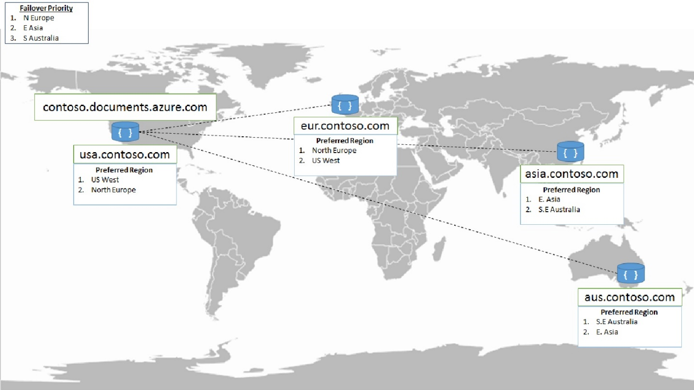
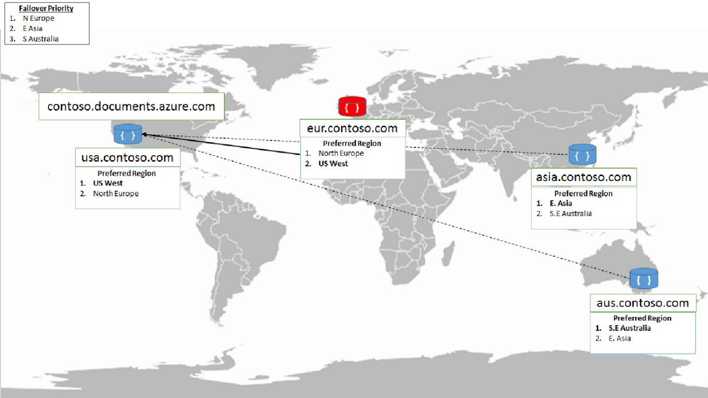
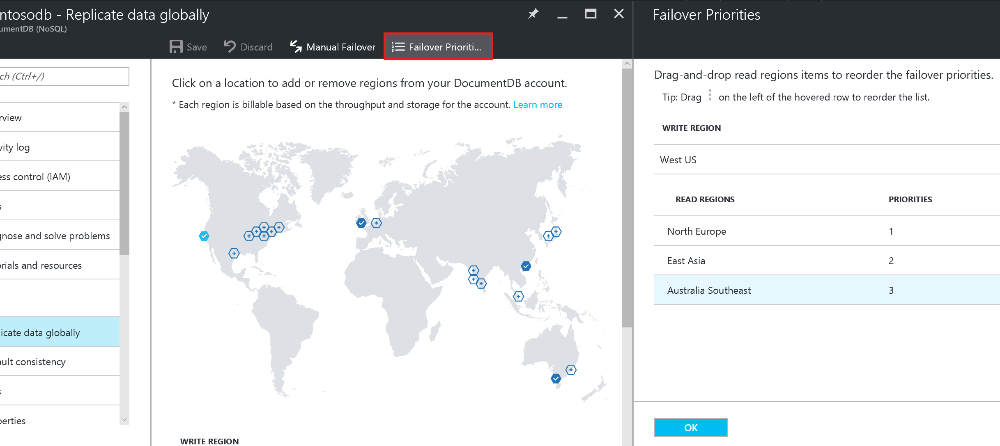
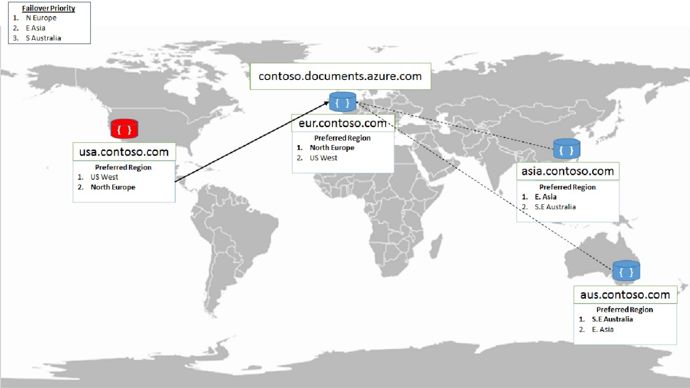
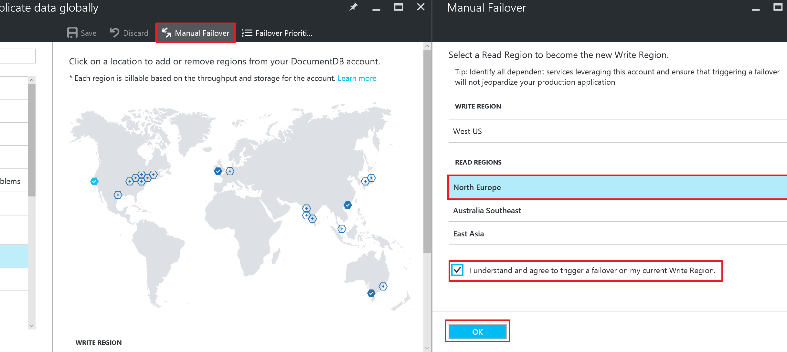

<properties
    pageTitle="Azure DocumentDB 中的区域性故障转移 | Azure"
    description="了解如何在 Azure DocumentDB 中执行手动和自动故障转移。"
    services="documentdb"
    documentationcenter=""
    author="arramac"
    manager="jhubbard"
    editor="" />
<tags
    ms.assetid="446e2580-ff49-4485-8e53-ae34e08d997f"
    ms.service="documentdb"
    ms.devlang="multiple"
    ms.topic="article"
    ms.tgt_pltfrm="na"
    ms.workload="na"
    ms.date="01/10/2016"
    wacn.date="02/27/2017"
    ms.author="arramac" />  

# Azure DocumentDB 中的区域性故障转移
Azure DocumentDB 可通过提供完全托管的[多区域数据库帐户](/documentation/articles/documentdb-distribute-data-globally/)来简化全局数据分发。这些帐户在一致性、可用性和性能之间提供明确的折衷，并且全部附带了相应的保证。DocumentDB 帐户提供以下优势：高可用性，10 毫秒以下的延迟，[妥善定义的一致性级别](/documentation/articles/documentdb-consistency-levels/)，使用多宿主 API 实现透明的区域性故障转移，以及在全球范围内弹性缩放吞吐量和存储。

Azure DocumentDB 支持显式和策略驱动型故障转移，方便用户在发生故障时控制端到端系统行为。本文内容：

- 如何在 DocumentDB 中进行手动故障转移？
- 如何在 DocumentDB 中进行自动故障转移？
- 如何在应用程序体系结构中使用手动故障转移？

## 配置多区域应用程序
在深入探讨故障转移模式之前，我们先介绍如何配置应用程序，以便在需要进行区域性故障转移时充分利用多区域可用性，确保足够的还原能力。

- 首先，在多个区域中部署应用程序
- 为了确保从每个部署了应用程序的区域进行访问时的低延迟性，请通过一个支持的 SDK 为每个区域配置相应的[首选区域列表](https://msdn.microsoft.com/zh-cn/library/microsoft.azure.documents.client.connectionpolicy.preferredlocations.aspx#P:Microsoft.Azure.Documents.Client.ConnectionPolicy.PreferredLocations)。

以下代码片段演示如何初始化多区域应用程序。其中，DocumentDB 帐户 `contoso.documents.azure.com` 配置了两个区域 - 美国西部和北欧。

- 应用程序部署在美国西部区域（例如，使用 Azure 应用服务）
- 配置了“`West US`”作为第一个首选区域，确保读取时的低延迟性
- 配置了“`North Europe`”作为第二个首选区域（确保区域故障时的高可用性）

在 .NET 中，此配置类似于以下代码片段：

    ConnectionPolicy usConnectionPolicy = new ConnectionPolicy 
    { 
        ConnectionMode = ConnectionMode.Direct,
        ConnectionProtocol = Protocol.Tcp
    };

    usConnectionPolicy.PreferredLocations.Add(LocationNames.WestUS);
    usConnectionPolicy.PreferredLocations.Add(LocationNames.NorthEurope);

    DocumentClient usClient = new DocumentClient(
        new Uri("https://contosodb.documents.azure.com"),
        "memf7qfF89n6KL9vcb7rIQl6tfgZsRt5gY5dh3BIjesarJanYIcg2Edn9uPOUIVwgkAugOb2zUdCR2h0PTtMrA==",
        usConnectionPolicy);

该应用程序也部署在北欧区域，只是首选区域的顺序相反。即，先指定北欧区域，确保读取时的低延迟性。然后指定美国西部作为第二个首选区域，确保区域故障时的高可用性。

以下体系结构示意图显示多区域应用程序部署，其中 DocumentDB 和该应用程序配置为可在四个 Azure 地理区域使用。

  

现在，让我们看看 DocumentDB 服务如何通过自动故障转移处理区域性故障。

## 自动故障转移
在极少数情况下，当出现 Azure 区域性中断时，DocumentDB 会自动触发故障转移，对存在于受影响区域的所有 DocumentDB 帐户进行转移。

**某个读取区域中断时会发生什么情况？**

读取区域位于其中一个受影响区域的 DocumentDB 帐户会自动断开与其写入区域的连接，并被标记为脱机。DocumentDB SDK 会实现一个区域性发现协议，以便自动检测可用的区域，从而将读取调用重定向到首选区域列表中的下一个可用区域。如果首选区域列表中没有区域可用，则会自动让调用返回到当前的写入区域。处理区域性故障转移不需在应用程序代码中进行更改。在这整个过程中，DocumentDB 会始终确保一致性。

  

受影响区域从中断恢复以后，该区域所有受影响的 DocumentDB 帐户会自动由服务恢复。然后，有读取区域位于受影响区域的 DocumentDB 帐户会自动与当前的写入区域同步并转为联机状态。DocumentDB SDK 发现有新区域可用以后，就会根据应用程序配置的首选区域列表评估该区域是否可选作当前的读取区域。后续的读取会重定向到恢复的区域，不需更改应用程序代码。

**某个写入区域中断时会发生什么情况？**

对于给定的 Azure DocumentDB 帐户，如果受影响区域是当前的写入区域，则会自动将该区域标记为脱机。然后会针对每个受影响的 DocumentDB 帐户，将一个备用区域提升为写入区域。可以通过 Azure 门户预览或以[编程方式](https://docs.microsoft.com/rest/api/documentdbresourceprovider/databaseaccounts#DatabaseAccounts_FailoverPriorityChange)完全控制 DocumentDB 帐户的区域选择顺序。

  

在自动故障转移过程中，DocumentDB 会根据指定的优先级顺序自动选择给定 Azure DocumentDB 帐户的下一个写入区域。

  

受影响区域从中断恢复以后，该区域所有受影响的 DocumentDB 帐户会自动由服务恢复。

- 此前的写入区域位于受影响区域的 DocumentDB 帐户在可以读取后仍会保持脱机模式，即使所在区域已经恢复。
- 可以查询该区域，通过与当前写入区域中的可用数据进行比较，计算中断期间未复制的写入内容。可以根据应用程序的需求，执行合并和/或冲突解决方案，将最终的更改集写回到当前的写入区域。
- 合并完所做的更改以后，即可通过删除该区域并将其重新添加到 DocumentDB 帐户的方式，让受影响区域回到联机状态。将区域添加回来以后，即可通过 Azure 门户预览或以[编程方式](https://docs.microsoft.com/rest/api/documentdbresourceprovider/databaseaccounts#DatabaseAccounts_CreateOrUpdate)执行手动故障转移，将其重新配置为写入区域。

## 手动故障转移

除了自动故障转移，还可以通过动态方式将给定 DocumentDB 帐户当前的写入区域手动更改为现有的读取区域之一。可以通过 Azure 门户预览或以[编程方式](https://docs.microsoft.com/rest/api/documentdbresourceprovider/databaseaccounts#DatabaseAccounts_CreateOrUpdate)启动手动故障转移。

手动故障转移可确保**零数据丢失**和**零可用性丢失**，并可针对指定的 DocumentDB 帐户，将写入状态从旧写入区域恰当地转移到新写入区域。与自动故障转移一样，在手动故障转移过程中，Azure DocumentDB SDK 可以自动处理写入区域更改，确保将调用自动重定向到新的写入区域。管理故障转移不需在应用程序中更改代码或配置。

  

下面是一些可以使用手动故障转移的常见情形：

**遵循时钟模型**：如果应用程序的流量模式可以根据一天的时间进行预测，则可根据一天的时间定期将写入状态转移到最活动的地理区域。

**服务更新**：某些全局分布式应用程序的部署可能需要在计划内服务更新期间通过流量管理器将流量重新路由到其他区域。现在，此类应用程序部署可以使用手动故障转移，将写入状态保留给在服务更新时段会有活动流量的区域。

**业务连续性和灾难恢复 \(BCDR\) 演练**：大多数企业应用程序在开发和发布过程中都会进行业务连续性测试。BCDR 测试通常是进行遵从性认证的重要一步，并可确保在发生区域性中断时服务的可用性。可以对使用 DocumentDB 进行存储的应用程序实施 BCDR 就绪性测试，方法是：触发对 DocumentDB 帐户的手动故障转移，以及/或者动态添加和删除某个区域。

本文探讨了如何在 Azure DocumentDB 中使用手动和自动故障转移，以及如何配置 DocumentDB 帐户和应用程序才能让其全局可用。可以利用 Azure DocumentDB 的全局复制支持改善端到端延迟情况，确保即使在发生区域故障的情况下，也可以顺利使用这些帐户和应用程序。

## 后续步骤
- 了解 DocumentDB 如何支持[全球分布](/documentation/articles/documentdb-distribute-data-globally/)
- 了解 [DocumentDB 的全球一致性](/documentation/articles/documentdb-consistency-levels/)
- 使用 [Azure DocumentDB SDK](/documentation/articles/documentdb-developing-with-multiple-regions/) 在多个区域中进行开发
- 了解如何使用 Azure DocumentDB 构建[多区域作者体系结构](/documentation/articles/documentdb-multi-region-writers/)

<!---HONumber=Mooncake_0220_2017-->
