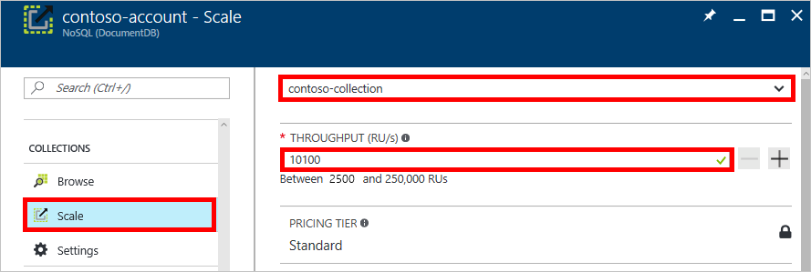

<properties
    pageTitle="预配 DocumentDB 的吞吐量 | Azure"
    description="了解如何为 DocumentDB 集合设置预配吞吐量。"
    services="documentdb"
    author="mimig1"
    manager="jhubbard"
    editor=""
    documentationcenter="" />
<tags
    ms.assetid="f98def7f-f012-4592-be03-f6fa185e1b1e"
    ms.service="documentdb"
    ms.workload="data-services"
    ms.tgt_pltfrm="na"
    ms.devlang="na"
    ms.topic="article"
    ms.date="02/15/2017"
    wacn.date="05/31/2017"
    ms.author="mimig"
    ms.translationtype="Human Translation"
    ms.sourcegitcommit="4a18b6116e37e365e2d4c4e2d144d7588310292e"
    ms.openlocfilehash="0726e23f9a433ccdbe3ec3cd53346695ecb09c88"
    ms.contentlocale="zh-cn"
    ms.lasthandoff="05/19/2017" />

# 设置 DocumentDB 集合的吞吐量

可在 Azure 门户中或通过使用客户端 SDK 设置 DocumentDB 集合的吞吐量。 

下表列出了适用于集合的吞吐量：

<table border="0" cellspacing="0" cellpadding="0">
    <tbody>
        <tr>
            <td valign="top">

</td>
            <td valign="top">
<strong>单分区集合</strong>
</td>
            <td valign="top">
<strong>已分区集合</strong>
</td>
        </tr>
        <tr>
            <td valign="top">
最小吞吐量
</td>
            <td valign="top">
400 个请求单位/秒
</td>
            <td valign="top">
2,500 个请求单位/秒
</td>
        </tr>
        <tr>
            <td valign="top">
最大吞吐量
</td>
            <td valign="top">
10,000 个请求单位/秒
</td>
            <td valign="top">
不受限制
</td>
        </tr>
    </tbody>
</table>

> [AZURE.NOTE] 
> 若要将分区集合的吞吐量值设置为在 2,500 RU/s 和 10,000 RU/s 之间，必须暂时使用 Azure 门户。 SDK 中目前尚不提供此功能。

## 使用 Azure 门户设置吞吐量

1. 在新窗口中，打开 [Azure 门户](https://portal.azure.cn)。
2. 在左侧栏中单击“DocumentDB”，或者单击底部的“更多服务”，滚动到“数据库”，然后单击“DocumentDB”。
3. 选择 DocumentDB 帐户。
4. 在新窗口中，在“集合”下单击“缩放”，如以下屏幕截图中所示。
5. 在新窗口中，从下拉列表中选择集合，更改**吞吐量**值，然后单击“保存”。

    

## 使用 .NET SDK 设置吞吐量 

    //Fetch the resource to be updated
    Offer offer = client.CreateOfferQuery()
        .Where(r => r.ResourceLink == collection.SelfLink)    
        .AsEnumerable()
        .SingleOrDefault();

    // Set the throughput to the new value, for example 12,000 request units per second
    offer = new OfferV2(offer, 12000);

    //Now persist these changes to the database by replacing the original resource
    await client.ReplaceOfferAsync(offer);

## 吞吐量常见问题

**可否将吞吐量设置为 400 RU/s 以下？**

400 RU/秒是 DocumentDB 单区集合提供的最小吞吐量（分区集合的最小值为 2500 RU/秒）。 请求单位按 100 RU/秒间隔进行设置，但吞吐量不能设置为 100 RU/秒或小于 400 RU/秒的任何值。 如果正在寻找一种经济高效的方法来开发和测试 DocumentDB，则可以使用免费的 [DocumentDB 模拟器](/documentation/articles/documentdb-nosql-local-emulator/)来免费进行本地部署。 

## 后续步骤

若要了解有关使用 DocumentDB 进行预配和全球扩展的详细信息，请参阅[使用 DocumentDB 进行分区和缩放](/documentation/articles/documentdb-partition-data/)。

<!-- Update_Description: wording update -->