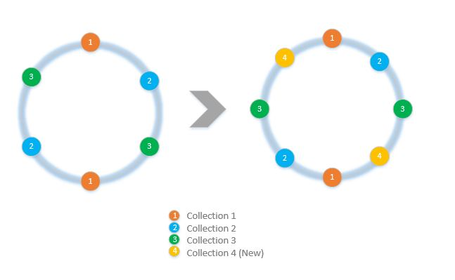
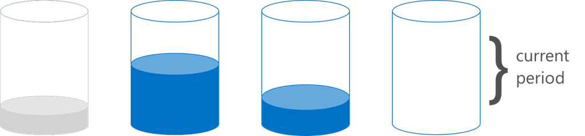

<properties 
	pageTitle="如何使用 SDK 实现客户端分区 | Azure" 
	description="了解如何使用 Azure DocumentDB SDK 对数据进行分区（分片）和跨多个集合路由请求" 
	services="documentdb" 
	authors="arramac" 
	manager="jhubbard" 
	editor="cgronlun" 
	documentationCenter=""/>

<tags 
	ms.service="documentdb" 
	ms.date="04/10/2016" 
	wacn.date="06/29/2016"/>

# 如何在 DocumentDB 中使用 .NET SDK 对数据进行分区

Azure DocumentDB 支持可扩大到[大容量存储和吞吐量](/documentation/articles/documentdb-partition-data/)的集合。但是，也存在对分区行为进行精细控制更有利的用例。为了减少分区任务所需的重复代码，我们在 .NET、Node.js 和 Java SDK 中添加了相应的功能，可使构建跨多个集合的应用程序变得更为简单。

在本文中，我们将了解 .NET SDK 中的类和接口，以及如何使用它们来开发已分区的应用程序。Java、Node.js 和 Python 等其他 SDK 支持使用类似方法和接口进行客户端侧分区。

## 使用 DocumentDB SDK 进行分区

在深入了解分区之前，我们来简要概括一些与分区相关的基本 DocumentDB 概念。每个 Azure DocumentDB 数据库帐户都包含一组数据库，每个数据库都包含多个集合，而每个集合可包含存储过程、触发器、UDF、文档及相关附件。集合本身可以是一个分区或已分区，并且具有以下属性：

- 集合提供性能隔离。因此，整理同一集合内的相似文档时有性能优势。例如，对于时序数据，你可能想将上个月频繁查询的数据置于预配的吞吐量较高的集内，而将较早的数据置于预配的吞吐量较低的集合内。
- ACID 事务（即存储过程和触发器）不能跨越集合。事务的作用域在集合内的单个分区键值内。
- 集合对数据的结构/模型没有要求，因此它们可以用于相同类型或不同类型的 JSON 文档。

从 [Azure DocumentDB SDK 1.5.x](/documentation/articles/documentdb-sdk-dotnet/) 版本开始，你可以直接对数据库进行文档操作。在内部，[DocumentClient](https://msdn.microsoft.com/library/azure/microsoft.azure.documents.client.documentclient.aspx) 使用为数据库指定的 PartitionResolver 将请求路由到相应的集合。

>[AZURE.NOTE] [Server-side partitioning](/documentation/articles/documentdb-partition-data/) REST API 2015-12-16 和 SDK 1.6.0+ 中引入的服务器端的分区功能取代了用于简单用例的客户端分区程序。但是，客户端分区更灵活，并可让你跨分区键控制性能隔离，在读取多个分区中的结果时控制并行度，并使用范围/空间分区方法与哈希。

例如，在 .NET 中，每个 PartitionResolver 类都是 [IPartitionResolver](https://msdn.microsoft.com/library/azure/microsoft.azure.documents.client.ipartitionresolver.aspx) 接口的具体实现，它拥有三种方法 - [GetPartitionKey](https://msdn.microsoft.com/library/azure/microsoft.azure.documents.client.ipartitionresolver.getpartitionkey.aspx)、[ResolveForCreate](https://msdn.microsoft.com/library/azure/microsoft.azure.documents.client.ipartitionresolver.resolveforcreate.aspx) 和 [ResolveForRead](https://msdn.microsoft.com/library/azure/microsoft.azure.documents.client.ipartitionresolver.resolveforread.aspx)。LINQ 查询和 ReadFeed 迭代器在内部使用 ResolveForRead 方法来循环访问与请求的分区键匹配的所有集合。类似地，创建操作使用 ResolveForCreate 方法来将创建路由到正确的分区。进行替换、删除和读取无需任何更改，因为它们使用已包含对相应集合的引用的文档。

SDK 还包括两个类，通过 [HashPartitionResolver](https://msdn.microsoft.com/library/azure/microsoft.azure.documents.partitioning.hashpartitionresolver.aspx) 和 [RangePartitionResolver](https://msdn.microsoft.com/library/azure/mt126047.aspx) 支持两种规范分区技术（哈希和范围查找）。你可以使用这些类轻松地将分区逻辑添加到你的应用程序。

## 添加分区逻辑并注册 PartitionResolver 

下面的代码片段演示如何创建 [HashPartitionResolver](https://msdn.microsoft.com/library/azure/microsoft.azure.documents.partitioning.hashpartitionresolver.aspx) 并针对数据库向 DocumentClient 注册。

		cs
		// Create some collections to partition data.
		DocumentCollection collection1 = await client.CreateDocumentCollectionAsync(...);
		DocumentCollection collection2 = await client.CreateDocumentCollectionAsync(...);
		
		// Initialize a HashPartitionResolver using the "UserId" property and the two collection self-links.
		HashPartitionResolver hashResolver = new HashPartitionResolver(
		    u => ((UserProfile)u).UserId, 
		    new string[] { collection1.SelfLink, collection2.SelfLink });
		
		// Register the PartitionResolver with the database.
		this.client.PartitionResolvers[database.SelfLink] = hashResolver;
		

## 在分区中创建文档  

注册 PartitionResolver 后，你可以直接对数据库执行创建和查询，如下所示。在此示例中，SDK 使用 PartitionResolver 来提取 UserId，并对其进行哈希运算，然后使用该值将创建操作路由到正确的集合。

		cs
		Document johnDocument = await this.client.CreateDocumentAsync(
		    database.SelfLink, new UserProfile("J1", "@John", Region.UnitedStatesEast));
		Document ryanDocument = await this.client.CreateDocumentAsync(
		    database.SelfLink, new UserProfile("U4", "@Ryan", Region.AsiaPacific, UserStatus.AppearAway));

## 创建针对分区的查询  

通过传入数据库和分区键，可以使用 [CreateDocumentQuery](https://msdn.microsoft.com/library/azure/microsoft.azure.documents.linq.documentqueryable.createdocumentquery.aspx) 方法进行查询。该查询对数据库内映射到分区键的所有集合返回单个结果集。

		cs
		// Query for John's document by ID - uses PartitionResolver to restrict the query to the partitions 
		// containing @John. Again the query uses the database self link, and relies on the hash resolver 
		// to route the appropriate collection.
		var query = this.client.CreateDocumentQuery<UserProfile>(
		    database.SelfLink, null, partitionResolver.GetPartitionKey(johnProfile))
		    .Where(u => u.UserName == "@John");
		johnProfile = query.AsEnumerable().FirstOrDefault();

## 在数据库中创建对所有集合的查询 

通过跳过分区键参数，你还可以查询数据库中的所有集合并枚举结果，如下所示。

		cs
		// Query for all "Available" users. Here since there is no partition key, the query is serially executed 
		// across each partition/collection and returns a single result-set. 
		query = this.client.CreateDocumentQuery<UserProfile>(database.SelfLink)
		    .Where(u => u.Status == UserStatus.Available);
		foreach (UserProfile activeUser in query)
		{
		    Console.WriteLine(activeUser);
		}

## 哈希分区解析程序
使用哈希分区，将基于哈希函数的值分配分配，这可让你跨大量分区均衡分配请求和数据。这种方法通常用于对在大量不同客户端中生成或使用的数据进行分区，对存储用户配置文件、目录项和 IoT（物联网）遥测数据非常有用。集合内的 DocumentDB 服务器端分区支持也使用哈希分区。

**哈希分区：**

跨 N 个集合的简单的哈希分区方案将使用任意文档、计算 hash(d) mod N 来确定它被放置在哪个集合内。但是，这项简单技术的问题是，在添加新集合或删除集合时作用不佳，因为这要求对几乎所有数据进行重新配置。[一致哈希](http://citeseerx.ist.psu.edu/viewdoc/summary?doi=10.1.1.23.3738)是一种熟知的算法，它所实施的哈希方案可最大程度减少添加或删除集合时所需的数据移动量，从而能解决此问题。

[HashPartitionResolver](https://msdn.microsoft.com/library/azure/microsoft.azure.documents.partitioning.hashpartitionresolver.aspx) 类实现相应的逻辑，以通过 [IHashGenerator](https://msdn.microsoft.com/library/azure/microsoft.azure.documents.partitioning.ihashgenerator.aspx) 接口中指定的哈希函数构建一致的哈希环。默认情况下，HashPartitionResolver 使用 MD5 哈希函数，但是你可以使用自己的哈希实现来换出该函数。在哈希环中，HashPartitionResolver 在内部为每个集合创建 16 个哈希或“虚拟节点”，以便实现更一致的跨集合文档分布，但你可以改变这个数字来权衡数据与客户端计算量之间的不对称度。

**使用 HashPartitionResolver 的一致哈希：**

## 范围分区解析程序

在范围分区过程中，基于分区键是否在特定范围内分配分配。这通常用于使用时间戳属性（例如，2015 年 4 月 1 日与 2015 年 4 月 14 日之间的 eventTime）进行分区。[RangePartitionResolver](https://msdn.microsoft.com/library/azure/mt126047.aspx) 类可帮助你保持 Range\<T\> 和集合自链接之间的映射。

[Range\<T\>](https://msdn.microsoft.com/library/azure/mt126048.aspx) 是一个简单的类，它用于管理实现 IComparable\<T\> 和 IEquatable\<T\> 的任意类型（例如字符串或数字）的范围。对于读取和创建，你可以传入任意范围，解析程序会通过识别与请求范围相交的分区范围识别所有候选集合。在对时序数据执行范围查询时，这项功能非常有用。

**范围分区：**

范围分区的一种特殊情况是范围只是单一的离散值，有时被称为“查找分区”。这通常用于按区域（例如斯堪的纳维亚的分区包含挪威、丹麦和瑞典）分区或多租户应用程序内的租户分区。

## 示例 

查看 [DocumentDB 分区示例 Github 项目](https://github.com/Azure/azure-documentdb-dotnet/tree/287acafef76ad223577759b0170c8f08adb45755/samples/code-samples/Partitioning)，它包含有关如何使用这些 PartitionResolvers 的代码片段，并对这些代码片段进行扩展，以实现你自己的解析程序来满足特定用例，如以下所示：

* 如何为 GetPartitionKey 指定任意 lambda 表达式，并使用它来实现复合分区键，或以不同方式对不同类型的对象进行分区。
* 如何创建一个使用手动查找表来执行分区的简单 [LookupPartitionResolver](https://github.com/Azure/azure-documentdb-dotnet/blob/287acafef76ad223577759b0170c8f08adb45755/samples/code-samples/Partitioning/Partitioners/LookupPartitionResolver.cs)。此模式通常用于基于离散值（如区域、租户 ID 或应用程序名称）进行分区。
* 如何创建 [ManagedPartitionResolver](https://github.com/Azure/azure-documentdb-dotnet/blob/287acafef76ad223577759b0170c8f08adb45755/samples/code-samples/Partitioning/Partitioners/ManagedHashPartitionResolver.cs)，它可基于定义命名方案、IndexingPolicy 和需要针对新集合注册的存储过程的模板自动创建集合。
* 如何创建无方案 [SpilloverPartitionResolver](https://github.com/Azure/azure-documentdb-dotnet/blob/287acafef76ad223577759b0170c8f08adb45755/samples/code-samples/Partitioning/Partitioners/SpilloverPartitionResolver.cs)，它仅在旧集合填满时创建新集合。
* 如何将 PartitionResolver 状态序列化和反序列化为 JSON，以便能在进程之间和关闭时进行共享。你可以将这些内容保存在配置文件甚至是 DocumentDB 集合中。
* [DocumentClientHashPartitioningManager](https://github.com/Azure/azure-documentdb-dotnet/blob/287acafef76ad223577759b0170c8f08adb45755/samples/code-samples/Partitioning/Util/DocumentClientHashPartitioningManager.cs) 类，用于基于一致哈希在分区数据库中动态添加和删除分区。它在内部使用 [TransitionHashPartitionResolver](https://github.com/Azure/azure-documentdb-dotnet/blob/287acafef76ad223577759b0170c8f08adb45755/samples/code-samples/Partitioning/Partitioners/TransitionHashPartitionResolver.cs) 以在迁移期间使用四种模式中的一种进行路由读取和写入 - 从旧的分区方案读取 (ReadCurrent)、从新的方案读取 (ReadNext)、合并两个的结果 (ReadBoth) 或在迁移期间不可用 (None)。

这些示例是开放源代码的，并且我们鼓励你提交可让其他 DocumentDB 开发人员获益的相关拉取请求。请参考 [Contribution guidelines（贡献准则）](https://github.com/Azure/azure-documentdb-net/blob/master/Contributing.md)以获如何做出贡献的指导。

>[AZURE.NOTE] 创建集合的速度受到 DocumentDB 的限制，因此此处显示的一些示例方法可能需要几分钟才能完成。

##常见问题
**DocumentDB 支持服务器端分区吗？**

是的，DocumentDB 支持 [服务器端分区](/documentation/articles/documentdb-partition-data/)。DocumentDB 还支持通过客户端分区解析程序进行客户端分区，以实现更高级的用例。

**在什么情况下应使用服务器端与客户端分区？** 
对于大多数用例，我们建议使用服务器端分区，因为它可处理分区数据和路由请求的管理任务。但是，如果需要范围分区，或使用专用用例实现对不同分区键值间的性能隔离，那么客户端分区可能是最好的方法。

**如何在分区方案中添加或删除集合？**

请查看示例项目中 DocumentClientHashPartitioningManager 的实现，了解可如何实现重新分区。

**如何保存或与其他客户端共享我的分区配置？**

你可以将分区程序状态序列化为 JSON，并存储在配置文件甚至是 DocumentDB 集合内。有关示例，请查看示例项目中的 RunSerializeDeserializeSample 方法。

**如何链接各种分区技术？**

你可以通过实现在内部使用一个或多个现有解析程序的 IPartitionResolver 来链接 PartitionResolver。有关示例，请查看 TransitionHashPartitionResolver 示例项目。

##参考
* [ DocumentDB 中的服务器端分区](/documentation/articles/documentdb-partition-data/)
* [DocumentDB 集合和性能级别](/documentation/articles/documentdb-performance-levels/)
* [Github 上的分区代码示例](https://github.com/Azure/azure-documentdb-dotnet/tree/287acafef76ad223577759b0170c8f08adb45755/samples/code-samples/Partitioning)
* [MSDN 中的 DocumentDB .NET SDK 文档](https://msdn.microsoft.com/library/azure/dn948556.aspx)
* [DocumentDB .NET samples（DocumentDB .NET 示例）](https://github.com/Azure/azure-documentdb-net)
* [DocumentDB 限制](/documentation/articles/documentdb-limits/)
* [DocumentDB 性能提示博客](https://azure.microsoft.com/blog/2015/01/20/performance-tips-for-azure-documentdb-part-1-2/)
 

<!---HONumber=Mooncake_0425_2016-->