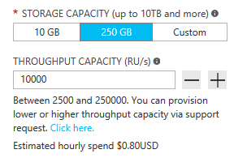
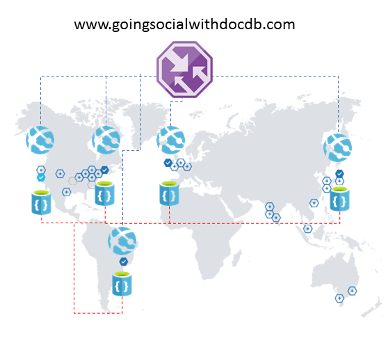

<properties
    pageTitle="DocumentDB 设计模式：社交媒体应用 | Azure"
    description="利用 DocumentDB 的存储灵活性和其他 Azure 服务了解社交网络的设计模式。"
    keywords="社交媒体应用"
    services="documentdb"
    author="ealsur"
    manager="jhubbard"
    editor=""
    documentationcenter=""
    redirect_url="http://azure.cn/documentation/articles/documentdb-use-cases"
    ROBOTS="NOINDEX, NOFOLLOW" />
<tags
    ms.assetid="2dbf83a7-512a-4993-bf1b-ea7d72e095d9"
    ms.service="documentdb"
    ms.workload="data-services"
    ms.tgt_pltfrm="na"
    ms.devlang="na"
    ms.topic="article"
    ms.date="05/10/2017"
    wacn.date="05/31/2017"
    ms.author="mimig"
    ms.translationtype="Human Translation"
    ms.sourcegitcommit="4a18b6116e37e365e2d4c4e2d144d7588310292e"
    ms.openlocfilehash="97051ff5024a1010358afcf43800fff575f4fb77"
    ms.contentlocale="zh-cn"
    ms.lasthandoff="05/19/2017" />

# 使用 DocumentDB 进行社交
生活在大规模互连的社会，这意味着有时候你也会成为 **社交网络**中的一部分。 我们使用社交网络与朋友、同事和家人保持联系，有时还会与有共同兴趣的人分享我们的激情。

作为工程师或开发人员，我们可能想知道这些网络如何存储数据以及如何将这些数据相互联系起来，甚至有可能被要求自行为特定的间隙市场创建或构建新的社交网络。 这时就会产生一个大问题：所有这些数据是如何存储的？

假设我们正在创建一个新型时尚的社交网络，用户可以在此网络中发布与媒体相关的文章，例如图片、视频，甚至音乐。 用户可以对帖子发表评论并打分以进行评级。 主网站登录页上将提供用户可见并可进行交互的帖子源。 这听起来似乎并不复杂（最初），但为简单起见，我们就止步于此（我们可以深入了解受这些关系影响的自定义用户源，但它超出了本文的目的）。

那么，我们如何存储此数据以及存储在何处？

你们当中许多人可能有使用 SQL 数据库的经验，或者至少对 [关系建模数据](https://en.wikipedia.org/wiki/Relational_model) 有所了解，那么你们可能会忍不住想要开始绘制类似以下图形：

 

非常标准且数据结构美观... 不可扩展。 

请不要误会我的意思，我的一生都在与 SQL 数据库打交道，它们的确很不错，但就像每一种模式、每一次实践以及每一个软件平台一样，并非对每一种方案都适用。

为什么在此方案中 SQL 不是最佳选择？ 让我们看一下单个 post 结构，如果想要在网站或应用程序中显示文章，可能不得不执行查询... 只加入 8 个表以显示单个 post。现在请想象一下：动态地上传一系列贴子并将其显示在屏幕上。你可能明白我的意思了。

当然，我们也可以使用一个功能足够强大的超大 SQL 实例来解决数以千计的查询，其中可以使用许多这些连接来为我们提供内容，但当已经有一个更简单的解决方案存在时，我们为什么还要选择这种呢？

## NoSQL 加载
有许多特殊图形数据库可以[在 Azure 上运行](http://neo4j.com/developer/guide-cloud-deployment/#_windows_azure)，但它们成本较高且需要 IaaS 服务（基础结构即服务，主要是虚拟机）和维护。 本文介绍的成本更低的解决方案适用于在 Azure 的 NoSQL 数据库 [DocumentDB](/home/features/documentdb/) 上运行的大多数方案。 使用 [NoSQL](https://zh.wikipedia.org/wiki/NoSQL) 方法以 JSON 格式存储数据并应用[非规范化](https://en.wikipedia.org/wiki/Denormalization)，就可以将我们以前的复杂帖子转换为单个[文档](https://en.wikipedia.org/wiki/Document-oriented_database)：

    {
        "id":"ew12-res2-234e-544f",
        "title":"post title",
        "date":"2016-01-01",
        "body":"this is an awesome post stored on NoSQL",
        "createdBy":User,
        "images":["http://myfirstimage.png","http://mysecondimage.png"],
        "videos":[
            {"url":"http://myfirstvideo.mp4", "title":"The first video"},
            {"url":"http://mysecondvideo.mp4", "title":"The second video"}
        ],
        "audios":[
            {"url":"http://myfirstaudio.mp3", "title":"The first audio"},
            {"url":"http://mysecondaudio.mp3", "title":"The second audio"}
        ]
    }

可以使用单个查询获得，且无需联接。 这种方法更简单且更直观，且在预算方面，它所需要的资源更少，但得到的结果更好。

Azure DocumentDB 可确保所有属性通过其自动索引功能进行索引，此功能甚至可以进行[自定义](/documentation/articles/documentdb-indexing-policies/)。 自由架构方法可以让我们存储具有不同和动态结构的文档，也许明天我们希望帖子上显示一系列类别或与其关联的哈希标记，我们不需要执行任何额外操作，DocumentDB 将自行使用添加的属性处理新文档。

可以将对帖子的评论视为具有父属性的其他帖子（这可以简化我们的对象映射）。 

    {
        "id":"1234-asd3-54ts-199a",
        "title":"Awesome post!",
        "date":"2016-01-02",
        "createdBy":User2,
        "parent":"ew12-res2-234e-544f"
    }

    {
        "id":"asd2-fee4-23gc-jh67",
        "title":"Ditto!",
        "date":"2016-01-03",
        "createdBy":User3,
        "parent":"ew12-res2-234e-544f"
    }

并且所有社交互动都可以作为计数器存储在单个对象上：

    {
        "id":"dfe3-thf5-232s-dse4",
        "post":"ew12-res2-234e-544f",
        "comments":2,
        "likes":10,
        "points":200
    }

创建源只不过是创建文档的问题，文档可按给定的相关顺序保留帖子 ID 列表：

    [
        {"relevance":9, "post":"ew12-res2-234e-544f"},
        {"relevance":8, "post":"fer7-mnb6-fgh9-2344"},
        {"relevance":7, "post":"w34r-qeg6-ref6-8565"}
    ]

我们可以有一个“最新”流（其中帖子按创建日期排序）和一个“最热门”流（其中包括在过去 24 小时内获得了更多赞的帖子），甚至还可以基于逻辑点赞粉丝和兴趣为每个用户实现客户流，且它仍然可以是一个帖子列表。 虽然如何生成这些列表还是一个问题，但读取性能仍然不受阻碍。 一旦我们获得其中一个列表之后，我们就可以使用 [IN 运算符](/documentation/articles/documentdb-sql-query/#WhereClause/) 向 DocumentDB 发出单个查询以一次性获取帖子的所有页面。

可以使用 [Azure 应用服务](/home/features/app-service/)的后台进程 - [Web 作业](/documentation/articles/web-sites-create-web-jobs/) - 来构建源流。 创建一个帖子后，可以通过使用 [Azure 存储](/home/features/storage/)、[队列](/documentation/articles/storage-dotnet-how-to-use-queues/)和 Web 作业（通过 [Azure Webjobs SDK](/documentation/articles/websites-dotnet-webjobs-sdk/) 触发）触发后台处理，从而根据我们自己的自定义逻辑实现流内的帖子传播。 

通过使用这种相同的技术创建最终一致性环境还可以以延迟方式处理评分和点赞。

至于关注者，则需要有更多的技巧来处理。 DocumentDB 具有文档大小上限，而且读取/写入大型文档会影响应用程序的可伸缩性。 因此，可考虑使用以下结构，以文档形式存储关注者：

    {
        "id":"234d-sd23-rrf2-552d",
        "followersOf": "dse4-qwe2-ert4-aad2",
        "followers":[
            "ewr5-232d-tyrg-iuo2",
            "qejh-2345-sdf1-ytg5",
            //...
            "uie0-4tyg-3456-rwjh"
        ]
    }

这对于拥有数千位关注者的用户可能有用，但如果有名人加入我们的排名，此方法会生成大型文档，并可能最终达到文档大小上限。

为了解决此问题，我们可以使用一种混合方法。 我们可以在用户统计信息文档中存储关注者人数：

    {
        "id":"234d-sd23-rrf2-552d",
        "user": "dse4-qwe2-ert4-aad2",
        "followers":55230,
        "totalPosts":452,
        "totalPoints":11342
    }

然后使用一个[扩展](https://github.com/richorama/AzureStorageExtensions#azuregraphstore)，将实际的关注者图形存储在 Azure 存储表中，以允许进行简单的“A 关注 B”存储和检索。 这样，我们就可以将确切的关注者列表的检索过程（当我们需要它时）委托给 Azure 存储表，但为了快速查找数字，我们仍继续使用 DocumentDB。

## “阶梯”模式和数据重复
你可能已注意到，在引用帖子的 JSON 文档中，某个用户出现了多次。 而且你猜得没错，这意味着如果应用此非规范化，则表示用户的这一信息可以显示在多个地方。

为了允许更快速地查询，我们引发了数据重复。 此负面影响的问题在于，如果通过一些操作，用户的数据发生更改，那么我们需要查找该用户曾经执行过的所有活动并对这些活动全部进行更新。 听上去不太实用，对不对？

图形数据库可以采用其自己的方式解决这一问题，而我们将通过识别用户的“密钥”属性解决该问题。对于每个活动，我们都会在应用程序中显示此属性。 如果我们在应用程序中直观显示一个帖子并仅显示创建者的姓名和照片，那么为什么还要在“createdBy”属性中存储用户的所有数据呢？ 如果对于每一条评论我们都只显示用户的照片，那么我们的确不需要关于该用户的其余信息。 在这里我称之为“阶梯模式”的模式将开始发挥作用。

我们以用户信息为例：

    {
        "id":"dse4-qwe2-ert4-aad2",
        "name":"John",
        "surname":"Doe",
        "address":"742 Evergreen Terrace",
        "birthday":"1983-05-07",
        "email":"john@doe.com",
        "twitterHandle":"@john",
        "username":"johndoe",
        "password":"some_encrypted_phrase",
        "totalPoints":100,
        "totalPosts":24
    }

通过查看此信息，我们可以快速检测出哪些是重要的信息，哪些不是，从而就会创建一个“阶梯”：

最简单的一步称为 UserChunk，这是标识用户的最小信息块并可用于数据重复。 通过减少重复数据的大小直到只留下我们将要“显示”的信息，可以降低大规模更新的可能性。

中间步骤被称为用户，这是将在 DocumentDB 上的大多数依赖性能查询上使用的完整数据，也是最常访问和最重要的数据。 它包括由 UserChunk 表示的信息。

最复杂的一步是扩展用户。 它包括所有重要的用户信息以及并不需要快速读取的其他数据，或者它的使用情况就是最终结果（就像登录过程一样）。 此数据可以存储在 DocumentDB 外、Azure SQL 数据库或 Azure 表存储中。

为什么我们要拆分用户，甚至将此信息存储在不同的位置？ 由于 DocumentDB 中的存储空间并不是无限大，并且从性能角度考虑，文档越大，查询成本将越高。 保持文档精简，包含用于对社交网络执行所有依赖性能的查询的适当信息，并为最终方案（例如完整的配置文件编辑、登录名，甚至使用情况分析和大数据方案的数据挖掘）存储其他额外信息。 我们实际上并不关心用于数据分析的数据收集速度是否减慢了，因为它是在 Azure SQL 数据库上运行的，然而我们确实很在意我们的用户是否具有快速和精简的用户体验。 在 DocumentDB 中存储的用户外观如下所示：

    {
        "id":"dse4-qwe2-ert4-aad2",
        "name":"John",
        "surname":"Doe",
        "username":"johndoe"
        "email":"john@doe.com",
        "twitterHandle":"@john"
    }

贴子内容如下所示：

    {
        "id":"1234-asd3-54ts-199a",
        "title":"Awesome post!",
        "date":"2016-01-02",
        "createdBy":{
            "id":"dse4-qwe2-ert4-aad2",
            "username":"johndoe"
        }
    }

在区块的其中一个属性受到影响的情况下进行编辑时，通过使用指向已编制索引的属性 (SELECT * FROM posts p WHERE p.createdBy.id == “edited_user_id”) 的查询，然后更新这些区块，可以很容易找的受影响的文档。

## 搜索框
幸运的是，用户将生成大量内容。 并且我们应能够提供搜索和查找可能在其内容流中不直接显示的内容的能力，也许是由于我们未关注创建者，或者也许是因为我们只是想要尽力找到 6 个月之前我们发布的旧帖子。

为什么会这么简单？

Azure 搜索可实现它们称之为 [索引器](https://msdn.microsoft.com/zh-cn/library/azure/dn946891.aspx)的内容，这是在数据存储库中挂钩的后台处理程序，可以自动添加、更新或删除索引中的对象。 它们支持 [Azure SQL 数据库索引器](https://blogs.msdn.microsoft.com/kaevans/2015/03/06/indexing-azure-sql-database-with-azure-search/)、Azure Blob 索引器和 Azure DocumentDB 索引器。 将信息从 DocumentDB 转换至 Azure 搜索比较简单，因为这两者都采用 JSON 格式存储数据，我们只需创建索引并映射我们想要编制索引的文档的属性即可，几分钟后（取决于数据的大小），便可通过云基础结构中最好的搜索即服务解决方案搜索所有内容。 

有关 Azure 搜索的详细信息，请访问 [Hitchhiker’s Guide to Search](https://blogs.msdn.microsoft.com/mvpawardprogram/2016/02/02/a-hitchhikers-guide-to-search/)（搜索漫游指南）。

## 基础知识
存储所有此内容（每天会不断增加）后，我们可能会思考这样一个问题：我可以使用所有来自用户的此信息流做些什么？

答案非常简单：将其投入使用并从中进行学习。

但我们可以学到什么呢？ 一些简单的示例包括 [观点分析](https://en.wikipedia.org/wiki/Sentiment_analysis)、基于用户首选项的内容建议，甚至自动执行的内容审查方，内容审查方可确保通过社交网络发布的所有内容对该系列均安全。

由于想要深入了解，你可能会认为自己需要更多数学科学方面的知识才能提取出简单数据库和文件之外的这些模式和信息，其实不然。

[Cortana Intelligence 套件](https://www.microsoft.com/en/server-cloud/cortana-analytics-suite/overview.aspx)的一部分，是一个全面托管的云服务，使你可以在简单的拖放界面中使用算法创建工作流、为 [R](https://zh.wikipedia.org/wiki/R_\(programming_language\)) 中自己的算法进行编码，或使用部分已生成的或现成的 API（如[文本分析](https://gallery.cortanaanalytics.com/MachineLearningAPI/Text-Analytics-2)、[内容审查器](https://www.microsoft.com/moderator)或[建议](https://gallery.cortanaanalytics.com/MachineLearningAPI/Recommendations-2)）。

另一个可用的选项是使用 [Microsoft 认知服务](https://www.microsoft.com/cognitive-services) 分析用户内容：不仅可以更好地理解它们（通过分析使用 [文本分析 API](https://www.microsoft.com/cognitive-services/en-us/text-analytics-api)编写的内容），而且还可以检测不需要或不成熟的内容，然后使用[计算机构想 API](https://www.microsoft.com/cognitive-services/en-us/computer-vision-api)解决相关问题。 认知服务包括大量不需要使用任何一种机器学习知识的现成的可用解决方案。

## 全球范围内的社交体验
最后，还必须说明一个非常重要的主题：**可伸缩性**。 在设计体系结构时，因为需要处理更多的数据和/或希望拥有更大的地理覆盖范围，所以每个组件的自行可伸缩性至关重要。 幸运的是，通过使用 DocumentDB 完成此类复杂任务是一种**统包体验**。

DocumentDB 根据给定的**分区键**（定义为文档中的一个属性）自动创建分区，从而支持现成可用的[动态分区](https://azure.microsoft.com/zh-cn/blog/10-things-to-know-about-documentdb-partitioned-collections/)。 必须在设计时定义正确的分区键，并记住可用的[最佳做法](/documentation/articles/documentdb-partition-data/#designing-for-partitioning/)；对于社交体验，分区策略必须与查询（需要在同一分区内进行读取）和写入（通过在多个分区上分散写入来避免“热点”）方式保持一致。 一些相关选项是：基于临时键（日/月/周）的分区，按内容类别、地理区域和用户进行划分；这一切都取决于查询数据并将其显示在社交体验中的方式。 

值得一提的有趣的一点是，DocumentDB 将以透明方式在所有分区中运行查询（包括[聚合](https://azure.microsoft.com/zh-cn/blog/planet-scale-aggregates-with-azure-documentdb/)），无需在数据增长过程中添加任何逻辑。

一段时间后，最终流量会增加，资源消耗（通过 [RU](/documentation/articles/documentdb-request-units/) 即“请求单位”进行度量）也会增加。 随着用户群的增长，读取和写入操作会更加频繁，用户将开始创建和读取更多内容；**缩放吞吐量**的能力至关重要。 增加 RU 非常容易，可以通过在 Azure 门户中单击几次或[通过 API 发出命令](https://docs.microsoft.com/zh-cn/rest/api/documentdb/replace-an-offer)来实现。

如果平台的发展越来越好，来自其他国家/地区或洲的用户注意到你的平台并开始使用它，这是一件多么让人惊喜的事！

但是你很快会意识到他们在平台的体验并不理想；他们与运营区域相距太远，延迟问题非常严重，你显然不希望他们因此退出平台。 如果有一种简单的方法可以**扩展全球覆盖范围**就好了······确实有！

通过 DocumentDB，只需单击数次即可通过透明方式全局复制数据。 这也意味着可以拥有[多个故障转移区域](/documentation/articles/documentdb-regional-failovers/)。 

全局复制数据时，需确保客户端可以利用该数据。 如果要使用 Web 前端或从移动客户端访问 API，则可以部署 [Azure 流量管理器](/home/features/traffic-manager/)并在所有所需区域克隆 Azure 应用服务（方法是通过使用[性能配置](/documentation/articles/web-sites-traffic-manager/)支持扩展的全球覆盖范围）。 客户端访问前端或 API 时，将被路由到最近的应用服务，而该应用服务将连接到本地的 DocumentDB 副本。

## 结束语
本文尝试说明一种完全在 Azure 上创建具有低成本服务社交网络，并可通过鼓励使用多层存储解决方案和称为“阶梯”的数据分布得到良好结果的替代方法。

事实上，对于此类方案并没有万能方法，而需结合各种卓越的服务共同创建，才能提供绝佳的体验：DocumentDB 的速度和自由性，可用于提供绝佳的社交应用程序；一流搜索解决方案后的智能操作，如 Azure 搜索；Azure 应用服务的灵活性，不仅可以托管与语言无关的应用程序，甚至还可以托管功能强大的后台进程；Azure 存储和 Azure SQL 数据库的可扩展性，可用于存储大量数据；Azure 机器学习的分析功能，可创建能够为我们的进程提供反馈，并且有助于我们向合适的用户提供合适的内容的知识和智能。

## 后续步骤
若要详细了解 DocumentDB 用例，请参阅[常见 DocumentDB 用例](/documentation/articles/documentdb-use-cases/)。

<!---Update_Description: wording update -->