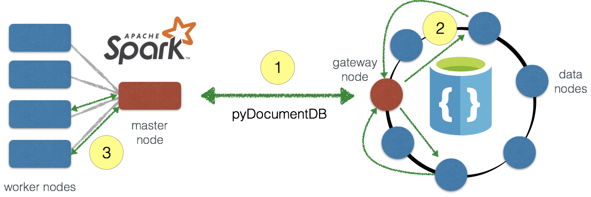
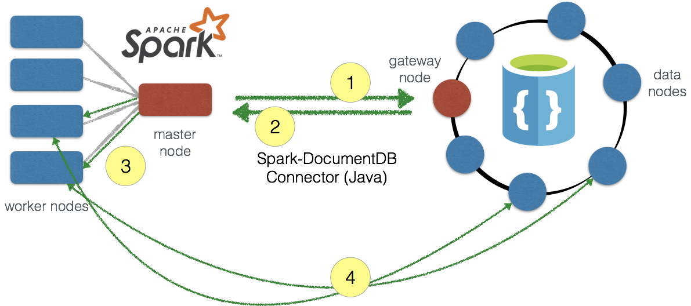
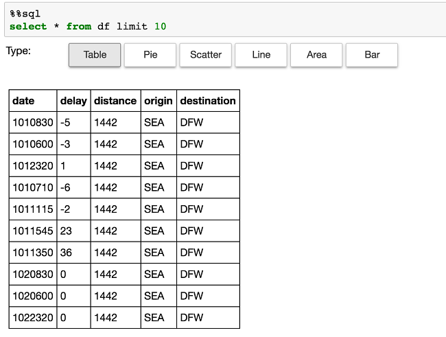
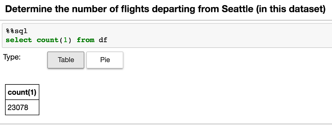
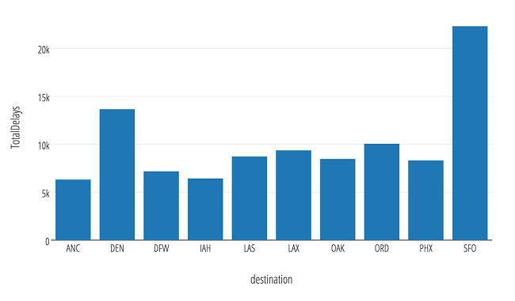
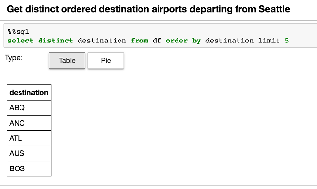
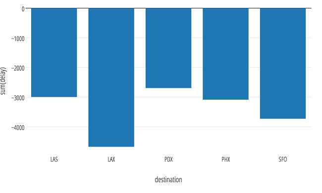
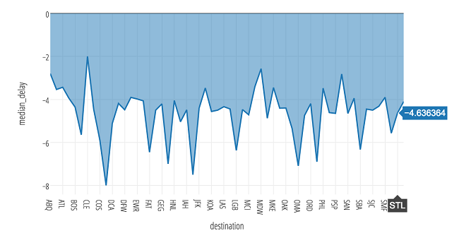

<properties
    pageTitle="将 Apache Spark 连接到 Azure DocumentDB | Azure"
    description="使用本教程来了解 Azure DocumentDB Spark 连接器：使用该连接器可将 Apache Spark 连接到 Azure DocumentDB，以便在针对云设计的 Microsoft 多租户全局分布式的数据库系统中执行分布式聚合和数据科学。"
    keywords="apache spark"
    services="documentdb"
    documentationcenter=""
    author="dennyglee"
    manager="jhubbard"
    editor=""
    translationtype="Human Translation" />
<tags
    ms.assetid="c4f46007-2606-4273-ab16-29d0e15c0736"
    ms.service="documentdb"
    ms.workload="data-services"
    ms.tgt_pltfrm="na"
    ms.devlang="na"
    ms.topic="article"
    ms.date="04/03/2017"
    wacn.date="05/08/2017"
    ms.author="denlee"
    ms.sourcegitcommit="2c4ee90387d280f15b2f2ed656f7d4862ad80901"
    ms.openlocfilehash="1599fdd300104f45a3f7923e24f1892b10bce813"
    ms.lasthandoff="04/28/2017" />

# 使用 Spark 到 DocumentDB 的连接器加速实时大数据分析

Spark 到 DocumentDB 的连接器能使 Azure DocumentDB 充当 Apache Spark 作业的输入源或输出接收器。 将 [Spark](http://spark.apache.org/) 连接到 [DocumentDB](/home/features/documentdb/) 后，可以更快地解决瞬息万变的数据科学问题，使用 DocumentDB 快速保存和查询数据。 Spark 到 DocumentDB 的连接器有效利用本机 DocumentDB 托管的索引，可在针对 IoT、数据科学和分析方案等各种快速变化的全局分布式数据执行分析、下推谓词筛选时启用可更新的列。 

## 下载

首先，请从 GitHub 上的 [azure-documentdb-spark](https://github.com/Azure/azure-documentdb-spark/) 存储库下载 Spark 到 DocumentDB 的连接器（预览版）。

## 连接器组件

连接器利用以下组件：

- [DocumentDB](http://documentdb.com)：专门为云设计的 Microsoft 多租户[全局分布式数据库系统](/documentation/articles/documentdb-distribute-data-globally/)。 使用 DocumentDB，客户可跨数目不限的地理区域弹性缩放吞吐量与存储。 该服务向开发员提供 99% 的低延迟、99.99% 的高可用性保证，以及[多个完善定义的一致性模型](/documentation/articles/documentdb-consistency-levels/)。

- [Apache Spark](http://spark.apache.org/)：专为速度、易用性和复杂分析打造的强大开源处理引擎。 

- [Azure HDInsight 上的 Apache Spark](/documentation/articles/hdinsight-apache-spark-jupyter-spark-sql/) 可以使用 Azure HDInsight 在云中为任务关键型部署方案部署 Apache Spark。

官方支持的版本：

| 组件 | 版本 |
|---------|-------|
|Apache Spark|2.0+|
| Scala| 2.11|
| Azure DocumentDB Java SDK | 1.9.6 |
 
本文将帮助你使用 Python（通过 pyDocumentDB）和 scala 接口运行一些简单的示例。

可使用两种方法连接 Apache Spark 和 Azure DocumentDB：

- 通过 [Azure DocumentDB Python SDK](https://github.com/Azure/azure-documentdb-python) 使用 pyDocumentDB。
- 利用 [Azure DocumentDB Java SDK](https://github.com/Azure/azure-documentdb-java) 创建基于 Java 的 Spark 到 DocumentDB 的连接器。

## pyDocumentDB 实现 
使用最新的 [pyDocumentDB SDK](https://github.com/Azure/azure-documentdb-python) 可将 Spark 连接到 DocumentDB，如下图所示：

### pyDocumentDB 实现的数据流

数据流如下所示：

1. 通过 pyDocumentDB 建立从 Spark 主节点到 DocumentDB 网关节点的连接。  请注意，用户只需指定 Spark 和 DocumentDB 连接，连接到相应主节点和网关节点的过程对用户是透明的。
2. 针对 DocumentDB 执行查询（通过网关节点），然后，查询针对数据节点中的集合分区运行查询。 这些查询的响应将发回到网关节点，结果集将返回到 Spark 主节点。
3. 所有后续查询（例如，针对 Spark 数据框架执行的查询）将发送到 Spark 工作节点进行处理。

要点在于，Spark 与 DocumentDB 之间的通信仅限于 Spark 主节点和 DocumentDB 网关节点。  查询的速度与这两个节点之间的传输层速度相同。

### 安装 pyDocumentDB
可以使用 **pip** 在驱动程序节点上安装 pyDocumentDB，例如：

    pip install pyDocumentDB

### 通过 pyDocumentDB 将 Spark 连接到 DocumentDB 
由于通信传输的简单性，使用 pyDocumentDB 执行从 Spark 到 DocumentDB 的查询相对简单。

以下代码片段演示如何在 Spark 上下文中使用 pyDocumentDB。

    # Import Necessary Libraries
    import pydocumentdb
    from pydocumentdb import document_client
    from pydocumentdb import documents
    import datetime

    # Configuring the connection policy (allowing for endpoint discovery)
    connectionPolicy = documents.ConnectionPolicy()
    connectionPolicy.EnableEndpointDiscovery 
    connectionPolicy.PreferredLocations = ["China North", "China East", "Southeast Asia", "Western Europe","Canada Central"]

    # Set keys to connect to DocumentDB 
    masterKey = 'le1n99i1w5l7uvokJs3RT5ZAH8dc3ql7lx2CG0h0kK4lVWPkQnwpRLyAN0nwS1z4Cyd1lJgvGUfMWR3v8vkXKA==' 
    host = 'https://doctorwho.documents.azure.cn:443/'
    client = document_client.DocumentClient(host, {'masterKey': masterKey}, connectionPolicy)

代码片段指明：

- DocumentDB Python SDK 包含所有所需的连接参数，包括首选位置（即，按哪种优先顺序选择哪个读取副本）。
-  导入所需的库，并配置 **masterKey** 和**主机**来创建 DocumentDB *客户端* (**pydocumentdb.document_client**)。

### 通过 pyDocumentDB 执行 Spark 查询
以下示例使用前面代码片段中通过指定的只读密钥创建的 DocumentDB 实例。  以下代码片段连接到 **airports.codes** 集合（前面指定的 DoctorWho 帐户），并运行一个查询来提取华盛顿州的机场城市信息。 

    # Configure Database and Collections
    databaseId = 'airports'
    collectionId = 'codes'

    # Configurations the DocumentDB client will use to connect to the database and collection
    dbLink = 'dbs/' + databaseId
    collLink = dbLink + '/colls/' + collectionId

    # Set query parameter
    querystr = "SELECT c.City FROM c WHERE c.State='WA'"

    # Query documents
    query = client.QueryDocuments(collLink, querystr, options=None, partition_key=None)

    # Query for partitioned collections
    # query = client.QueryDocuments(collLink, query, options= { 'enableCrossPartitionQuery': True }, partition_key=None)

    # Push into list `elements`
    elements = list(query)

通过 **query** 执行查询后，将返回已转换为 Python 列表的 **query_iterable.QueryIterable** 结果。 可以使用以下代码轻松将 Python 列表转换为 Spark 数据框架：

    # Create `df` Spark DataFrame from `elements` Python list
    df = spark.createDataFrame(elements)

### 为何使用 pyDocumentDB 将 Spark 连接到 DocumentDB？
在以下场合下，通常使用 pyDocumentDB 将 Spark 连接到 DocumentDB：

- 要使用 python。
- 要将 DocumentDB 中相对较小的结果集返回到 Spark。  请注意，DocumentDB 中的基础数据集可能很大。 这比针对 DocumentDB 源应用筛选器（运行谓词筛选器）时要大。  

## Spark 到 DocumentDB 的连接器

Spark 到 DocumentDB 的连接器利用 [Azure DocumentDB Java SDK](https://github.com/Azure/azure-documentdb-java)，并在 Spark 工作节点与 DocumentDB 之间移动数据，如下图所示：

数据流如下所示：

1. 建立从 Spark 主节点到 DocumentDB 网关节点的连接，以获取分区映射。  请注意，用户只需指定 Spark 和 DocumentDB 连接，连接到相应主节点和网关节点的过程对用户是透明的。
2. 此信息将返回给 Spark 主节点。  此时，你应该能够分析查询，确定需要访问 DocumentDB 中的哪些分区（及其位置）。
3. 此信息将传送到 Spark 工作节点 ...
4. 从而允许 Spark 工作节点直接连接到 DocumentDB 分区以提取所需的数据，并将数据传送回到 Spark 工作节点中的 Spark 分区。

要点在于，Spark 与 DocumentDB 之间的通信速度会大幅提高，因为数据移动在 Spark 工作节点与 DocumentDB 数据节点（分区）之间发生。

### 构建 Spark 到 DocumentDB 的连接器
目前，连接器项目使用 maven。 若要构建不带依赖项的连接器，可以运行：

    mvn clean package

也可以在 *releases* 文件夹中下载最新版本的 jar。

### 包含 Azure DocumentDB Spark JAR
在执行任何代码之前，首先需要包含 Azure DocumentDB Spark JAR。  如果使用 **spark-shell**，则可以使用 **-jar** 选项包含 JAR。  

    spark-shell --master $master --jars /$location/azure-documentdb-spark-0.0.1-jar-with-dependencies.jar

如果想要执行不带依赖项的 jar：

    spark-shell --master $master --jars /$location/azure-documentdb-spark-0.0.1.jar,/$location/azure-documentdb-1.9.6.jar

如果你正在使用笔记本服务（例如 Azure HDInsight Jupyter 笔记本服务），可以使用 **spark magic** 命令：

    %%configure
    { "jars": ["wasb:///example/jars/azure-documentdb-1.9.6.jar","wasb:///example/jars/azure-documentdb-spark-0.0.1.jar"],
      "conf": {
        "spark.jars.excludes": "org.scala-lang:scala-reflect"
       }
    }

使用 **jars** 命令可以包含 **azure-documentdb-spark** 所需的两个 jar（该 jar 本身以及 Azure DocumentDB Java SDK）并排除 **scala-reflect**，使其不会干扰所执行的 Livy 调用（Jupyter 笔记本 > Livy > Spark）。

### 使用连接器将 Spark 连接到 DocumentDB
尽管通信传输有点复杂，但使用连接器执行从 Spark 到 DocumentDB 的查询要快得多。

以下代码片段演示如何在 Spark 上下文中使用连接器。

    // Import Necessary Libraries
    import org.joda.time._
    import org.joda.time.format._
    import com.microsoft.azure.documentdb.spark.schema._
    import com.microsoft.azure.documentdb.spark._
    import com.microsoft.azure.documentdb.spark.config.Config

    // Configure connection to your collection
    val readConfig2 = Config(Map("Endpoint" -> "https://doctorwho.documents.azure.cn:443/",
    "Masterkey" -> "le1n99i1w5l7uvokJs3RT5ZAH8dc3ql7lx2CG0h0kK4lVWPkQnwpRLyAN0nwS1z4Cyd1lJgvGUfMWR3v8vkXKA==",
    "Database" -> "DepartureDelays",
    "preferredRegions" -> "China North;China East;",
    "Collection" -> "flights_pcoll", 
    "SamplingRatio" -> "1.0"))
 
    // Create collection connection 
    val coll = spark.sqlContext.read.DocumentDB(readConfig2)
    coll.createOrReplaceTempView("c")

代码片段指明：

- **azure-documentdb-spark** 包含所有所需的连接参数，包括首选位置（例如，按哪种优先顺序选择哪个读取副本）。
- 只需导入所需的库，并配置 masterKey 和主机来创建 DocumentDB 客户端。

### 通过连接器执行 Spark 查询

以下示例使用前面代码片段中通过指定的只读密钥创建的 DocumentDB 实例。 以下代码片段连接到 DepartureDelays.flights_pcoll 集合（前面指定的 DoctorWho 帐户），并运行一个查询来提取从西雅图出发的航班的航班延迟信息。

    // Queries
    var query = "SELECT c.date, c.delay, c.distance, c.origin, c.destination FROM c WHERE c.origin = 'SEA'"
    val df = spark.sql(query)

    // Run DF query (count)
    df.count()

    // Run DF query (show)
    df.show()

### 为何使用 Spark 到 DocumentDB 的连接器实现？

在以下场合下，通常使用连接器将 Spark 连接到 DocumentDB：

- 要使用 Scala（并将其更新为包含[问题 3：添加 Python 包装和示例](https://github.com/Azure/azure-documentdb-spark/issues/3)中所述的 Python 包装）。
- 要在 Apache Spark 与 DocumentDB 之间传输大量的数据。

若要大致了解查询性能的差异，请参阅[查询测试运行 wiki 文章](https://github.com/Azure/azure-documentdb-spark/wiki/Query-Test-Runs)。

## 分布式聚合示例
本部分举例说明如何结合使用 Apache Spark 和 Azure DocumentDB 来执行分布式聚合与分析。  请注意，根据 [Planet scale aggregates with Azure DocumentDB](https://azure.microsoft.com/zh-cn/blog/planet-scale-aggregates-with-azure-documentdb/)（使用 Azure DocumentDB 实现全球级聚合）博客文章中所述，Azure DocumentDB 已能支持聚合，下面介绍了如何将它与 Apache Spark 配合使用，以进一步发挥它的优势。

请注意，这些聚合与 [Spark 到 DocumentDB 的连接器笔记本](https://github.com/Azure/azure-documentdb-spark/blob/master/samples/notebooks/Spark-to-DocumentDB_Connector.ipynb)相关。

### 连接到航班示例数据
在这些聚合示例中，我们要访问 **DoctorWho** DocumentDB 数据库中存储的一些航班绩效数据。  若要连接到这些数据，需要利用以下代码片段：

    // Import Spark to DocumentDB connector
    import com.microsoft.azure.documentdb.spark.schema._
    import com.microsoft.azure.documentdb.spark._
    import com.microsoft.azure.documentdb.spark.config.Config

    // Connect to DocumentDB Database
    val readConfig2 = Config(Map("Endpoint" -> "https://doctorwho.documents.azure.cn:443/",
    "Masterkey" -> "le1n99i1w5l7uvokJs3RT5ZAH8dc3ql7lx2CG0h0kK4lVWPkQnwpRLyAN0nwS1z4Cyd1lJgvGUfMWR3v8vkXKA==",
    "Database" -> "DepartureDelays",
    "preferredRegions" -> "China North;China East;",
    "Collection" -> "flights_pcoll", 
    "SamplingRatio" -> "1.0"))

    // Create collection connection 
    val coll = spark.sqlContext.read.DocumentDB(readConfig2)
    coll.createOrReplaceTempView("c")

我们还要使用此代码片段运行一个基本查询，以便将 DocumentDB 中所需的筛选数据集传输到 Spark（后者可以执行分布式聚合）。  在本例中，我们要查询从西雅图 (SEA) 出发的航班。

    // Run, get row count, and time query
    val originSEA = spark.sql("SELECT c.date, c.delay, c.distance, c.origin, c.destination FROM c WHERE c.origin = 'SEA'")
    originSEA.createOrReplaceTempView("originSEA")

从 Jupyter 笔记本服务运行查询后，生成了以下结果。  请注意，所有代码片段都是泛用性的，并不特定于任一服务。

### 运行 LIMIT 和 COUNT 查询
就像我们在 SQL/Spark SQL 中经常所做的那样，让我们从 **LIMIT** 查询开始：

下一个查询是简单快速的 **COUNT** 查询：

### GROUP BY 查询
接下来，我们可以针对 DocumentDB 数据库轻松运行 **GROUP BY** 查询：

    select destination, sum(delay) as TotalDelays 
    from originSEA 
    group by destination 
    order by sum(delay) desc limit 10

### DISTINCT, ORDER BY 查询
下面是 **DISTINCT, ORDER BY** 查询：

### 继续分析航班数据
可以使用以下示例查询继续分析航班数据：

#### 从西雅图出发的航班延迟次数最多的 5 个目的地（城市）

    select destination, sum(delay) 
    from originSEA
    where delay < 0 
    group by destination 
    order by sum(delay) limit 5

#### 根据从西雅图出发的航班的目的地城市计算平均延迟时间

    select destination, percentile_approx(delay, 0.5) as median_delay 
    from originSEA
    where delay < 0 
    group by destination 
    order by percentile_approx(delay, 0.5)

## 后续步骤

从 [azure-documentdb-spark](https://github.com/Azure/azure-documentdb-spark) GitHub 存储库下载 Spark 到 DocumentDB 的连接器（如果尚未下载），并浏览该存储库中的其他资源：

- [分布式聚合示例](https://github.com/Azure/azure-documentdb-spark/wiki/Aggregations-Examples)
- [示例脚本和笔记本](https://github.com/Azure/azure-documentdb-spark/tree/master/samples)

此外，还可以查看文章 [Apache Spark SQL、数据框架和数据集指南](http://spark.apache.org/docs/latest/sql-programming-guide.html)以及 [Azure HDInsight 上的 Apache Spark](/documentation/articles/hdinsight-apache-spark-jupyter-spark-sql/)。

