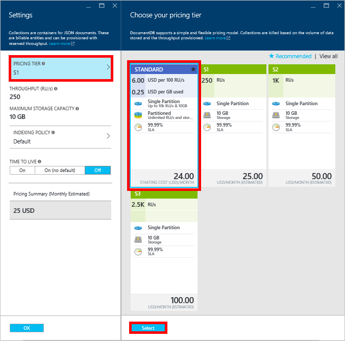
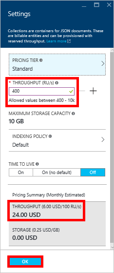

<properties 
	pageTitle="提升你的 DocumentDB S1 帐户 | Azure" 
	description="通过在 Azure 门户预览中进行一些简单的更改，利用 DocumentDB S1 帐户中增加的吞吐量。" 
	services="documentdb" 
	authors="mimig1" 
	manager="jhubbard" 
	editor="monicar" 
	documentationCenter=""/>

<tags 
	ms.service="documentdb" 
	ms.workload="data-services" 
	ms.tgt_pltfrm="na" 
	ms.devlang="na" 
	ms.topic="article" 
	ms.date="08/25/2016" 
	ms.author="mimig"
   	wacn.date="02/06/2017"/>  

# 提升你的 DocumentDB 帐户

请按照以下步骤利用你的 Azure DocumentDB S1 帐户已增加的吞吐量。几乎不需要额外的费用，就可以将现有 S1 帐户的吞吐量从 250 [RU/秒](/documentation/articles/documentdb-request-units/) 增加到 400 RU/秒，甚至更多！

## 在 Azure 门户预览中更改为用户定义的性能

1. 在浏览器中导航至 [**Azure 门户预览**](https://portal.azure.cn)。
2. 单击“浏览”->“DocumentDB (NoSQL)”，然后选择要修改的 DocumentDB 帐户。
3. 在“数据库”可重用功能区中，选择要修改的数据库，然后在“数据库”边栏选项卡中选择具有 S1 定价层的集合。

        

4. 在“集合”边栏选项卡中，依次单击“更多”、“设置”。
5. 在“设置”边栏选项卡上单击“定价层”，请注意，此时将显示每个计划的月成本估计值。在“选择定价层”边栏选项卡中，单击“标准”，然后单击“选择”保存更改。

        

6. 返回到“设置”边栏选项卡中，“定价层”已更改为“标准”，“吞吐量(RU/s)”框显示默认值 400。单击“确定”保存更改。

    > [AZURE.NOTE] 可以在 400 和 10,000 [请求单位](/documentation/articles/documentdb-request-units/)/秒 (RU/s) 之间设置吞吐量。页面底部的“定价摘要”将自动更新以提供月成本估计值。
    
	  

8. 返回到“数据库”边栏选项卡，可以核实该集合增加的吞吐量。

	  

有关对用户定义和预定义的吞吐量的更改的详细信息，请参阅博客文章 [DocumentDB: Everything you need to know about using the new pricing options](https://azure.microsoft.com/blog/documentdb-use-the-new-pricing-options-on-your-existing-collections/)（DocumentDB：关于使用新的定价选项所需要了解的一切）。

## 后续步骤

如果你确定需要更多吞吐量（大于 10,000 RU/s）或更多存储（大于 10GB），可以创建分区集合。若要创建分区集合，请参阅[创建集合](/documentation/articles/documentdb-create-collection/)。

<!---HONumber=Mooncake_Quality_Review_0125_2017-->
