<properties
	pageTitle="DocumentDB 文档资源管理器（用于查看 JSON）| Azure"
	description="DocumentDB 文档资源管理器是一个 Azure 门户预览工具，使用 NoSQL 文档数据库 DocumentDB 查看 JSON、编辑、创建和上传 JSON 文档。"
    keywords="查看 JSON"
	services="documentdb"
	authors="AndrewHoh"
	manager="jhubbard"
	editor="monicar"
	documentationCenter=""/>

<tags
	ms.service="documentdb"
	ms.date="03/30/2016"
	wacn.date="07/04/2016"/>

# 使用 DocumentDB 文档资源管理器查看、编辑、创建和上传 JSON 文档

本文概述了 [Azure DocumentDB](/documentation/services/documentdb/) 文档资源管理器，这是一个 Azure 门户预览工具，它使用 DocumentDB 查看、编辑、创建、上传和筛选 JSON 文档。

## 启动文档资源管理器

1. 在 Azure 门户预览的跳转栏中，单击“DocumentDB 帐户”。如果“DocumentDB 帐户”不可见，请单击“浏览”，再单击“DocumentDB 帐户”。

2. 在“DocumentDB 帐户”边栏选项卡的顶部，单击“文档资源管理器”。
 
	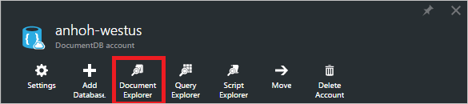

 	>[AZURE.NOTE] 查询资源管理器还会显示在数据库和集合边栏选项卡中。

    在“文档资源管理器”边栏选项卡上，将根据在其中启动文档资源管理器的上下文对“数据库”和“集合”下拉列表进行预填充。

	

## 创建文档

1. [启动文档资源管理器](#launch-document-explorer)。

2. 在“文档资源管理器”边栏选项卡上，单击“创建文档”。

    将在“文档”边栏选项卡上显示最小 JSON 代码段。

	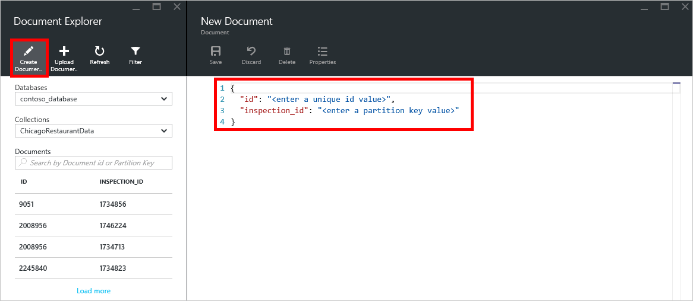

2. 在“文档”边栏选项卡中，键入或粘贴你要创建的 JSON 文档的内容，然后单击“保存”以便将文档提交到在“文档资源管理器”边栏选项卡中指定的数据库和集合。

	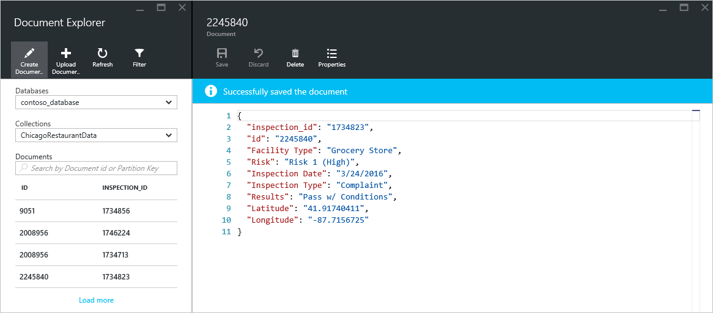

	> [AZURE.NOTE] 如果你不提供“id”属性，文档资源管理器将自动添加 id 属性并生成一个 GUID 作为 id 值。

    如果已有来自 JSON 文件、MongoDB、SQL Server、CSV 文件、Azure 表存储、Amazon DynamoDB、HBase 或其他 DocumentDB 集合的数据，你可以使用 DocumentDB 的[数据迁移工具](/documentation/articles/documentdb-import-data/)快速导入数据。

## 编辑文档

1. [启动文档资源管理器](#launch-document-explorer)。

2. 若要编辑现有文档，请在“文档资源管理器”边栏选项卡中选中该文档，在“文档”边栏选项卡中编辑该文档，然后单击“保存”。

    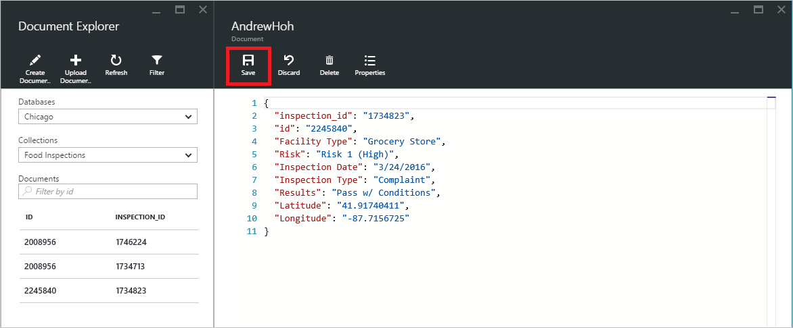

    如果你在编辑某个文档时想放弃当前的一组编辑，单击“文档”边栏选项卡中的“放弃”并确认放弃操作即可，将重新加载文档的先前状态。

    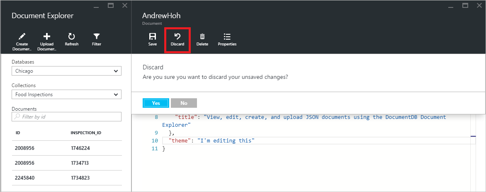

## 删除文档

1. [启动文档资源管理器](#launch-document-explorer)。

2. 在“文档资源管理器”选择文档，单击“删除”，然后确认删除。确认后，将立即从“文档资源管理器”列表中删除该文档。

	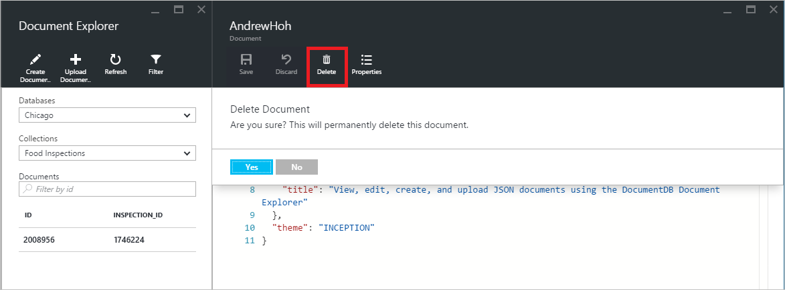

## 使用 JSON 文档

文档资源管理器可验证任何新建或编辑的文档是否包含有效的 JSON。你甚至可以查看 JSON 错误，方法是将鼠标悬停在错误部分以获取有关验证错误的详细信息。

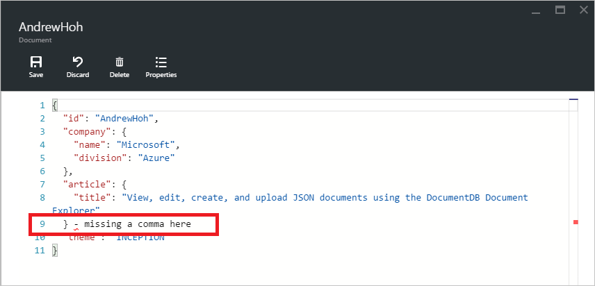

此外，文档资源管理器还可以防止你使用无效的 JSON 内容保存文档。

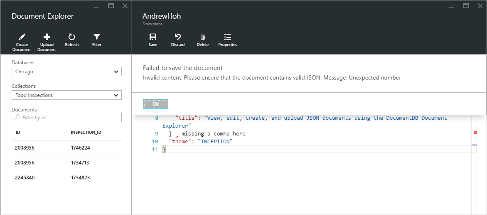

最后，文档资源管理器还允许你通过单击“属性”命令来轻松查看当前所加载文档的系统属性。

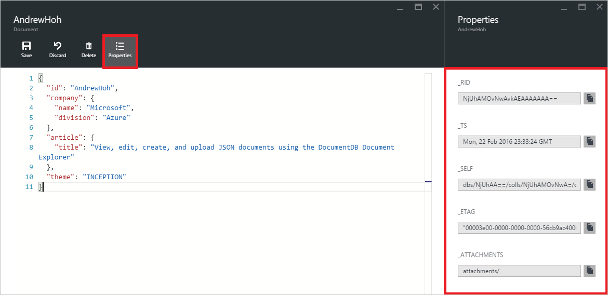

> [AZURE.NOTE] 时间戳 (\_ts) 属性在内部表示为新纪元时间，但文档资源管理器以方便阅读的 GMT 格式显示该值。

## 筛选文档
文档资源管理器还支持多种导航选项和高级设置。

默认情况下，文档资源管理器将加载所选集合中最多前 100 个文档（按文档创建日期从最早到最晚排列）。可通过选择“文档资源管理器”边栏选项卡底部的“加载更多”选项加载其他文档（每批加载 100 个文档）。可通过“筛选”命令选择要加载的具体文档。

1. [启动文档资源管理器](#launch-document-explorer)。

2. 在“文档资源管理器”边栏选项卡的顶部，单击“筛选”。

    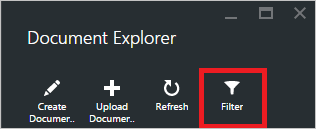
  
3.  将在命令栏的下方显示筛选设置。在筛选设置中，提供 WHERE 子句和/或 ORDER BY 子句，然后单击“筛选”。

	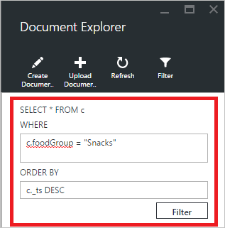

	文档资源管理器将自动刷新与筛选查询匹配的文档结果。阅读关于 [SQL 查询和 SQL 语法](/documentation/articles/documentdb-sql-query/)一文中的 DocumentDB SQL 语法信息或打印 [SQL 查询备忘单](/documentation/articles/documentdb-sql-query-cheat-sheet/)的副本。

    可使用“数据库”和“集合”下拉列表框轻松更改当前查看其中文档的集合，而无需关闭并重新启动文档资源管理器。

    文档资源管理器还支持按文档的 id 属性筛选当前加载的一组文档。只需在文档筛选器中的 id 框中键入即可。

	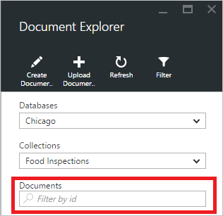

	系统将根据你提供的条件筛选文档资源管理器列表中的结果。

	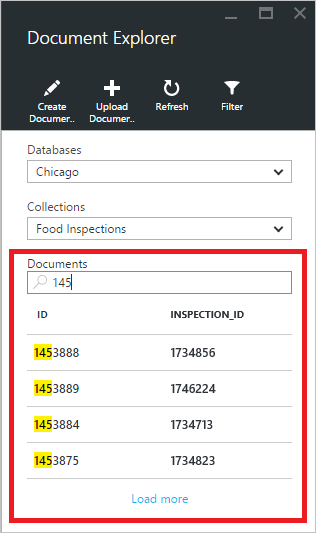

	> [AZURE.IMPORTANT] 文档资源管理器的筛选器功能仅从**当前**加载的文档集中进行筛选，而并不对当前所选集合执行查询。

4. 若要刷新由文档资源管理器加载的文档列表，请单击边栏选项卡顶部的“刷新”。

	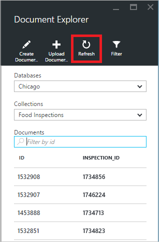

## 批量添加文档

文档资源管理器支持批量引入一个或多个现有 JSON 文档，每个上传操作最多上传 100 个 JSON 文件。

1. [启动文档资源管理器](#launch-document-explorer)。

2. 若要开始上传过程，请单击“上传文档”。

	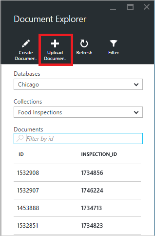

    将打开“上传文档”边栏选项卡。

2. 单击浏览按钮以打开文件资源管理器窗口，选择要上传的一个或多个 JSON 文档，然后单击“打开”。

	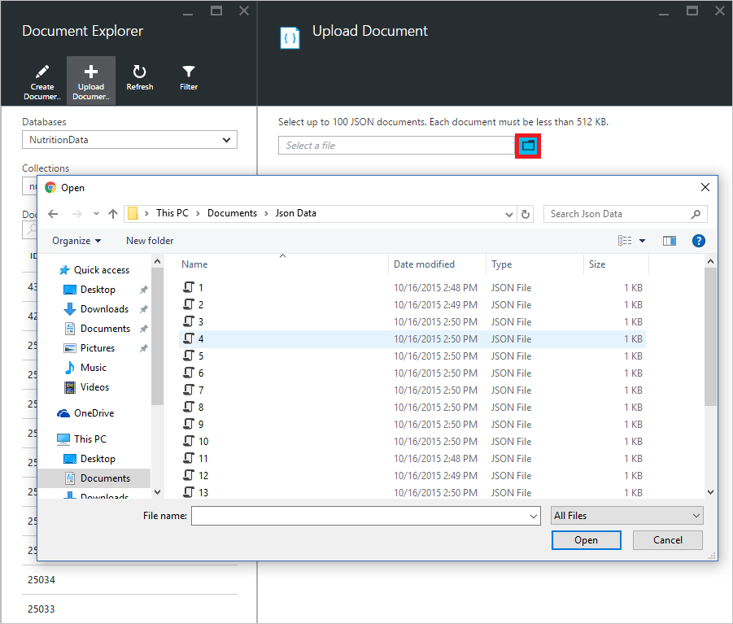

	> [AZURE.NOTE] 文档资源管理器当前仅支持每个单独上传操作最多上传 100 个 JSON 文档。

3. 选好之后，单击“上传”按钮。这些文档将自动添加到“文档资源管理器”网格，上传结果显示为操作进度。导入失败将报告为单独的文件。

	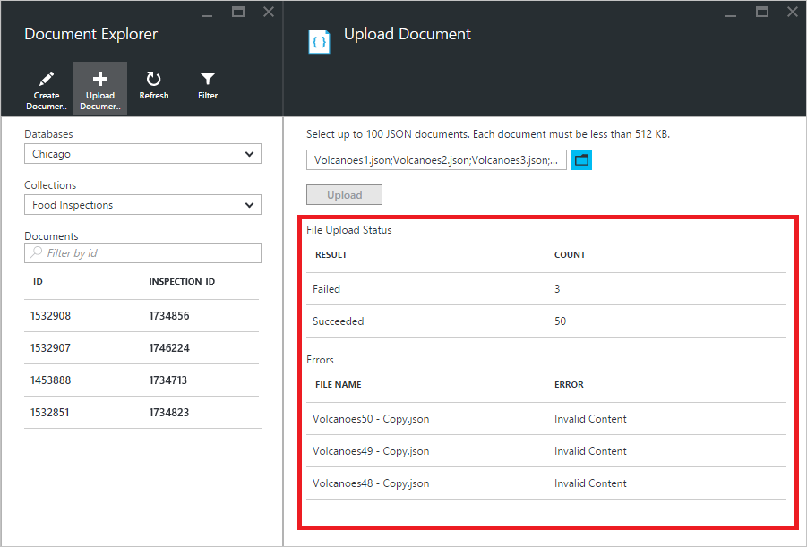

4. 操作完成后，你可以选择另外最多 100 个文档进行上传。

## 在门户预览外使用 JSON 文档

Azure 门户预览中的文档资源管理器只是在 DocumentDB 中使用文档的一种方法。你还可以通过 [REST API](https://msdn.microsoft.com/library/azure/mt489082.aspx) 或[客户端 SDK](/documentation/articles/documentdb-sdk-dotnet/) 使用文档。有关代码示例，请参阅 [.NET SDK 文档示例](/documentation/articles/documentdb-dotnet-samples/#document-examples)和 [Node.js SDK 文档示例](/documentation/articles/documentdb-nodejs-samples/#document-examples)。

如果需要从其他源（JSON 文件、MongoDB、SQL Server、CSV 文件、Azure 表存储、Amazon DynamoDB 或 HBase）导入或迁移文件，你可以使用 DocumentDB 的[数据迁移工具](/documentation/articles/documentdb-import-data/)将数据快速导入到 DocumentDB。

## 后续步骤

有关文档资源管理器中支持的 DocumentDB SQL 语法的详细信息，请参阅 [SQL 查询和 SQL 语法](/documentation/articles/documentdb-sql-query/)一文或打印 [SQL 查询备忘单](/documentation/articles/documentdb-sql-query-cheat-sheet/)。

<!---HONumber=Mooncake_0425_2016-->