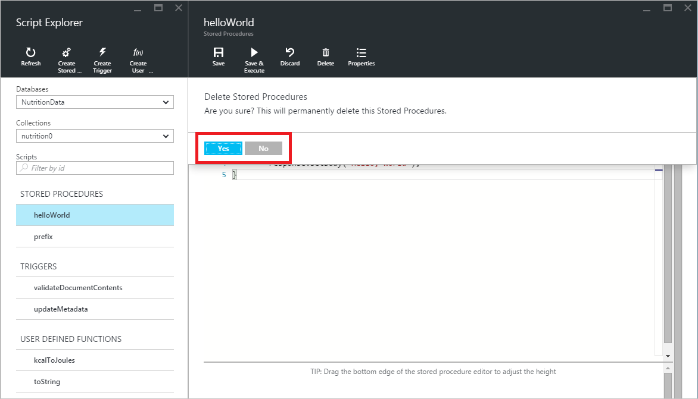

<properties
	pageTitle="DocumentDB 脚本资源管理器（JavaScript 编辑器）| Azure"
	description="DocumentDB 脚本资源管理器是一种 Azure 门户预览工具，用于管理 DocumentDB 服务器端编程项目，包括存储过程、触发器和用户定义的函数。"
	keywords="javascript 编辑器"
	services="documentdb"
	authors="AndrewHoh"
	manager="jhubbard"
	editor="monicar"
	documentationCenter=""/>

<tags
	ms.service="documentdb"
	ms.date="03/30/2016"
	wacn.date="06/29/2016"/>

# 使用 DocumentDB 脚本资源管理器创建并运行存储过程、触发器和用户定义的函数。

本文概述了 [Azure DocumentDB](/services/documentdb/) 脚本资源管理器，它是 Azure 门户预览中的 JavaScript 编辑器，用于查看和执行 DocumentDB 服务器端的编程项目，包括存储过程、触发器和用户定义的函数。阅读[存储过程、数据库触发器和 UDF](/documentation/articles/documentdb-programming/) 一文中有关 DocumentDB 服务器端编程的详细信息。

## 启动脚本资源管理器

1. 在 Azure 门户预览的跳转栏中，单击“DocumentDB 帐户”。如果“DocumentDB 帐户”不可见，请单击“浏览”，再单击“DocumentDB 帐户”。

2. 在“DocumentDB 帐户”边栏选项卡的顶部，单击“脚本资源管理器”。

	
 
    >[AZURE.NOTE] 脚本资源管理器也将显示在数据库和集合边栏选项卡上。

    将根据在其中启动脚本资源管理器的上下文预填充“数据库”和“集合”下拉列表框。例如，如果从数据库边栏选项卡启动，则将预填充当前数据库。如果从集合边栏选项卡启动，则将预填充当前集合。

	

4.  可使用“数据库”和“集合”下拉列表框轻松更改当前在其中查看脚本的集合，而无需关闭并重新启动脚本资源管理器。

5. 脚本资源管理器还支持按脚本的 id 属性筛选当前加载的脚本集。只需在筛选器框中键入，系统就会根据你提供的条件筛选脚本资源管理器列表中的结果。

	

	> [AZURE.IMPORTANT] 脚本资源管理器的筛选器功能仅从**当前**加载的脚本集中进行筛选，而不会自动刷新当前所选集合。

5. 若要刷新由脚本资源管理器加载的脚本列表，只需单击边栏选项卡顶部的“刷新”命令即可。

	

## 创建、查看和编辑存储过程、触发器和用户定义的函数

脚本资源管理器让你可以对 DocumentDB 服务器端的编程项目轻松执行 CRUD 操作。

- 若要创建脚本，只需单击脚本资源管理器中相应的创建命令，提供一个 id，输入脚本内容，然后单击“保存”即可。

	

- 创建触发器时还必须指定触发器类型和触发操作

	

- 若要查看脚本，只需单击你感兴趣的脚本即可。

	

- 若要编辑脚本，只需在 JavaScript 编辑器中进行所需更改，然后单击“保存”即可。

	

- 若要放弃所有挂起脚本更改，只需单击“放弃”命令即可。

	

- 脚本资源管理器还允许你通过单击“属性”命令轻松查看当前所加载脚本的系统属性。

	

	> [AZURE.NOTE] 时间戳 (\_ts) 属性在内部表示为新纪元时间，但文档资源管理器以便于阅读的 GMT 格式显示该值。

- 若要删除脚本，请在脚本资源管理器中选择该脚本并单击“删除”命令。

	

- 单击“是”以确认删除操作，或单击“否”以取消删除操作。

	

## 执行存储过程

> [AZURE.WARNING] 对于服务器端分区的集合，尚不支持在脚本资源管理器中执行存储过程。有关详细信息，请访问 [DocumentDB 中的分区和缩放](/documentation/articles/documentdb-partition-data/)。

脚本资源管理器允许你通过 Azure 门户预览执行服务器端存储过程。

- 打开新建的存储过程边栏选项卡时，将提供一个默认脚本（前缀）。若要运行*前缀*脚本或你自己的脚本，请添加 id 和输入。对于支持多个参数的存储过程，所有输入必须位于一个数组内（例如 ["foo"，"bar"]）。

	

- 若要执行存储过程，只需单击命令脚本编辑器窗格中的“保存并执行”命令即可。

	> [AZURE.NOTE] “保存并执行”命令将在执行之前保存存储过程，这意味着它将覆盖以前保存的存储过程版本。

- 存储过程执行成功后将显示“已成功保存并执行存储过程”状态并将在“结果”窗格中预填充返回的结果。

	

- 如果执行时遇到错误，将在“结果”窗格中显示该错误。

	

## 在门户预览外使用脚本

Azure 门户预览中的脚本资源管理器只是在 DocumentDB 中使用存储过程、触发器和用户定义的函数的一种方式。你还可以通过 REST API 和[客户端 SDK](/documentation/articles/documentdb-sdk-dotnet/) 使用这些脚本。REST API 文档包含有关[使用 REST 的存储过程](https://msdn.microsoft.com/library/azure/mt489092.aspx)、[使用 REST 的用户定义的函数](https://msdn.microsoft.com/library/azure/dn781481.aspx)和[使用 REST 的触发器](https://msdn.microsoft.com/library/azure/mt489116.aspx)的示例。还提供了介绍如何[使用 C# 处理脚本](/documentation/articles/documentdb-dotnet-samples/#server-side-programming-examples)和[使用 Node.js 处理脚本](/documentation/articles/documentdb-nodejs-samples/#server-side-programming-examples)的信息的示例。

## 后续步骤

在[存储过程、数据库触发器和 UDF](/documentation/articles/documentdb-programming/) 一文中了解有关 DocumentDB 服务器端编程的详细信息。

<!---HONumber=Mooncake_0425_2016-->