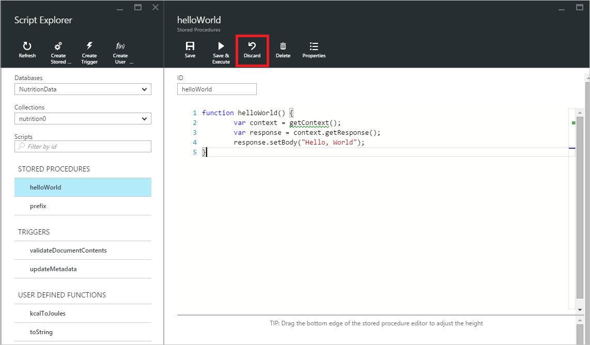

<properties
    pageTitle="DocumentDB 门户工具：脚本资源管理器 | Azure"
    description="了解 DocumentDB 脚本资源管理器，这是一种 Azure 门户预览工具，用于管理 DocumentDB 服务器端编程项目，包括 JavaScript 存储过程、触发器和用户定义的函数。"
    keywords="javascript 编辑器"
    services="documentdb"
    author="kirillg"
    manager="jhubbard"
    editor="monicar"
    documentationcenter="" />
<tags
    ms.assetid="9d0620da-2449-4c17-82a4-24aaa46e9b3e"
    ms.service="documentdb"
    ms.workload="data-services"
    ms.tgt_pltfrm="na"
    ms.devlang="na"
    ms.topic="article"
    ms.date="02/14/2017"
    wacn.date="05/31/2017"
    ms.author="kirillg"
    ms.translationtype="Human Translation"
    ms.sourcegitcommit="4a18b6116e37e365e2d4c4e2d144d7588310292e"
    ms.openlocfilehash="201cef3123355f09a379fd1c5903415bc43f64bc"
    ms.contentlocale="zh-cn"
    ms.lasthandoff="05/19/2017" />

# 使用 DocumentDB 脚本资源管理器创建并运行存储过程、触发器和用户定义的函数
本文概述了 [DocumentDB](/home/features/documentdb/) 脚本资源管理器，它是 Azure 门户预览中的 JavaScript 编辑器，用于查看和执行 DocumentDB 服务器端的编程项目，包括存储过程、触发器和用户定义的函数。 阅读[存储过程、数据库触发器和 UDF](/documentation/articles/documentdb-programming/) 一文中有关 DocumentDB 服务器端编程的详细信息。

## 启动脚本资源管理器
1. 在 [Azure 门户预览](https://portal.azure.cn)的左侧导航栏中，单击 **DocumentDB**。 

    如果 **DocumentDB** 不可见，请单击底部的“更多服务”，然后单击  **DocumentDB**。
2. 在资源菜单中，单击“脚本资源管理器” 。
   
    
   
    将根据在其中启动脚本资源管理器的上下文预填充“数据库”和“集合”下拉列表框。  例如，如果从数据库边栏选项卡启动，则预填充当前数据库。  如果从集合边栏选项卡启动，则预填充当前集合。
3. 可使用“数据库”和“集合”下拉列表框轻松更改当前在其中查看脚本的集合，而无需关闭并重新启动脚本资源管理器。  
4. 脚本资源管理器还支持按脚本的 id 属性筛选当前加载的脚本集。  只需在筛选器框中键入，系统就会根据提供的条件筛选脚本资源管理器列表中的结果。
   
    

    > [AZURE.IMPORTANT] 
    > 脚本资源管理器的筛选器功能仅从***当前***加载的脚本集中进行筛选，而不会自动刷新当前所选集合。

5. 若要刷新由脚本资源管理器加载的脚本列表，只需单击边栏选项卡顶部的“刷新”  命令即可。
   
    

## 创建、查看和编辑存储过程、触发器和用户定义的函数
脚本资源管理器让你可以对 DocumentDB 服务器端的编程项目轻松执行 CRUD 操作。  

- 若要创建脚本，只需单击脚本资源管理器中相应的创建命令，提供一个 id，输入脚本内容，然后单击“保存” 即可。
  
    
- 创建触发器时还必须指定触发器类型和触发操作
  
    
- 若要查看脚本，只需单击感兴趣的脚本即可。
  
    
- 若要编辑脚本，只需在 JavaScript 编辑器中进行所需更改，然后单击“保存” 即可。
  
    
- 若要放弃所有挂起脚本更改，只需单击“放弃”  命令即可。
  
    
- 脚本资源管理器还允许你通过单击“属性”  命令轻松查看当前所加载脚本的系统属性。
  
    
  
	> [AZURE.NOTE]
	> 时间戳 (_ts) 属性在内部表示为新纪元时间，但脚本资源管理器以便于阅读的 GMT 格式显示该值。
	> 
	> 
- 若要删除脚本，请在脚本资源管理器中选择该脚本并单击  “删除”命令。
  
    
- 单击“是”以确认删除操作，或单击“否”以取消删除操作。
  
    

## 执行存储过程
> [AZURE.WARNING]
> 对于服务器端分区的集合，尚不支持在脚本资源管理器中执行存储过程。 有关详细信息，请访问 [DocumentDB 中的分区和缩放](/documentation/articles/documentdb-partition-data/)。
> 
> 

脚本资源管理器允许通过 Azure 门户预览执行服务器端存储过程。

- 打开新建的存储过程边栏选项卡时，将提供一个默认脚本（*前缀*）。 若要运行*前缀*脚本或自己的脚本，请添加 *id* 和*输入*。 对于接受多个参数的存储过程，所有输入都必须位于一个数组内（例如 *["foo", "bar"]*）。
  
    
- 若要执行存储过程，只需单击命令脚本编辑器窗格中的“保存并执行”命令即可。
  
	> [AZURE.NOTE]
	> “保存并执行”命令将在执行之前保存存储过程，这意味着它将覆盖以前保存的存储过程版本。
	> 
	> 
- 存储过程执行成功后将显示“已成功保存并执行存储过程”状态并将在“结果”窗格中填充返回的结果。
  
    
- 如果执行时遇到错误，将在“结果”  窗格中显示该错误。
  
    

## 在门户外使用脚本
Azure 门户预览中的脚本资源管理器只是在 DocumentDB 中使用存储过程、触发器和用户定义的函数的一种方式。 还可以通过 REST API 和[客户端 SDK](/documentation/articles/documentdb-sdk-dotnet/) 使用这些脚本。 REST API 文档包含有关[使用 REST 的存储过程](https://msdn.microsoft.com/zh-cn/library/azure/mt489092.aspx)、[使用 REST 的用户定义的函数](https://msdn.microsoft.com/zh-cn/library/azure/dn781481.aspx)和[使用 REST 的触发器](https://msdn.microsoft.com/zh-cn/library/azure/mt489116.aspx)的使用示例。 还提供了介绍如何[使用 C# 处理脚本](/documentation/articles/documentdb-dotnet-samples/#server-side-programming-examples/)和[使用 Node.js 处理脚本](/documentation/articles/documentdb-nodejs-samples/#server-side-programming-examples/)的信息的示例。

## 后续步骤
在[存储过程、数据库触发器和 UDF](/documentation/articles/documentdb-programming/) 一文中了解有关 DocumentDB 服务器端编程的详细信息。

<!---Update_Description: wording update -->