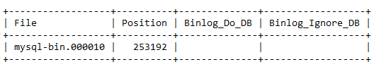
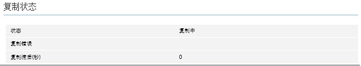

<properties linkid="" urlDisplayName="" pageTitle="Configure SQL Data Sync to replicate to MySQL Database on Azure – Azure cloud" metakeywords="Azure Cloud, technical documentation, documents and resources, MySQL, database, service restrictions and limitations, data replication, Azure MySQL, MySQL PaaS, Azure MySQL PaaS, Azure MySQL Service, Azure RDS" description="This article helps you to understand how to use the SQL Data Sync function to replicate local MySQL instances to the cloud." metaCanonical="" services="MySQL" documentationCenter="Services" title="" authors="" solutions="" manager="" editor="" />

<tags ms.service="mysql" ms.date="" wacn.date="09/16/2015"/>

#Configure SQL Data Sync to replicate to MySQL Database on Azure
MySQL Database on Azure supports slave server mode and standard MySQL data replication. You can use this feature to automatically sync database data from a MySQL server that is running locally or in other locations to a server that is running on MySQL Database on Azure.

##Configuration steps
1.	Confirm that the system variable lower\_case\_table\_names on the master MySQL server is set to 1. If not, then you must set it to 1. MySQL database replication requires the value of this parameter to be consistent between the master and slave servers, and this parameter is set to 1 on MySQL on Azure. mysql> SET GLOBAL lower\_case\_table\_names = 1;
2.	Set the master server to read-only mode: mysql> FLUSH TABLES WITH READ LOCK; mysql> SET GLOBAL read\_only = ON;
3.	Run the “show master status” SQL command on the master server to ascertain the current binary log file name and offset. The results returned should be similar to this: 

4.	Export the databases for all users on the master server, for example, by using the mysqldump tool. mysqldump --databases <database name> --single-transaction --order-by-primary -r <backup file name> --routines -h<server address> -P<port number> –u<username> -p<password> Note that databases that are built into MySQL servers, including the MySQL library and test library, do not need to be exported.
5.	Once the database has been exported, change the master MySQL server setting back to read/write mode: mysql> SET GLOBAL read\_only = OFF; mysql> UNLOCK TABLES;  
6.	Create an account on the master MySQL server for data replication use, and set up the permissions. CREATE USER '<your user>'@'%' IDENTIFIED BY '<your password>'; GRANT REPLICATION SLAVE ON *.* TO '<your user>'@'%';
7.	Sign in to the Azure portal and create a new MySQL server on MySQL Database on Azure.
8.	Create individual databases for all users on the master server on the newly created MySQL server.
9.	Create the required user accounts on the newly created MySQL server. This is necessary because user account information cannot be replicated.
10.	Import the user database data exported from the master server onto the newly created MySQL server. If the database file is very large, we recommend that you upload the file to a virtual machine on Azure, and then import it into the MySQL server from the virtual machine. The virtual machine should be in the same data center as the newly created MySQL server. The specific steps are listed below.

	a) Upload the mysql.exe tool to the virtual machine.

	b) Upload the file that was exported from the database onto the virtual machine. If the backup file is very large, you can compress it before uploading.

	c) Sign in to the virtual machine, and connect to the newly created MySQL server by using mysql.exe: mysql -h<server address> -P<port number> –u<username> -p<password>

	d) Run the source <backup file name> SQL command to import data within the backup file.

	e) Repeat steps c and d until all the data in the user databases has been imported into the MySQL server.

11.	Make the newly created MySQL server the slave server

	a) Select the newly created MySQL server, and click the “Replicate” page.

	b) Change the role to “Slave server,” and then enter the master server parameters.

	i. For the master server binary log file name and offset, enter the results obtained in step b.

	ii. If you are using SSL links, select the enable option in the locations by using the SSL links. Next, open the master server certification authority (CA) certificate and copy the entire contents into the input box of the master server CA certificate. c) Click Save after all the details are correctly configured.

>[AZURE.NOTE]**We strongly recommend using SSL to help ensure that your data is secure. **

12.	Once the configuration is successful, the Replication Status at the bottom should say “replicating.” 

>[AZURE.NOTE]**Once the replication role of the MySQL server is set to slave server, the server will be in read-only mode. - Once the replication role of the MySQL server is set to slave server, none of the master server parameters on the replication page will be editable, except for the role. If there is an input error, you must set the replication role to Disabled and then reconfigure the slave server parameters. - We recommend setting the binlog\_format for the master server to Mixed or Row, to avoid causing data replication errors due to the use of unsafe statements such as sysdate ().**

##Data replication restrictions
1. Changes on the master server to accounts and permissions are not replicated. If you created an account on the master server and this account needs to access the slave server, then you will need to create the same account yourself on MySQL Database on Azure.

2. The master and slave server versions must be the same. For example, both must be MySQL 5.5, or both must be MySQL 5.6.

##Solving data replication errors
If replication stops because it encounters a problem of any kind, the replication status will change to “Replication Error.” You can find details of the error by looking at the Replication Error field. Common causes of replication errors include:  
- The value of the max\_allowed\_packet parameter on the slave server is less than the value of the same parameter on the master server. This parameter determines the maximum permitted Data Manipulation Language (DML) size for MySQL servers. If the value of the parameter is smaller on the slave server than on the master server, some DMLs may run successfully on the master side but fail to run on the slave server, causing an error. Ensure that the max\_allowed\_packet values are consistent between the master and slave servers.

- When the replication role is changed to slave server, there is a parameter input error on the master server. This makes it impossible for the slave server to connect to the master server.

- Data is consistent between the master and slave servers. For example, replication attempts to insert a record into the slave server that already exists. There are several possible causes of this error:

	- Some DMLs on the master server were not recorded in the binary log file. For example, SET sql\_log\_bin=0 was executed before the DML was executed on the master server.

	- Before the replication role was changed to the slave server, faulty write operations were performed on it.

	- There are input errors for the binary log file name or offset the replication role was changed to the slave server.

If data replication errors do occur, solve them by using the following process:

1.	Use the Azure portal to change the replication role of the MySQL to Disabled. This will put the MySQL in read-only mode.

2.	Determine the cause of the error by looking at the replication error field, and resolve the issue. For example, you can set a max\_allowed\_packet value consistent with that on the master server and change the record on the slave server that is causing the replication failure.

3.	Use the Azure portal to change the replication role of the MySQL back to the slave server.

	- The master server binary log file name and offset are the master server binary file name and offset that were previously replicated and executed. If there were previously no input errors with the binary log file name or offset, we do not recommend making any changes.

	- For security reasons, the master server password and master server CA certificate that were previously entered will not be displayed at this time. If you do not make any changes, MySQL will continue to use the previous password and CA certificate.

	- The other master server parameter fields will show the corresponding parameter values that were previously entered. If there are no errors, you do not need to make any changes.

<!--HONumber=81-->