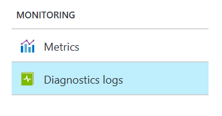
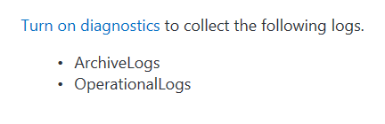
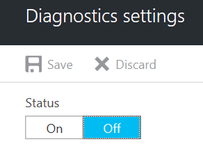

<properties
    pageTitle="Azure 事件中心诊断日志 | Azure"
    description="了解如何在 Azure 中分析来自事件中心的诊断日志。"
    keywords=""
    documentationcenter=""
    services="event-hubs"
    author="banisadr"
    manager=""
    editor="" />
<tags
    ms.assetid=""
    ms.service="event-hubs"
    ms.devlang="na"
    ms.topic="article"
    ms.tgt_pltfrm="na"
    ms.workload="data-services"
    ms.date="02/01/2017"
    wacn.date="03/24/2017"
    ms.author="babanisa" />  

# 事件中心诊断日志

## 介绍
事件中心公开两种类型的日志：
* [活动日志](/documentation/articles/monitoring-overview-activity-logs/)：始终启用，提供针对作业执行的操作的深入信息；
* [诊断日志](/documentation/articles/monitoring-overview-of-diagnostic-logs/)：用户可配置的日志，提供作业发生的所有情况的更多深入信息，包括从创建作业开始，到更新、运行作业，直到删除作业为止的所有信息。

## 如何启用诊断日志
诊断日志默认**已关闭**。若要启用诊断日志，请执行下列步骤：

登录到 Azure 门户预览并导航到流式处理作业边栏选项卡，然后使用“监视”下面的“诊断日志”边栏选项卡。

  

然后单击“启用诊断”链接

  

在打开的诊断中，将状态更改为“打开”。

  

更改诊断日志的状态配置所需的存档目标（存储帐户、事件中心、Log Analytics）并选择想要收集的日志类别（“执行”、“创作”）。然后保存新的诊断配置。

保存后，配置将在大约 10 分钟后生效，在此之后，日志将开始出现在配置的存档目标中，可在“诊断日志”边栏选项卡中看到：

[诊断日志](https://docs.microsoft.com/azure/monitoring-and-diagnostics/monitoring-overview-of-diagnostic-logs)页中提供了有关配置诊断的详细信息。

## 诊断日志类别
目前会捕获两种类别的诊断日志：

* **ArchivalLogs：**捕获与事件中心存档相关（特别是与存档错误相关）的日志。
* **OperationalLogs：**捕获事件中心操作期间发生的日志，特别是包括事件中心创建在内的操作类型、所使用的资源和操作的状态。

## 诊断日志架构
所有日志均以 JSON 格式存储；每个日志项目均包含字符串字段，这些字段采用以下格式：

### 存档错误架构
名称 | 说明
------- | -------
TaskName | 描述失败的任务
ActivityId | 用于跟踪的内部 ID
trackingId | 用于跟踪的内部 ID
resourceId | ARM 资源 ID
eventHub | 事件中心的完整名称（包括命名空间名称）
partitionId | 写入到的事件中心分区
archiveStep | ArchiveFlushWriter
startTime | 失败开始时间
failures | 发生失败的次数
durationInSeconds | 失败持续时间
message | 错误消息
category | ArchiveLogs

#### 存档日志示例

    {
         "TaskName": "EventHubArchiveUserError",
         "ActivityId": "21b89a0b-8095-471a-9db8-d151d74ecf26",
         "trackingId": "21b89a0b-8095-471a-9db8-d151d74ecf26_B7",
         "resourceId": "/SUBSCRIPTIONS/854D368F-1828-428F-8F3C-F2AFFA9B2F7D/RESOURCEGROUPS/DEFAULT-EVENTHUB-CENTRALUS/PROVIDERS/MICROSOFT.EVENTHUB/NAMESPACES/FBETTATI-OPERA-EVENTHUB",
         "eventHub": "fbettati-opera-eventhub:eventhub:eh123~32766",
         "partitionId": "1",
         "archiveStep": "ArchiveFlushWriter",
         "startTime": "9/22/2016 5:11:21 AM",
         "failures": 3,
         "durationInSeconds": 360,
         "message": "Microsoft.WindowsAzure.Storage.StorageException: The remote server returned an error: (404) Not Found. ---> System.Net.WebException: The remote server returned an error: (404) Not Found.\r\n   at Microsoft.WindowsAzure.Storage.Shared.Protocol.HttpResponseParsers.ProcessExpectedStatusCodeNoException[T](HttpStatusCode expectedStatusCode, HttpStatusCode actualStatusCode, T retVal, StorageCommandBase`1 cmd, Exception ex)\r\n   at Microsoft.WindowsAzure.Storage.Blob.CloudBlockBlob.<PutBlockImpl>b__3e(RESTCommand`1 cmd, HttpWebResponse resp, Exception ex, OperationContext ctx)\r\n   at Microsoft.WindowsAzure.Storage.Core.Executor.Executor.EndGetResponse[T](IAsyncResult getResponseResult)\r\n   --- End of inner exception stack trace ---\r\n   at Microsoft.WindowsAzure.Storage.Core.Util.StorageAsyncResult`1.End()\r\n   at Microsoft.WindowsAzure.Storage.Core.Util.AsyncExtensions.<>c__DisplayClass4.<CreateCallbackVoid>b__3(IAsyncResult ar)\r\n--- End of stack trace from previous location where exception was thrown ---\r\n   at System.",
         "category": "ArchiveLogs"
    }

### 操作日志架构
名称 | 说明
------- | -------
ActivityId | 用于跟踪的内部 ID
EventName | 操作名称			 
resourceId | ARM 资源 ID
SubscriptionId | 订阅 ID
EventTimeString | 操作时间
EventProperties | 操作属性
状态 | 操作状态
调用方 | 操作的调用方（门户或管理客户端）
category | OperationalLogs

#### 操作日志示例

    Example: 
    {
         "ActivityId": "6aa994ac-b56e-4292-8448-0767a5657cc7",
         "EventName": "Create EventHub",
         "resourceId": "/SUBSCRIPTIONS/1A2109E3-9DA0-455B-B937-E35E36C1163C/RESOURCEGROUPS/DEFAULT-SERVICEBUS-CENTRALUS/PROVIDERS/MICROSOFT.EVENTHUB/NAMESPACES/SHOEBOXEHNS-CY4001",
         "SubscriptionId": "1a2109e3-9da0-455b-b937-e35e36c1163c",
         "EventTimeString": "9/28/2016 8:40:06 PM +00:00",
         "EventProperties": "{"SubscriptionId":"1a2109e3-9da0-455b-b937-e35e36c1163c","Namespace":"shoeboxehns-cy4001","Via":"https://shoeboxehns-cy4001.servicebus.chinacloudapi.cn/f8096791adb448579ee83d30e006a13e/?api-version=2016-07","TrackingId":"5ee74c9e-72b5-4e98-97c4-08a62e56e221_G1"}",
         "Status": "Succeeded",
         "Caller": "ServiceBus Client",
         "category": "OperationalLogs"
    }

## 后续步骤
* [事件中心简介](/documentation/articles/event-hubs-what-is-event-hubs/)
* [事件中心 API 概述](/documentation/articles/event-hubs-api-overview/)
* [事件中心入门](/documentation/articles/event-hubs-csharp-ephcs-getstarted/)

<!---HONumber=Mooncake_0320_2017-->
<!--Update_Description:new article of diagnostic log of event hubs-->