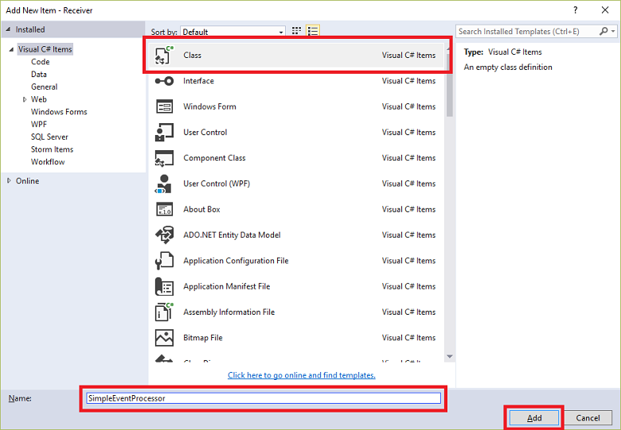

<properties
    pageTitle="使用 .NET Framework 从 Azure 事件中心接收事件 | Azure"
    description="按照本教程中的步骤使用 .NET Framework 从 Azure 事件中心接收事件。"
    services="event-hubs"
    documentationcenter=""
    author="jtaubensee"
    manager="timlt"
    editor=""
    translationtype="Human Translation" />
<tags
    ms.assetid="c4974bd3-2a79-48a1-aa3b-8ee2d6655b28"
    ms.service="event-hubs"
    ms.workload="na"
    ms.tgt_pltfrm="na"
    ms.devlang="na"
    ms.topic="get-started-article"
    ms.date="03/08/2017"
    wacn.date="04/17/2017"
    ms.author="jotaub;sethm"
    ms.sourcegitcommit="7cc8d7b9c616d399509cd9dbdd155b0e9a7987a8"
    ms.openlocfilehash="22be9cf77635657b6f8f412629ef3a3ff9b4035e"
    ms.lasthandoff="04/07/2017" />

# 使用 .NET Framework 从 Azure 事件中心接收事件

## 介绍
事件中心是一个服务，可用于处理来自连接设备和应用程序的大量事件数据（遥测）。 将数据采集到事件中心后，可以使用任何实时分析提供程序或存储群集来转换和存储数据。 这种大规模事件收集和处理功能是现代应用程序体系结构（包括物联网 (IoT)）的重要组件。

本教程显示如何编写 .NET Framework 控制台应用程序，以使用**[事件处理程序主机][EventProcessorHost]**从事件中心接收消息。 若要使用 .NET Framework 发送事件，请参阅[使用 .NET Framework 将事件发送到 Azure 事件中心](/documentation/articles/event-hubs-dotnet-framework-getstarted-send/)一文，或者单击左侧目录中的相应发送语言。

[事件处理程序主机][EventProcessorHost]是一个 .NET 类，它通过从事件中心管理持久检查点和并行接收来简化从那些事件中心接收事件的过程。 使用 [事件处理程序主机][事件处理程序主机]，可跨多个接收方拆分事件，即使在不同节点中托管也是如此。 此示例演示如何为单一接收方使用[事件处理程序主机][EventProcessorHost]。 [扩大事件处理][Scale out Event Processing with Event Hubs]示例显示如何将[事件处理程序主机][EventProcessorHost]用于多个接收方。

## 先决条件

若要完成本教程，你需要以下各项：

* [Microsoft Visual Studio 2015 或更高版本](http://visualstudio.com)。 本教程中的屏幕截图使用 Visual Studio 2017。
* 有效的 Azure 帐户。 如果没有帐户，只需几分钟时间就可以创建一个免费帐户。 有关详细信息，请参阅 [Azure 试用](/pricing/1rmb-trial/)。

## 创建事件中心命名空间和事件中心
第一步是使用 [Azure 门户](https://portal.azure.cn)创建事件中心类型的命名空间，并获取应用程序与事件中心进行通信所需的管理凭据。 若要创建命名空间和事件中心，请按照[本文](/documentation/articles/event-hubs-create/)中的步骤进行操作，然后继续执行以下步骤。
## 创建 Azure 存储帐户
若要使用[事件处理程序主机][EventProcessorHost]，必须有一个 [Azure 存储帐户][Azure Storage account]：

1. 登录到 [Azure 门户][Azure 门户]，然后单击屏幕左上角的“新建”。

2. 单击“存储”，然后单击“存储帐户”。

    

3. 在“创建存储帐户”  边栏选项卡中，键入存储帐户的名称。 选择 Azure 订阅、资源组和要在其中创建该资源的位置。 然后单击“创建” 。

    

4. 在存储帐户列表中，单击新建的存储帐户。

5. 在“存储帐户”边栏选项卡中，单击“访问密钥”。 复制 **key1** 的值，在本教程的后面部分使用。

    

6. 在 Visual Studio 中，使用 **控制台应用程序** 项目模板创建一个新的 Visual C# 桌面应用项目。 将该项目命名为 **Receiver**。

    

7. 在解决方案资源管理器中，右键单击“Receiver”项目，然后单击“为解决方案管理 NuGet 包”。

8. 单击“浏览”选项卡，然后搜索 `Azure Service Bus Event Hub - EventProcessorHost`。 单击“安装” 并接受使用条款。

    

    Visual Studio 下载、安装 [Azure 服务总线事件中心 - EventProcessorHost NuGet 包](https://www.nuget.org/packages/Microsoft.Azure.ServiceBus.EventProcessorHost)及其所有依赖项并添加对它们的引用。

9. 右键单击 **Receiver** 项目，单击“添加”，然后单击“类”。 将新类命名为 **SimpleEventProcessor**，然后单击“添加”以创建该类。

    

10. 在 SimpleEventProcessor.cs 文件的顶部添加以下语句：

        using Microsoft.ServiceBus.Messaging;
        using System.Diagnostics;

    然后，用以下代码替换该类的正文：

        class SimpleEventProcessor : IEventProcessor
         {
             Stopwatch checkpointStopWatch;
             
             async Task IEventProcessor.CloseAsync(PartitionContext context, CloseReason reason)
             {
                 Console.WriteLine("Processor Shutting Down. Partition '{0}', Reason: '{1}'.", context.Lease.PartitionId, reason);
                 if (reason == CloseReason.Shutdown)
                 {
                     await context.CheckpointAsync();
                 }
             }
             
             Task IEventProcessor.OpenAsync(PartitionContext context)
             {
                 Console.WriteLine("SimpleEventProcessor initialized.  Partition: '{0}', Offset: '{1}'", context.Lease.PartitionId, context.Lease.Offset);
                 this.checkpointStopWatch = new Stopwatch();
                 this.checkpointStopWatch.Start();
                 return Task.FromResult<object>(null);
             }
             
             async Task IEventProcessor.ProcessEventsAsync(PartitionContext context, IEnumerable<EventData> messages)
             {
                 foreach (EventData eventData in messages)
                 {
                     string data = Encoding.UTF8.GetString(eventData.GetBytes());
                 
                     Console.WriteLine(string.Format("Message received.  Partition: '{0}', Data: '{1}'",
                         context.Lease.PartitionId, data));
                 }
                 
                 //Call checkpoint every 5 minutes, so that worker can resume processing from 5 minutes back if it restarts.
                 if (this.checkpointStopWatch.Elapsed > TimeSpan.FromMinutes(5))
                 {
                     await context.CheckpointAsync();
                     this.checkpointStopWatch.Restart();
                 }
             }
        }

    此类将由 **EventProcessorHost** 调用，以处理从事件中心接收的事件。 请注意， `SimpleEventProcessor` 类使用秒表以定期对 **EventProcessorHost** 上下文调用检查点方法。 这将确保接收方重新启动时将会丢失的处理工作不会超过五分钟。

11. 在 **Program** 类中，在文件顶部添加以下 `using` 语句：

        using Microsoft.ServiceBus.Messaging;

    然后，将 `Program` 类中的 `Main` 方法替换为以下代码，从而替换为以前保存的事件中心名称和命名空间级别连接字符串，以及在前面部分复制的存储帐户和密钥。

        static void Main(string[] args)
        {
           string eventHubConnectionString = "{Event Hubs namespace connection string}";
           string eventHubName = "{Event Hub name}";
           string storageAccountName = "{storage account name}";
           string storageAccountKey = "{storage account key}";
           string storageConnectionString = string.Format("DefaultEndpointsProtocol=https;AccountName={0};AccountKey={1}", storageAccountName, storageAccountKey);
           
           string eventProcessorHostName = Guid.NewGuid().ToString();
           EventProcessorHost eventProcessorHost = new EventProcessorHost(eventProcessorHostName, eventHubName, EventHubConsumerGroup.DefaultGroupName, eventHubConnectionString, storageConnectionString);
           Console.WriteLine("Registering EventProcessor...");
           var options = new EventProcessorOptions();
           options.ExceptionReceived += (sender, e) => { Console.WriteLine(e.Exception); };
           eventProcessorHost.RegisterEventProcessorAsync<SimpleEventProcessor>(options).Wait();
           
           Console.WriteLine("Receiving. Press enter key to stop worker.");
           Console.ReadLine();
           eventProcessorHost.UnregisterEventProcessorAsync().Wait();
        }

12. 运行程序，并确保没有任何错误。

祝贺你！ 现在你已使用事件处理程序主机从事件中心接收消息。

> [AZURE.NOTE]
> 本教程使用单个 [EventProcessorHost][EventProcessorHost] 实例。 若要增加吞吐量，建议运行多个 [EventProcessorHost][EventProcessorHost] 实例，如[扩大事件处理][扩大事件处理]示例中所示。 在这些情况下，为了对接收的事件进行负载均衡，各个实例会自动相互协调。 如果希望多个接收方都各自处理 *全部* 事件，则必须使用 **ConsumerGroup** 概念。 在从不同计算机中接收事件时，根据部署 [EventProcessorHost][EventProcessorHost] 实例的计算机（或角色）来指定该实例的名称可能会很有用。 有关这些主题的详细信息，请参阅[事件中心概述][Event Hubs Overview]和[事件中心编程指南][Event Hubs Programming Guide]主题。
> 
> 

<!-- Links -->
[Event Hubs Overview]: /documentation/articles/event-hubs-overview/
[Event Hubs Programming Guide]: /documentation/articles/event-hubs-programming-guide/
[Azure Storage account]: /documentation/articles/storage-create-storage-account/
[EventProcessorHost]: https://www.nuget.org/packages/Microsoft.Azure.ServiceBus.EventProcessorHost
[Azure portal]: https://portal.azure.cn

## 后续步骤
现在已生成了一个可以创建事件中心以及发送和接收数据的有效应用程序，接下来请访问以下链接，继续学习：

* [事件处理程序主机](https://www.nuget.org/packages/Microsoft.Azure.ServiceBus.EventProcessorHost)
* [事件中心概述][Event Hubs overview]
* [事件中心常见问题](/documentation/articles/event-hubs-faq/)

<!-- Images. -->

[19]: ./media/event-hubs-csharp-ephcs-getstarted/create-eh-proj1.png
[20]: ./media/event-hubs-csharp-ephcs-getstarted/create-eh-proj2.png
[21]: ./media/event-hubs-csharp-ephcs-getstarted/run-csharp-ephcs1.png
[22]: ./media/event-hubs-csharp-ephcs-getstarted/run-csharp-ephcs2.png

<!-- Links -->
[Event Processor Host]: https://www.nuget.org/packages/Microsoft.Azure.ServiceBus.EventProcessorHost
[Event Hubs overview]: /documentation/articles/event-hubs-overview/
[Scale out Event Processing with Event Hubs]: https://code.msdn.microsoft.com/Service-Bus-Event-Hub-45f43fc3

<!--Update_Description:update meta properties;wording update-->