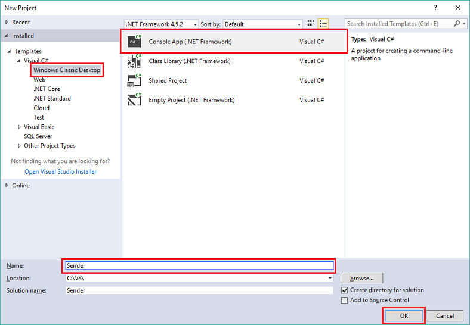
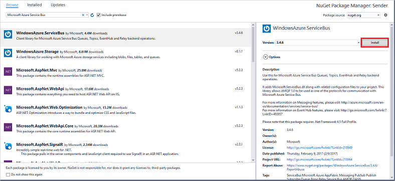

<properties
    pageTitle="使用 .NET Framework 将事件发送到 Azure 事件中心 | Azure"
    description="使用 .NET Framework 将事件发送到事件中心入门"
    services="event-hubs"
    documentationcenter=""
    author="jtaubensee"
    manager="timlt"
    editor=""
    translationtype="Human Translation" />
<tags
    ms.assetid="c4974bd3-2a79-48a1-aa3b-8ee2d6655b28"
    ms.service="event-hubs"
    ms.workload="na"
    ms.tgt_pltfrm="na"
    ms.devlang="na"
    ms.topic="get-started-article"
    ms.date="03/08/2017"
    wacn.date="04/17/2017"
    ms.author="jotaub;sethm"
    ms.sourcegitcommit="7cc8d7b9c616d399509cd9dbdd155b0e9a7987a8"
    ms.openlocfilehash="dd1f8f2156e7deda4680d881762d58273bcbd9b2"
    ms.lasthandoff="04/07/2017" />

# 使用 .NET Framework 将事件发送到 Azure 事件中心

## 介绍
事件中心是一个服务，可用于处理来自连接设备和应用程序的大量事件数据（遥测）。 将数据采集到事件中心后，可以使用任何实时分析提供程序或存储群集来转换和存储数据。 这种大规模事件收集和处理功能是现代应用程序体系结构（包括物联网 (IoT)）的重要组件。

本教程介绍如何使用 [Azure 门户](https://portal.azure.cn)创建事件中心。此外，还介绍如何使用控制台应用程序（通过 .NET Framework 用 C# 编写）将事件发送到事件中心。若要使用 .NET Framework 接收事件，请参阅[使用 .NET Framework 接收事件](/documentation/articles/event-hubs-dotnet-framework-getstarted-receive-eph/)一文，或者单击左侧目录中的相应接收语言。

若要完成本教程，你需要以下各项：

* [Microsoft Visual Studio 2015 或更高版本](http://visualstudio.com)。 本教程中的屏幕截图使用 Visual Studio 2017。
* 有效的 Azure 帐户。 如果没有帐户，只需几分钟时间就可以创建一个免费帐户。 有关详细信息，请参阅 [Azure 试用](/pricing/1rmb-trial/)。

## 创建事件中心命名空间和事件中心

第一步是使用 [Azure 门户](https://portal.azure.cn)创建事件中心类型的命名空间，并获取应用程序与事件中心进行通信所需的管理凭据。 若要创建命名空间和事件中心，请按照[本文](/documentation/articles/event-hubs-create/)中的步骤进行操作，然后继续执行以下步骤。

## 创建控制台应用程序
在此部分中，你将编写用于将事件发送到事件中心的 Windows 控制台应用。

1. 在 Visual Studio 中，使用 **控制台应用程序** 项目模板创建一个新的 Visual C# 桌面应用项目。 将该项目命名为 **Sender**。

    

2. 在解决方案资源管理器中，右键单击“Sender”项目，然后单击“为解决方案管理 NuGet 包”。 

3. 单击“浏览”选项卡，然后搜索 `Azure Service Bus`。 单击“安装” 并接受使用条款。 

    

    Visual Studio 下载、安装 [Azure 服务总线库 NuGet 包](https://www.nuget.org/packages/WindowsAzure.ServiceBus)并添加对它的引用。

4. 在 **Program.cs** 文件顶部添加以下 `using` 语句：

        using System.Threading;
        using Microsoft.ServiceBus.Messaging;

5. 将以下字段添加到 **Program** 类，并将占位符值分别替换为你在上一节中创建的事件中心的名称和前面保存的命名空间级别连接字符串。

        static string eventHubName = "{Event Hub name}";
        static string connectionString = "{send connection string}";

6. 将以下方法添加到 **Program** 类：

        static void SendingRandomMessages()
        {
            var eventHubClient = EventHubClient.CreateFromConnectionString(connectionString, eventHubName);
            while (true)
            {
                try
                {
                    var message = Guid.NewGuid().ToString();
                    Console.WriteLine("{0} > Sending message: {1}", DateTime.Now, message);
                    eventHubClient.Send(new EventData(Encoding.UTF8.GetBytes(message)));
                }
                catch (Exception exception)
                {
                    Console.ForegroundColor = ConsoleColor.Red;
                    Console.WriteLine("{0} > Exception: {1}", DateTime.Now, exception.Message);
                    Console.ResetColor();
                }
                
                Thread.Sleep(200);
            }
        }

    此方法会不断地将事件发送到事件中心，迟延为 200 毫秒。

7. 最后，在 **Main** 方法中添加以下行：

        Console.WriteLine("Press Ctrl-C to stop the sender process");
        Console.WriteLine("Press Enter to start now");
        Console.ReadLine();
        SendingRandomMessages();

8. 运行程序，并确保没有任何错误。

祝贺你！ 现在已将消息发送到事件中心。

## 后续步骤
现在已生成了一个可以创建事件中心以及发送数据的有效应用程序，接下来请继续学习以下方案：

* [使用事件处理程序主机接收事件](/documentation/articles/event-hubs-dotnet-framework-getstarted-receive-eph/)
* [事件处理程序主机参考](https://www.nuget.org/packages/Microsoft.Azure.ServiceBus.EventProcessorHost)
* [事件中心概述](/documentation/articles/event-hubs-what-is-event-hubs/)

<!-- Images. -->
[19]: ./media/event-hubs-csharp-ephcs-getstarted/create-eh-proj1.png
[20]: ./media/event-hubs-csharp-ephcs-getstarted/create-eh-proj2.png
[21]: ./media/event-hubs-csharp-ephcs-getstarted/run-csharp-ephcs1.png
[22]: ./media/event-hubs-csharp-ephcs-getstarted/run-csharp-ephcs2.png

<!--Update_Description:update meta properties;wording update;-->