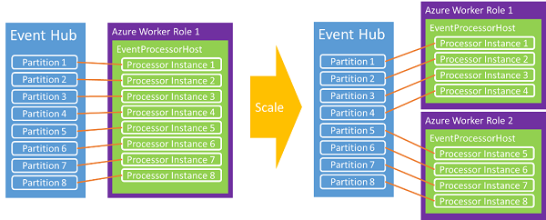

<properties 
    pageTitle="Azure 事件中心编程指南 | Azure"
    description="介绍如何使用 Azure.NET SDK 进行 Azure 事件中心编程。"
    services="event-hubs"
    documentationcenter="na"
    author="sethmanheim"
    manager="timlt"
    editor="" />
<tags
    ms.assetid="64cbfd3d-4a0e-4455-a90a-7f3d4f080323"
    ms.service="event-hubs"
    ms.devlang="na"
    ms.topic="article"
    ms.tgt_pltfrm="na"
    ms.workload="tbd"
    ms.date="02/10/2017"
    wacn.date="03/24/2017"
    ms.author="sethm" />  

# 事件中心编程指南

本文介绍使用 Azure 事件中心和 Azure .NET SDK 编写代码时的一些常见情况。内容假设你对事件中心已有初步的了解。有关事件中心的概念概述，请参阅[事件中心概述](/documentation/articles/event-hubs-what-is-event-hubs/)。

## 事件发布者
使用 HTTP POST 或通过 AMQP 1.0 连接将事件发送到事件中心。选择使用哪种方式具体取决于要解决的特定方案。AMQP 1.0 连接计量为服务总线中的中转连接计量，对于经常要以较高的消息量和较低的延迟传送消息的方案，适合选择此方式，因为它们提供持久的消息传递通道。

事件中心是使用 [NamespaceManager][] 类创建和管理的。使用 .NET 托管 API 时，用于将数据发布到事件中心的主要构造是 [EventHubClient](https://docs.microsoft.com/zh-cn/dotnet/api/microsoft.servicebus.messaging.eventhubclient) 和 [EventData][] 类。[EventHubClient][] 提供 AMQP 通信通道，事件将通过该通道发送到事件中心。[EventData][] 类表示一个事件，用于将消息发布到事件中心。此类包括正文、一些元数据和有关事件的标头信息。其他属性将在通过事件中心传递时添加到 [EventData][] 对象中。

## 入门
支持事件中心的 .NET 类在 Microsoft.ServiceBus.dll 程序集中提供。引用服务总线 API 以及使用所有服务总线依赖项配置应用程序的最简单方法是下载[服务总线 NuGet 包](https://www.nuget.org/packages/WindowsAzure.ServiceBus)。或者，你也可以在 Visual Studio 中使用[程序包管理器控制台](http://docs.nuget.org/docs/start-here/using-the-package-manager-console)。为此，请在[程序包管理器控制台](http://docs.nuget.org/docs/start-here/using-the-package-manager-console)窗口中发出以下命令：

		Install-Package WindowsAzure.ServiceBus

## 创建事件中心
可以使用 [NamespaceManager][] 类来创建事件中心。例如：

    var manager = new Microsoft.ServiceBus.NamespaceManager("mynamespace.servicebus.chinacloudapi.cn");
    var description = manager.CreateEventHub("MyEventHub");

在大多数情况下，建议使用 [CreateEventHubIfNotExists][] 方法，避免服务重启时生成异常。例如：

    var description = manager.CreateEventHubIfNotExists("MyEventHub");

所有事件中心创建操作（包括 [CreateEventHubIfNotExists][]）需要对相关的命名空间具有**管理**权限。如果想要限制发布者或使用者应用程序的权限，使用具有受限权限的凭据时，可以在生产代码中避免这些创建操作调用。

[EventHubDescription](https://docs.microsoft.com/zh-cn/dotnet/api/microsoft.servicebus.messaging.eventhubdescription) 类包含有关事件中心的详细信息，其中包括授权规则、消息保留间隔、分区 ID、状态和路径。可以使用此类来更新事件中心上的元数据。

## 创建事件中心客户端

与事件中心交互的主类是 [Microsoft.ServiceBus.Messaging.EventHubClient][]。此类提供发送者和接收者功能。可以使用 [Create](https://docs.microsoft.com/zh-cn/dotnet/api/microsoft.servicebus.messaging.eventhubclient#Microsoft_ServiceBus_Messaging_EventHubClient_Create_System_String_) 方法实例化此类，如以下示例中所示。

    var client = EventHubClient.Create(description.Path);

此方法使用 App.config 文件中 `appSettings` 节中的服务总线连接信息。有关用于存储服务总线连接信息的 `appSettings` XML 示例，请参阅 [Microsoft.ServiceBus.Messaging.EventHubClient.Create(System.String)](https://docs.microsoft.com/zh-cn/dotnet/api/microsoft.servicebus.messaging.eventhubclient#Microsoft_ServiceBus_Messaging_EventHubClient_Create_System_String_) 方法的文档。

另一个选项是从连接字符串创建客户端。使用 Azure 辅助角色时，此选项非常合适，因为你可以在辅助角色的配置属性中存储字符串。例如：

    EventHubClient.CreateFromConnectionString("your_connection_string");

连接字符串的格式与前面所用方法的 App.config 文件中显示的格式相同：

    Endpoint=sb://[namespace].servicebus.chinacloudapi.cn/;SharedAccessKeyName=RootManageSharedAccessKey;SharedAccessKey=[key]

最后，还可以从 [MessagingFactory](https://docs.microsoft.com/zh-cn/dotnet/api/microsoft.servicebus.messaging.messagingfactory) 实例创建 [EventHubClient][] 对象，如以下代码示例中所示。

    var factory = MessagingFactory.CreateFromConnectionString("your_connection_string");
    var client = factory.CreateEventHubClient("MyEventHub");

必须注意，从消息工厂实例创建的其他 [EventHubClient][] 对象将重复使用同一个基础 TCP 连接。因此，这些对象将对吞吐量实施客户端限制。[Create](https://docs.microsoft.com/zh-cn/dotnet/api/microsoft.servicebus.messaging.eventhubclient#Microsoft_ServiceBus_Messaging_EventHubClient_Create_System_String_) 方法重复使用单个消息工厂。如果需要单个发送者具有极高的吞吐量，则可以创建多个消息工厂，并从每个消息工厂创建一个 [EventHubClient][] 对象。

## 将事件发送到事件中心

可以通过以下方式将事件发送到事件中心：创建一个 [EventData][] 实例并通过 [Send](https://docs.microsoft.com/zh-cn/dotnet/api/microsoft.servicebus.messaging.eventhubclient#Microsoft_ServiceBus_Messaging_EventHubClient_Send_Microsoft_ServiceBus_Messaging_EventData_) 方法发送该实例。此方法采用单个 [EventData][] 实例参数，并以同步方式将其发送至事件中心。

## 事件序列化

[EventData][] 类具有[四个重载构造函数](https://docs.microsoft.com/zh-cn/dotnet/api/microsoft.servicebus.messaging.eventdata#constructors_)，这些构造函数采用各种参数，例如对象和序列化程序、字节数组或流。还可以实例化 [EventData][] 类，然后设置正文流。将 JSON 与 [EventData][] 类结合使用时，可以使用 **Encoding.UTF8.GetBytes()** 来检索 JSON 编码字符串的字节数组。

## 分区键
[EventData][] 类具有一个 [PartitionKey][] 属性，发送者可通过此属性指定一个经哈希处理后生成分区分配的值。使用分区键可确保将具有相同键的所有事件发送到事件中心内的同一分区。常见的分区键包括用户会话 ID 和唯一的发送者 ID。[PartitionKey][] 属性是可选的，在使用 [Microsoft.ServiceBus.Messaging.EventHubClient.Send(Microsoft.ServiceBus.Messaging.EventData)](https://docs.microsoft.com/zh-cn/dotnet/api/microsoft.servicebus.messaging.eventhubclient#Microsoft_ServiceBus_Messaging_EventHubClient_Send_Microsoft_ServiceBus_Messaging_EventData_) 或 [Microsoft.ServiceBus.Messaging.EventHubClient.SendAsync(Microsoft.ServiceBus.Messaging.EventData)](https://docs.microsoft.com/zh-cn/dotnet/api/microsoft.servicebus.messaging.eventhubclient#Microsoft_ServiceBus_Messaging_EventHubClient_SendAsync_Microsoft_ServiceBus_Messaging_EventData_) 方法时可以提供。如果未提供 [PartitionKey][] 的值，在发送事件时，将会使用循环模式将事件分发到分区。

### 可用性注意事项

可选择使用分区键，并应仔细考虑是否使用分区键。在许多情况下，如果事件排序较为重要，使用分区键是一个不错的选择。使用分区键时，这些分区需要单个节点上的可用性，并且可能会随时间推移发生故障；例如，在计算节点重启和修补时。因此，如果设置了分区 ID，并且该分区由于某种原因变得不可用，则对该分区中的数据的访问尝试会失败。如果高可用性是最重要的，请不要指定分区键；在这种情况下，会使用前述的轮循机制模型将事件发送到分区。在这种情况下，需在可用性（无分区 ID）和一致性（将事件固定到分区 ID）之间做出明确选择。

另一个注意事项是处理事件处理中的延迟。在某些情况下，丢弃数据并重试可能比尝试并维持数据处理要更好，后者可能会进而导致下游处理延迟。例如，在拥有股票行情自动收录器的情况下，最好等待接收完整的最新数据，但在实时聊天或 VOIP 的情况下，则更希望能快速获得数据，即使数据不完整。

考虑到这些可用性需求，在这些情况下，可选择以下错误处理策略之一：

- 停止（在修复之前停止从事件中心读取）
- 丢弃（消息不重要，将其丢弃）
- 重试（根据需要重试消息）
- [死信](/documentation/articles/service-bus-dead-letter-queues/)（使用队列或其他事件中心，仅将无法处理的消息列为死信）

## 批处理事件发送操作

分批发送事件可以极大地提高吞吐量。[SendBatch](https://docs.microsoft.com/zh-cn/dotnet/api/microsoft.servicebus.messaging.eventhubclient#Microsoft_ServiceBus_Messaging_EventHubClient_SendBatch_System_Collections_Generic_IEnumerable_Microsoft_ServiceBus_Messaging_EventData__) 方法采用 [EventData][] 类型的 **IEnumerable** 参数，并将整批作为一个原子操作发送到事件中心。

    public void SendBatch(IEnumerable<EventData> eventDataList);

请注意，单个批不能超过事件的 256 KB 限制。此外，批中的每个消息都要使用相同的发布者标识。发送者负责确保批不超过最大事件大小。如果超过该限制，将会生成客户端 **Send** 错误。

## 异步发送和按比例发送

你也可以通过异步方式将事件发送到事件中心。以异步方式发送可以增大客户端发送事件的速率。可以在异步版本中使用返回 [Task](https://msdn.microsoft.com/zh-cn/library/system.threading.tasks.task.aspx) 对象的 [Send](https://docs.microsoft.com/zh-cn/dotnet/api/microsoft.servicebus.messaging.eventhubclient#Microsoft_ServiceBus_Messaging_EventHubClient_Send_Microsoft_ServiceBus_Messaging_EventData_) 和 [SendBatch](https://docs.microsoft.com/zh-cn/dotnet/api/microsoft.servicebus.messaging.eventhubclient#Microsoft_ServiceBus_Messaging_EventHubClient_SendBatch_System_Collections_Generic_IEnumerable_Microsoft_ServiceBus_Messaging_EventData__) 方法。尽管此方法可以提高吞吐量，但它也会导致即使事件中心服务施加了限制，客户端也仍会继续发送事件，并可能导致客户端在未正常实现时发生失败或丢失消息。此外，你可以在客户端上使用 [RetryPolicy](https://docs.microsoft.com/zh-cn/dotnet/api/microsoft.servicebus.messaging.cliententity#Microsoft_ServiceBus_Messaging_ClientEntity_RetryPolicy) 属性来控制客户端重试选项。

## 创建分区发送者

尽管最常见的做法是使用分区键将事件发送到事件中心，但在某些情况下，你可能需要将事件直接发送到给定的分区。例如：

    var partitionedSender = client.CreatePartitionedSender(description.PartitionIds[0]);

[CreatePartitionedSender](https://docs.microsoft.com/zh-cn/dotnet/api/microsoft.servicebus.messaging.eventhubclient#Microsoft_ServiceBus_Messaging_EventHubClient_CreatePartitionedSender_System_String_) 返回一个 [EventHubSender](https://docs.microsoft.com/zh-cn/dotnet/api/microsoft.servicebus.messaging.eventhubsender) 对象，可使用该对象将事件发布到特定的事件中心分区。

##  事件使用者

事件中心针对事件使用提供两个主要模型：直接接收者和和较高级别的抽象，如 [EventProcessorHost][]。直接接收者负责自行协调对使用者组中分区的访问。

### 直接使用者

从使用者组中的分区读取数据的最直接方式是使用 [EventHubReceiver](https://docs.microsoft.com/zh-cn/dotnet/api/microsoft.servicebus.messaging.eventhubreceiver) 类。若要创建此类的实例，必须使用 [EventHubConsumerGroup](https://docs.microsoft.com/zh-cn/dotnet/api/microsoft.servicebus.messaging.eventhubconsumergroup) 类的实例。在以下示例中，创建使用者组的接收者时，必须指定分区 ID。

    EventHubConsumerGroup group = client.GetDefaultConsumerGroup();
    var receiver = group.CreateReceiver(client.GetRuntimeInformation().PartitionIds[0]);

[CreateReceiver](https://docs.microsoft.com/zh-cn/dotnet/api/microsoft.servicebus.messaging.eventhubconsumergroup#methods_summary) 方法有多个重载，可以简化对所创建读取者的控制。这些方法包括以字符串或时间戳的形式指定偏移量，并能够指定是要在返回的流中包含此指定偏移量，还是要在该偏移量的后面启动。创建接收者后，可以在返回的对象上开始接收事件。[Receive](https://docs.microsoft.com/zh-cn/dotnet/api/microsoft.servicebus.messaging.eventhubreceiver#methods_summary) 方法有四个重载，它们控制接收操作参数，如批大小和等待时间。可以使用这些方法的异步版本来提高使用者的吞吐量。例如：

    bool receive = true;
    string myOffset;
    while(receive)
    {
        var message = receiver.Receive();
        myOffset = message.Offset;
        string body = Encoding.UTF8.GetString(message.GetBytes());
        Console.WriteLine(String.Format("Received message offset: {0} \nbody: {1}", myOffset, body));
    }

对于特定的分区，将按照消息发送到事件中心的顺序接收消息。偏移量是用于标识分区中消息的字符串标记。

请注意，在任何时候，使用者组中的单个分区不能连接 5 个以上的并发读取者。读取者连接或断开连接时，其会话可能会保持活动状态几分钟，然后服务才会将其识别为已断开连接。在此期间，重新连接到分区可能会失败。有关编写事件中心直接接收者的示例，请参阅[事件中心直接接收者](https://code.msdn.microsoft.com/Event-Hub-Direct-Receivers-13fa95c6)示例。

###  事件处理程序主机

[EventProcessorHost][] 类处理来自事件中心的数据。在 .NET 平台上构建事件读取者时，应该使用此实现。[EventProcessorHost][] 为事件处理器实现提供线程安全、多进程安全的运行时环境，该环境还能提供检查点和分区租用管理。

若要使用 [EventProcessorHost][] 类，你可以实现 [IEventProcessor](https://docs.microsoft.com/zh-cn/dotnet/api/microsoft.servicebus.messaging.ieventprocessor)。此接口包含三个方法：

* [OpenAsync](https://docs.microsoft.com/zh-cn/dotnet/api/microsoft.servicebus.messaging.ieventprocessor#Microsoft_ServiceBus_Messaging_IEventProcessor_OpenAsync_Microsoft_ServiceBus_Messaging_PartitionContext_)

* [CloseAsync](https://docs.microsoft.com/zh-cn/dotnet/api/microsoft.servicebus.messaging.ieventprocessor#Microsoft_ServiceBus_Messaging_IEventProcessor_CloseAsync_Microsoft_ServiceBus_Messaging_PartitionContext_Microsoft_ServiceBus_Messaging_CloseReason_)

* [ProcessEventsAsync](https://docs.microsoft.com/zh-cn/dotnet/api/microsoft.servicebus.messaging.ieventprocessor#Microsoft_ServiceBus_Messaging_IEventProcessor_ProcessEventsAsync_Microsoft_ServiceBus_Messaging_PartitionContext_System_Collections_Generic_IEnumerable_Microsoft_ServiceBus_Messaging_EventData__)

若要开始处理事件，请实例化 [EventProcessorHost][]，并为事件中心提供适当的参数。然后，调用 [RegisterEventProcessorAsync](https://docs.microsoft.com/zh-cn/dotnet/api/microsoft.servicebus.messaging.eventprocessorhost#Microsoft_ServiceBus_Messaging_EventProcessorHost_RegisterEventProcessorAsync__1)，将 [IEventProcessor](https://docs.microsoft.com/zh-cn/dotnet/api/microsoft.servicebus.messaging.ieventprocessor) 实现注册到运行时。此时，主机将尝试使用“贪婪”算法获取事件中心内每个分区上的租约。这些租约将持续指定的时限，然后必须续订。新节点（本例中的工作线程实例）进入联机状态时，它们将保留租约，以后每次尝试获取更多租约时，负载将在节点之间转移。

经过一段时间后，就会建立平衡。通过这种动态功能，可以向使用者应用基于 CPU 的自动缩放，以实现向上扩展和向下缩减。由于事件中心没有直接的消息计数概念，平均 CPU 利用率通常是度量后端或使用者规模的最佳机制。如果发布者开始发布的事件数超过了使用者可以处理的数量，可以使用使用者的 CPU 增大功能来实现工作线程实例数的自动缩放。

[EventProcessorHost][] 类还实现了基于 Azure 存储空间的检查点机制。此机制按分区存储偏移量，每个使用者都能确定前一个使用者的最后一个检查点是什么。分区通过租约在节点之间转移时，正是此同步机制在促进负载转移。

## 发布者吊销

除 [EventProcessorHost][] 的高级运行时功能外，事件中心还支持吊销发布者，以阻止特定发布者向事件中心发送事件。发布者令牌已泄露，或者软件更新导致发布者行为不当时，这些功能特别有用。在这些情况下，可阻止发布者的标识（其 SAS 令牌的一部分）发布事件。

有关发布者吊销以及如何以发布者身份向事件中心发送事件的详细信息，请参阅[事件中心大规模安全发布](https://code.msdn.microsoft.com/Service-Bus-Event-Hub-99ce67ab)示例。

## 后续步骤

若要了解有关事件中心方案的详细信息，请访问以下链接：

* [事件中心 API 概述](/documentation/articles/event-hubs-api-overview/)
* [什么是事件中心](/documentation/articles/event-hubs-what-is-event-hubs/)
* [事件处理程序主机 API 参考](https://docs.microsoft.com/zh-cn/dotnet/api/microsoft.servicebus.messaging.eventprocessorhost)

[NamespaceManager]: https://docs.microsoft.com/zh-cn/dotnet/api/microsoft.servicebus.namespacemanager
[EventHubClient]: https://docs.microsoft.com/zh-cn/dotnet/api/microsoft.servicebus.messaging.eventhubclient
[EventData]: https://docs.microsoft.com/zh-cn/dotnet/api/microsoft.servicebus.messaging.eventdata
[CreateEventHubIfNotExists]: https://docs.microsoft.com/zh-cn/dotnet/api/microsoft.servicebus.namespacemanager#Microsoft_ServiceBus_NamespaceManager_CreateEventHubIfNotExists_System_String_
[PartitionKey]: https://docs.microsoft.com/zh-cn/dotnet/api/microsoft.servicebus.messaging.eventdata#Microsoft_ServiceBus_Messaging_EventData_PartitionKey
[EventProcessorHost]: https://docs.microsoft.com/zh-cn/dotnet/api/microsoft.servicebus.messaging.eventprocessorhost

<!---HONumber=Mooncake_0320_2017-->
<!--Update_Description:update meta properties; wording update; update link reference-->