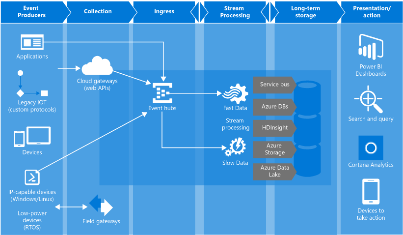

<properties
    pageTitle="什么是 Azure 事件中心以及为何使用 Azure 事件中心 | Azure"
    description="Azure 事件中心概述和简介 - 从网站、应用和设备进行云规模遥测引入"
    services="event-hubs"
    documentationcenter=".net"
    author="sethmanheim"
    manager="timlt"
    editor=""
    translationtype="Human Translation" />
<tags
    ms.assetid=""
    ms.service="event-hubs"
    ms.devlang="na"
    ms.topic="get-started-article"
    ms.tgt_pltfrm="na"
    ms.workload="na"
    ms.date="03/31/2017"
    wacn.date="05/08/2017"
    ms.author="sethm; babanisa"
    ms.sourcegitcommit="2c4ee90387d280f15b2f2ed656f7d4862ad80901"
    ms.openlocfilehash="55917df44200b416528b9bb8f77eadafcaf1f33a"
    ms.lasthandoff="04/28/2017" />

# 什么是 Azure 事件中心？
事件中心是一个高度可缩放的数据流平台，每秒能引入数百万个事件。 可使用任何实时分析提供程序或批处理/存储适配器转换和存储发送到事件中心的数据。 由于能够以较低的延迟和极高的规模提供发布订阅功能，事件中心可以充当大数据的“入口”。

## 为何使用事件中心？
事件中心事件和遥测处理功能使其特别适用于：

* 应用程序检测
* 用户体验或工作流处理
* 物联网 (IoT) 方案

事件中心还支持移动应用中的行为跟踪、从 Web 场中采集流量信息、控制台游戏中的游戏内事件捕获，或者从工业机器或互联汽车中收集遥测数据。

## Azure 事件中心概述
事件中心在解决方案体系结构中所扮演的常见角色是充当事件管道的“前门”，通常称为 *事件引入器*。 事件引入器是位于事件发布者与事件使用者之间的组件或服务，可以将事件流的生成与这些事件的使用分离开来。 下图显示了此体系结构：

Azure 事件中心是一种事件处理服务，用于提供云规模的事件与遥测引入，具有较低的延迟和较高的可靠性。 事件中心提供消息流处理功能，其特征不同于传统的企业消息传送。 事件中心功能围绕高吞吐量和事件处理方案而构建。 因此，事件中心未实现可用于消息传递实体（如主题）的某些消息传递功能。

事件中心在命名空间级别创建，并使用 AMQP 和 HTTP 作为其主 API 接口。

## 事件发布者
向事件中心发送数据的任何实体都称为“事件发布者” 。 事件发布者可以使用 HTTPS 或 AMQP 1.0 发布事件。 事件发布者使用共享访问签名 (SAS) 令牌在事件中心上标识自身，并且可以包含唯一标识，或使用常见的 SAS 令牌。

### 发布事件
可以通过 AMQP 1.0 或 HTTPS 发布事件。 服务总线提供了一个 [EventHubClient](https://docs.microsoft.com/zh-cn/dotnet/api/microsoft.servicebus.messaging.eventhubclient) 类，使用该类可从 .NET 客户端向事件中心发送事件。 对于其他运行时和平台，你可以使用任何 AMQP 1.0 客户端，例如 [Apache Qpid](http://qpid.apache.org/)。 可以逐个或者批量发送事件。 单个发布（事件数据实例）限制为 256 KB，无论其为单个事件还是批量事件。 发布大于此限制的事件将导致出错。 发布者最好是不知道事件中心内的分区数，而只是通过其 SAS 令牌指定 *分区键* （如下一部分所述）或其标识。

是要使用 AMQP 还 HTTPS 根据具体的使用方案而定。 AMQP 除了需要使用传输级别安全 (TLS) 或 SSL/TLS 以外，还需要建立持久的双向套接字。 初始化会话时，AMQP 具有较高的网络成本，但是 HTTPS 需要为每个请求使用额外的 SSL 开销。 对于活动频繁的发布者，AMQP 的性能更高。

事件中心可确保按顺序将共享分区键值的所有事件传送到同一分区。 如果将分区键与发布者策略结合使用，则发布者的标识与分区键的值必须匹配。 否则将会出错。

### 发布者策略
事件中心可让你通过 *发布者策略*对事件发布者进行精细控制。 发布者策略是运行时功能，旨在为大量的独立事件发布者提供方便。 借助发布者策略，每个发布者在使用以下机制将事件发布到事件中心时可以使用自身的唯一标识符。

    //[my namespace].servicebus.chinacloudapi.cn/[event hub name]/publishers/[my publisher name]

不需要提前创建发布者名称，但它们必须与发布事件时使用的 SAS 令牌匹配，以确保发布者标识保持独立。 使用发布者策略时， **PartitionKey** 值将设置为发布者名称。 若要正常工作，这些值必须匹配。

## 分区
事件中心使用分区使用者模式提供消息流式处理，在此模式下，每个使用者只读取消息流的特定子集或分区。 此模式允许以水平缩放规模进行事件处理，并提供其他面向流的功能，而队列和主题不能提供这些功能。

分区是事件中心内保留的有序事件。 较新的事件到达时，会将其添加到此序列的末尾。 可以将分区视为“提交日志”。

事件中心将在配置的保留时间内保留数据，该时间适用于事件中心的所有分区。 事件根据特定的时间过期；无法显式删除事件。 因为分区相互独立，并且包含其各自的数据序列，所以它们通常以不同的速率增长。

分区数在创建时指定，必须介于 2 到 32 之间。 分区计数不可更改，因此在设置分区计数时应考虑长期规模。 分区是一种数据组织机制，与使用方应用程序中所需的下游并行度相关。 事件中心的分区数与预期会有的并发读取者数直接相关。 可以通过联系事件中心团队将分区数增加到 32 个以上。

虽然可以标识分区并向其直接发送数据，但并不建议这样做， 而应使用[事件发布者](#event-publishers)和[容量](#capacity)部分介绍的更高级构造。 

分区中填充了一系列的事件数据，这些数据包含事件的正文、用户定义的属性包和元数据，例如，它在分区中的偏移量，以及它在流序列中的编号。

如需详细了解分区以及如何在可用性和可靠性之间进行取舍，请参阅[事件中心编程指南](/documentation/articles/event-hubs-programming-guide/#partition-key)和[事件中心中的可用性和一致性](/documentation/articles/event-hubs-availability-and-consistency/)这两篇文章。

### 分区键
可以使用[分区键](/documentation/articles/event-hubs-programming-guide/#partition-key)将传入事件数据映射到特定分区，以便进行数据组织。 分区键是发送者提供的、要传递给事件中心的值。 该键通过静态哈希函数进行处理，以便分配分区。 如果在发布事件时未指定分区键，则会使用循环分配。

事件发布者只知道其分区密钥，而不知道事件要发布到的分区。 键与分区的这种分离使发送者无需了解有关下游处理的过多信息。 每个设备或用户的唯一标识就可以充当一个适当的分区键，但是，也可以使用其他属性（例如地理位置），以便将相关的事件分组到单个分区中。

## SAS 令牌
事件中心使用在命名空间和事件中心级别提供的*共享访问签名*。 SAS 令牌是从 SAS 密钥生成的，它是以特定格式编码的 URL 的 SHA 哈希。 事件中心可以使用密钥（策略）的名称和令牌重新生成哈希，以便对发送者进行身份验证。 通常，为事件发布者创建的 SAS 令牌只对特定的事件中心具有 **发送** 权限。 此 SAS 令牌 URL 机制是“发布者策略”中介绍的发布者标识的基础。 有关使用 SAS 的详细信息，请参阅[使用服务总线进行共享访问签名身份验证](/documentation/articles/service-bus-sas/)。

## 事件使用者
从事件中心读取事件数据的任何实体均称为“事件使用者” 。 所有事件中心使用者都通过 AMQP 1.0 会话进行连接，事件将在可用时通过该会话传送。 客户端不需要轮询数据可用性。

### 使用者组
事件中心的发布/订阅机制通过“使用者组”启用。 使用者组是整个事件中心的视图（状态、位置或偏移量）。 使用者组使多个消费应用程序都有各自独立的事件流视图，并按自身步调和偏移量独立读取流。

在流处理体系结构中，每个下游应用程序相当于一个使用者组。 如果要将事件数据写入长期存储，则该存储写入器应用程序就是一个使用者组。 然后，复杂的事件处理可由另一个独立的使用者组执行。 你只能通过使用者组访问分区。 每个分区一次只能有一个 **来自给定使用者组** 的活动读取者。 事件中心内始终有一个默认的使用者组，最多可为一个标准层事件中心创建 20 个使用者组。

以下是使用者组 URI 约定的示例：

    //[my namespace].servicebus.chinacloudapi.cn/[event hub name]/[Consumer Group #1]
    //[my namespace].servicebus.chinacloudapi.cn/[event hub name]/[Consumer Group #2]

下图显示了事件中心流处理体系结构：

### 流偏移量
偏移量  是事件在分区中的位置。 可以将偏移量视为客户端游标。 偏移量是事件的字节编号。 有了该偏移量，事件使用者（读取者）便可以在事件流中指定要从其开始读取事件的点。 可以时间戳或者偏移量值的形式指定偏移量。 使用者负责在事件中心服务的外部存储其自身的偏移量值。 在分区中，每个事件都包含一个偏移量。

### 检查点
*检查点* 是读取者在分区事件序列中标记或提交其位置时执行的过程。 检查点操作由使用者负责，并在使用者组中的每个分区上进行。 这种责任意味着，对于每个使用者组而言，每个分区读取者必须跟踪它在事件流中的当前位置，当它认为数据流已完成时，可以通知服务。

如果读取者与分区断开连接，当它重新连接时，将开始读取前面由该使用者组中该分区的最后一个读取者提交的检查点。 当读取者建立连接时，它会将此偏移量传递给事件中心，以指定要从其开始读取数据的位置。 这样，用户便可以使用检查点将事件标记为已由下游应用程序“完成”，并且在不同计算机上运行的读取者之间发生故障转移时，还可以提供弹性。 若要返回到较旧的数据，可以在此检查点过程中指定较低的偏移量。 借助此机制，检查点可以实现故障转移复原和事件流重放。

### 常见的使用者任务
所有事件中心使用者都通过 AMQP 1.0 会话和状态感知双向信道进行连接。 每个分区都提供一个 AMQP 1.0 会话，方便传输按分区隔离的事件。

#### 连接到分区
在连接到分区时，常见的做法是使用租用机制来协调读取者与特定分区的连接。 这样，便可以做到一个使用者组中每分区只有一个活动的读取者。 使用 .NET 客户端的 [EventProcessorHost](https://docs.microsoft.com/zh-cn/dotnet/api/microsoft.servicebus.messaging.eventprocessorhost) 类可以简化检查点、租用和读取者管理功能。 事件处理程序主机是智能使用者代理。

#### 读取事件
为特定分区建立 AMQP 1.0 会话和链接后，事件中心服务会将事件传送到 AMQP 1.0 客户端。 与 HTTP GET 等基于提取的机制相比，此传送机制可以实现更高的吞吐量和更低的延迟。 将事件发送到客户端时，每个事件数据实例将包含重要的元数据，例如，用于简化对事件序列执行的检查点操作的偏移量和序列号。

事件数据：

* Offset
* 序列号
* 正文
* 用户属性
* 系统属性

用户负责管理偏移量。

## 容量
事件中心具有高度可缩放的并行体系结构，在调整大小和缩放时需要考虑几个主要因素。

### 吞吐量单位
事件中心的吞吐量容量由吞吐量单位 控制。 吞吐量单位是预先购买的容量单位。 单个吞吐量单位包括以下容量：

* 入口：最高每秒 1 MB 或每秒 1000 个事件（以先达到的限制为准）
* 出口：最高每秒 2 MB

若超过所购买吞吐量单位的容量，将限制入口流入量并返回 [ServerBusyException](https://docs.microsoft.com/zh-cn/dotnet/api/microsoft.azure.eventhubs.serverbusyexception) 。 出口不会出现限制异常，但仍受限于所购买吞吐量单位的容量。 如果收到发布速率异常或者预期看到更高的出口，请务必检查为命名空间购买的吞吐量单位数量。 可以在 [Azure 门户][Azure 门户]中命名空间的“规模”边栏选项卡上管理吞吐量单位。 也可使用 Azure API 以编程方式管理吞吐量单位。

吞吐量单位按小时计费，需提前购买。 购买后，吞吐量单位的最短计费时限为一小时。 最多可为事件中心命名空间购买 20 个吞吐量单位，并在命名空间中的所有事件中心之间共享。

联系 Azure 支持，可按 20 个单位为一块的方式，购买更多的吞吐量单位（最多 100 个）。 除此之外，也可以购买包含 100 个吞吐量单位的块。

建议权衡吞吐量单位和分区数目，从而实现最佳缩放。 一个分区最多只能缩放一个吞吐量单位。 吞吐量单位数应小于或等于事件中心内的分区数。

有关详细定价信息，请参阅 [事件中心定价](/pricing/details/event-hubs/)。

## 后续步骤

* 使用[事件中心教程][Event Hubs tutorial]入门
* [事件中心编程指南](/documentation/articles/event-hubs-programming-guide/)
* [事件中心中的可用性和一致性](/documentation/articles/event-hubs-availability-and-consistency/)
* [事件中心常见问题](/documentation/articles/event-hubs-faq/)
* [使用事件中心的示例应用程序]

[Event Hubs tutorial]: /documentation/articles/event-hubs-dotnet-standard-getstarted-send/
[使用事件中心的示例应用程序]: https://github.com/Azure/azure-event-hubs/tree/master/samples
[Azure 门户]: https://portal.azure.cn

<!--Update_Description:update meta properties;wording update；update reference link-->