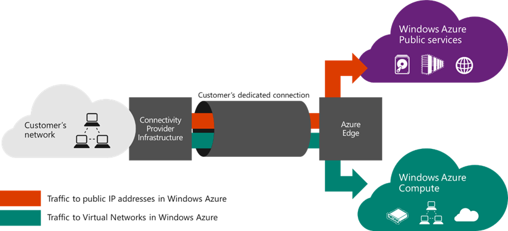

<properties 
   pageTitle="ExpressRoute 线路和路由域 | Azure"
   description="本页提供 ExpressRoute 线路和路由域的概述。"
   documentationCenter="na"
   services="expressroute"
   authors="cherylmc"
   manager="carolz"
   editor=""/>
<tags 
   ms.service="expressroute"
   ms.date="03/21/2016"
   wacn.date="06/06/2016"/>

# ExpressRoute 线路和路由域

 你必须订购一条 *ExpressRoute 线路*，以通过连接服务提供商将你的本地基础结构连接到 Azure。下图提供了你的 WAN 与 Azure 之间的连接的逻辑表示形式。

## ExpressRoute 线路

*ExpressRoute 线路*表示通过连接服务提供商在本地基础结构与 Azure 云服务之间建立的逻辑连接。你可以订购多条 ExpressRoute 线路。每条线路可以位于相同或不同的区域，且可以通过不同的连接服务提供商连接到各个场地。

ExpressRoute 线路不会映射到任何物理设备。线路由一个称为服务密钥 (s-key) 的标准 GUID 进行唯一标识。服务密钥是在  Azure、连接服务提供商与你之间唯一交换的信息。服务密钥不是用于保证安全的机密。ExpressRoute 线路与服务密钥之间存在 1:1 的映射。

ExpressRoute 线路最多可以有两个独立的对等互连：Azure 公共和Azure 专用。每个对等互连是一对独立的 BGP 会话，每个会话采用冗余配置以实现高可用性。ExpressRoute 线路与路由域之间存在 1:N (1 <= N <= 2) 映射。每条 ExpressRoute 线路可以启用一个或两个对等互连。
 
每条线路有固定的带宽（50 Mbps、100 Mbps、200 Mbps、500 Mbps、1 Gbps、10 Gbps），并映射到连接服务提供商和对等互连位置。选择的带宽在线路的所有对等互连之间共享。

### 配额、限制和局限性

每条 ExpressRoute 线路应用默认的配额和限制。有关最新的配额信息，请参阅 [Azure 订阅和服务限制、配额与约束](/documentation/articles/azure-subscription-service-limits/)。

## ExpressRoute 路由域

一条 ExpressRoute 线路有两个关联的路由域：Azure 公共和Azure 专用。在一组路由器上，每个路由域采用相同的配置（主动-主动，或负载分担）以实现高可用性。Azure 服务分类为 *Azure 公共*和 *Azure 专用*来表示 IP 寻址方案。

### 专用对等互连

可以通过专用对等域来连接虚拟网络内部署的 Azure 计算服务（即虚拟机 (IaaS) 和云服务 (PaaS)）。专用对等域被视为进入 Azure 的核心网络的受信任扩展。可以在核心网络和 Azure 虚拟网络 (VNet) 之间设置双向连接。这样，你便可以使用专用 IP 地址直接连接到虚拟机和云服务。

可以将多个虚拟网络连接到专用对等域。有关限制和局限性的信息请查看[常见问题页](/documentation/articles/expressroute-faqs/)。有关最新的限制信息，请访问 [Azure 订阅和服务限制、配额与约束](/documentation/articles/azure-subscription-service-limits/)。有关路由配置的详细信息，请参阅[路由](/documentation/articles/expressroute-routing/)页。

### 公共对等互连

Azure 存储空间、SQL 数据库和 Web 应用等服务是使用公共 IP 地址提供的。你可以通过公共对等路由域私下连接到公共 IP 地址（包括云服务的 VIP）上托管的服务。可以将公共对等域连接到外围网络，并从 WAN 连接到公共 IP 地址上的所有 Azure 服务，而无需通过 Internet 连接。

始终会从 WAN 发起到 Azure 服务的连接。Azure 服务无法通过此路由域发起到你网络的连接。启用公共对等互连后，你将能够连接到所有 Azure 服务。我们不允许选择要将路由播发到的服务。可以通过世纪互联客服来查询 Azure 通过此对等互连播发给你的前缀列表。

你可以在网络中定义自定义路由筛选器，以只使用所需的路由。有关路由配置的详细信息，请参阅[路由](/documentation/articles/expressroute-routing/)页。你可以在网络中定义自定义路由筛选器，以只使用所需的路由。

有关通过公共对等路由域支持的服务的详细信息，请参阅[常见问题页](/documentation/articles/expressroute-faqs/)。
 
## 路由域比较

下表比较了两种路由域。

||**专用对等互连**|**公共对等互连**|
|---|---|---|---|
|**每个对等互连支持的最大前缀数**|默认为 4000，使用 ExpressRoute 高级版时为 10,000|200|
|**支持的 IP 地址范围**|WAN 中任何有效的 IPv4 地址|由你或者你的连接提供商拥有的公共 IPv4 地址|
|**AS 编号要求**|专用和公共 AS 编号。客户必须拥有公共 AS 编号。|专用和公共 AS 编号。客户必须拥有公共 AS 编号。|
|**路由接口 IP 地址**|RFC1918 和公共 IP 地址|在路由注册表中为客户注册的公共 IP 地址。| 
|**MD5 哈希支持**| 是|是|

你可以选择启用一个或多个路由域作为 ExpressRoute 线路的一部分。若要将这些路由域合并成单个路由域，可以选择将所有路由域放置在同一个 VPN 中。此外，可以如图所示，将它们放置在不同的路由域中。建议的配置是将专用对等域直接连接到核心网络，并将公共对等域连接到外围网络。
 
如果你选择使用所有两个对等会话，必须使用两对 BGP 会话（每一对用于一个对等类型）。BGP 会话对提供高度可用的链接。如果你要通过第 2 层连接服务提供商进行连接，则需要负责配置和管理路由。可以通过查看设置 ExpressRoute 的[工作流](/documentation/articles/expressroute-workflows/)来了解详细信息

## 后续步骤

- 查找服务提供商。请参阅 [ExpressRoute 服务提供商和位置](/documentation/articles/expressroute-locations/)。
- 确保符合所有先决条件。请参阅 [ExpressRoute 先决条件](/documentation/articles/expressroute-prerequisites/)。
- 配置 ExpressRoute 连接。
	- [创建 ExpressRoute 线路](/documentation/articles/expressroute-howto-circuit-classic/)
	- [配置路由（线路对等互连）](/documentation/articles/expressroute-howto-routing-classic/)
	- [将 VNet 链接到 ExpressRoute 线路](/documentation/articles/expressroute-howto-linkvnet-classic/)

<!---HONumber=82-->