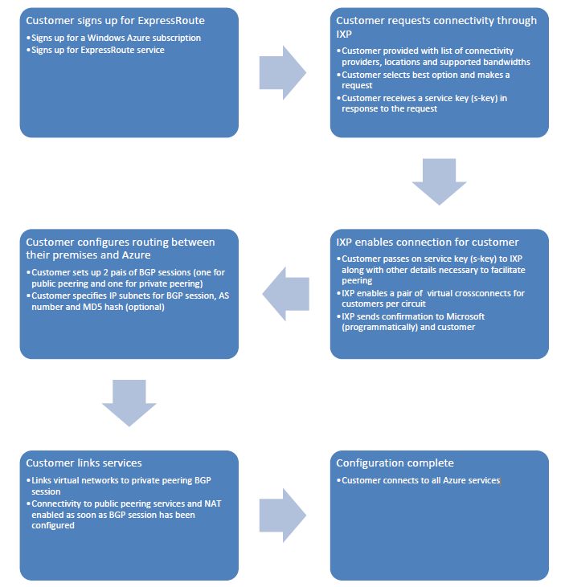

<properties
   pageTitle="通过 Exchange 提供商配置 ExpressRoute"
   description="本教程将指导你通过 Exchange 提供商 (EXP) 设置 ExpressRoute。"
   documentationCenter="na"
   services="expressroute"
   authors="cherylmc"
   manager="carolz"
   editor="tysonn" />
<tags
   ms.service="expressroute"
   ms.date="07/28/2015"
   wacn.date=""/>

#  通过 Exchange 提供商配置 ExpressRoute 连接

要通过 Exchange 提供商配置 ExpressRoute 连接，你需要按正确的顺序完成多个步骤。这些说明将帮助你完成以下操作：

- 创建和管理 ExpressRoute 线路
- 为 ExpressRoute 线路配置 BGP 对等互连
- 将虚拟网络连接到 ExpressRoute 线路

##  配置先决条件

在开始配置之前，请确认你满足以下先决条件：

- Azure 订阅
- 最新版本的 Azure PowerShell
- 以下虚拟网络要求：
	- 一组要在 Azure 的虚拟网络中使用的 IP 地址前缀
	- 一组本地 IP 前缀（可以包含公共 IP 地址）
	- 虚拟网络网关必须使用 /28 子网创建。
	- 虚拟网络外部的一组附加 IP 前缀 (/28)。这将用于配置 BGP 对等互连。
	- 你的网络的 AS 编号。有关 AS 编号的详细信息，请参阅[自治系统 (AS) 编号](http://www.iana.org/assignments/as-numbers/as-numbers.xhtml)。
	- MD5 哈希（如果你需要经过验证的 BGP 会话）
	- 用于发送流量的 VLAN ID。每条线路需要 2 个 VLAN ID：一个用于虚拟网络，另一个用于公共 IP 地址上托管的服务。
	- 网络的[自治系统 (AS) 编号](http://www.iana.org/assignments/as-numbers/as-numbers.xhtml)。
	- 连接到 Exchange 提供商的以太网交换机的两个 1 Gbps/10 Gbps 交叉连接。
	- 一对能够支持 BGP 进行路由的路由器

##  部署工作流

##  使用 PowerShell 配置设置

Windows PowerShell 是一个功能强大的脚本编写环境，可用于在 Azure 中控制和自动执行工作负荷的部署和管理。有关详细信息，请参阅 [MSDN](https://msdn.microsoft.com/zh-cn/library/azure/jj156055.aspx) 中的 PowerShell 文档。

1. **为 ExpressRoute 导入 PowerShell 模块。**

	    Import-Module 'C:\Program Files (x86)\Microsoft SDKs\Azure\PowerShell\ServiceManagement\Azure\Azure.psd1'
	    Import-Module 'C:\Program Files (x86)\Microsoft SDKs\Azure\PowerShell\ServiceManagement\Azure\ExpressRoute\ExpressRoute.psd1'

2. **获取支持的提供商、位置和带宽的列表。**

	在创建线路之前，你需要服务提供商、支持的位置和每个位置的带宽选项的列表。以下 PowerShell cmdlet 将返回此信息，你将在后面的步骤中使用该信息。

    	PS C:\> Get-AzureDedicatedCircuitServiceProvider
		**The information returned will look similar to the example below:**

		Name                 DedicatedCircuitLocations      DedicatedCircuitBandwidths
		----                 -------------------------      --------------------------
		AT&T                 Silicon Valley,Washington DC   10Mbps:10, 50Mbps:50, 100Mbps:100, 500Mbps:500, 1Gbps:1000
		British Telecom      London,Amsterdam               10Mbps:10, 50Mbps:50, 100Mbps:100, 500Mbps:500, 1Gbps:1000
		Equinix              Amsterdam,Atlanta,Chicago,Dall 200Mbps:200, 500Mbps:500, 1Gbps:1000, 10Gbps:10000
		                     as,New York,Seattle,Silicon
		                     Valley,Washington
		                     DC,London,Hong
		                     Kong,Singapore,Sydney,Tokyo
		IIJ                  Tokyo                          10Mbps:10, 50Mbps:50, 100Mbps:100, 500Mbps:500, 1Gbps:1000
		Level 3              London,Silicon                 200Mbps:200, 500Mbps:500, 1Gbps:1000
		Communications -     Valley,Washington DC
		Exchange
		Level 3              London,Silicon                 10Mbps:10, 50Mbps:50, 100Mbps:100, 500Mbps:500, 1Gbps:1000
		Communications -     Valley,Washington DC
		IPVPN
		Orange               Amsterdam,London               10Mbps:10, 50Mbps:50, 100Mbps:100, 500Mbps:500, 1Gbps:1000
		SingTel Domestic     Singapore                      10Mbps:10, 50Mbps:50, 100Mbps:100, 500Mbps:500, 1Gbps:1000
		SingTel              Singapore                      10Mbps:10, 50Mbps:50, 100Mbps:100, 500Mbps:500, 1Gbps:1000
		International
		TeleCity Group       Amsterdam,London               200Mbps:200, 500Mbps:500, 1Gbps:1000, 10Gbps:10000
		Telstra Corporation  Sydney                         10Mbps:10, 50Mbps:50, 100Mbps:100, 500Mbps:500, 1Gbps:1000
		Verizon              Silicon Valley,Washington DC   10Mbps:10, 50Mbps:50, 100Mbps:100, 500Mbps:500, 1Gbps:1000

3. **创建专用缓存**

	以下示例演示如何通过 Equinix Silicon Valley 创建 200 Mbps 的 ExpressRoute 线路。如果你使用的是其他提供商和其他设置，请在发出请求时替换该信息。

	下面是请求新的服务密钥的示例：

		#Creating a new circuit
		$Bandwidth = 200
		$CircuitName = "EquinixSVTest"
		$ServiceProvider = "Equinix"
		$Location = "Silicon Valley"

		New-AzureDedicatedCircuit -CircuitName $CircuitName -ServiceProviderName $ServiceProvider -Bandwidth $Bandwidth -Location $Location

		#Getting service key
		Get-AzureDedicatedCircuit

	响应将如下例所示：

		Bandwidth                        : 200
		CircuitName                      : EquinixSVTest
		Location                         : Silicon Valley
		ServiceKey                       : *********************************
		ServiceProviderName              : equinix
		ServiceProviderProvisioningState : NotProvisioned
		Status                           : Enabled

	你可以随时使用 Get-AzureCircuit cmdlet 检索此信息。进行不带任何参数的调用将列出所有线路。你的服务密钥将在 ServiceKey 字段中列出。

		PS C:\> Get-AzureDedicatedCircuit

		Bandwidth                        : 200
		CircuitName                      : EquinixSVTest
		Location                         : Silicon Valley
		ServiceKey                       : *********************************
		ServiceProviderName              : equinix
		ServiceProviderProvisioningState : NotProvisioned
		Status                           : Enabled

4. **将服务密钥发送给你的 Exchange 提供商。**

	你的 Exchange 提供商将使用服务密钥启用其连接端。你必须向连接提供商提供其他信息以启用连接。

5. **定期检查服务密钥的状态。**

	这样，你就知道提供商何时启用了你的线路。启用线路后，*ServiceProviderProvisioningState* 将显示为*Provisioned*，如下例所示。

		PS C:\> Get-AzureDedicatedCircuit

		Bandwidth                        : 200
		CircuitName                      : EquinixSVTest
		Location                         : Silicon Valley
		ServiceKey                       : *********************************
		ServiceProviderName              : equinix
		ServiceProviderProvisioningState : Provisioned
		Status                           : Enabled

6. **配置虚拟网络的路由。**

	我们使用 BGP 会话交换路由，同时也确保我们具有高可用性。使用下面的示例为你的线路创建 BGP 会话。创建会话时，请替换为你自己的值。

		#Setting up a bgp session
		$ServiceKey = "<your key>"
		$PriSN = "<subnet/30 you use IP #1 and Azure uses IP #2>"
		$SecSN = "<subnet/30 use IP #1 and Azure uses IP #2>"
		$ASN = <your ASN>
		$VLAN = <your vlan ID>

		#Create a new bgp peering session
		New-AzureBGPPeering -ServiceKey $ServiceKey -PrimaryPeerSubnet $PriSN -SecondaryPeerSubnet $SecSN -PeerAsn $ASN VlanId $VLAN –AccessType Private
		#Get BGP parameters and Azure ASN
		Get-AzureBGPPeering -ServiceKey $ServiceKey –AccessType Private
		#Update BGP peering config
		Set-AzureBGPPeering  -ServiceKey $ServiceKey -PrimaryPeerSubnet $PriSN -SecondaryPeerSubnet $SecSN -PeerAsn $ASN -VlanId $VLAN –AccessType Private
		#Removing BGP peering config
		Remove-AzureBGPPeering -ServiceKey $ServiceKey –AccessType Private

	你可以通过提供服务密钥使用 Get-AzureBGPPeering 获取线路的路由信息。你还可以使用 Set-AzureBGPPeering 更新 BGP 设置。运行此命令时，将不会显示 BGP 会话。线路必须至少与一个 VNet 连接，才能启动 BGP 会话。

	下面的响应将为你提供执行后续步骤所需的信息。使用对等 ASN 在路由器的 VRF 上配置 BGP。

		PS C:\> New-AzureBGPPeering -ServiceKey $ServiceKey -PrimaryPeerSubnet $PriSN -SecondaryPeerSubnet $SecSN -PeerAsn $ASN -VlanId $VLAN –AccessType Private

		AzureAsn            : 12076
		PeerAsn             : 65001
		PrimaryAzurePort    : EQIX-SJC-06GMR-CIS-1-PRI-A
		PrimaryPeerSubnet   : 10.0.1.0/30
		SecondaryAzurePort  : EQIX-SJC-06GMR-CIS-2-SEC-A
		SecondaryPeerSubnet : 10.0.2.0/30
		State               : Enabled
		VlanId              : 100

7. **配置公共 IP 地址上托管的服务的路由。**

	我们使用 BGP 会话交换路由，同时也确保我们具有高可用性。使用下面的示例为你的线路创建 BGP 会话。创建会话时，请替换为你自己的值。

		#Setting up a bgp session
		$ServiceKey = "<your key>"
		$PriSN = "<subnet/30 subnet you use IP #1 and Azure uses IP #2>"
		$SecSN = "< subnet/30 subnet you use IP #1 and Azure uses IP #2>"
		$ASN = <your ASN>
		$VLAN = <your vlan ID>

		#Create a new bgp peering session
		New-AzureBGPPeering -ServiceKey $ServiceKey -PrimaryPeerSubnet $PriSN -SecondaryPeerSubnet $SecSN -PeerAsn $ASN -VlanId $VLAN –AccessType Public
		#Get BGP parameters and Azure ASN
		Get-AzureBGPPeering -ServiceKey $ServiceKey –AccessType Public
		#Update BGP peering config
		Set-AzureBGPPeering  -ServiceKey $ServiceKey -PrimaryPeerSubnet $PriSN -SecondaryPeerSubnet $SecSN -PeerAsn $ASN -VlanId $VLAN –AccessType Public
		#Removing BGP peering config
		Remove-AzureBGPPeering -ServiceKey $ServiceKey –AccessType Public

	你可以通过提供服务密钥使用 Get-AzureBGPPeering 获取线路的路由信息。你还可以使用 Set-AzureBGPPeering 更新 BGP 设置。运行此命令时，将不会显示 BGP 会话。线路必须至少与一个 VNet 连接，才能启动 BGP 会话。

	下面的响应将为你提供执行后续步骤所需的信息。使用对等 ASN 在路由器的 VRF 上配置 BGP。

		PS C:\> New-AzureBGPPeering -ServiceKey $ServiceKey -PrimaryPeerSubnet $PriSN -SecondaryPeerSubnet $SecSN -PeerAsn $ASN -VlanId $VLAN –AccessType Private

		AzureAsn            : 12076
		PeerAsn             : 65001
		PrimaryAzurePort    : EQIX-SJC-06GMR-CIS-1-PRI-A
		PrimaryPeerSubnet   : 10.0.1.8/30
		SecondaryAzurePort  : EQIX-SJC-06GMR-CIS-2-SEC-A
		SecondaryPeerSubnet : 10.0.2.8/30
		State               : Enabled
		VlanId              : 101

8. **配置虚拟网络和网关。**

	请参阅[为 ExpressRoute 配置虚拟网络和网关](/documentation/articles/expressroute-configuring-vnet-gateway)。请注意，网关子网必须是 /28 才能用于 ExpressRoute 连接。

9. **将你的网络连接到线路。** 只有在你已确认线路已转为以下状态后，才继续按下面的说明进行操作：
	- ServiceProviderProvisioningState：已设置
	- 状态：已启用

			PS C:\> $Vnet = "MyTestVNet"
			New-AzureDedicatedCircuitLink -ServiceKey $ServiceKey -VNetName $Vnet
 
## 后续步骤

- 有关 ExpressRoute 的详细信息，请参阅 [ExpressRoute 常见问题](/documentation/articles/expressroute-faqs)。

<!---HONumber=69-->