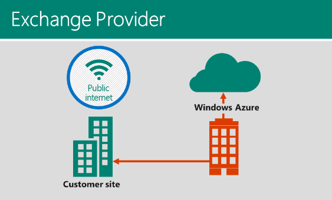

<properties 
   pageTitle="ExpressRoute 简介 | Windows Azure"
   description="本页提供 ExpressRoute 服务的概述，包括 ExpressRoute 连接的工作方式、使用 Exchange 提供商和网络服务提供商，以及 ExpressRoute 公共对等互连、专用对等互连和 Microsoft 对等互连。"
   documentationCenter="na"
   services="expressroute"
   authors="cherylmc"
   manager="adinah"
   editor="tysonn"/>
<tags 
   ms.service="expressroute"
   ms.date="06/15/2015"
   wacn.date="11/02/2015"/>

# ExpressRoute 技术概述

使用 Windows Azure ExpressRoute，可在 Azure 数据中心与你的本地环境或第三方托管设施环境中的基础结构之间创建专用连接。使用 ExpressRoute，你可以通过 ExpressRoute 合作伙伴的网络设施中建立与 Azure 的连接。
 
与通过 Internet 的典型连接相比，ExpressRoute 连接提供更高的安全性、更多的可靠性、更快的速度和更少的延迟。在某些情况下，使用 ExpressRoute 连接在本地网络和 Azure 之间传输数据还可以产生显著的成本效益。如果你已创建从本地网络到 Azure 的跨界连接，则可以在不改动虚拟网络的情况下迁移到 ExpressRoute 连接。

有关详细信息，请参阅 [ExpressRoute 常见问题](/documentation/articles/expressroute-faqs)。

## ExpressRoute 连接的工作原理

若要将本地网络连接到Azure云服务，你必须通过连接提供商订购并启用两条专用线路。

## 连接提供商

接连提供商示意图如下：

| |**连接提供商**|
|---|---|
|**典型连接模型**| 点对点以太网链接|
|**支持的带宽**|200 Mbps、500 Mbps、1 Gbps 和 10 Gbps|
|**路由**|直接使用客户边缘路由器建立 BGP 会话| 

### 连接提供商
我们与中国电信合作提供点到点连接服务，以帮助在 Azure 与客户本地之间建立连接。我们提供从 200 Mbps 到 10 Gbps（200 Mbps、500 Mbps、1 Gbps 和 10 Gbps）的线路带宽。

如果你想要通过连接提供商建立第 3 层直接连接，可以采用以下方法：

- 你可以与连接提供商（例如 中国电信）合作，以便在数据中心与 Azure 之间设置以太网线路。 

我们需要你建立冗余连接，以满足我们的 SLA 要求。我们不支持直接连接到Azure边缘路由器。专用线路始终应通过连接提供商启用。尽管这样会在 Azure 与你的网络之间建立第 2 层连接，但我们不支持网络的 2 层扩展。你必须在边缘路由器与 Azure 边缘路由器之间设置冗余路由会话，以建立第 3 层连接。

若要了解有关配置的详细信息并查看实际示例，你可以遵循以下分步指南操作：[通过 Exchange 提供商配置 ExpressRoute 连接](/documentation/articles/expressroute-configuring-exps)。

## ExpressRoute 对等互连
下图提供了你的网络与 Azure 之间的连接的逻辑表示形式。你必须通过连接提供商订购两条*专用线路*，才能将你的网络连接到 Azure。专用线路表示通过连接提供商在你的网络与 Azure 之间建立的逻辑连接。你可以订购许多的专用线路，每个线路可部署在相同或不同的区域，并可以通过不同的连接提供商连接到你的网络环境。

一条专用线路具有两个关联的路由域 - 公共域、专用域。在一组路由器上，每个路由域采用相同的配置（主动-主动，或负载分担）以实现高可用性。

### 专有对等互连
可以通过专用对等域来连接虚拟网络内部署的 Azure 计算服务（即虚拟机 (IaaS) 和云服务 (PaaS)）。专用对等域被视为进入 Azure 的核心网络的受信任扩展。可以在核心网络和 Azure 虚拟网络 (VNet) 之间设置双向连接。这样，将便可以使用专用 IP 地址直接连接到虚拟机和云服务。

可以将多个虚拟网络连接到专用对等域。有关限制和局限性的信息请查看[常见问题页](/documentation/articles/expressroute-faqs)。
  

### 公共对等互连
Azure 存储空间、SQL Database 和网站等服务是使用公共 IP 地址提供的。你可以通过公共对等路由域接到公共 IP 地址（包括云服务的 VIP）上托管的服务。可以将公共对等域连接到 Extranet，并从客户网络连接到公共 IP 地址上的所有 Azure 服务，而无需通过 Internet 连接。始终会从客户网络发起到 Windows Azure 服务的连接。Windows Azure 服务无法通过此路由域发起到你网络的连接。启用公共对等互连后，你将能够连接到所有 Azure 服务。我们不允许选择要将路由播发到的服务。可以在 [Windows Azure 数据中心 IP 范围](http://www.microsoft.com/download/details.aspx?id=41653)页上查看我们通过此对等互连播发给你的前缀列表。你可以在网络中定义自定义路由筛选器，以只使用所需的路由。

有关通过公共对等路由域支持的服务的详细信息，请查看[常见问题页](/documentation/articles/expressroute-faqs)。

你可以选择启用一个或多个路由域作为专用线路的一部分。建议的配置是将专用对等域直接连接到Azure虚拟网络，并将公共对等链接连接到 Extranet。
 
如果你选择使用所有两个对等会话，必须使用两对 BGP 会话（每一对用于一个对等类型）。BGP 会话提供了高可用的链接，你则需要负责配置和管理路由。可以通过查看设置 ExpressRoute 的工作流来了解详细信息

## 后续步骤

- 查找连接提供商。请参阅 [ExpressRoute 提供商和位置](/documentation/articles/expressroute-locations)。
- 配置 ExpressRoute 连接。有关说明，请参阅[通过 Exchange 提供商配置 ExpressRoute 连接](/documentation/articles/expressroute-configuring-exps)。 

<!---HONumber=69-->