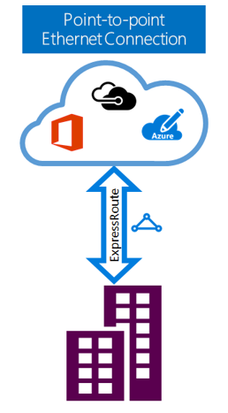

<properties 
   pageTitle="ExpressRoute 简介 | Azure"
   description="本页提供 ExpressRoute 服务的概述，包括 ExpressRoute 连接的工作原理。"
   documentationCenter="na"
   services="expressroute"
   authors="cherylmc"
   manager="carmonm"
   editor=""/>
<tags 
   ms.service="expressroute"
   ms.date="05/02/2016"
   wacn.date="06/06/2016"/>

# ExpressRoute 技术概述

Azure ExpressRoute 可让你通过连接服务提供商所提供的专用连接，将本地网络扩展到 Azure 云。使用 ExpressRoute 可与 Azure云服务建立连接。可以从任意位置之间的 (IP VPN) 网络、点到点以太网或在共置设施上通过连接服务提供商的虚拟交叉连接来建立这种连接。ExpressRoute 连接不通过公共 Internet 。与通过 Internet 的典型连接相比，ExpressRoute 连接提供更高的可靠性、更快的速度、更低的延迟和更高的安全性。

**主要优势包括：**

- 通过连接服务提供商在本地网络与 Azure 云之间建立第 3 层连接。可以从任意位置之间的 (IPVPN) 网络、点到点以太网，或通过以太网交换经由虚拟交叉连接来建立这种连接。
- 跨地缘政治区域中的所有区域连接到 Azure 云服务。
- 通过 ExpressRoute 高级版附加组件从全球连接到所有区域的 Azure 服务。
- 通过行业标准协议 (BGP) 在你的网络与 Azure 之间进行动态路由。
- 在每个对等位置提供内置冗余以提高可靠性。
- 连接运行时间 [SLA](/support/legal/sla/)。

有关详细信息，请参阅 [ExpressRoute 常见问题](/documentation/articles/expressroute-faqs/)。

## 如何使用 ExpressRoute 将我的网络连接到 Azure？

可以通过以下方法在本地网络与 Azure 云之间建立连接。

**点到点以太网连接。** 你可以通过点到点以太网链路，将本地数据中心/办公室连接到 Azure 云。点到点以太网提供商可以在你的站点与 Azure 云之间提供第 2 层连接。

## ExpressRoute 功能

ExpressRoute 支持以下特性和功能。

### 第 3 层连接

Azure 采用行业标准动态路由协议 (BGP)，在本地网络、Azure 中的实例和 Azure 公共地址之间交换路由。我们根据不同的流量配置文件来与网络建立多个 BGP 会话。有关详细信息，请参阅 [ExpressRoute 线路和路由域](/documentation/articles/expressroute-circuit-peerings/)一文。

### 冗余

每个 ExpressRoute 线路有两道连接，用于从连接服务提供商/你的网络边缘连接到两个 Azure 企业边缘路由器 (MSEE)。 Azure 要求从连接服务提供商/你的一端建立双重 BGP 连接 – 各自连接到每个 MSEE。你可以选择不要在你的一端部署冗余设备/以太网路线。但是，连接服务提供商会使用冗余设备，确保以冗余方式将你的连接移交给 Azure。冗余的第 3 层连接配置是 Azure [SLA](/support/legal/sla/) 生效的条件。

### 与 Azure 云服务建立连接

通过 ExpressRoute 连接可访问以下服务。

- Azure 服务

 
你可以访问 [ExpressRoute 常见问题](/documentation/articles/expressroute-faqs/)页，以获取通过 ExpressRoute 支持的服务的详细列表。

### 与地缘政治区域中的所有区域建立连接

可以在我们的某个[对等位置](/documentation/articles/expressroute-locations/)连接到 Azure，然后访问该地缘政治区域中的所有区域。

例如，如果你在北京通过 ExpressRoute 连接到 Azure，则就能够访问在上海托管的所有 Azure 云服务。

### 支持的带宽选项

你可以购买各种带宽的 ExpressRoute 线路。支持的带宽列表如下。请务必咨询连接服务提供商，以获取他们支持的带宽列表。

- 50 Mbps
- 100 Mbps
- 200 Mbps
- 500 Mbps
- 1 Gbps
- 2 Gbps
- 5 Gbps
- 10 Gbps

### 动态调整带宽

你可以在不中断连接的情况下增大 ExpressRoute 线路带宽（尽最大努力）。

### 弹性计费模式

你可以选择最适合自己的计费模式。请从以下计费模式中选择。有关详细信息，请参阅 [ExpressRoute 常见问题](/documentation/articles/expressroute-faqs/)页。

- **无限制数据**。ExpressRoute 线路按月计费，所有入站和出站数据传输不收取费用。 
- **计量数据**。ExpressRoute 线路按月计费。所有入站数据传输免费。出站数据传输按每 GB 数据传输计费。数据传输费率根据区域不同而异。
- **ExpressRoute 高级版附加组件**。ExpressRoute 高级版是 ExpressRoute 线路上的附加组件。ExpressRoute 高级版附加组件提供以下功能： 
	- 提高 Azure 公共和 Azure 专用对等互连的路由限制，从4,000 路由提升至 10,000 路由。
	- 服务的跨地缘政治区域连接。在任何区域创建的 ExpressRoute 线路都将能够访问位于其他区域的资源。例如，创建于中国北部的虚拟网络可以通过在中国东部设置的 ExpressRoute 线路进行访问。
	- 增加了每个 ExpressRoute 线路的 VNet 链接数量，从 10 增加至更大的限制，具体取决于线路的带宽。

## 后续步骤

- 了解 ExpressRoute 连接和路由域。请参阅 [ExpressRoute 线路和路由域](/documentation/articles/expressroute-circuit-peerings/)。
- 查找服务提供商。请参阅 [ExpressRoute 合作伙伴和对等位置](/documentation/articles/expressroute-locations/)。
- 确保符合所有先决条件。请参阅 [ExpressRoute 先决条件](/documentation/articles/expressroute-prerequisites/)。
- 请参阅[路由](/documentation/articles/expressroute-routing/)的要求。
- 配置 ExpressRoute 连接。
	- [创建 ExpressRoute 线路](/documentation/articles/expressroute-howto-circuit-classic/)
	- [配置路由](/documentation/articles/expressroute-howto-routing-classic/)
	- [将 VNet 链接到 ExpressRoute 线路](/documentation/articles/expressroute-howto-linkvnet-classic/)

<!---HONumber=Mooncake_0104_2016-->