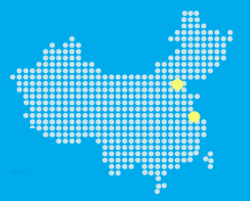

<properties
   pageTitle="ExpressRoute 位置 | Azure"
   description="本文详细说明了服务的上市区域，以及如何连接到 Azure 区域。"
   services="expressroute"
   documentationCenter="na"
   authors="cherylmc"
   manager="carmonm"
   editor="" />
<tags
   ms.service="expressroute"
   ms.date="05/11/2016"
   wacn.date="06/06/2016" />

# ExpressRoute 合作伙伴和对等位置
本文中的表格提供有关 ExpressRoute 连接提供商、ExpressRoute 地理覆盖范围、通过 ExpressRoute 支持的 Azure 服务以及 ExpressRoute 系统集成商 (SI) 的信息。

## ExpressRoute 连接服务提供商

所有的 Azure 区域和位置都支持 ExpressRoute。以下地图提供了 Azure 区域和 ExpressRoute 位置的列表。ExpressRoute 位置是指 Microsoft 与多个服务提供商对等互连的位置。

下表提供了Azure区域内 ExpressRoute 位置与 Azure 区域的映射。

|**区域**|**Azure 区域**|**ExpressRoute 位置**|
|---|---|---|
|**中国**|中国北部|北京|
|**中国**|中国东部|上海|

标准 ExpressRoute SKU 不支持跨地缘政治区域的连接。你需要启用 ExpressRoute 高级版附加组件才能支持跨地缘政治区域连接。不支持连接到国家/地区云环境。如有需要，请联系连接服务提供商。

## 连接提供商的位置

| **服务提供商** |**Azure** | **Office 365** | **位置** |
|-----------------------|--------------------|----------------|---------------|
| **北京电信** | 支持 | 不支持 | 北京 |
| **上海电信** | 支持 | 不支持 | 上海 |

## 通过未列出的连接提供商建立连接 

如果前面部分中未列出你的连接服务提供商，你仍可以建立连接。

- 请咨询你的连接提供商，以了解他们是否连接到列出的连接服务商位置中节点。

## 后续步骤

- 有关 ExpressRoute 的详细信息，请参阅 [ExpressRoute 常见问题](/documentation/articles/expressroute-faqs/)。
- 确保符合所有先决条件。请参阅 [ExpressRoute 先决条件](/documentation/articles/expressroute-prerequisites/)。

<!---HONumber=Mooncake_0104_2016-->