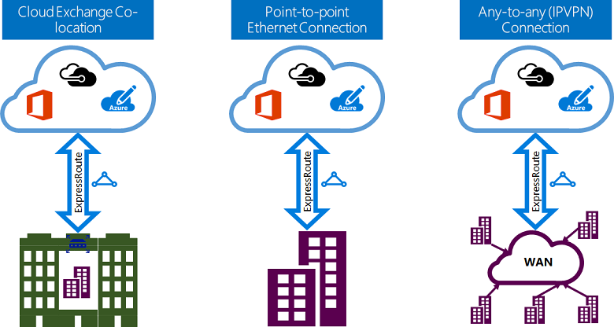

<properties
    pageTitle="ExpressRoute 连接模型：通过网络服务提供商、交换和以太网提供商连接到 Azure | Azure"
    description="本文介绍客户网络和 Microsoft Azure、Office 365 以及 Dynamics 365 服务之间的不同连接模式。客户可使用 MPLS 提供商、云交换和以太网提供商。"
    documentationcenter="na"
    services="expressroute"
    author="cherylmc"
    manager="timlt"
    editor="" />
<tags
    ms.assetid="ms.service: expressroute"
    ms.devlang="na"
    ms.topic="get-started-article"
    ms.tgt_pltfrm="na"
    ms.workload="infrastructure-services"
    ms.date="02/09/2017"
    wacn.date="03/24/2017"
    ms.author="cherylmc" />  

# ExpressRoute 连接模型
可通过以下三种不同方式，创建本地网络和 Azure 云之间的连接：[CloudExchange 归置](#CloudExchange)、[点对点以太网连接](#Ethernet)和[任意位置之间的 (IPVPN) 连接](#IPVPN)。连接服务提供商可以提供一个或多个连接模型。可以咨询连接服务提供商来选择最合适的模型。  

  

## 共置于云交换位置
如果你所在的位置提供云交换设施，则你可以订购虚拟交叉连接，以通过共同租用提供商的以太网交换连接到 Azure 云。共同租用提供商可以在共置设施中的基础结构与 Azure 云之间提供第 2 层交叉连接或托管的第 3 层交叉连接。

## 点到点以太网连接
你可以通过点到点以太网链路，将本地数据中心/办公室连接到 Azure 云。点到点以太网提供商可以在你的站点与 Azure 云之间提供第 2 层连接或托管的第 3 层连接。

## 任意位置之间的 (IPVPN) 网络
你可以将 WAN 集成到 Azure 云。 Azure 云可与你的 WAN 互连，就如同它是其他任何一个分支机构。在上述连接模型中，ExpressRoute 功能与特性完全相同。

## 后续步骤
* 了解 ExpressRoute 连接和路由域。请参阅 [ExpressRoute 线路和路由域](/documentation/articles/expressroute-circuit-peerings/)。
* 了解 ExpressRoute 功能。请参阅 [ExpressRoute 技术概述](/documentation/articles/expressroute-introduction/)
* 查找服务提供商。请参阅 [ExpressRoute 合作伙伴和对等位置](/documentation/articles/expressroute-locations/)。
* 确保符合所有先决条件。请参阅 [ExpressRoute 先决条件](/documentation/articles/expressroute-prerequisites/)。
* 请参阅[路由](/documentation/articles/expressroute-routing/)的要求。
* 配置 ExpressRoute 连接。
  * [创建 ExpressRoute 线路](/documentation/articles/expressroute-howto-circuit-portal-resource-manager/)
  * [配置路由](/documentation/articles/expressroute-howto-routing-portal-resource-manager/)
  * [将 VNet 链接到 ExpressRoute 线路](/documentation/articles/expressroute-howto-linkvnet-portal-resource-manager/)

<!---HONumber=Mooncake_0320_2017-->