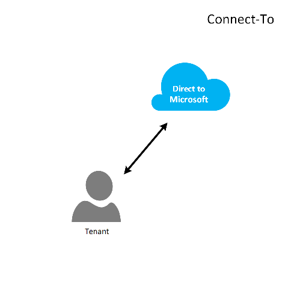

<properties
   pageTitle="适用于云解决方案提供商的 Azure ExpressRoute | Azure"
   description="本文提供的信息适用于想要将 Azure 服务和 ExpressRoute 纳入到产品/服务中去的云服务提供商。"
   documentationCenter="na"
   services="expressroute"
   authors="richcar"
   manager="carmonm"
   editor=""/>  

<tags
   ms.service="expressroute"
   ms.devlang="na"
   ms.topic="get-started-article"
   ms.tgt_pltfrm="na"
   ms.workload="infrastructure-services"
   ms.date="10/10/2016"
   wacn.date="10/31/2016"
   ms.author="richcar"/>  

# 适用于云解决方案提供商 (CSP) 的 ExpressRoute

Azure 为传统经销商和分销商 (CSP) 提供超大规模的服务，允许他们为你的客户快速预配新服务和解决方案，而不需投资开发这些新服务。为了让云解决方案提供商 (CSP) 能够直接管理这些新服务，Azure 提供了相应的程序和 API，以便 CSP 代表你的客户管理  Azure 资源。其中一项资源就是 ExpressRoute。ExpressRoute 允许 CSP 将现有客户资源连接到 Azure 服务。ExpressRoute 是一种高速专用通信链路，可以链接到 Azure 中的服务。

ExpresRoute 由一对可以实现高可用性的线路组成，这对线路连接到单个客户订阅，不能由多个客户共享。每个线路都会在不同的路由器中终止，目的是维持高可用性。

>[AZURE.NOTE] ExpressRoute 存在带宽和连接限制，也就是说，进行大型/复杂的实施时，需要为单个客户提供多个 ExpressRoute 线路。

 Azure 提供越来越多的服务，你可以将这些服务提供给你的客户。若要充分利用这些服务，需使用 ExpressRoute 连接对  Azure 环境进行高速、低延迟访问。

## Azure 管理
Azure 为 CSP 提供管理 Azure 客户订阅所需的 API，允许通过编程方式与你自己的服务管理系统集成。如需支持的管理功能，可单击[此处](https://msdn.microsoft.com/zh-cn/library/partnercenter/dn974944.aspx)。

## Azure 资源管理
订阅管理方式将取决于你与客户签署的协定。可以由 CSP 直接管理资源的创建和维护，也可以始终由客户对 Azure 订阅进行控制，并根据需要来创建 Azure 资源。如果你的客户在其 Azure 订阅中管理资源的创建，他们会使用以下两种模型之一：“Connect-Through”模型或“Connect-To”模型。将在下面各节中详细介绍这些模型。

### Connect-Through 模型

在 Connect-Through 模型中，CSP 在数据中心和客户的 Azure 订阅之间创建直接连接。使用 ExpressRoute 进行直接连接，将你的网络与 Azure 相连。然后，你的客户再连接到你的网络。此方案要求客户通过 CSP 网络来访问 Azure 服务。

如果客户有其他不由你管理的 Azure 订阅，他们会使用公共 Internet 或自己的专用连接来连接到这些在非 CSP 订阅下预配的服务。

对于管理 Azure 服务的 CSP 来说，所作的假定是该 CSP 有一个以前建立的客户标识存储，该存储随后会复制到 Azure Active Directory 中，以便通过 Administrate-On-Behalf-Of (AOBO) 对其 CSP 订阅进行管理。此方案的关键驱动因素包括：既定的合作伙伴或服务提供商已建立与客户的合作关系、客户目前正使用提供商的服务，或者合作伙伴希望提供包括提供商托管型解决方案和 Azure 托管型解决方案在内的组合型解决方案，以便增加灵活性，并解决客户遇到的无法单独通过 CSP 来解决的挑战。此模型见下**图**。

### Connect-To 模型

在 Connect-To 模型中，服务提供商使用基于客户网络的 ExpressRoute 在其客户的数据中心和 CSP 预配的 Azure 订阅之间创建直接连接。

>[AZURE.NOTE] 就 ExpressRoute 来说，客户需创建和维护 ExpressRoute 线路。

此连接方案要求客户在访问由 CSP 管理的 Azure 订阅时，使用全部或部分由客户创建、拥有和管理的直接网络连接，通过客户网络直接进行连接。对于这些客户来说，所作的假定是提供商目前并没有建立客户标识存储，而且提供商会帮助客户将当前的标识存储复制到 Azure Active Directory 中，以便通过 AOBO 管理其订阅。此方案的关键驱动因素包括：既定的合作伙伴或服务提供商已建立与客户的合作关系、客户目前正使用提供商的服务，或者合作伙伴希望提供完全基于 Azure 托管型解决方案的服务，而不需要使用现有的提供商数据中心或基础结构。

如何选择这两种模式取决于你客户的需求，以及你目前提供 Azure 服务的具体需要。有关这些模型的详细信息以及关联的基于角色的访问控制、网络和标识设计模式在以下链接中有详尽介绍：

 - **基于角色的访问控制 (RBAC)** – RBAC 基于 Azure Active Directory。有关 Azure RBAC 的详细信息，请单击[此处](/documentation/articles/role-based-access-control-configure/)。
 - **网络** – 介绍有关 Azure 中网络的各种主题。
 - **Azure Active Directory (AAD)** – AAD 提供针对 Azure 和第三方 SaaS 应用程序的标识管理。有关 Azure AD 的详细信息，请单击[此处](/documentation/services/identity/)。  

## 网络速度
ExpressRoute 支持的网络速度其范围为 50 Mb/秒到 10Gb/秒。因此，客户可以根据其具体环境购买所需的网络带宽。

>[AZURE.NOTE] 网络带宽可以在不中断通信的情况下，根据需要进行提升，但若要降低网络速度，则需先拆卸线路，然后按较低的网络速度重新创建。

ExpressRoute 支持将多个 vNet 连接到单个 ExpressRoute 线路，以便更好地利用速度更高的连接。单个 ExpressRoute 线路可以在同一客户拥有的多个 Azure 订阅之间共享。

## 配置 ExpressRoute
可以将 ExpressRoute 配置为在单个 ExpressRoute 线路上支持三种类型的流量（[路由域](#ExpressRoute-routing-domains)）。该流量可分成 Azure 公共对等互连和专用对等互连。你可以选择一种类型的或所有类型的需通过单个 ExpressRoute 线路发送的流量，也可以使用多个 ExpressRoute 线路，具体取决于 ExpressRoute 线路的大小以及你客户的隔离要求。你的客户所面临的安全状况可能不允许公共流量和专用流量经过相同的线路。

### Connect-Through 模型
在 Connect-Through 配置中，需要负责所有网络基础结构，确保将客户数据中心资源连接到 Azure 中托管的订阅。每个想要使用 Azure 功能的客户都需要建立自己的 ExpressRoute 连接，这些连接由你来管理。你将使用客户所用的相同方法来采购 ExpressRoute 线路。按照适用于线路预配和线路状态的 [ExpressRoute 工作流](/documentation/articles/expressroute-workflows/)这篇文章中概述的相同步骤进行操作。然后，你将配置边界网关协议 (BGP) 路由，以便控制本地网络与 Azure vNet 之间的流量。

### Connect-To 模型
在 Connect-To 配置中，你的客户已经建立了到 Azure 的连接，或者会启动一个到 Internet 服务提供商的连接，将 ExpressRoute 从你客户自己的数据中心直接链接到 Azure 而不是你的数据中心。你的客户将遵循上述 Connect-Through 模型中描述的步骤来开始预配过程。建立线路以后，你的客户需先配置本地路由器，然后才能访问你的网络和 Azure vNet。

你可以协助设置连接并配置路由，以便你数据中心的资源能够与你数据中心的客户端资源通信，或者与 Azure 中托管的资源通信。

##  ExpressRoute 路由域
ExpressRoute 提供三种路由域：公共对等互连、专用对等互连。在主动-主动配置中，每个路由域都配置了相同的路由器，以确保高可用性。有关 ExpressRoute 路由域的更多详细信息，请单击[此处](/documentation/articles/expressroute-circuit-peerings/)。

你可以自定义路由筛选器，根据需要来允许相关路由。如需详细信息，或者需要了解如何进行此类更改，请参阅详细介绍路由筛选器的以下文章：[使用 PowerShell 创建和修改 ExpressRoute 线路的路由](/documentation/articles/expressroute-howto-routing-classic/)。

>[AZURE.NOTE] 对于公共对等互连，必须通过客户或 CSP 拥有的公共 IP 地址进行连接，并且必须遵循所有定义的规则。有关详细信息，请参阅 [ExpressRoute 先决条件](/documentation/articles/expressroute-prerequisites/)页。

## 路由
ExpressRoute 通过 Azure 虚拟网络网关连接到 Azure 网络。网络网关为 Azure 虚拟网络提供路由功能。

创建 Azure 虚拟网络时，还会为 vNet 创建默认的路由表，以便引导进出 vNet 子网的流量。如果默认路由表对解决方案来说不够用，则可创建自定义路由，以便将传出流量路由到自定义设备，或者阻止到特定子网或外部网络的路由。

### 默认路由
默认路由表包含以下路由：

- 在子网内路由
- 在虚拟网络中从子网到子网路由
- 到 Internet
- 从虚拟网络到虚拟网络的路由，使用 VPN 网关
- 从虚拟网络到本地网络的路由，使用 VPN 或 ExpressRoute 网关

### 用户定义的路由 (UDR)
使用用户定义的路由，你可以控制虚拟网络中从分配的子网到其他子网的出站流量，或者控制经过其他某个预定义网关（ExpressRoute；Internet 或 VPN）的出站流量。可以将默认的系统路由表替换为用户定义的路由表，以便将默认路由表替换为自定义路由。使用用户定义的路由，客户可以创建到某些设备（例如防火墙或入侵检测设备）的特定路由，或者阻止他人从托管用户定义的路由的子网访问特定的子网。有关用户定义的路由的概述，请单击[此处](/documentation/articles/virtual-networks-udr-overview/)。

## “安全”
根据所用的模型（Connect-To 或 Connect-Through），你的客户可在其 vNet 中定义安全策略，或者向 CSP 提供针对其 vNet 进行定义时的安全策略要求。可以定义以下安全标准：

1.	**客户隔离** - Azure 平台将客户 ID 和 vNet 信息存储在安全的数据库中，以便将每个客户的流量封装在 GRE 隧道中，从而实现客户隔离。
2.	**网络安全组 (NSG)** 规则用于在 Azure 的 vNet 中定义允许进出子网的流量。默认情况下，NSG 包含的“阻止”规则将阻止从 Internet 到 vNet 的流量，包含的“允许”规则将允许 vNet 内部的流量。
3.	**强制隧道** - 此选项可将源自 Azure 的面向 Internet 的流量通过 ExpressRoute 连接重定向到本地数据中心。
有关强制隧道的详细信息，请单击[此处](/documentation/articles/expressroute-routing/#advertising-default-routes)。

4.	**加密** - 虽然 ExpressRoute 线路是特定客户专用的，但也存在网络提供商被攻破的可能，这会让入侵者可以查看数据包流量。为了解决这种可能存在的问题，可以让客户或 CSP 加密连接中的流量，即为本地资源和 Azure 资源之间的所有流量定义 IPSec 隧道模式策略（请参阅图 5 上方针对客户 1 的可选“隧道”模式 IPSec：ExpressRoute 安全性）。第二个选项是在 ExpressRoute 线路的每个终结点处使用防火墙设备。这需要在两端安装其他的第三方防火墙 VM/设备，以便加密 ExpressRoute 线路上的流量。

## 后续步骤
使用云解决方案提供商服务，你可以在不需要购买昂贵的基础结构和功能的情况下，提升你对客户的价值，让你一直充当主要的外包提供商。可以通过 CSP API 实现与 Azure 的无缝集成，让你在现有的管理框架内集成对 Azure 的管理功能。

如需更多信息，可单击以下链接：

- [Microsoft 云解决方案提供商计划](https://partner.microsoft.com/zh-cn/Solutions/cloud-reseller-overview)  
- [做好以云解决方案提供商身份进行事务处理的准备](https://partner.microsoft.com/zh-cn/solutions/cloud-reseller-pre-launch)
- [Microsoft 云解决方案提供商资源](https://partner.microsoft.com/zh-cn/solutions/cloud-reseller-resources)

<!---HONumber=Mooncake_0530_2016-->