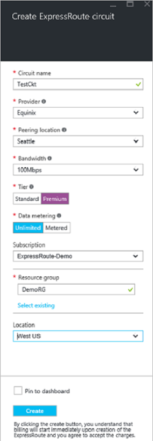
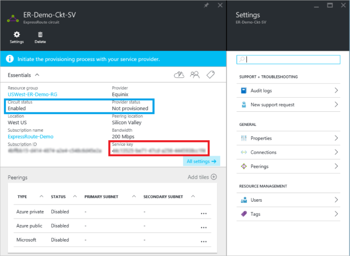

<properties
   pageTitle="使用 Resource Manager 和 Azure 门户创建和修改 ExpressRoute 线路 | Azure"
   description="本文介绍如何创建、预配、验证、更新、删除和取消预配 ExpressRoute 线路。"
   documentationCenter="na"
   services="expressroute"
   authors="cherylmc"
   manager="carmonm"
   editor=""
   tags="azure-resource-manager"/>
<tags
   ms.service="expressroute"
   ms.devlang="na"
   ms.topic="article"
   ms.tgt_pltfrm="na"
   ms.workload="infrastructure-services"
   ms.date="10/10/2016"
   wacn.date="10/31/2016"
   ms.author="cherylmc"/>

# 创建和修改 ExpressRoute 线路

> [AZURE.SELECTOR]
- [Azure 门户 - Resource Manager](/documentation/articles/expressroute-howto-circuit-portal-resource-manager/)
- [PowerShell - Resource Manager](/documentation/articles/expressroute-howto-circuit-arm/)
- [PowerShell - 经典](/documentation/articles/expressroute-howto-circuit-classic/)

本文介绍如何使用 Azure 门户和 Azure Resource Manager 部署模型创建 Azure ExpressRoute 线路。以下步骤还说明如何查看线路状态，以及如何更新、删除和取消预配线路。

**关于 Azure 部署模型**

[AZURE.INCLUDE [vpn-gateway-clasic-rm](../../includes/vpn-gateway-classic-rm-include.md)]

## 开始之前

- 在开始配置之前，请查看[先决条件](/documentation/articles/expressroute-prerequisites/)和[工作流](/documentation/articles/expressroute-workflows/)。
- 确保有权访问 [Azure 门户预览](https://portal.azure.cn)。
- 确保你有权创建新的网络资源。如果你没有适当的权限，请与帐户管理员联系。

## 创建和预配 ExpressRoute 线路

### 1\.登录到 Azure 门户预览

从浏览器导航到 [Azure 门户预览](http://portal.azure.cn)并使用 Azure 帐户登录。

### 2\.创建新的 ExpressRoute 线路

>[AZURE.IMPORTANT] 从发布服务密钥的那一刻起，将对 ExpressRoute 线路进行计费。确保连接服务提供商准备好预配线路后就执行此操作。

1. 你可以通过选择创建新资源的选项来创建 ExpressRoute 线路。单击“新建”>“网络”>“ExpressRoute”，如下图所示：

	

2. 单击“ExpressRoute”即可显示“创建 ExpressRoute 线路”边栏选项卡。在此边栏选项卡中填充值时，请务必指定正确的 SKU 层和数据计量方式。

	- “层”决定是启用 ExpressRoute 标准版外接程序还是 ExpressRoute 高级版外接程序。可以指定“Standard”以获取标准 SKU，或指定“Premium”以获取高级版外接程序。

	- “数据计量”决定计费类型。可以指定“Metered”以获取数据流量套餐，指定“Unlimited”以获取无限制流量套餐。注意，可以将计费类型从 **Metered** 更改为 **Unlimited**，但不能将类型从 **Unlimited** 更改为 **Metered**。

	

### 3\.查看线路和属性

**查看所有线路**

在左侧菜单中选择“所有资源”即可查看创建的所有线路。
	

**查看属性**

可选中回路查看其属性。在此边栏选项卡上，记下回路的服务密钥。必须复制回路的密钥并将其传递给服务供应商，才可完成预配流程。回路密钥是特定的。

### 4\.将服务密钥发送给连接服务提供商进行预配

在此边栏选项卡中，“提供商状态”提供有关服务提供商端当前预配状态的信息。“线路状态”提供 Microsoft 端的状态。有关线路预配状态的详细信息，请参阅 [Workflows](/documentation/articles/expressroute-workflows/#expressroute-circuit-provisioning-states)（工作流）一文。

当你创建新的 ExpressRoute 线路时，线路将是以下状态：

提供商状态：未预配  
线路状态：已启用

当连接提供商正在为你启用线路时，线路将转为以下状态。

提供商状态：正在预配  
线路状态：已启用

只有 ExpressRoute 线路处于以下状态时，你才能使用它。

提供商状态：已预配  
线路状态：已启用

### 5\.定期检查线路密钥的状态

选中你感兴趣的线路即可查看其属性。选中“提供商状态”，确保在继续之前其已转为“已预配”。

### 6\.创建路由配置

有关分步说明，请参阅 [ExpressRoute circuit routing configuration](/documentation/articles/expressroute-howto-routing-portal-resource-manager/)（ExpressRoute 线路路由配置）一文，了解如何创建和修改线路对等互连。

>[AZURE.IMPORTANT] 这些说明只适用于由提供第 2 层连接服务的服务提供商创建的线路。如果你的服务提供商提供第 3 层托管服务（通常是 IP VPN，如 MPLS），则连接服务提供商将为你配置和管理路由。

### 7\.将虚拟网络链接到 ExpressRoute 线路

接下来，将虚拟网络链接到 ExpressRoute 线路。使用 Resource Manager 部署模式时，请参阅 [Linking virtual networks to ExpressRoute circuits](/documentation/articles/expressroute-howto-linkvnet-arm/)（将虚拟网络链接到 ExpressRoute 线路）一文。

## 获取 ExpressRoute 线路的状态

选择线路即可查看其状态。

## 修改 ExpressRoute 线路

你可以在不影响连接的情况下修改 ExpressRoute 线路的某些属性。此时不能使用 Azure 门户修改 ExpressRoute 线路属性。但是，你可以使用 PowerShell 来修改线路属性。有关详细信息，请参阅[使用 PowerShell 修改 ExpressRoute 线路](/documentation/articles/expressroute-howto-circuit-arm/#modify)部分。

你可以在不停机的情况下执行以下操作：

- 为 ExpressRoute 线路启用或禁用 ExpressRoute 高级版外接程序。

- 增加 ExpressRoute 线路的带宽。请注意，不支持对线路的带宽进行降级。

- 将计量套餐从数据流量套餐更改为无限制流量套餐。请注意，不支持将计量套餐从无限制流量套餐更改为数据流量套餐。

-  可以启用和禁用“允许经典操作”。

有关限制和局限性的详细信息，请参阅 [ExpressRoute FAQ](/documentation/articles/expressroute-faqs/)（ExpressRoute 常见问题）。

## 取消预配和删除 ExpressRoute 线路

可以通过选择“删除”图标来删除 ExpressRoute 线路。注意以下事项：

- 必须取消所有虚拟网络与 ExpressRoute 线路的链接。如果此操作失败，请检查是否有虚拟网络链接到了该线路。

- 如果 ExpressRoute 线路服务提供商预配状态为“正在预配”或“已预配”，则必须与服务提供商合作，在他们一端取消预配线路。在服务提供商取消对线路的预配并通知我们之前，我们会继续保留资源并向你收费。

- 如果服务提供商已取消预配线路（服务提供商预配状态设置为“未预配”），则可以删除线路。这样就会停止线路计费

## 后续步骤

创建你的线路后，请确保执行以下操作：

- [创建和修改 ExpressRoute 线路的路由](/documentation/articles/expressroute-howto-routing-portal-resource-manager/)
- [将虚拟网络链接到 ExpressRoute 线路](/documentation/articles/expressroute-howto-linkvnet-arm/)

<!---HONumber=Mooncake_0530_2016-->