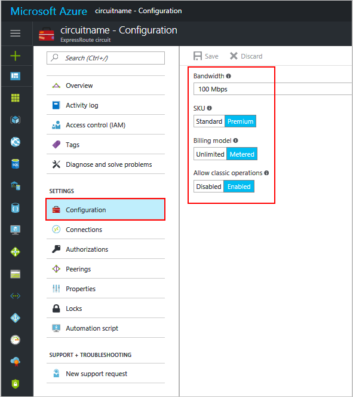

<properties
    pageTitle="创建和修改 ExpressRoute 线路：Azure 门户预览 | Azure"
    description="本文介绍如何创建、预配、验证、更新、删除和取消预配 ExpressRoute 线路。"
    documentationCenter="na"
    services="expressroute"
    authors="cherylmc"
    manager="timlt"
    editor=""
    tags="azure-resource-manager"
    translationtype="Human Translation" />
<tags
   ms.service="expressroute"
   ms.devlang="na"
   ms.topic="article"
   ms.tgt_pltfrm="na"
   ms.workload="infrastructure-services"
    ms.date="03/07/2017"
    wacn.date="05/02/2017"
    ms.author="cherylmc"
    ms.sourcegitcommit="75890c3ffb1d1757de64a8b8344e9f2569f26273"
    ms.openlocfilehash="9ee6241c12a603a49b6550b96577b098f975a749"
    ms.lasthandoff="04/25/2017" />

# 创建和修改 ExpressRoute 线路

> [AZURE.SELECTOR]
- [Azure 门户 - Resource Manager](/documentation/articles/expressroute-howto-circuit-portal-resource-manager/)
- [PowerShell - Resource Manager](/documentation/articles/expressroute-howto-circuit-arm/)
- [PowerShell - 经典](/documentation/articles/expressroute-howto-circuit-classic/)

本文介绍如何使用 Azure 门户和 Azure Resource Manager 部署模型创建 Azure ExpressRoute 线路。以下步骤还说明如何查看线路状态，以及如何更新、删除和取消预配线路。

**关于 Azure 部署模型**

[AZURE.INCLUDE [vpn-gateway-clasic-rm](../../includes/vpn-gateway-classic-rm-include.md)]

## 开始之前

- 在开始配置之前，请查看[先决条件](/documentation/articles/expressroute-prerequisites/)和[工作流](/documentation/articles/expressroute-workflows/)。
- 确保有权访问 [Azure 门户预览](https://portal.azure.cn)。
- 确保你有权创建新的网络资源。如果你没有适当的权限，请与帐户管理员联系。

## 创建和预配 ExpressRoute 线路

### 1.登录到 Azure 门户预览

从浏览器导航到 [Azure 门户预览](http://portal.azure.cn)并使用 Azure 帐户登录。

### 2.创建新的 ExpressRoute 线路

>[AZURE.IMPORTANT]
> 从发布服务密钥的那一刻起，将对 ExpressRoute 线路进行计费。 确保连接服务提供商准备好预配线路后就执行此操作。

1. 你可以通过选择创建新资源的选项来创建 ExpressRoute 线路。单击“新建”>“网络”>“ExpressRoute”，如下图所示：

    

2. 单击“ExpressRoute”即可显示“创建 ExpressRoute 线路”边栏选项卡。在此边栏选项卡中填充值时，请务必指定正确的 SKU 层和数据计量方式。

    - “层”决定是启用 ExpressRoute 标准版外接程序还是 ExpressRoute 高级版外接程序。 可以指定“Standard”以获取标准 SKU，或指定“Premium”以获取高级版外接程序。

    - “数据计量”决定计费类型。 可以指定“Metered”以获取数据流量套餐，指定“Unlimited”以获取无限制流量套餐。 注意：可以将计费类型从“Metered”更改为“Unlimited”，但不能将类型从“Unlimited”更改为“Metered”。

    

>[AZURE.IMPORTANT]
> 请注意，对等互连位置表示与 Microsoft 建立对等互连的[物理位置](/documentation/articles/expressroute-locations/)。 此位置与“Location”属性 **没有** 关系，后者指的是 Azure 网络资源提供商所在的地理位置。 尽管两者之间没有关系，但最好是选择地理上与线路对等互连位置靠近的网络资源提供商。 

### 3.查看线路和属性

**查看所有线路**

在左侧菜单中选择“所有资源”即可查看创建的所有线路。
	

**查看属性**

可选中回路查看其属性。在此边栏选项卡上，记下回路的服务密钥。必须复制回路的密钥并将其传递给服务供应商，才可完成预配流程。回路密钥是特定的。

### 4.将服务密钥发送给连接服务提供商进行预配

在此边栏选项卡中，“提供商状态”提供有关服务提供商端当前预配状态的信息。“线路状态”提供 Microsoft 端的状态。有关线路预配状态的详细信息，请参阅 [Workflows](/documentation/articles/expressroute-workflows/#expressroute-circuit-provisioning-states)（工作流）一文。

当你创建新的 ExpressRoute 线路时，线路将是以下状态：

提供商状态：未预配  
线路状态：已启用

当连接提供商正在为你启用线路时，线路将转为以下状态。

提供商状态：正在预配  
线路状态：已启用

只有 ExpressRoute 线路处于以下状态时，你才能使用它。

提供商状态：已预配  
线路状态：已启用

### 5.定期检查线路密钥的状态

选中你感兴趣的线路即可查看其属性。选中“提供商状态”，确保在继续之前其已转为“已预配”。

### 6.创建路由配置

有关分步说明，请参阅 [ExpressRoute 线路路由配置](/documentation/articles/expressroute-howto-routing-portal-resource-manager/)一文，了解如何创建和修改线路对等互连。

>[AZURE.IMPORTANT]
> 这些说明只适用于由提供第 2 层连接服务的服务提供商创建的线路。 如果你的服务提供商提供第 3 层托管服务（通常是 IP VPN，如 MPLS），则连接服务提供商将为你配置和管理路由。

### 7.将虚拟网络链接到 ExpressRoute 线路

接下来，将虚拟网络链接到 ExpressRoute 线路。 使用 Resource Manager 部署模型时，请参阅[将虚拟网络链接到 ExpressRoute 线路](/documentation/articles/expressroute-howto-linkvnet-arm/)一文。

## 获取 ExpressRoute 线路的状态

选择线路即可查看其状态。

## 修改 ExpressRoute 线路
可以在不影响连接的情况下修改 ExpressRoute 线路的某些属性。

你可以在不停机的情况下执行以下操作：

- 为 ExpressRoute 线路启用或禁用 ExpressRoute 高级版外接程序。

- 增加 ExpressRoute 线路的带宽，前提是端口上有可用容量。 请注意，不支持对线路的带宽进行降级。 

- 将计量套餐从数据流量套餐更改为无限制流量套餐。 请注意，不支持将计量套餐从无限制流量套餐更改为数据流量套餐。

-  可以启用和禁用允许经典操作。

有关限制和局限性的详细信息，请参阅 [ExpressRoute 常见问题解答](/documentation/articles/expressroute-faqs/)。

若要修改 ExpressRoute 线路，请单击“配置”，如下图所示。

可以在“配置”边栏选项卡内修改带宽、SKU、计费模型，以及允许经典操作。

> [AZURE.IMPORTANT]
> 如果现有端口上的容量不足，可能需要重新创建 ExpressRoute 线路。 如果该位置没有额外的可用容量，则不能升级线路。
>
> 但是，你无法在不中断的情况下降低 ExpressRoute 线路的带宽。 带宽降级需要取消对 ExpressRoute 线路的预配，然后重新预配新的 ExpressRoute 线路。
> 
> 如果使用的资源超出了标准线路所允许的范围，禁用高级版外接程序的操作可能会失败。
> 
> 

## 取消预配和删除 ExpressRoute 线路
可以通过选择“删除”图标来删除 ExpressRoute 线路。 注意以下事项：

- 必须取消所有虚拟网络与 ExpressRoute 线路的链接。如果此操作失败，请检查是否有虚拟网络链接到了该线路。

- 如果 ExpressRoute 线路服务提供商预配状态为“正在预配”或“已预配”，则必须与服务提供商合作，在他们一端取消预配线路。在服务提供商取消对线路的预配并通知我们之前，我们会继续保留资源并向你收费。

- 如果服务提供商已取消预配线路（服务提供商预配状态设置为“未预配”），则可以删除线路，这样就会停止线路计费。

## 后续步骤

创建你的线路后，请确保执行以下操作：

- [创建和修改 ExpressRoute 线路的路由](/documentation/articles/expressroute-howto-routing-portal-resource-manager/)
- [将虚拟网络链接到 ExpressRoute 线路](/documentation/articles/expressroute-howto-linkvnet-arm/)

<!---HONumber=Mooncake_0530_2016-->