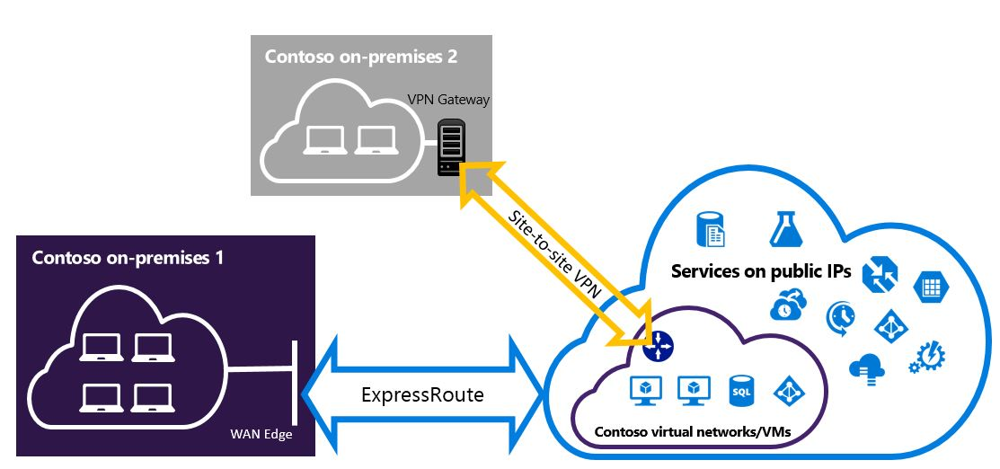

<properties
   pageTitle="为 Resource Manager 部署模型配置可并存的 ExpressRoute 和站点到站点 VPN 连接| Azure"
   description="本文将指导你为 Resource Manager 模型配置可共存的 ExpressRoute 和站点到站点 VPN 连接。"
   documentationCenter="na"
   services="expressroute"
   authors="charwen"
   manager="carmonm"
   editor=""
   tags="azure-resource-manager"/>
<tags
   ms.service="expressroute"
   ms.date="05/04/2016"
   wacn.date="06/06/2016"/>

# 为 Resource Manager 部署模型配置 ExpressRoute 和站点到站点共存的连接

> [AZURE.SELECTOR]
- [PowerShell - Resource Manager](/documentation/articles/expressroute-howto-coexist-resource-manager/)
- [PowerShell - Classic](/documentation/articles/expressroute-howto-coexist-classic/)

能够配置站点到站点 VPN 和 ExpressRoute 具有多项优势。你可以将站点到站点 VPN 配置为 ExressRoute 的安全故障转移路径，或者使用站点到站点 VPN 连接到不是通过 ExpressRoute 进行连接的站点。我们将在本文中介绍这两种方案的配置步骤。本文适用于 Resource Manager 部署模型。此配置在 Azure 门户中不可用。

**关于 Azure 部署模型**

[AZURE.INCLUDE [vpn-gateway-clasic-rm](../includes/vpn-gateway-classic-rm-include.md)]

>[AZURE.IMPORTANT] 按以下说明进行操作之前，必须预先配置ExpressRoute 线路。在按以下步骤操作之前，请务必遵循相关指南来[创建 ExpressRoute 线路](/documentation/articles/expressroute-howto-circuit-arm/)和[配置路由](/documentation/articles/expressroute-howto-routing-arm/)。

## 限制和局限性

- **不支持转换性路由：**你将不能（通过 Azure）在通过站点到站点 VPN 连接的本地网络与通过 ExpressRoute 连接的本地网络之间进行路由。
- **无法在站点到站点 VPN 网关上启用强制隧道：**你只能通过 ExpressRoute 将所有面向 Internet 的流量“强制”返回到本地网络。 
- **仅限标准或高性能网关：**ExpressRoute 网关和站点到站点 VPN 网关必须使用标准或高性能网关。有关网关 SKU 的信息，请参阅[网关 SKU](/documentation/articles/vpn-gateway-about-vpngateways/)。
- **仅限基于路由的 VPN 网关：**必须使用基于路由的 VPN 网关。有关基于路由的 VPN 网关的信息，请参阅 [VPN 网关](/documentation/articles/vpn-gateway-about-vpngateways/)。
- **静态路由要求：**如果你的本地网络同时连接到 ExpressRoute 和站点到站点 VPN，则必须在本地网络中配置静态路由，以便将站点到站点 VPN 连接路由到公共 Internet。
- **必须先配置 ExpressRoute 网关：**必须先创建 ExpressRoute 网关，然后再添加站点到站点 VPN 网关。

## 配置设计

### 将站点到站点 VPN 配置为 ExpressRoute 的故障转移路径

你可以将站点到站点 VPN 连接配置为 ExpressRoute 的备份。这仅适用于链接到 Azure 专用对等路径的虚拟网络。对于可通过 Azure 公共线路访问的服务，没有基于 VPN 的故障转移解决方案。ExpressRoute 线路始终是主链接。仅当 ExpressRoute 线路失败时，数据才会流经站点到站点 VPN 路径。

### 配置站点到站点 VPN，以便连接到不通过 ExpressRoute 进行连接的站点

你可以对网络进行配置，使得部分站点通过站点到站点 VPN 直接连接到 Azure，部分站点通过 ExpressRoute 进行连接。

>[AZURE.NOTE] 不能将虚拟网络配置为转换路由器。

## 选择要使用的步骤

若要配置能够共存的连接，有两组不同的过程可供选择。你选择的配置过程将取决于你有要连接到的现有虚拟网络，还是要创建新的虚拟网络。

- 我没有 VNet，需要创建一个。
	
	如果你还没有虚拟网络，此过程将指导你使用 Resource Manager 部署模型创建新的虚拟网络，然后创建新的 ExpressRoute 和站点到站点 VPN 连接。若要配置，请遵循本文中[创建新的虚拟网络和并存连接](#new)部分中的步骤。

- 我已有一个 Resource Manager 部署模型 VNet。

	你可能已在具有现有站点到站点 VPN 连接或 ExpressRoute 连接的位置拥有虚拟网络。[为现有的 VNet 配置并存连接](#add)部分将指导你删除网关，然后创建新的 ExpressRoute 连接和站点到站点 VPN 连接。请注意，在创建新连接时，必须按照非常特定的顺序完成步骤。不要按照其他文章中的说明来创建网关和连接。

	在此过程中，创建可以共存的连接将需要你删除网关，然后配置新网关。这意味着，在你删除并重新创建网关和连接时，跨界连接将会停止工作，但你无需将任何 VM 或服务迁移到新的虚拟网络。在你配置网关时，如果进行了相应配置，你的 VM 和服务仍可以通过负载平衡器与外界通信。

## 创建新的虚拟网络和并存连接

本过程将指导你创建 VNet，以及创建将共存的站点到站点连接和 ExpressRoute 连接。
	
1. 你需要安装 Azure PowerShell cmdlet 的最新版本。有关安装 PowerShell cmdlet 的详细信息，请参阅[如何安装和配置 Azure PowerShell](/documentation/articles/powershell-install-configure/)。请注意，针对此配置使用的 cmdlet 可能与你熟悉的 cmdlet 稍有不同。请务必使用说明内容中指定的 cmdlet。

2. 登录你的帐户并设置环境。
	
		login-AzureRmAccount -Environment $(Get-AzureRmEnvironment -Name AzureChinaCloud)
		Select-AzureRmSubscription -SubscriptionName 'yoursubscription'
		$location = "China East"
		$resgrp = New-AzureRmResourceGroup -Name "ErVpnCoex" -Location $location

3. 创建包括网关子网的虚拟网络。有关虚拟网络配置的详细信息，请参阅 [Azure 虚拟网络配置](/documentation/articles/virtual-networks-create-vnet-arm-ps/)。

	>[AZURE.IMPORTANT] 网关子网必须是 /27 或更短的前缀（例如 /26 或 /25）。
	
	创建新的 VNet。

		$vnet = New-AzureRmVirtualNetwork -Name "CoexVnet" -ResourceGroupName $resgrp.ResourceGroupName -Location $location -AddressPrefix "10.200.0.0/16" 

	添加子网。

		Add-AzureRmVirtualNetworkSubnetConfig -Name "App" -VirtualNetwork $vnet -AddressPrefix "10.200.1.0/24"
		Add-AzureRmVirtualNetworkSubnetConfig -Name "GatewaySubnet" -VirtualNetwork $vnet -AddressPrefix "10.200.255.0/24"

	保存 VNet 配置。

		$vnet = Set-AzureRmVirtualNetwork -VirtualNetwork $vnet

4. 创建 ExpressRoute 网关。有关 ExpressRoute 网关配置的详细信息，请参阅 [ExpressRoute 网关配置](/documentation/articles/expressroute-howto-add-gateway-resource-manager/)。GatewaySKU 必须是 Standard 或 HighPerformance。

		$gwSubnet = Get-AzureRmVirtualNetworkSubnetConfig -Name "GatewaySubnet" -VirtualNetwork $vnet
		$gwIP = New-AzureRmPublicIpAddress -Name "ERGatewayIP" -ResourceGroupName $resgrp.ResourceGroupName -Location $location -AllocationMethod Dynamic
		$gwConfig = New-AzureRmVirtualNetworkGatewayIpConfig -Name "ERGatewayIpConfig" -SubnetId $gwSubnet.Id -PublicIpAddressId $gwIP.Id
		$gw = New-AzureRmVirtualNetworkGateway -Name "ERGateway" -ResourceGroupName $resgrp.ResourceGroupName -Location $location -IpConfigurations $gwConfig -GatewayType "ExpressRoute" -GatewaySku Standard 

5. 将 ExpressRoute 网关连接到 ExpressRoute 线路。完成此步骤后，则已通过 ExpressRoute 建立本地网络与 Azure 之间的连接。有关链接操作的详细信息，请参阅[将 VNet 链接到 ExpressRoute](/documentation/articles/expressroute-howto-linkvnet-arm/)。

		$ckt = Get-AzureRmExpressRouteCircuit -Name "YourCircuit" -ResourceGroupName "YourCircuitResourceGroup"
		New-AzureRmVirtualNetworkGatewayConnection -Name "ERConnection" -ResourceGroupName $resgrp.ResourceGroupName -Location $location -VirtualNetworkGateway1 $gw -PeerId $ckt.Id -ConnectionType ExpressRoute

6. 接下来，创建站点到站点 VPN 网关。有关 VPN 网关配置的详细信息，请参阅[配置 VNet 到 VNet 连接](/documentation/articles/vpn-gateway-vnet-vnet-rm-ps/)。GatewaySKU 必须是 Standard 或 HighPerformance。VpnType 必须为 RouteBased。

		$gwSubnet = Get-AzureRmVirtualNetworkSubnetConfig -Name "GatewaySubnet" -VirtualNetwork $vnet
		$gwIP = New-AzureRmPublicIpAddress -Name "VPNGatewayIP" -ResourceGroupName $resgrp.ResourceGroupName -Location $location -AllocationMethod Dynamic
		$gwConfig = New-AzureRmVirtualNetworkGatewayIpConfig -Name "VPNGatewayIpConfig" -SubnetId $gwSubnet.Id -PublicIpAddressId $gwIP.Id
		New-AzureRmVirtualNetworkGateway -Name "VPNGateway" -ResourceGroupName $resgrp.ResourceGroupName -Location $location -IpConfigurations $gwConfig -GatewayType "Vpn" -VpnType "RouteBased" -GatewaySku "Standard"

7. 创建一个本地站点 VPN 网关实体。此命令不会配置本地 VPN 网关，而是允许你提供本地网关设置（如公共 IP 和本地地址空间），以便 Azure VPN 网关可以连接到它。
	>[AZURE.NOTE] 如果你的本地网络具有多个路由，你可以通过数组的形式将其全部传入。$MyLocalNetworkAddress = @("10.100.0.0/16","10.101.0.0/16","10.102.0.0/16")

		$localVpn = New-AzureRmLocalNetworkGateway -Name "LocalVPNGateway" -ResourceGroupName $resgrp.ResourceGroupName -Location $location -GatewayIpAddress *<Public IP>* -AddressPrefix '10.100.0.0/16'

8. 配置本地 VPN 设备以连接到新的 Azure VPN 网关。有关 VPN 设备配置的详细信息，请参阅 [VPN 设备配置](/documentation/articles/vpn-gateway-about-vpn-devices/)。

9. 将 Azure 上的站点到站点 VPN 网关连接到本地网关。

		$azureVpn = Get-AzureRmVirtualNetworkGateway -Name "VPNGateway" -ResourceGroupName $resgrp.ResourceGroupName
		New-AzureRmVirtualNetworkGatewayConnection -Name "VPNConnection" -ResourceGroupName $resgrp.ResourceGroupName -Location $location -VirtualNetworkGateway1 $azureVpn -LocalNetworkGateway2 $localVpn -ConnectionType IPsec -SharedKey <yourkey>

## 为现有的 VNet 配置并存连接

如果你已经有了一个虚拟网络，请检查网关子网大小。如果网关子网为 /28 或 /29，则必须先删除虚拟网络网关，然后增加网关子网大小。本部分的步骤将说明如何这样做。

如果网关子网为 /27 或更大，且虚拟网络是通过 ExpressRoute 连接的，则可跳过下面的步骤，转到前一部分的[“步骤 6 - 创建站点到站点 VPN 网关”](#vpngw)。

>[AZURE.NOTE] 如果你删除的是现有网关，则当你进行此配置时，本地系统将失去与虚拟网络建立的连接。

1. 你需要安装 Azure PowerShell cmdlet 的最新版本。有关安装 PowerShell cmdlet 的详细信息，请参阅[如何安装和配置 Azure PowerShell](/documentation/articles/powershell-install-configure/)。请注意，针对此配置使用的 cmdlet 可能与你熟悉的 cmdlet 稍有不同。请务必使用说明内容中指定的 cmdlet。 

2. 删除现有的 ExpressRoute 或站点到站点 VPN 网关。

		Remove-AzureRmVirtualNetworkGateway -Name <yourgatewayname> -ResourceGroupName <yourresourcegroup>

3. 删除网关子网。
		
		$vnet = Get-AzureRmVirtualNetwork -Name <yourvnetname> -ResourceGroupName <yourresourcegroup> 
		Remove-AzureRmVirtualNetworkSubnetConfig -Name GatewaySubnet -VirtualNetwork $vnet

4. 添加为 /27 或更大的网关子网。
	>[AZURE.NOTE] 如果你因为虚拟网络中没有剩余足够的 IP 地址而无法增加网关子网大小，则需增加 IP 地址空间。

		$vnet = Get-AzureRmVirtualNetwork -Name <yourvnetname> -ResourceGroupName <yourresourcegroup>
		Add-AzureRmVirtualNetworkSubnetConfig -Name "GatewaySubnet" -VirtualNetwork $vnet -AddressPrefix "10.200.255.0/24"

	保存 VNet 配置。

		$vnet = Set-AzureRmVirtualNetwork -VirtualNetwork $vnet

5. 此时，你将拥有不带网关的虚拟网络。若要创建新网关并完成连接，可以转到[步骤 4 - 创建 ExpressRoute 网关](#gw)（可以在前一组步骤中找到）。

## 将点到站点配置添加到 VPN 网关
可以按照下面的步骤将点到站点配置添加到共存设置中的 VPN 网关。

1. 添加 VPN 客户端地址池。 

		$azureVpn = Get-AzureRmVirtualNetworkGateway -Name "VPNGateway" -ResourceGroupName $resgrp.ResourceGroupName
		Set-AzureRmVirtualNetworkGatewayVpnClientConfig -VirtualNetworkGateway $azureVpn -VpnClientAddressPool "10.251.251.0/24"

2. 为你的 VPN 网关将 VPN 根证书上传到 Azure。在此示例中，假定根证书存储在运行以下 PowerShell cmdlet 的本地计算机中。

		$p2sCertFullName = "RootErVpnCoexP2S.cer"
		$p2sCertMatchName = "RootErVpnCoexP2S"
		$p2sCertToUpload=get-childitem Cert:\CurrentUser\My | Where-Object {$_.Subject -match $p2sCertMatchName}
		if ($p2sCertToUpload.count -eq 1){
		    write-host "cert found"
		} else {
		    write-host "cert not found"
		    exit
		} 
		$p2sCertData = [System.Convert]::ToBase64String($p2sCertToUpload.RawData)
		Add-AzureRmVpnClientRootCertificate -VpnClientRootCertificateName $p2sCertFullName -VirtualNetworkGatewayname $azureVpn.Name -ResourceGroupName $resgrp.ResourceGroupName -PublicCertData $p2sCertData

有关点到站点 VPN 的详细信息，请参阅[配置点到站点连接](/documentation/articles/vpn-gateway-howto-point-to-site-rm-ps/)。

## 后续步骤

有关 ExpressRoute 的详细信息，请参阅 [ExpressRoute 常见问题](/documentation/articles/expressroute-faqs/)。

<!---HONumber=Mooncake_0509_2016-->