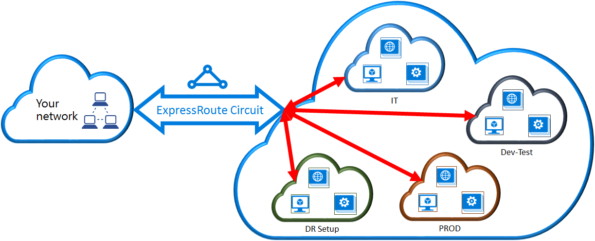

<properties
    pageTitle="将虚拟网络链接到 ExpressRoute 线路：PowerShell：Azure | Azure"
    description="本文档概述如何使用 Resource Manager 部署模型和 PowerShell 将虚拟网络 (VNet) 链接到 ExpressRoute 线路。"
    services="expressroute"
    documentationcenter="na"
    author="ganesr"
    manager="timlt"
    editor=""
    tags="azure-resource-manager"
    translationtype="Human Translation" />
<tags
    ms.assetid="daacb6e5-705a-456f-9a03-c4fc3f8c1f7e"
    ms.service="expressroute"
    ms.devlang="na"
    ms.topic="article"
    ms.tgt_pltfrm="na"
    ms.workload="infrastructure-services"
    ms.date="04/12/2017"
    wacn.date="05/02/2017"
    ms.author="ganesr"
    ms.sourcegitcommit="78da854d58905bc82228bcbff1de0fcfbc12d5ac"
    ms.openlocfilehash="1da6647739e22cfe90dbad0e26d3a7870c2fb661"
    ms.lasthandoff="04/22/2017" />

# 将虚拟网络连接到 ExpressRoute 线路
> [AZURE.SELECTOR]
- [Resource Manager - Azure 门户预览](/documentation/articles/expressroute-howto-linkvnet-portal-resource-manager/)
- [Resource Manager - PowerShell](/documentation/articles/expressroute-howto-linkvnet-arm/)
- [经典 - PowerShell](/documentation/articles/expressroute-howto-linkvnet-classic/)

本文将帮助你使用 Resource Manager 部署模型和 PowerShell 将虚拟网络 (VNet) 链接到 Azure ExpressRoute 线路。 虚拟网络可以在同一个订阅中，也可以属于另一个订阅。 本文还介绍如何更新虚拟网络链接。 

## 开始之前
* 安装最新版本的 Azure PowerShell 模块。 有关详细信息，请参阅[如何安装和配置 Azure PowerShell](/documentation/articles/powershell-install-configure/)。
* 在开始配置之前，请查看[先决条件](/documentation/articles/expressroute-prerequisites/)、[路由要求](/documentation/articles/expressroute-routing/)和[工作流](/documentation/articles/expressroute-workflows/)。
* 必须有活动的 ExpressRoute 线路。 
  * 请按说明[创建 ExpressRoute 线路](/documentation/articles/expressroute-howto-circuit-arm/)，并通过连接提供商启用该线路。 
  * 确保为线路配置 Azure 专用对等互连。 有关路由说明，请参阅[配置路由](/documentation/articles/expressroute-howto-routing-arm/)一文。 
  * 确保配置 Azure 专用对等互连，并运行用户网络和 Azure 之间的 BGP 对等互连，以便启用端到端连接。
  * 确保已创建并完全预配一个虚拟网络和一个虚拟网络网关。 按照说明[为 ExpressRoute 创建虚拟网关](/documentation/articles/expressroute-howto-add-gateway-resource-manager/)。 ExpressRoute 的虚拟网关使用 GatewayType“ExpressRoute”，而不是 VPN。

最多可以将 10 个虚拟网络链接到一条标准 ExpressRoute 线路。 使用标准 ExpressRoute 线路时，所有虚拟网络都必须位于同一地缘政治区域。 

如果已启用 ExpressRoute 高级外接程序，则可以链接 ExpressRoute 线路的地缘政治区域外部的虚拟网络，或者将更多虚拟网络连接到 ExpressRoute 线路。有关高级外接程序的更多详细信息，请参阅[常见问题](/documentation/articles/expressroute-faqs/)。

## 将同一订阅中的虚拟网络连接到线路

可以使用以下 cmdlet 将虚拟网络网关连接到 ExpressRoute 线路。在运行 cmdlet 前，请确保已创建虚拟网络网关并可将其用于进行链接：

	$circuit = Get-AzureRmExpressRouteCircuit -Name "MyCircuit" -ResourceGroupName "MyRG"
	$gw = Get-AzureRmVirtualNetworkGateway -Name "ExpressRouteGw" -ResourceGroupName "MyRG"
	$connection = New-AzureRmVirtualNetworkGatewayConnection -Name "ERConnection" -ResourceGroupName "MyRG" -Location "China North" -VirtualNetworkGateway1 $gw -PeerId $circuit.Id -ConnectionType ExpressRoute

## 将不同订阅中的虚拟网络连接到线路

用户可以在多个订阅之间共享 ExpressRoute 线路。下图是在多个订阅之间共享 ExpressRoute 线路的简单示意图。

大型云中的每个较小云用于表示属于组织中不同部门的订阅。组织内的每个部门可以使用自己的订阅部署其服务，但可以共享单个 ExpressRoute 线路以连接回本地网络。单个部门（在此示例中为 IT 部门）可以拥有 ExpressRoute 线路。组织内的其他订阅可以使用 ExpressRoute 线路。

>[AZURE.NOTE]
> 将对 ExpressRoute 线路所有者收取专用线路的连接和带宽费用。 所有虚拟网络共享相同的带宽。
> 
> 

### 管理 - 线路所有者和线路用户

“线路所有者”是 ExpressRoute 线路资源的已授权高级用户。 线路所有者可以创建可供“线路用户”兑换的授权。 线路用户是虚拟网关的所有者，这些网关与 ExpressRoute 线路位于不同的订阅中。 线路用户可以兑换授权（每个虚拟网络需要一个授权）。

线路所有者有权随时修改和撤消授权。 撤消授权会导致从已撤消访问权限的订阅中删除所有链路连接。

### 线路所有者操作

**创建授权**

线路所有者创建授权。这样即可创建授权密钥，供线路用户可用来将其虚拟网络网关连接到 ExpressRoute 线路。一个授权只可用于一个连接。

以下 cmdlet 代码片段演示如何创建授权：

	$circuit = Get-AzureRmExpressRouteCircuit -Name "MyCircuit" -ResourceGroupName "MyRG"
	Add-AzureRmExpressRouteCircuitAuthorization -ExpressRouteCircuit $circuit -Name "MyAuthorization1"
	Set-AzureRmExpressRouteCircuit -ExpressRouteCircuit $circuit

    $circuit = Get-AzureRmExpressRouteCircuit -Name "MyCircuit" -ResourceGroupName "MyRG"
	$auth1 = Get-AzureRmExpressRouteCircuitAuthorization -ExpressRouteCircuit $circuit -Name "MyAuthorization1"
		

对此操作的响应将包含授权密钥和状态：

		Name                   : MyAuthorization1
		Id                     : /subscriptions/&&&&&&&&&&&&&&&&&&&&&&&&&&&&&&&&&&&&/resourceGroups/ERCrossSubTestRG/providers/Microsoft.Network/expressRouteCircuits/CrossSubTest/authorizations/MyAuthorization1
		Etag                   : &&&&&&&&&&&&&&&&&&&&&&&&&&&&&&&&&&&& 
		AuthorizationKey       : ####################################
		AuthorizationUseStatus : Available
		ProvisioningState      : Succeeded

		

**查看授权**

线路所有者可以通过运行以下 cmdlet 查看针对特定线路发出的所有授权：

	$circuit = Get-AzureRmExpressRouteCircuit -Name "MyCircuit" -ResourceGroupName "MyRG"
	$authorizations = Get-AzureRmExpressRouteCircuitAuthorization -ExpressRouteCircuit $circuit
	

**添加授权**

线路所有者可以使用以下 cmdlet 添加授权：

	$circuit = Get-AzureRmExpressRouteCircuit -Name "MyCircuit" -ResourceGroupName "MyRG"
	Add-AzureRmExpressRouteCircuitAuthorization -ExpressRouteCircuit $circuit -Name "MyAuthorization2"
	Set-AzureRmExpressRouteCircuit -ExpressRouteCircuit $circuit
	
	$circuit = Get-AzureRmExpressRouteCircuit -Name "MyCircuit" -ResourceGroupName "MyRG"
	$authorizations = Get-AzureRmExpressRouteCircuitAuthorization -ExpressRouteCircuit $circuit

**删除授权**

线路所有者可以通过运行以下 cmdlet 撤消/删除对用户的授权：

	Remove-AzureRmExpressRouteCircuitAuthorization -Name "MyAuthorization2" -ExpressRouteCircuit $circuit
	Set-AzureRmExpressRouteCircuit -ExpressRouteCircuit $circuit	

### 线路用户操作

线路用户需有对等 ID 和线路所有者提供的授权密钥。授权密钥是一个 GUID。

可通过以下命令检查对等 ID：

	Get-AzureRmExpressRouteCircuit -Name "MyCircuit" -ResourceGroupName "MyRG"

**兑换连接授权**

线路用户可以通过运行以下 cmdlet 兑现链接授权：

	$id = "/subscriptions/********************************/resourceGroups/ERCrossSubTestRG/providers/Microsoft.Network/expressRouteCircuits/MyCircuit"	
	$gw = Get-AzureRmVirtualNetworkGateway -Name "ExpressRouteGw" -ResourceGroupName "MyRG"
	$connection = New-AzureRmVirtualNetworkGatewayConnection -Name "ERConnection" -ResourceGroupName "RemoteResourceGroup" -Location "China North" -VirtualNetworkGateway1 $gw -PeerId $id -ConnectionType ExpressRoute -AuthorizationKey "^^^^^^^^^^^^^^^^^^^^^^^^^^^^^^^^^^^^^^^^^^^^^"

**释放连接授权**

可以通过删除 ExpressRoute 线路与虚拟网络之间的连接释放授权。

## 修改虚拟网络连接
可以更新虚拟网络连接的某些属性。 

**更新连接权重**

虚拟网络可以连接到多条 ExpressRoute 线路。 可以从多条 ExpressRoute 线路收到相同的前缀。 若要选择使用哪个连接发送目标为此前缀的流量，可以更改连接的 *RoutingWeight*。 将在具有最高 *RoutingWeight* 的连接上发送流量。

    $connection = Get-AzureRmVirtualNetworkGatewayConnection -Name "MyVirtualNetworkConnection" -ResourceGroupName "MyRG"
    $connection.RoutingWeight = 100
    Set-AzureRmVirtualNetworkGatewayConnection -VirtualNetworkGatewayConnection $connection

*RoutingWeight* 的范围是 0 到 32000。 默认值为 0。

## 后续步骤

有关 ExpressRoute 的详细信息，请参阅 [ExpressRoute 常见问题](/documentation/articles/expressroute-faqs/)。

<!---HONumber=Mooncake_1226_2016-->