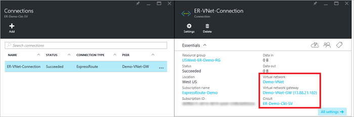

<properties
   pageTitle="使用 Resource Manager 部署模型和 Azure 门户将虚拟网络链接到 ExpressRoute 线路 | Azure"
   description="本文档概述了如何将虚拟网络 (VNet) 链接到 ExpressRoute 线路。"
   services="expressroute"
   documentationCenter="na"
   authors="cherylmc"
   manager="carmonm"
   editor=""
   tags="azure-resource-manager"/>
<tags
   ms.service="expressroute"
   ms.devlang="na"
   ms.topic="article"
   ms.tgt_pltfrm="na"
   ms.workload="infrastructure-services"
   ms.date="10/10/2016"
   wacn.date="10/31/2016"
   ms.author="cherylmc" />

# 将虚拟网络链接到 ExpressRoute 线路

> [AZURE.SELECTOR]
- [Azure 门户 - Resource Manager](/documentation/articles/expressroute-howto-linkvnet-portal-resource-manager/)
- [PowerShell - Resource Manager](/documentation/articles/expressroute-howto-linkvnet-arm/)
- [PowerShell - 经典](/documentation/articles/expressroute-howto-linkvnet-classic/)

本文将帮助你使用 Resource Manager 部署模型和 Azure 门户将虚拟网络 (VNet) 链接到 Azure ExpressRoute 线路。虚拟网络可以在同一个订阅中，也可以属于另一个订阅。

**关于 Azure 部署模型**

[AZURE.INCLUDE [vpn-gateway-clasic-rm](../../includes/vpn-gateway-classic-rm-include.md)]

## 配置先决条件

- 在开始配置之前，请务必查看[先决条件](/documentation/articles/expressroute-prerequisites/)、[路由要求](/documentation/articles/expressroute-routing/)和[工作流](/documentation/articles/expressroute-workflows/)。
- 你必须有一个活动的 ExpressRoute 线路。 
	- 请按说明[创建 ExpressRoute 线路](/documentation/articles/expressroute-howto-circuit-arm/)，并通过连接提供商启用该线路。 
	
	- 请确保为线路配置 Azure 专用对等互连。如需路由说明，请参阅[配置路由](/documentation/articles/expressroute-howto-routing-portal-resource-manager/)一文。
	
	- 确保配置 Azure 专用对等互连并运行你的网络和 Azure 之间的 BGP 对等互连，以便启用端到端连接。
	
	- 确保已创建并完全预配一个虚拟网络和一个虚拟网络网关。请按说明创建 [VPN 网关](/documentation/articles/vpn-gateway-howto-site-to-site-resource-manager-portal/)（仅遵循步骤 1-5）。

最多可以将 10 个虚拟网络链接到一条标准 ExpressRoute 线路。使用标准 ExpressRoute 线路时，所有虚拟网络必须都位于同一地缘政治区域。如果已启用 ExpressRoute 高级外接程序，则可以链接 ExpressRoute 线路的地缘政治区域外部的虚拟网络，或者将更多虚拟网络连接到 ExpressRoute 线路。有关高级外接程序的更多详细信息，请参阅[常见问题](/documentation/articles/expressroute-faqs/)。

## 将同一订阅中的虚拟网络连接到线路

### 创建连接

1. 确保已成功配置 ExpressRoute 线路和 Azure 专用对等互连。请遵循[创建 ExpressRoute 线路](/documentation/articles/expressroute-howto-circuit-arm/)和[配置路由](/documentation/articles/expressroute-howto-routing-arm/)中的说明。ExpressRoute 线路应如下图所示。

	

	>[AZURE.NOTE] 如果第 3 层提供商配置了你的对等互连，则 BGP 配置信息将不会显示。如果你的线路处于已预配状态，你应该能够创建连接。

2. 现在你可以开始预配连接，以便将虚拟网络网关链接到 ExpressRoute 线路。单击“连接”>“添加”以打开“添加连接”边栏选项卡，然后配置值。请查看以下参考示例。

	

3. 成功配置你的连接之后，连接对象将显示连接的信息。

	

### 删除连接

可以通过选择你的连接的边栏选项卡上的“删除”图标来删除连接。

## 将不同订阅中的虚拟网络连接到线路

此时，无法使用 Azure 门户跨订阅连接虚拟网络。但是，你可以使用 PowerShell 来执行此操作。有关详细信息，请参阅 [PowerShell](/documentation/articles/expressroute-howto-linkvnet-arm/) 一文。

## 后续步骤

有关 ExpressRoute 的详细信息，请参阅 [ExpressRoute 常见问题](/documentation/articles/expressroute-faqs/)。

<!---HONumber=Mooncake_0530_2016-->