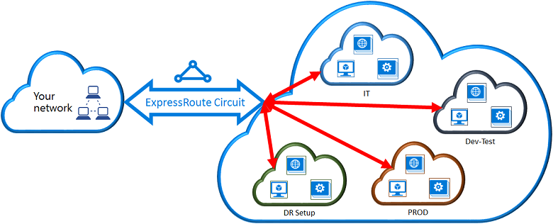
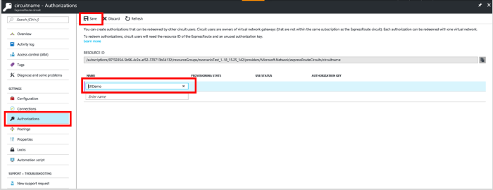
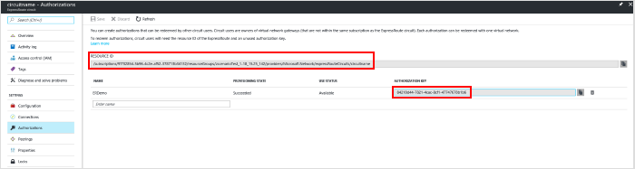
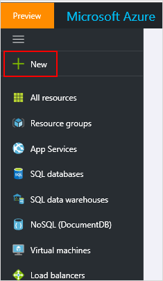
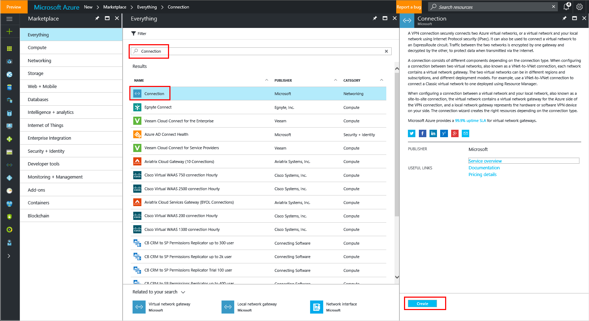
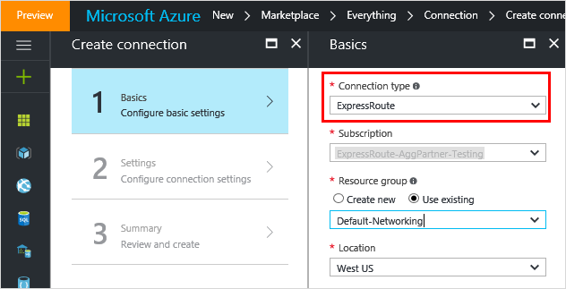
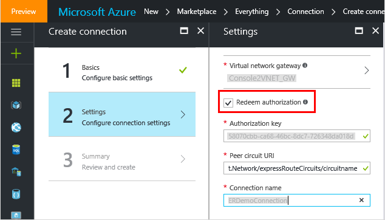

<properties
    pageTitle="使用 Resource Manager 部署模型和 Azure 门户将虚拟网络链接到 ExpressRoute 线路 | Azure"
    description="本文档概述了如何将虚拟网络 (VNet) 链接到 ExpressRoute 线路。"
    services="expressroute"
    documentationcenter="na"
    author="cherylmc"
    manager="timlt"
    editor=""
    tags="azure-resource-manager"
    translationtype="Human Translation" />
<tags
    ms.assetid="f5cb5441-2fba-46d9-99a5-d1d586e7bda4"
    ms.service="expressroute"
    ms.devlang="na"
    ms.topic="article"
    ms.tgt_pltfrm="na"
    ms.workload="infrastructure-services"
    ms.date="04/12/2017"
    wacn.date="05/02/2017"
    ms.author="cherylmc"
    ms.sourcegitcommit="78da854d58905bc82228bcbff1de0fcfbc12d5ac"
    ms.openlocfilehash="396c798631b5561df7004b3e2ffc8c8c59e3ae03"
    ms.lasthandoff="04/22/2017" />

# 将虚拟网络连接到 ExpressRoute 线路
> [AZURE.SELECTOR]
- [Resource Manager - Azure 门户](/documentation/articles/expressroute-howto-linkvnet-portal-resource-manager/)
- [Resource Manager - PowerShell](/documentation/articles/expressroute-howto-linkvnet-arm/)
- [经典 - PowerShell](/documentation/articles/expressroute-howto-linkvnet-classic/)

本文通过使用 Resource Manager 部署模型和 Azure 门户，帮助将虚拟网络 (VNets) 链接到 Azure ExpressRoute 线路。虚拟网络可以在同一个订阅中，也可以属于另一个订阅。

## 开始之前

- 在开始配置之前，请查看[先决条件](/documentation/articles/expressroute-prerequisites/)、[路由要求](/documentation/articles/expressroute-routing/)和[工作流](/documentation/articles/expressroute-workflows/)。
- 必须有活动的 ExpressRoute 线路。 
    - 请按说明[创建 ExpressRoute 线路](/documentation/articles/expressroute-howto-circuit-portal-resource-manager/)，并通过连接提供商启用该线路。

    - 确保为线路配置 Azure 专用对等互连。 有关路由说明，请参阅[配置路由](/documentation/articles/expressroute-howto-routing-portal-resource-manager/)一文。 

    - 确保配置 Azure 专用对等互连，并运行用户网络和 Azure 之间的 BGP 对等互连，以便启用端到端连接。
    - 确保已创建并完全预配一个虚拟网络和一个虚拟网络网关。 按照说明[为 ExpressRoute 创建虚拟网关](/documentation/articles/expressroute-howto-add-gateway-resource-manager/)。 ExpressRoute 的虚拟网关使用 GatewayType“ExpressRoute”，而不是 VPN。
	
- 最多可以将 10 个虚拟网络链接到一条标准 ExpressRoute 线路。使用标准 ExpressRoute 线路时，所有虚拟网络都必须位于同一地缘政治区域。

- 如果已启用 ExpressRoute 高级外接程序，则可以链接 ExpressRoute 线路的地缘政治区域外部的虚拟网络，或者将大量虚拟网络连接到 ExpressRoute 线路。有关高级外接程序的更多详细信息，请参阅[常见问题](/documentation/articles/expressroute-faqs/)。

## 将同一订阅中的虚拟网络连接到线路

### 创建连接

> [AZURE.NOTE]
> 如果第 3 层提供商配置了你的对等互连，则 BGP 配置信息将不会显示。如果你的线路处于已预配状态，你应该能够创建连接。
>

1. 确保已成功配置 ExpressRoute 线路和 Azure 专用对等互连。请遵循[创建 ExpressRoute 线路](/documentation/articles/expressroute-howto-circuit-arm/)和[配置路由](/documentation/articles/expressroute-howto-routing-arm/)中的说明。ExpressRoute 线路应如下图所示：

	  

   
2. 现在你可以开始预配连接，以便将虚拟网络网关链接到 ExpressRoute 线路。单击“连接”>“添加”以打开“添加连接”边栏选项卡，然后配置值。

      

3. 成功配置你的连接之后，连接对象将显示连接的信息。

     

### 删除连接
可以通过选择连接的边栏选项卡上的“删除”图标来删除连接。

## 将不同订阅中的虚拟网络连接到线路
用户可以在多个订阅之间共享 ExpressRoute 线路。 下图显示了如何在多个订阅之间实现 ExpressRoute 线路共享的简单示意图。

- 大型云中的每个较小云用于表示属于组织中不同部门的订阅。
- 组织内的每个部门可以使用自己的订阅部署其服务，但可以共享单个 ExpressRoute 线路以连接回本地网络。
- 单个部门（在此示例中为 IT 部门）可以拥有 ExpressRoute 线路。 组织内的其他订阅可以使用 ExpressRoute 线路。

    > [AZURE.NOTE]
    > 将对 ExpressRoute 线路所有者收取专用线路的连接和带宽费用。 所有虚拟网络共享相同的带宽。
    > 
    >

### 管理 - 线路所有者和线路用户

“线路所有者”是 ExpressRoute 线路资源的已授权高级用户。 线路所有者可以创建可供“线路用户”兑换的授权。 线路用户是虚拟网关的所有者，这些网关与 ExpressRoute 线路位于不同的订阅中。 线路用户可以兑换授权（每个虚拟网络需要一个授权）。

线路所有者有权随时修改和撤消授权。 撤消授权会导致从已撤消访问权限的订阅中删除所有链路连接。

### 线路所有者操作

**创建连接授权**

线路所有者创建授权。 这样即可创建授权密钥，供线路用户可用来将其虚拟网络网关连接到 ExpressRoute 线路。 一个授权只可用于一个连接。

1. 在“ExpressRoute”边栏选项卡中单击“授权”，然后键入授权的**名称**并单击“保存”。

    

2. 保存配置后，复制“资源 ID”和“授权密钥”。

    

**删除连接授权**

可以通过选择连接的边栏选项卡上的“删除”图标来删除连接。

### 线路用户操作

线路用户需要线路所有者提供的资源 ID 和授权密钥。 

**兑换连接授权**

1. 单击“+新建”按钮。

    

2. 在应用商店中搜索“连接”，然后选择它并单击“创建”。

    

3. 请确保将“连接类型”  设置为“ExpressRoute”。

4. 在“基本信息”边栏选项卡中填写详细信息，然后单击“确定”。

    

5. 在“设置”边栏选项卡中，选择“虚拟网络网关”并选中“兑换授权”复选框。

6. 输入“授权密钥”和“对等线路 URI”，并为连接命名。 单击 **“确定”**。

    

7. 在“摘要”边栏选项卡中检查信息，然后单击“确定”。

**释放连接授权**

可以通过删除 ExpressRoute 线路与虚拟网络之间的连接释放授权。

## 后续步骤

有关 ExpressRoute 的详细信息，请参阅 [ExpressRoute 常见问题](/documentation/articles/expressroute-faqs/)。

<!---HONumber=Mooncake_0320_2017-->