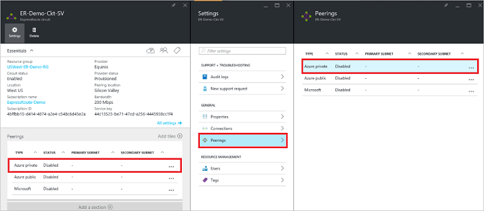
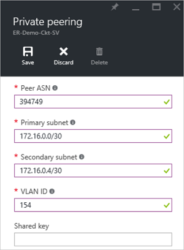
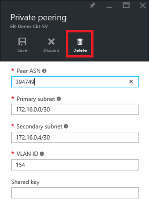
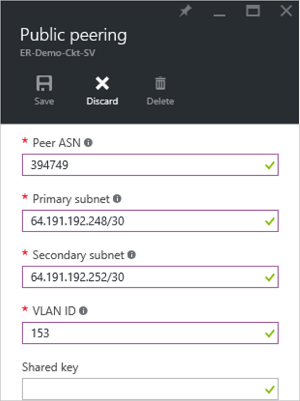
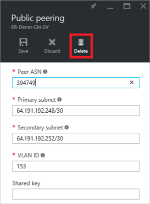

<properties
    pageTitle="如何为 ExpressRoute 线路配置路由（对等互连）：Resource Manager：Azure "
    description="本文介绍创建和预配 ExpressRoute 线路的专用、公共对等互连的步骤。 本文还介绍如何检查状态，以及如何更新或删除线路的对等互连。"
    documentationCenter="na"
    services="expressroute"
    author="cherylmc"
    manager="timlt"
    editor=""
    tags="azure-resource-manager"
    translationtype="Human Translation" />
<tags
    ms.assetid="8c2a7ed2-ae5c-4e49-81f6-77cf9f2b2ac9"
    ms.service="expressroute"
    ms.devlang="na"
    ms.topic="article"
    ms.tgt_pltfrm="na"
    ms.workload="infrastructure-services"
    ms.date="03/21/2017"
    wacn.date="05/02/2017"
    ms.author="cherylmc"
    ms.sourcegitcommit="78da854d58905bc82228bcbff1de0fcfbc12d5ac"
    ms.openlocfilehash="9665a12a5670d8f38d03c0a89beaf52867d7fa54"
    ms.lasthandoff="04/22/2017" />

# 创建和修改 ExpressRoute 线路的对等互连
> [AZURE.SELECTOR]
- [资源管理器 - Azure 门户预览](/documentation/articles/expressroute-howto-routing-portal-resource-manager/)
- [Resource Manager - PowerShell](/documentation/articles/expressroute-howto-routing-arm/)
- [经典 - PowerShell](/documentation/articles/expressroute-howto-routing-classic/)

本文将指导你执行相关步骤，以便使用 Azure 门户预览和 Resource Manager 部署模型创建和管理 ExpressRoute 线路的路由配置。

**关于 Azure 部署模型**

[AZURE.INCLUDE [vpn-gateway-clasic-rm](../../includes/vpn-gateway-classic-rm-include.md)]

## 配置先决条件

- 在开始配置之前，请务必查看[先决条件](/documentation/articles/expressroute-prerequisites/)页、[路由要求](/documentation/articles/expressroute-routing/)页和[工作流](/documentation/articles/expressroute-workflows/)页。
- 你必须有一个活动的 ExpressRoute 线路。 在继续下一步之前，请按说明 [创建 ExpressRoute 线路](/documentation/articles/expressroute-howto-circuit-portal-resource-manager/) ，并通过连接提供商启用该线路。 ExpressRoute 线路必须处于已预配和已启用状态，你才能运行下述 cmdlet。
- 如果计划使用共享密钥/MD5 哈希，请确保在隧道两端都使用该哈希，并将最大字符数限制为 25。

这些说明只适用于由提供第 2 层连接服务的服务提供商创建的线路。如果你的服务提供商提供第 3 层托管服务（通常是 IPVPN，如 MPLS），则连接服务提供商将为你设置和管理路由。

>[AZURE.IMPORTANT]
> 我们目前无法通过服务管理门户播发服务提供商配置的对等互连。 我们正在努力不久就实现这一功能。 请在配置 BGP 对等互连之前与服务提供商核对。
> 
> 

你可以为 ExpressRoute 线路配置一或两个对等互连（Azure 专用、Azure 公共互联）。可以按照所选的任意顺序配置对等互连。但是，你必须确保一次只完成一个对等互连的配置。

## Azure 专用对等互连

本部分说明如何为 ExpressRoute 线路创建、获取、更新和删除 Azure 专用对等互连配置。

### 创建 Azure 专用对等互连

1. 配置 ExpressRoute 线路。在继续之前，请确保线路完全由连接提供商设置。

	

2. 配置线路的 Azure 专用对等互连。在继续执行后续步骤之前，请确保已准备好以下各项：

	- 主链路的 /30 子网。它不能是保留给虚拟网络使用的任何地址空间的一部分。
	- 辅助链路的 /30 子网。它不能是保留给虚拟网络使用的任何地址空间的一部分。
	- 用于建立此对等互连的有效 VLAN ID。请确保线路中没有其他对等互连使用同一个 VLAN ID。
	- 对等互连的 AS 编号。可以使用 2 字节和 4 字节 AS 编号。可以将专用 AS 编号用于此对等互连。请务必不要使用 65515。
	- MD5 哈希（如果选择使用）。**这是可选的**。

3. 选择 Azure 专用对等行，如下所示。
	
	
	

4. 配置专用对等互连。下图显示了一个配置示例。

	

	
5. 指定所有参数后，请保存配置。成功接受配置后，你将看到类似于下面示例的内容。

    

### 查看 Azure 专用对等互连详细信息

可以通过选择对等互连查看 Azure 专用对等互连的属性。

### 更新 Azure 专用对等互连配置

你可以选择用于对等互连的行并修改对等互连属性。

### 删除 Azure 专用对等互连

可以通过选择删除图标来删除对等互连配置，如下所示。

## Azure 公共对等互连

本部分说明如何为 ExpressRoute 线路创建、获取、更新和删除 Azure 公共对等互连配置。

### 创建 Azure 公共对等互连

1. 配置 ExpressRoute 线路。在进一步继续之前，请确保线路完全由连接提供商设置。

	

2. 配置线路的 Azure 公共对等互连。在继续执行后续步骤之前，请确保已准备好以下各项：

	- 主链路的 /30 子网。
	- 辅助链路的 /30 子网。
	- 用于设置此对等互连的所有 IP 地址必须都是有效的公共 IPv4 地址。
	- 用于建立此对等互连的有效 VLAN ID。请确保线路中没有其他对等互连使用同一个 VLAN ID。
	- 对等互连的 AS 编号。可以使用 2 字节和 4 字节 AS 编号。
	- MD5 哈希（如果选择使用）。**这是可选的**。

3. 选择 Azure 公共对等互连行，如下所示。
	
	
	

4. 配置公共对等互连。下图显示了一个配置示例。

	

	
5. 指定所有参数后，请保存配置。成功接受配置后，你将看到类似于下面示例的内容。

    

### 查看 Azure 公共对等互连详细信息

可以通过选择对等互连查看 Azure 公共对等互连的属性。

### 更新 Azure 公共对等互连配置

你可以选择用于对等互连的行并修改对等互连属性。

### 删除 Azure 公共对等互连

可以通过选择删除图标来删除对等互连配置，如下所示。

## 后续步骤

下一步， [将 VNet 链接到 ExpressRoute 线路](/documentation/articles/expressroute-howto-linkvnet-portal-resource-manager/)。

-  有关 ExpressRoute 工作流的详细信息，请参阅 [ExpressRoute 工作流](/documentation/articles/expressroute-workflows/)。

-  有关线路对等互连的详细信息，请参阅 [ExpressRoute 线路和路由域](/documentation/articles/expressroute-circuit-peerings/)。

-  有关使用虚拟网络的详细信息，请参阅[虚拟网络概述](/documentation/articles/virtual-networks-overview/)。

<!--Update_Description:update wording-->