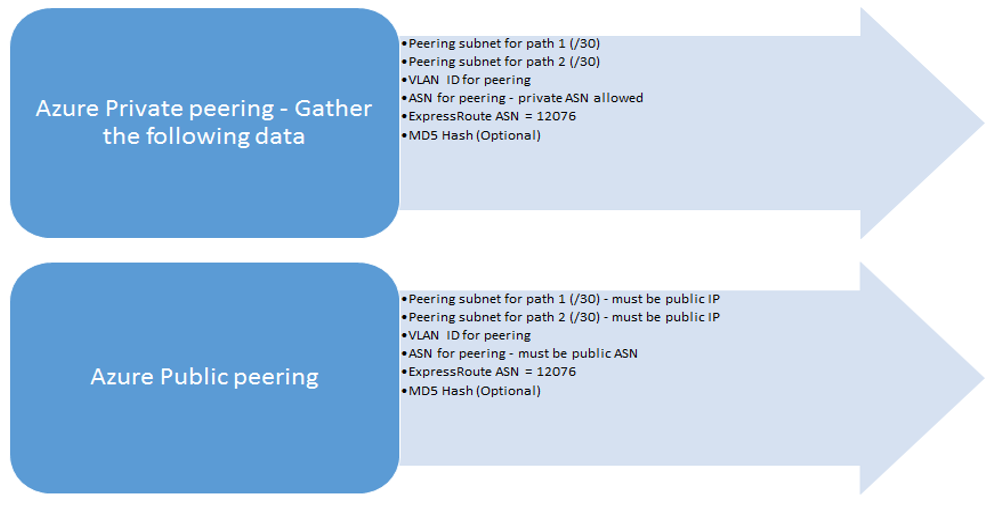

<properties
   pageTitle="ExpressRoute 线路配置工作流 | Azure"
   description="本页将指导你完成配置 ExpressRoute 线路和对等互连的工作流"
   documentationCenter="na"
   services="expressroute"
   authors="cherylmc"
   manager="carmonm"
   editor="" />
<tags
   ms.service="expressroute"
   ms.devlang="na"
   ms.topic="article" 
   ms.tgt_pltfrm="na"
   ms.workload="infrastructure-services"
   ms.date="10/10/2016"
   ms.author="cherylmc"
   wacn.date="10/31/2016"/>

# ExpressRoute 线路预配工作流和线路状态
本页从较高层面引导你完成服务预配和路由配置工作流。

下图和相应的步骤说明了预配端到端 ExpressRoute 线路所要执行的任务。

1. 使用 PowerShell 配置 ExpressRoute 线路。有关更多详细信息，请遵循[创建 ExpressRoute 线路](/documentation/articles/expressroute-howto-circuit-classic/)一文中的说明。

2. 从服务提供商订购连接。此过程根据情况而有所不同。有关如何订购连接的详细信息，请联系你的连接服务提供商。

3. 通过 PowerShell 验证 ExpressRoute 线路预配状态，以确保线路预配成功。

4. 配置路由域。如果连接服务提供商管理第 3 层，则他们将为你的线路配置路由。如果连接服务提供商只提供第 2 层服务，则你必须根据[路由要求](/documentation/articles/expressroute-routing/)和[路由配置](/documentation/articles/expressroute-howto-routing-classic/)页中所述的指导原则来配置路由。

	-  启用 Azure 专用对等互连 - 只有启用此对等互连才能连接到部署在虚拟网络中的 VM/云服务。
	-  启用 Azure 公共对等互连 - 如果你想要连接到托管在公共 IP 地址上的 Azure 服务，则必须启用 Azure 公共对等互连。如果你已选择为 Azure 专用对等互连启用默认路由并想要访问 Azure 资源，则必须执行上述操作。

	

5. 将虚拟网络链接到 ExpressRoute 线路 - 可以将虚拟网络链接到 ExpressRoute 线路。请按照说明[将 VNet 链接](/documentation/articles/expressroute-howto-linkvnet-arm/)到你的线路。这些 VNet 可以位于 ExpressRoute 线路所在的同一 Azure 订阅中，也可以位于不同的订阅中。

## ExpressRoute 线路预配状态

每条 ExpressRoute 线路有两种状态：

- 服务提供商预配状态
- 状态

“状态”表示 Microsoft 的预配状态。创建 Expressroute 线路时，此属性设置为 Enabled

连接服务提供商预配状态表示连接服务提供商一端的状态。该状态可能是 *NotProvisioned*、*Provisioning* 或 *Provisioned*。ExpressRoute 线路必须处于 Provisioned 状态才可供使用。

### ExpressRoute 线路的可能状态

本部分列出 ExpressRoute 线路的可能状态。

#### 创建时

运行 PowerShell cmdlet 创建 ExpressRoute 线路后，很快就会看到 ExpressRoute 线路处于以下状态。

	ServiceProviderProvisioningState : NotProvisioned
	Status                           : Enabled

#### 当连接服务提供商正在预配线路时

将服务密钥传递给连接服务提供商并且他们已启动预配过程时，很快就会看到 ExpressRoute 线路处于以下状态。

	ServiceProviderProvisioningState : Provisioning
	Status                           : Enabled

#### 当连接服务提供商完成预配过程时

当连接服务提供商完成预配过程后，很快就会看到 ExpressRoute 线路处于以下状态。

	ServiceProviderProvisioningState : Provisioned
	Status                           : Enabled

线路只有处于 Provisioned 和 Enabled 状态时才可供使用。如果你使用第 2 层服务提供商，则只有在线路处于此状态时才能配置路由。

#### 当连接服务提供商正在取消预配线路时

如果已请求服务提供商取消预配 ExpressRoute 线路，当服务提供商完成取消预配过程后，将看到线路已设置为以下状态。

	ServiceProviderProvisioningState : NotProvisioned
	Status                           : Enabled

如果需要，你可以选择重新启用线路，或运行 PowerShell cmdlet 删除线路。

>[AZURE.IMPORTANT] 当 ServiceProviderProvisioningState 为 Provisioning 或 Provisioned 时，如果运行该 PowerShell cmdlet 来删除线路，操作将会失败。请先让连接服务提供商取消 ExpressRoute 线路，然后删除线路。在运行 PowerShell cmdlet 删除线路之前，Azure 会持续收取线路费用。

## 路由会话配置状态

BGP 预配状态可让你知道  Azure 边缘是否已启用 BGP 会话。必须处于已启用状态才能使用对等互连。

必须特意检查  Azure 对等互连的 BGP 会话状态。除了 BGP 预配状态，还有另一个状态称为*播发的公共前缀状态*。播发的公共前缀状态必须是*已配置*状态，BGP 会话才能启动，才能进行端到端的路由。

如果播发的公共前缀状态设置为需要验证状态，则不会启用 BGP 会话，因为播发的前缀不符合任何路由注册表中的 AS 编号。

>[AZURE.IMPORTANT] 如果播发的公共前缀状态是*手动验证*状态，则你必须[在线申请支持](/support/support-ticket-form/?l=zh-cn)创建工单，并提供拥有播发 IP 地址的证明以及相关的自治系统编号。

## 后续步骤

- 配置 ExpressRoute 连接。

	- [创建 ExpressRoute 线路](/documentation/articles/expressroute-howto-circuit-arm/)
	- [配置路由](/documentation/articles/expressroute-howto-routing-arm/)
	- [将 VNet 链接到 ExpressRoute 线路](/documentation/articles/expressroute-howto-linkvnet-arm/)

<!---HONumber=Mooncake_0104_2016-->